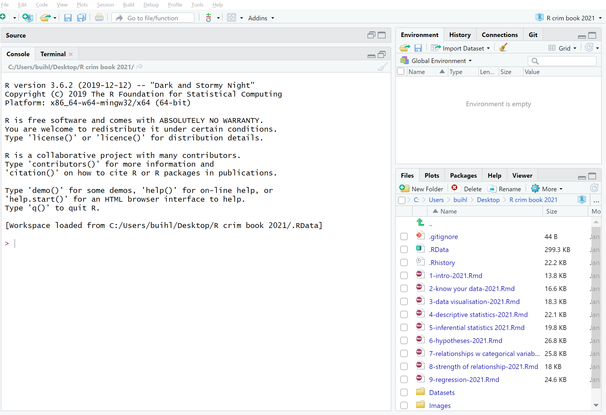
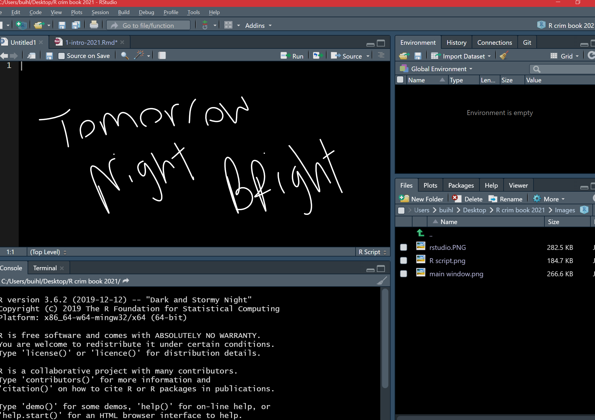

# A First Lesson About R
#### *Operators, Objects, and Packages* {-}


---

##### **Learning Outcomes:** {-}
- Install `R` and `R Studio`
- Understand how `R Studio` is set up
- Learn what operators and objects are and their relevance in `R`
- Understand the purpose of packages
- Install your first package

<div style="margin-bottom:30px;">
</div>

##### **Today’s learning tools**: {-}

<div style="margin-bottom:15px;">
</div>

##### *Data*: {-}
- N/A 

<div style="margin-bottom:15px;">
</div>

##### *Packages*: {-}
- `dplyr`

<div style="margin-bottom:15px;">
</div>

##### *Functions introduced (and packages to which they belong)* {-}
- `c()` : Concatenates elements to create vectors (`base R`)
-	`class()` : Check the class of an object (`base R`) 
-	`data.frame()` : Create a new data frame object (`base R`)
-	`install.packages()` : Installs non-base R packages (`base R`)
-	`library()` : Loads the installed non-base R package (`base R`)
-	`list()` : Create a list (`base R`)
-	`log()` : Computes the natural logarithm (`base R`)
-	`View()` : View data in new window (`base R`)


---

In this lesson, you will be introduced to the programming language, `R`. After installing the related software and getting a basic idea of the R Studio interface, you will learn three `R` basics: operators, objects, and packages. 

Unlike other statistical software like SPSS and STATA, `R` is a free, open-source software for performing statistical analysis and data visualization. In addition, `R` offers more analytical solutions, flexibility, and customization than these commonly used statistical software, and its popularity has increased substantially over the years. 

We learn `R` because we hope that this is an important tool that you will continue to use in future. As it is free and has a community feel to it where anyone can create and upload new techniques, the idea is that you can use `R` long after this course. Even if data analysis is not in the future for you, learning how to conduct and interpret statistical output is a good skill to have – much of our knowledge of the world includes statistics, so understanding the numbers and how they were derived are advantages. `R` uses a language called **object-oriented programming**, and though it may seem daunting at first, practice makes familiarity. Also, you can impress your friends with all your coding. 

---

## Install R & R Studio

<div style="margin-bottom:30px;">
</div>

All computers in lab will have `R` and `Rstudio` installed, but we recommend that you download both of these, in the order below, onto your own personal desktop: 

<div style="margin-bottom:30px;">
</div>

##### Install `R`: {-}

1. Go to https://www.r-project.org/ 

2. Click the [download R](https://cran.r-project.org/mirrors.html) link under the *Getting Started* heading 

3. You will be asked to select a Comprehensive R Archive Network (CRAN) mirror. Click the URL closest to your location

4. Click whichever download link is appropriate for your operating system.

5. Then click the *install R for the first-time* link and proceed to install `R`

<div style="margin-bottom:30px;">
</div>

##### Install R Studio: {-}

1. Go to https://rstudio.com/

2. Click the *Download* link

3. Scroll down and then click the DOWNLOAD button for the free version of
`RStudio`

4. You will be taken to a website to download the free version of `RStudio` that is appropriate for your computer. Download and then install it.


---

### Open and explore R Studio

<div style="margin-bottom:30px;">
</div>

You only need to open `Rstudio`, and not both `R` and `RStudio`; `R` runs automatically in the background when `RStudio` is open. Using `RStudio` makes it easier to work with `R` than using `R` itself. If you do not believe this, try working directly in `R`! 

<div style="margin-bottom:30px;">
</div>


{width=80%}

<div style="margin-bottom:30px;">
</div>


Figure 1.1 shows you what `RStudio` looks like when you first open it: three open panes. 

The biggest one to your left is the main console, and it tells you what version of `R` you have. 


When you start working in `Rstudio`, it is best to have *four* open panes. **How?**

Figure 1.2: Click in the *File* drop down Menu, select *New File*, then *R Script*.

<div style="margin-bottom:30px;">
</div>

{width=70%}

<div style="margin-bottom:30px;">
</div>

You can shift between different panes and re-size them with your mouse too.

<div style="margin-bottom:30px;">
</div>

{width=70%}

<div style="margin-bottom:30px;">
</div>

The purposes of the four panes in Figure 1.3 are the following:

1. **Script and data view**: where you type your programming code that tells `R` what you want to do. These are essentially instructions that you type and save as a **script**, so that you can return to it later to remember what you did and to share it with others so that they can reproduce what you did.

<div style="margin-bottom:15px;">
</div>

2. **Environment and history view**: 
  i) *2.1 Environment* tab- gives you the names of all the (data) objects that you have defined during your current `R` session, including number of observations and rows in those objects. We learn more about objects later. 

  ii) *2.2 History* tab- shows you a history of all the code you have previously evaluated in the main console.

<div style="margin-bottom:15px;">
</div>

3. **Main console**: this is considered `R's` heart, and it is where `R` evaluates the codes that you run. You can type your codes directly in the console, but for the sake of good habits, type them in the script and data view so you can save a record of them. Only type and run code from here if you want to debug or do some quick analysis.

<div style="margin-bottom:15px;">
</div>

4. **File directory, Plots, Packages, Help**:
  i) *4.1 Files* tab-  allows you to see the files in the folder that is currently set as your working directory. 

  ii) *4.2 Plots* tab- you will see any data visualizations that you produce here. You have not produced any yet, so it is empty now.

  iii) *4.3 Packages* tab- you will see the packages that are currently available to install. We will explain what these are soon, but know that they are an essential feature when working with `R`.

  iv) *4.4 Help* tab- you can access further information on the various packages. 


---

### Customising R Studio 
<div style="margin-bottom:30px;">
</div>

You can change the way `RStudio` looks: click in the *Tools* menu and select *Global options*. A pop up window appears with various options. 

Select *Appearance*. In this section you can change the font type and size, but also the theme background that `R` will use as the interface.

*Tomorrow Night Bright* theme is a recommendation because it is easier on your eyes with its dark background. You can preview and then click *Apply* to select the one you like (Figure 1.4).

<div style="margin-bottom:30px;">
</div>

{width=55%}


---

## Today's 3 (TOPICS) 

Now that we have a basic understanding of `R`, we are ready to learn some basic building blocks. Each session of *Modelling Criminological Data* will focus on three substantive topics. Today's topics are **operators**, **objects**, and **packages**.

<div style="margin-bottom:50px;">
</div>

---

### Operators 

<div style="margin-bottom:30px;">
</div>

**Operators** are symbols that tell `R` to do something specific like assigning values to vectors. They fall into four categories: arithmetic, relational, logical, and assignment. For now, let us type out and run some arithmetic operators: 

<div style="margin-bottom:35px;">
</div>
```{r}

# Addition
5 + 5

# Subtraction
10 - 3

# Multiplication
2 * 5

# Division
6 / 2

```


<div style="margin-bottom:50px;">
</div>

Did you *Run* the arithmetic operators? The answers will have appeared, just like the above. If you are wondering what the # symbol means in the coding above, these are called **comments**. They are annotations you can use in your `R script` to tell `R` that what comes right after the **#** are not code to be ran. Comments are like your personal notes alongside your coding. 

Remember: `R` is case-sensitive! For example:

<div style="margin-bottom:35px;">
</div>
```{r eval=FALSE}

# Calculating the logarithm 
Log(100)

# ERROR!
```
```{r}
# Instead, it should be:
log(100)

```


---

### Objects 


<div style="margin-bottom:30px;">
</div>

Everything that exists in `R` is an **object**. Think of objects as boxes where you put things in. We make an object by using an *assignment operator* ( `<-` ). In other words, we assign something to an object. For example:

<div style="margin-bottom:35px;">
</div>
```{r}

# Putting '10' in the 'a' box
a <- 10

# Putting 'Hello!' in the 'abc123' box
abc123 <- "Hello!"

```


<div style="margin-bottom:50px;">
</div>

Earlier, we introduced you to the Environment and History pane. We mentioned that it lists objects you defined. After making the 'a' and 'abc123' objects, they should appear in that very pane under the `Environment` tab. 


**Data structures** are important objects that store your data, and there are five main types but we focus on three for this course:

1. *(atomic) vector*: an ordered set of elements that are of the same *class*. Vectors are a basic data structure in `R`. Below are five different classes of vectors:

<div style="margin-bottom:35px;">
</div>
```{r}

# 1. numeric vector with three elements
my_1st_vector <- c(0.5, 8.9, 0.6) 

# 2. integer vector with addition of L at the end of the value
my_2nd_vector <- c(1L, 2L, 3L)  

# 3. logical vector
my_3rd_vector <- c(TRUE, FALSE, FALSE) 
# 'my_4th_vector' creates a logical vector using abbreviations of True and False, but you should use the full words instead
my_4th_vector <- c(T, F) 

# 4. character vector
my_5th_vector <- c("a", "b", "c") 

# 5. complex vector (we will not use this for our class)
my_6th_vector <- c(1+0i, 2+4i) 

```


<div style="margin-bottom:50px;">
</div>

2. *lists*: technically they, too, are vectors but they are more complex because they are not restricted on the length, structure, or class of the included elements. For example, to create a list containing strings, numbers, vectors and a logical, use `list()`:

<div style="margin-bottom:35px;">
</div>
```{r}

#'list_data' is an object that contains all those inside list()
list_data <- list("teal", "sky blue", c(10, 5, 10), TRUE, 68.26, 95.46, 99.7) 


# Use class() to confirm that the objects have been defined as a list
class(list_data)

```


<div style="margin-bottom:50px;">
</div>

3. *data frames*: also stores elements but differ from lists because they are defined by their number of columns and rows; the vectors (columns) must be of the same length. Data frames can contain different classes but each column must be of the same class. For example, if you want to combine some related vectors to make a data frame on violent American cities, use the function `data.frame()`:

<div style="margin-bottom:35px;">
</div>
```{r}

# Making some relevant vectors
TopVioCities <- c("St. Louis", "Detroit", "Baltimore") # some violent US cities
VioRatePer1k = c(20.8, 20.6, 20.3) # their violence rates per 1,000 persons
State <- c("Missouri", "Michigan", "Maryland") # in what states are these cities found

#Join them to make a data frame called 'df'
df<-data.frame(TopVioCities, VioRatePer1k, State)

#View the data frame, 'df', with the View() function
View(df)

```
<div style="margin-bottom:50px;">
</div>
---

### Packages 

<div style="margin-bottom:50px;">
</div>

**Packages** are a very important element of `R`. Throughout the course, and hopefully afterwards, you will find yourself installing numerous open source software packages that allow `R` to do new and different things. There are loads of packages out there. In early 2020, there were over 150,000 packages available. Anyone can write one, so you will need to be careful on which ones you use as the quality can vary. Official repositories, like [CRAN](https://cran.r-project.org/), are your best bet for packages as they will have passed some quality controls. 

You can see what packages are available in your local install by looking at the *packages* tab in the *File directory, Plots, Packages* pane (Figure 1.5). 


<div style="margin-bottom:30px;">
</div>

{width=35%}

<div style="margin-bottom:30px;">
</div>

A number of the packages we will use belong to a set of packages called **tidyverse**. These packages help make your data tidy. According to Statistician and Chief Scientist at `RStudio`, Hadley Wickham, transforming your data into *tidy data* is one of the most important steps of the data analysis process. It will ensure your data are in the format you need to conduct your analyses.

Packages can be installed using the `install.packages()` function. Remember that while you only need to install packages once, they need to be loaded with the `library()`function each time you open up `RStudio`. Let us install the package `dplyr` from `tidyverse` and load it:

```{r}

library(dplyr)

```


<div style="margin-bottom:30px;">
</div>

A lot of code and activity appears in the console. Warnings may manifest. Most of the time, the warnings explain what is being loaded and confirm that the package is successfully loaded. If there is an error, you will have to figure out what the warnings are telling you to successfully load the package. This happens and is normal.

To double check that you have actually installed `dplyr`, go to that *File Directory, Plots, Packages* pane and click on the *Packages* tab. The list of packages is in alphabetical order and `dplyr` should be there. If there is a tick in its box, it means that this package is currently loaded and you can use it; if there is no tick, it means that it is inactive, and you will have to bring it up with `library()`, or just tick its box (Figure 1.6). 


<div style="margin-bottom:30px;">
</div>

{width=35%}


<div style="margin-bottom:30px;">
</div>

On *masking*:  sometimes packages introduce functions that have the same name as those that are already loaded into your session. When that happens, the newly loaded ones will override the previous ones. You can still use them but you will have to refer to them explicitly by bringing them up by specifying to which package they belong with `library()`.

Keep `dplyr` in mind as next week we will learn more about it!

<div style="margin-bottom:30px;">
</div>
---


## SUMMARY


<div style="margin-bottom:50px;">
</div>

Today you installed both `R` and `RStudio` and had a gander around the `RStudio` interface. If you were bored with its default look, you could customise the interface. When working with `RStudio`, it is best to have the four panes. One had to do with the all-important **script** and we use `#` in the coding when we want to make **comments**. 

We learned about some important features of `R`. First were the **operators**. These are symbols that tell `R` what to do and come in four types. One we will use quite a bit is the *assignment operator*, which is the symbol, `<-`. Second were **objects**, which are pervasive when working with `R`. They are like boxes that you put stuff in, and we learned about three specific types of **data structure** objects: vectors, lists, and data frames. Third were packages. These are open source software that expand what `R` can do. We installed `dplyr` as an example, and we will use this `tidyverse` package in our next session.

<div style="margin-bottom:50px;">
</div>

Don't forget to do your homework!

<div style="margin-bottom:500px;">
</div>
