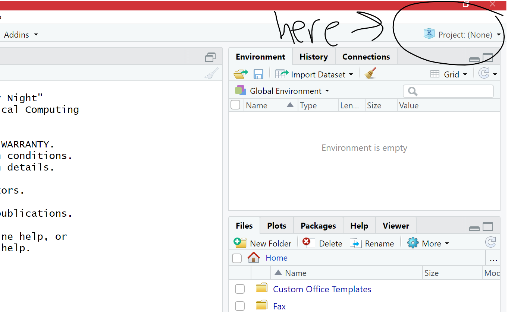
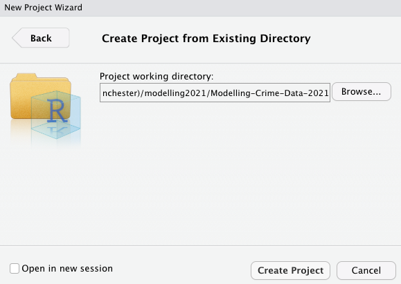
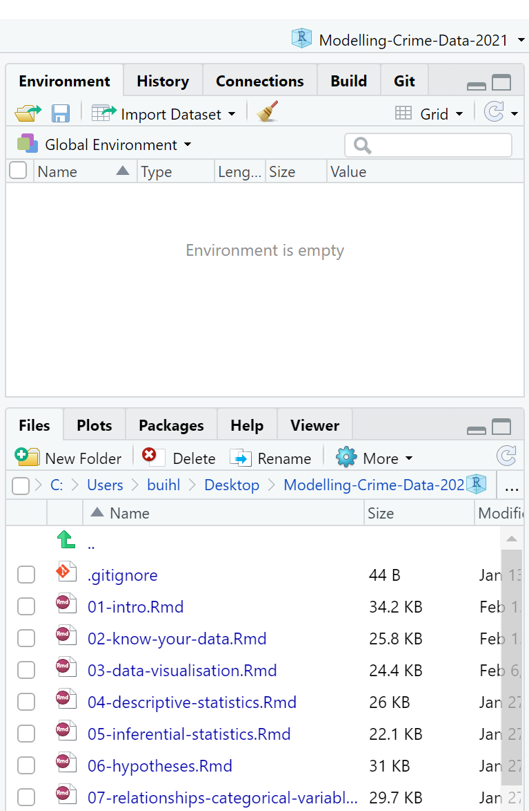

# Getting to know your data
#### *Variables, Labels, and Subsetting* {-}


##### **Learning Outcomes:** {-}
-	Create a project in `R` to refer back to for each session
-	Understand what variables are and how to examine them in `R`
-	Learn how to make new variables
- Learn how to label variables and their values
-	Learn how to subset select observations and variables

<div style="margin-bottom:30px;">
</div>

##### **Today’s Learning Tools:** {-}
<div style="margin-bottom:15px;">
</div>
##### *Total number of activities*: 9 {-}
<div style="margin-bottom:15px;">
</div>
##### *Data:* {-}
-	National Crime Victimization Survey (NCVS)

<div style="margin-bottom:15px;">
</div>

##### *Packages:* {-}
-	`dplyr`
-	`here`
-	`haven`
-	`labelled`
-	`sjlabelled`

<div style="margin-bottom:15px;">
</div>

##### *Functions introduced (and packages to which they belong)* {-}
- `%>%` : Known as the pipe operator, and allows users to pass one output of a code to become the input of another ( `dplyr`)
-`as_factor()` : Changes the class of an object to factor class (`haven`)
- `attributes()` : Access object attributes, such as value labels (`base R`)
-	`case_when()` : Allows users to vectorize multiple if / if else statements (`dplyr`)
-	`count()` : Counts the number of occurrences (`dplyr`)
-	`dir.create()` : creates a new folder in a project (`base R`)
-	`factor()` Creates a factor (`base R`)
-	`filter()` : Subsets a data frame to rows when a condition is true (`dplyr`)
-	`get_labels()` : Returns value labels of labelled data (`sjlabelled`)
-	`here()` : Finds a project’s files based on the current working directory (`here`)
-	`mutate()` : Creates new vectors or transforms existing ones (`dplyr`)
-	`read_spss()` : Imports SPSS .sav files (`haven`)
- `recode()` : Substitutes old values of a factor or a numeric vector by new ones (`base R`)
-	`remove_labels()` : Removes value labels from a variable (`sjlabelled`)
-	`remove_var_label()` : Removes a variable’s label (`labelled`)
-	`select()` : Select columns to retain or drop (`dplyr`)
- `table()`: Generates a frequency table (`base R`)
-	`var_label()` : Returns or sets a variable label (`labelled`)


---


## The Tidyverse

Last time, we installed our first package, `dplyr`. This is one of a number of packages from what is known as **tidyverse**. 

{width=40%} 

<div style="margin-bottom:30px;">
</div>

The tidyverse contains packages that help us carry out **wrangling** (i.e., cleaning variables), analysis, plotting, and modelling of our data. The ethos of tidyverse is that working and using tidy data makes our lives easier in the long run, allows us to stick to specific conventions, and enables us to share with others who follow this approach. Essentially, tidy data makes data analysis easy to carry out and to communicate to others.

So what is tidy data?

{width=80%}

<div style="margin-bottom:30px;">
</div>

Like what was mentioned in last week's lesson, our columns represent our variables, but, also, our cases (or better known in the tidyverse as **observations**) are our rows, whereby each cell is a value of that column's given variable for the observation in that row. 

In this class, we will be working with tidy data. Generally, if you have messy data, which is common in the real world of data analysis, your first task is to wrangle it until it is in a tidy shape similar to the ones described in Figures 2.2 and 2.3.  


{width=80%}

<div style="margin-bottom:30px;">
</div>

In today's lesson, we use `dplyr` and other `tidyverse` packages to explore and get to know our data. 

Being familiar with our data requires knowing what they comprise and what form they take. ‘Tidying’ our data through wrangling -- labelling, reformatting, recoding, and creating new variables -- will help with this step in the data analysis process. Today we will learn another three topics related to tidy data: **variables**, **labels**, and **subsetting**. 

<!-- We will be using the following packages this week: `dplyr`, `here`, `haven`, `tibble`, `labelled`, and `sjlabelled`. You can see this above in the packages tab. Make sure you have each one installed. Remember to install a package you must run `install_packages("packagename")`! -->

Let us get started and load `dplyr`:

<div style="margin-bottom:35px;">
</div>
```{r}

library(dplyr)

# Like last week, you can also check the 'Packages' tab in the 'Files, Plots...' pane to see if the box next to 'dplyr' has been ticked

```

<div style="margin-bottom:50px;">
</div>

## R Projects – Getting Your Work Files Organised

<div style="margin-bottom:30px;">
</div>

Although today is focused on tidy data, it is also helpful if whatever you are working on is also tidy and found in one easily accessible folder. By saving work inside a **project**, you can find files such as data and scripts related to specific work in a single working directory. Let us get into the habit of doing this:

<div style="margin-bottom:70px;">
</div>

### Activity 1: Making yourself a project 

•	Click on the top right tab called *Project: (None)* - Figure 2.4 
<div style="margin-bottom:30px;">
</div>

{width=50%}


<div style="margin-bottom:30px;">
</div>

In the options that appear, choose *Existing Directory*. The reason is you may have already created a folder for this work if you had saved your script from last week and from what you have done so far today. For example, Reka had saved a folder called 'modelling2021' with her scripts in it and will have her project in that same place too (see Figures 2.5 and 2.6).

{width=50%}


<div style="margin-bottom:30px;">
</div>

{width=50%}

<div style="margin-bottom:30px;">
</div>

Another option appears (Figure 2.6). Use the 'Browse...' button to select the folder where you have so far saved your script(s). Once you have done this, click on  *Create Project* and your new project will be launched.

This will now open up a new `RStudio` window with your project. In the future, you can start right where you left off by double clicking your project, which is a `.Rproj` file, to open it. It helps if you keep all your work for this class in one place, so `R` can read everything from that folder.

Now if you did not save any scripts or files thus far, so want to create a project in a new place,	you can do the following:

- Click on *New Project* (Figure 2.5). A window with different options appears. Create your project in *New Directory* and then click *New Project* 

<div style="margin-bottom:15px;">
</div>

-	Choose a name for your project (e.g., r_crim_course) and a location (i.e., working directory, which will be explained a little further below) where your project will be created

<div style="margin-bottom:50px;">
</div>

Inside your project, you can organise it by having separate files: one for scripts, one for data, one for outputs, and another for visuals. You can make these with the function `dir.create()`:
 
 <div style="margin-bottom:35px;">
</div>
```{r, eval=FALSE}

# For example, to make a sub-folder called 'Datasets' in your project folder, type this into your console pane:
dir.create("Datasets")

```

<div style="margin-bottom:50px;">
</div>

Another example: to create the online tutorial for this class, we have a project called `Modelling-Crime-Data-2021`. Figure 2.7 shows that this title appears in the top right hand corner and its contents, including sub-folders, appear in under the *Files* tab in the *Files, Plots...* pane. 

<div style="margin-bottom:30px;">
</div>

{width=40%}

<div style="margin-bottom:30px;">
</div>


The files in your *Files, Plots…* pane tell you in what folder you are automatically working. This is known as your **working directory**, the default location that appears when you open `RStudio`. Wherever your `R project` (that file ending in `.Rproj`) is saved will be the working directory. 

In your group google sheets, type the name of your `R` project and in which location it is in. Now decide whether this is a good location for your `R` project. For example, is the location name too long? (Something like 'C:\ Users\ xx\ Desktop \ xx\ xx\ Manchester\ xx \ xx\ xx\ xx\ xx\ xx' is too long and you might run into problems later.) Or are there files that are for your other course units in there too? If doubtful about the location of your project, move it somewhere else you think is more appropriate.

You can read on why projects are useful here: [https://www.r-bloggers.com/2020/01/rstudio-projects-and-working-directories-a-beginners-guide/](https://www.r-bloggers.com/2020/01/rstudio-projects-and-working-directories-a-beginners-guide/)


---


#### The `here` package
<div style="margin-bottom:30px;">
</div>

Whenever you want to locate certain files within your Project, use the `here` package:
<div style="margin-bottom:35px;">
</div>
```{r, eval=FALSE}

# First, you must install it if you have not done so:
install.packages("here")

```

```{r}

# Then bring it up with 'library()' because it may not come up automatically after installing it
library(here)

```
<div style="margin-bottom:50px;">
</div>

Using the `here` package is better than typing out the exact location of your file, which can be tedious. The next section shows how to use the `here()` function from said package to import data from the National Crime Victimization Survey (NCVS).


---


## Importing Data
<div style="margin-bottom:30px;">
</div>

Here is another `tidyverse` package to install:

<div style="margin-bottom:35px;">
</div>
```{r, eval=FALSE}

install.packages("haven")

```

```{r}

library(haven)

```

<div style="margin-bottom:50px;">
</div>

`haven` enables `R` to understand various data formats used by other statistical packages such as SPSS and STATA. We will need this package to open data in its diverse forms. When we worked with Excel last semester in *Making Sense of Criminological Data*, we could only open certain type of files. With `R`, we can open a wide range of data files, which opens up many possibilities of analysis for us. Let us give this a try now. 

<div style="margin-bottom:70px;">
</div>

### Activity 2: Importing and Viewing Data 

Go to the class Blackboard. Then click on *Learning materials* and then on *Week 2* where you will find the dataset 'NCVS lone offender assaults 1992 to 2013'. 

Download the data into the *Datasets* sub-folder in your working directory you had created using the function `dir.create()`. 

This data comes from The National Crime Victimization Survey (NCVS) from the US. You can read more about it [here](https://www.bjs.gov/index.cfm?ty=dcdetail&iid=245).

Now how to bring this dataset up in `RStudio`? We must follow these steps to *read* the data:

- 1. We note what kind of dataset file, 'NCVS lone offender assaults 1992 to 2013', is. The extension is `.sav` and this means that it is a file from the statistical package SPSS, so the function we need is `read_spss()` from the `haven` package. 

<!-- If the file came from Excel instead, for example, which would have an extension `.xlsx`, we would use the function `read_xlsx()` from the readxl package. -->

- 2. When importing data with the `here()` function, you must specify where the file is and what it is called in the brackets. In this case, we need to specify that it is in the sub-folder 'Datasets' and it is called 'NCVS lone offender assaults 1992 to 2013.sav'. So, the code to find the file would be: `here("Datasets", "NCVS lone offender assaults 1992 to 2013.sav")`.

Completing these steps, we now can load our dataset and place it inside a data frame called `ncvs`: 
<div style="margin-bottom:35px;">
</div>
```{r}

# Importing our SPSS dataset and naming it ‘ncvs’ 
ncvs <- read_spss(here("Datasets", "NCVS lone offender assaults 1992 to 2013.sav"))

```
<div style="margin-bottom:50px;">
</div>

What you are saying to `R` is the following: 

>My data, *NCVS lone offender assaults 1992 to 2013*, is a .sav file. Therefore, it is an SPSS dataset and is located in the sub-folder called *Datasets* in my default working directory. `R`,  please extract it from *here*, understand it, and place it in a data frame object called `ncvs`, so I can find it in `RStudio`.

<div style="margin-bottom:35px;">
</div>

To view the new data frame, `ncvs`, type:
<div style="margin-bottom:35px;">
</div>
```{r, eval=FALSE}

View(ncvs)

```

<div style="margin-bottom:50px;">
</div>

A tab appears labelled 'ncvs'. In it, you can view all its contents. In your group google sheets, type how many 'entries' and 'columns' there are in our data frame, `ncvs`.

<!-- # 23,969 entries and 47 columns -->

There are other ways to load data that are of different formats. For more information, see [this cheatsheet for importing data](https://evoldyn.gitlab.io/evomics-2018/ref-sheets/R_data-import.pdf). But for now, you can rely on us showing you the functions you need.


---


## Today’s 3 (TOPICS)

<div style="margin-bottom:30px;">
</div>

We now have data to tidy in `R`, so onto our three main topics for this week: **variables**, **labels**, and **subsetting**.

<div style="margin-bottom:30px;">
</div>

### Variables

Variables can be persons, places, things, or ideas that we are interested in studying. For example, height and favourite football team. 

Last week, we learned a little on how to examine what our variables are. Let us revisit this. One of the first things we do to get to know our `ncvs` data frame is to identify the number of rows and columns by using the function `View()` as we did above, or, a more direct way, the function `dim()`:

<div style="margin-bottom:35px;">
</div>
```{r dimncvs}

dim(ncvs)

```

<div style="margin-bottom:50px;">
</div>

Like your answer from Activity 2, the data frame`ncvs` has 47 columns, meaning that it has 47 variables. What are these variables all called? We can get their names using the `names` function:

<div style="margin-bottom:35px;">
</div>

```{r namesncvs}

names(ncvs)

```

<div style="margin-bottom:50px;">
</div>

We observe that a number of these variable names are codes, which is somewhat similar to the Crime Survey of England and Wales (CSEW) data we worked with last semester, whereby the variable *polatt7*, for example, was trust in police. 

You could view the data frame like you did previously (with the function `View()`) to find out what the variables actually are, or you could look it up in the data dictionary [here](https://www.icpsr.umich.edu/web/ICPSR/series/95/variables). The advantage of the data dictionary -- which will accompany all well-documented datasets -- is it will tell you precisely what the variables are and how they measure their characteristics in that particular dataset. For example, the data dictionary that accompanies the NCVS tells us that the variable `V3014` is age.

<div style="margin-bottom:50px;">
</div>

#### Measurement {-}
<div style="margin-bottom:30px;">
</div>

What about the level of measurement for these variables? Different variable types refer to different levels of measurement.

For **categorical variables**, we can have variables that are nominal (no order), ordinal (have an order), or binary (only two possible options, like 'yes' and 'no'). 

{width=70%}

<div style="margin-bottom:30px;">
</div>

**Numeric variables** can be classified two separate ways. Last semester, we discussed the difference between *interval* and *ratio* variables. Interval variables have the same distance between observations, but have no true zero. The temperature in Celsius is one example. Ratio variables, on the other hand, do have a true zero point. Calculating a ratio from the values of these variables makes sense, but for values from interval variables, it does not. For example, it is pretty meaningless to state that 20 degrees Celsius is twice as hot as 10 degrees Celsius ('0' in Celsius is not the absolute lowest temperature). But if Reka has £30 pounds in her bank account and Laura has £60, it is meaningful to say Laura has twice as much savings as Reka does. 

Another way to classify numeric variables is to distinguish between discrete and continuous variables. *Discrete* numeric variables have set values that make sense. For example, crime is one such variable. It is understandable to have 30 burglaries in May and 50 burglaries in December, but it is not understandable to have 45.2482 burglaries. *Continuous* numeric variables, however, can take on any value between a lower and upper bound and be meaningful. For example, weight and height. Here is an apt illustration: 

{width=70%}

<div style="margin-bottom:30px;">
</div>

#### Variables in `R`

So, how are these levels of measurement among variables relevant in `R`? Nominal and ordinal variables are encoded as a **factor** class because they are categorical characteristics, so take on a limited number of values; factors are like the integer vector introduced last week but each integer is a label. Numeric variables, on the other hand, are encoded as a **numeric** class.

<div style="margin-bottom:70px;">
</div>

##### Activity 3: Identifying a variable's level of measurement

Identifying the level of measurement should be straightforward when examining each variable. In some cases, however, `R` may not quite grasp what kind of variable you are working with. Thus, you will need to find out what `R` thinks your variable is classed as. 

How do you ask `R` what your variable is? Let us find out by using our `ncvs` data frame. 

First, do you remember from last week how to refer to one specific variable in your data frame? 

It is: `dataframe$variablename`

If we want to find out about the variable `injured` (whether the person was injured or not) from our data frame `ncvs`, for example, we can refer to the variable specifically. Let us use the `attributes()` function to examine this variable.

<div style="margin-bottom:35px;">
</div>
```{r}

# To see the class of a specific variable, such as the variable ‘injured’, we use:
attributes(ncvs$injured)

# The $ symbol allows us to access specific variables in a data frame object

# The $ symbol must be accompanied by the name of the data frame!

```
<div style="margin-bottom:50px;">
</div>

We can see the label ('Victim Sustained Injuries During Vicitmization'), and the values (at the bottom) indicating '0' for 'uninjured' and '1' for 'injured'. This appears to be a categorical variable with 2 possible values; therefore, a *binary* variable. 

Now your turn: find out what is the class of the variable `weaponpresent`. In your googledoc, type out the answer and the code you used to get that answer.


---


<div style="margin-bottom:50px;">
</div>


<!-- Another thing we can do is to apply a specific function (like that of `class()`) to every single variable in the dataframe. To do this, we can use the `sapply()` function. Inside the `sapply()` function, you actually have to specify *two things*. First, the object you want to apply the function to (in this case the dataframe, ncvs), and the function which you want to apply (in this case class). Like so:  -->


<!-- ```{r} -->

<!-- # To see the class of all the variables (columns) in our data frame, ncvs, we use: -->
<!-- sapply(ncvs, class) -->


<!-- ``` -->


<!-- This tells you about every single column (all 47 variables) in the dataframe!  -->


#### Formatting Classes and Value Labels

<div style="margin-bottom:30px;">
</div>

In some cases, you may want to make changes to how variables are classed. For example, in our data frame `nvcs`, some of the variables are classed as `haven_labelled`. 

What is this, you ask? When we use the `haven()` function to import data, `R` keeps the information associated with that file -- specifically the value labels that were in the dataset. In practice, therefore, you can find categorical data in `R` embedded in very different types of vectors (e.g., character, factor, or haven labelled) depending on decisions taken by whomever created the data frame.

Although we understand why these variables are labelled as `haven_labelled`, they do not help us understand what class these variables actually are. If we know a variable is classed as factor, We can change it to be so. For example, we want to change the class of variable `V3018` to be accurately classed as factor:

<div style="margin-bottom:35px;">
</div>
```{r}

# V3018 is a binary variable indicating sex
attributes(ncvs$V3018)
# It is indeed classed as 'haven-labelled'

# Naming the newly created factor 'sex' so we do not erase the original variable
# Specify the order we want our variable labels using 'labels= c()'
ncvs$sex <- factor(ncvs$V3018, labels = c("male", "female"))

table(ncvs$sex)

attributes(ncvs$sex)

```

<div style="margin-bottom:50px;">
</div>

The new variable, `sex`, a duplicate of `V3018`, is no longer a 'haven_labelled' type variable. It is now classed as a factor. But remember, 'class' and 'factor' are `R` lingo -- **we would still describe this as a categorical, binary variable!** We include `R` language so that you know what it means and how it links to what you have learned in your data analysis classes. 

<div style="margin-bottom:50px;">
</div>

#### Recoding and Creating New Variables 

<div style="margin-bottom:30px;">
</div>

What if we want to create a new variable? Here are three scenarios where we would want to do so: 

*Scenario 1*: we want a variable like the `injured` variable, but for the values, we instead want to see 'uninjured' and 'injured' and not '0' and '1';

*Scenario 2*: we want a composite variable, like the fear of crime composite variable from last semester that comprised many different scores; 

*Scenario 3*: we want to change an existing variable that is *ordinal* with four outcomes into a *binary* variable with only two outcomes. 

We address all three scenarios in turn. Recoding and creating new variables is called **data wrangling** and the package `dplyr` is most appropriate for doing so. 

{width=70%}

<div style="margin-bottom:30px;">
</div>


<!-- In some circumstances, we would like to recode variables. Recoding could entail collapsing multiple values of your variable into a single category or making some values of your variable become missing. In other circumstances, we may want to create a brand new variable that combines data from two others. First, time to install another package to learn the `add_column()` function: `tibble`. Now let us learn! -->

<div style="margin-bottom:70px;">
</div>

---


#### Activity 4: Creating a new variable by recoding an existing one

<div style="margin-bottom:35px;">
</div>

For scenario 1, we want to recode our existing `injured` variable. We view a frequency table of this variable to understand why. The frequency table tells us the number of times each value for the variable occurs. This is similar to the Pivot Table function in Excel from last semester. 

In `R`, the way to create a frequency table for one variable is to use the function `table()`. Inside the brackets, you would type the data frame and the variable you want to create the frequency table for. We want a frequency table for the `injured` variable:

<div style="margin-bottom:35px;">
</div>

```{r}

# Is the appropriate package, 'dplyr', loaded?

table(ncvs$injured)

```

<div style="margin-bottom:50px;">
</div>

The frequency table shows that 16,160 people answered '0' to the question of whether they were injured, while 7,809 answered '1'. Since we ran our `attribute()` function earlier, we know that '0' means 'uninjured', and '1' means 'injured'. Often in data, '0' represents the absence of the feature being measured and '1' means the presence of such feature.

Although we know what the numbers represent, we might forget or someone else unfamiliar with the data views the variable and may not know what the values mean. In this case, it would be helpful to change the numbers '0' and '1' to what they represent.

To do so, we create a new variable whereby a new column appears in the data frame. It is similar to when you create an object. Remember: 
<div style="margin-bottom:35px;">
</div>

```{r}

name <- "Reka"

```

<div style="margin-bottom:50px;">
</div>

The only difference is that we must attach this new object (which appears as a column) to the dataframe, and that the number of things we put in this object needs to match the number of rows in that data frame. As we are creating a new variable from one that already has the same number of rows, this is not a issue. 

Let us again create a duplicate variable of the `injured` variable: 

<div style="margin-bottom:35px;">
</div>
```{r}

# Create the new variable ‘injured_new’ from ‘injured’ 
ncvs$injured_new <-ncvs$injured 

```

<div style="margin-bottom:50px;">
</div>

View the `ncvs` data frame. Notice that a new column, `injured_new`, appeared at the end with the exact same contents as the variable `injured`. We will now change those '0' and '1' values.

A function to change values is `as_factor()` from the `haven` package. This function takes the labels assigned to the values of the variable, and changes those original values into these very labels. 

<div style="margin-bottom:35px;">
</div>

```{r}

# Remember: You can check what package each function we learn today belongs to by referring to the top of each online lesson, under 'Functions Introduced'

ncvs$injury_r <- as_factor(ncvs$injured)

```

<div style="margin-bottom:50px;">
</div>

In the data frame `ncvs`, you will see this new column `injured_r`. If we make the frequency table with this new variable, we see that the values are readily understandable as 'uninjured' and 'injured':

<div style="margin-bottom:35px;">
</div>
```{r}

table(ncvs$injury_r)

```

<div style="margin-bottom:50px;">
</div>

This a lot easier than 'VLOOKUP' from last semester! 


<div style="margin-bottom:70px;">
</div>

<!-- The first example uses the package `tibble` to make an additional variable. This new variable, `injured_new`, has the same exact information as the variable `injured`.  -->

<!-- In the second example, we changed our `injured_r` variable so that its values would have value labels. -->

<!-- In your group googledoc, type out the value for each value label of `injured_r`. If you are not sure how to figure this out, identify what the values were and run the `attributes` function on `injured_r` again. The order in which the value label appears from left to right will correspond to the order of values from lowest to highest. -->

<!-- Now we learn how to create a new variable that gives an ID number for each of our cases (rows): -->

<!-- <div style="margin-bottom:35px;"> -->
<!-- </div> -->
<!-- ```{r} -->

<!-- # 3. Create a new column (aka variable) that has a row ID  -->
<!-- add_column(ncvs, newid = 1:nrow(ncvs)) -->

<!-- ``` -->

<!-- <div style="margin-bottom:70px;"> -->
<!-- </div> -->


---


#### Activity 5: Creating a composite variable from more than 1 existing variable

We turn to Scenario 2: we want to create a new variable in our `ncvs` data frame that indicates the severity of the victimization experienced by the respondent. 

That severity will be measured by two variables: (1) whether the offender had a weapon and (2) whether the victim sustained an injury during their victimization. These are not necessarily the best variables to use in measuring victimization severity; this example, however, should illustrate how you might combine variables to create a new one. 

Before we do this, we need to know if we can actually do so by getting to know those variables of interest. By using the function `count()`, we get a good sense of what the values represent and the number of respondents in each of those values for both variables.

<div style="margin-bottom:35px;">
</div>
```{r}

# Using count ( ) for ‘injured’ and ‘weaponpresent’
count(ncvs, injured)
count(ncvs, weaponpresent)

```

<div style="margin-bottom:50px;">
</div>

This function tells us that `injured`, a binary variable, is stored as numbers, where the 0 value means the victim was uninjured and the 1 value means they were injured. Also, the `weaponpresent` variable is (should be) a binary variable stored as numbers. Here, more victims report that the offender did not use a weapon during the offence (n= 15,814) as opposed to using one (n= 6652). But there are also a number of missing values for this question (n= 1503).

Now what if we wanted to combine these, so we can have a score of severity, which takes into consideration presence of weapon and injury?

There is a particular function from the `dplyr` package that is very handy for creating a new variable from more than 1 variable. It is called `mutate`. The `mutate()` function will create a new column in our data frame that comprises the sum of both of these variables, keeping the old variables too: 

<div style="margin-bottom:35px;">
</div>
```{r}

# Create the new variable with mutate: 

# 1. The first argument inside the `mutate` function is the data frame into which we want to create the new variable
# 2. After the comma, we insert the equation that adds together the variables 'injured' and 'weaponpresent' to create the new variable called 'severity'
# 3. This new variable is saved in the data frame `ncvs` (to do so, it overwrites the old version of 'ncvs')

ncvs <- mutate(ncvs, severity = injured + weaponpresent)

```

<div style="margin-bottom:50px;">
</div>

Now view the data frame to see the new variable `severity`. The `severity` variable is ordinal, where '0' is the least severe (neither a weapon was used nor the victim injured), '1' is more severe (either the offender wielded a weapon or the victim reported being injured), and '2' is the most severe (the respondent reported being injured and the offender had a weapon). 

Let us see the new variable in the frequency table: 

<div style="margin-bottom:35px;">
</div>
```{r}

table(ncvs$severity)

```

<div style="margin-bottom:50px;">
</div> 

You can then add value labels to reflect your understanding of the summed scores. To do so, you can over-write the existing `severity` variable (instead of making an additional duplicate variable). 

You do so by specifying it on the left side of the `<-` (assignment operator). Then, on the right side, you use the `recode()` function. Inside the brackets of the `recode()` function,  we specify the variable we want to change, and then we follow with a list of values. Notice that the numbers must be between the crooked quote marks ````:

<div style="margin-bottom:35px;">
</div>

```{r}

ncvs$severity <- recode(ncvs$severity, `0` = "not at all severe", `1` = "somewhat severe", `2` = "very severe")

```
<div style="margin-bottom:50px;">
</div>

View this new version of the `severity` variable in a frequency table:

<div style="margin-bottom:35px;">
</div>
```{r}

table(ncvs$severity)

```
<div style="margin-bottom:50px;">
</div>

<!-- Try it out and type the code you used to add those value labels to `severity` in your group googledoc:-->

<!-- ```{r eval=FALSE} -->

<!-- # Clueless as to how to add value labels? Refer to Activity 4 -->
<!-- # Here is some help to add value labels to the 'severity' variable: -->

<!-- # ncvs$severity <- (ncvs$severity, labels = ??? ) -->

<!-- ``` -->
<!-- <div style="margin-bottom:70px;"> -->
<!-- </div> -->

<!-- <!-- # ncvs$severity<- factor(ncvs$severity, labels = c("nothing", "victim or weapon", "both"), ordered = TRUE) --> 

The above example was simple, but often, we will want to make more complex combinations of variables. This is known as **recoding**. And it will constitute our next activity. 


<div style="margin-bottom:70px;">
</div>

---


#### Activity 6: Recoding


Now to Scenario 3: we want to turn the variable `relationship` into a binary variable called `notstranger` whereby the offender was either a stranger (0) or was known to the victim (1). 

First, we use the `table()` function to create a frequency table for `relationship`, and it has four categories: 

<div style="margin-bottom:35px;">
</div>
```{r}


table(ncvs$relationship)

```

<div style="margin-bottom:50px;">
</div>

What do these categories mean? We can use the `as_factor()` function from the `haven` package to find out:

<div style="margin-bottom:35px;">
</div>
```{r}

table(as_factor(ncvs$relationship))

```

<div style="margin-bottom:50px;">
</div>


There are four categories of relationship in addition to a 'don't know' category, but there are no observations in it. 

We want to turn this into a binary variable. So let us  use `mutate()` and a new function called `case_when()`. 

Think of `case_when()` as an ‘if’ logical statement. It allows us to make changes to a variable that are conditional on some requirement. For example, we specify that values greater than '0' (values 1 to 3) mean 'not a stranger' and values equal to '0' mean 'stranger':

<div style="margin-bottom:35px;">
</div>

```{r}

ncvs <- mutate(ncvs, 
               notstranger = case_when(
                 relationship == 0 ~ "Stranger",
                 relationship > 0 ~ "Not a stranger"))

```

<div style="margin-bottom:50px;">
</div>


<!--```{r}

# 
ncvs <- mutate(ncvs, 
               notstranger = case_when(
                 relationship == 0 ~ "Stranger",
                 relationship == 1 | 
                 relationship == 2 | 
                 relationship == 3 ~ "Not a stranger"))

```
<div style="margin-bottom:50px;">
</div>

So we see we are saying the new variable 'notstranger' get's the values in the cases when relationship is equal to 0, and get's the values of not stranger when the relationship value is equal to 1, `or` relationship value is equal to 2, `or` relationship value is equal to 3! To tell R `or` we use the `|` operator. (The opposite of `or` (`|`) is `and` which is represented by `&`).

You could also say, if it is 0 then stranger, and if it is greater than 0 then it is not a stranger. Like so: 

Same results. -->

To verify that we have recoded a new binary variable:
<div style="margin-bottom:35px;">
</div>
```{r}

table(ncvs$notstranger)

```
<div style="margin-bottom:50px;">
</div>

It seems that most victimisation is perpetrated by non-strangers!


---


### Labels

<div style="margin-bottom:30px;">
</div>

Variables sometimes come with labels – these are very brief descriptions of the variable itself and what its values are. We are familiar with *variable* labels because of our previous activities. Now, *value* labels are very useful when we have a nominal or ordinal level variable in our dataset that has been assigned numeric values. To have a look at what are your variable and value labels, use the function `attributes()`:

<div style="margin-bottom:35px;">
</div>
```{r}

attributes(ncvs$injured)
# You can also use var_label() and get_labels() too, but attributes() shows both types of labels

```

<div style="margin-bottom:50px;">
</div>

Returning to a familiar variable, `injured`, the output in the console shows that 'uninjured' is labelled '0' and 'injured' is labelled '1'. Maybe, though, you do not like the labels that are attached to the variable values. Perhaps they do not make sense or they do not help you to understand better what this variable measures. If so, we can remove and change the labels. 

<div style="margin-bottom:70px;">
</div>

#### Activity 7: Removing labels 

We return to the `injured` variable from the `ncvs` dataframe. We, again, are going to make a duplicate variable of `injured` to learn how to remove and add labels. We do this because it is good practice to leave your original variables alone in case you need to go back to them. 

<div style="margin-bottom:35px;">
</div>
```{r}

# Make a new variable that is a duplicate of the original one, but naming it ‘injured_no_labels’
ncvs$injured_no_labels <- ncvs$injured

attributes(ncvs$injured_no_labels)

```
<div style="margin-bottom:50px;">
</div>

To remove labels, we will need to load two new packages: `labelled` and `sjlabelled`. Can you do that?

<div style="margin-bottom:35px;">
</div>
```{r, echo=FALSE, message=FALSE, warning=FALSE}

library(labelled)
library(sjlabelled)

```
<div style="margin-bottom:50px;">
</div>

After loading the two new packages, we remove variable and value labels:

<div style="margin-bottom:35px;">
</div>
```{r}

# Remove variable labels 
ncvs$injured_no_labels <- remove_var_label(ncvs$injured_no_labels) 

# Check that they were removed 
var_label(ncvs$injured_no_labels)

# Remove value labels 
ncvs$injured_no_labels <- remove_labels(ncvs$injured_no_labels, labels = c(1:2))  

# Check that they were removed 
get_labels(ncvs$injured_no_labels)

```

<div style="margin-bottom:50px;">
</div>

Now to add a label:
<div style="margin-bottom:35px;">
</div>
```{r}

# Add variable label 
var_label(ncvs$injured_no_labels) <- "Whether Victim Sustained Injuries" 

# Check that they were added 
var_label(ncvs$injured_no_labels)

# Add variable label 
ncvs$injured_no_labels <-add_labels(ncvs$injured_no_labels, labels = c(`uninjured` = 0, `injured` = 1)) 

# Check that they were added 
get_labels(ncvs$injured_no_labels)

```
<div style="margin-bottom:50px;">
</div>

Nothing to add in the googledoc so far, since Activity 4, so onto the next activity.

<div style="margin-bottom:70px;">
</div>


#### Note: pipes


<div style="margin-bottom:30px;">
</div>

In `R`, `%>%` represents a **pipe operator**. This is a nifty shortcut in `R` coding. It is in reference to [René Magritte's *The Treachery of Images*](https://blog.revolutionanalytics.com/2014/07/magrittr-simplifying-r-code-with-pipes.html). The pipe operator means that we only need to specify the data frame object once at the beginning as opposed to typing out the name of the data frame repeatedly. In all subsequent functions, the object is ‘piped’ through. If you were to read the code out loud, you might say 'and then' whenever you come across the pipe operator. We will use this now. 

<div style="margin-bottom:50px;">
</div>


---


### Subsetting

<div style="margin-bottom:70px;">
</div>

#### Activity 8: Ways to subset data

Through `tidyverse` functions, we can subset our data frames or vectors based on some criteria. Using the function `select()`, we can subset variables by number or name:

<div style="margin-bottom:35px;">
</div>
```{r}

# Using select () to subset by the first two variables
ncvs_df_1 <- ncvs %>% select(1:2) 

```
<div style="margin-bottom:50px;">
</div>

If we wanted to select only the variables `injured`, `weaponpresent`, and `severity`:

<div style="margin-bottom:35px;">
</div>
```{r}

# Using select () to subset by three select variables
ncvs_df_2 <- ncvs %>% select(injured, weaponpresent, severity) 

```
<div style="margin-bottom:50px;">
</div>

Using the function `slice()`, we can subset rows by number. To get only the first row:

<div style="margin-bottom:35px;">
</div>
```{r}

# Get the first row
first_row_of_ncvs <- ncvs %>% slice(1) 

```
<div style="margin-bottom:50px;">
</div>

To get more rows, you can use the 'from:to' notation. To get the first two rows, for example, you say 'from 1 to 2', that is '1:2':

<div style="margin-bottom:35px;">
</div>
```{r}

# Get the first two rows 
first_two_rows_of_ncvs <- ncvs %>% slice(1:2) 

```
<div style="margin-bottom:50px;">
</div>

You can subset select rows and columns by taking `slice()` and combining it with `select()`. For example:

<div style="margin-bottom:35px;">
</div>
```{r}

# Get the first two variables and first two rows 
first_two_rows_cols <- ncvs %>% select(1:2) %>% slice(1:2)

```

<div style="margin-bottom:50px;">
</div>


{width=80%}

<div style="margin-bottom:30px;">
</div>

Use the `filter()` function to subset observations (i.e., rows) based on conditions. For example, we only want those for which the `injured` variable was equal to 1, so we run:

<div style="margin-bottom:35px;">
</div>
```{r}

only_injured <- ncvs %>% filter(injured == 1)

```
<div style="margin-bottom:50px;">
</div>

These filters can be combined using conditions and (`&`) and or (`|`)  except we call this subset of the data frame 'knew_of_and_injured':

<div style="margin-bottom:35px;">
</div>
```{r}

# We want a subset called 'knew_of_and_injured' which comprises responses greater than 0 in the 'relationship' variable and responses equal to 1 in the 'injured' variable
knew_of_and_injured <- ncvs %>% 
filter(relationship > 0 & injured == 1)

```

<div style="margin-bottom:50px;">
</div>

Say if we wanted the first five rows of `knew_of_and_injured`. How would we do that? In your group googledoc, type out the code you think will help you create a (sub-)subset `knew_of_and_injured` of its first five rows. Call this new subset 'injuredfiveknew'.

<!-- injuredfiveknew <- KnewOfandInjured %>% slice(1:5)-->

<div style="margin-bottom:70px;">
</div>

---


#### Activity 9: Subsetting, the Sequel

We now have a subset called `injuredfiveknew`. Say we only want to keep the variables `V3014` (age) and `V3018` (sex). How would you make an object that only contains these two variables from `injuredfiveknew`?

Recall that you would need to use the function `select()`to select variables. But in this example, instead of inserting ' : ' like in the previous code, you would need to insert a ','. Understanding what ':' means and viewing the order of the variables in `injuredfiveknew` will give you insight into why.

In your group googledoc sheet, write out the code that you would use to do so. Name this new object that contains the two variables `five_ageandincome`

<!-- five_ageandincome <- injuredfiveknew %>% select(4,6)-->


<div style="margin-bottom:50px;">
</div>


---


## SUMMARY

<div style="margin-bottom:30px;">
</div>

Today you were further introduced to **tidyverse** packages that helped you to tidy your data. First, we learned to put our work into a **project** and then how to import data using a package called `haven`. Whenever we specify a data frame, we learned a nifty short-cut: the **pipe operator** - `%>%` - which allows us to specify the data frame only once when we code. 

Our three main topics today had to do with helping us tidy. There was a lot of **data wrangling** too. One topic were the variables themselves where we learned about the **factor** and **numeric** classes, and how to make and **recode** new variables. Two, we learned how to remove and add variable and value labels so that we can understand what our variables are measuring.  Three, we then learned to subset our data, whereby we make new dataframes that include only the columns – variables – or rows – observations – we want. We tidied our data using the TIDYVERSE WAY!

<div style="margin-bottom:50px;">
</div>

P.S. Well done today, to get through all this. What you are learning now will serve as the building blocks for your later data analysis, and we recognise it is all new and scary. But keep practicing, and you will get the hang of this in no time! And of course: don't forget to do your homework!

<div style="margin-bottom:500px;">
</div>

<!--## Answers to activities (if applicable)

-1. N/A
-2. 23,969 entries and 47 columns 
-3. numeric and class(ncvs$weaponpresent)
-4. N/A
-5. N/A 
-6. N/A 
-7. N/A 
-8. injuredfiveknew <- KnewOfandInjured %>% slice(1:5)
-9. five_ageandincome <- injuredfiveknew %>% select(4,6)-->


