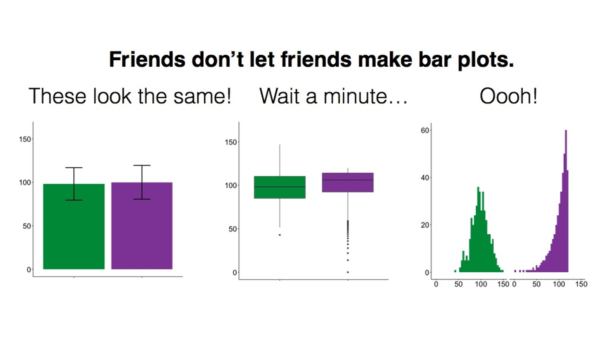

# Data Visualization
#### *Layers and Graphs* {-}


##### **Learning Outcomes:** {-}
-	Understand what the layered approach to Grammar of Graphics and its corresponding package `ggplot2` are
-	Learn how to use `ggplot2` to create different visualizations


##### **Today’s Learning Tools:** {-}


##### *Total number of activities*: 12 {-}


##### *Data:* {-}
-	Official crime data from England and Wales


##### *Packages:* {-}
-	`ggplot2`
- `ggthemes`
-	`readr`
- `here`


##### *Functions introduced (and packages to which they belong)* {-}
-	`aes()` : Mapping aesthetics to variables (`ggplot2`)
-	`as.factor()` : Convert to factor, including specifying levels (`base R`)
-	`facet_wrap()` : Facet graphics by one or more variables (`ggplot2`)
-	`geom_histogram()` : Geometry layer for histograms (`ggplot2`)
-	`geom_line()` : Geometry layer for line charts (`ggplot2`)
-	`geom_point()` : Geometry layer for scatterplots (`ggplot2`)
-	`ggplot()` : Initialize a ggplot graphic, i.e., specify data, aesthetics (`ggplot2`)
-	`labs()` : Specify labels for ggplot object, e.g., title, caption (`ggplot2`)
-	`range()` : Compute the minimum and maximum values (`base R`)
-	`read_csv()` : Read in comma separated values file (`readr`)
-	`scale_color_brewer()` : Default color scheme options (`ggplot2`)
-	`scale_color_viridis_d()` : Colour-blind-considerate palettes from `viridis` package (`ggplot2`)
-	`theme()` : Customise ggplot graphics (`ggplot2`)
- `theme_economist ()` : Changes the graphic to resemble ones found in *The Economist* (`ggthemes`)
-	`theme_minimal()` : Default minimalist theme for `ggplot` graphics (`ggplot2`)


<br>
<br>


---

## Grammar of Graphics

Today we learn the basics of data visualization in `R` using a package called `ggplot2` within the `tidyverse`, one of the most popular packages for making high-quality, reproducible graphics. The framework on which `ggplot2` is based derives from [Hadley Wickham’s (2010) A Layered Grammar of Graphics](http://vita.had.co.nz/papers/layered-grammar.pdf). 

Wickham advances the work of *Grammar of Graphics* by proposing a layered approach to describe and build graphics in a structured manner. Layers, according to Wickham, are used to describe the basic features that underlie any graphic or visualization. Every layer comprises five parts: data, aesthetics, statistical transformation (stat), geometric object (geom), and position adjustment (position). 

The three primary ones we focus on to ease you into this, however, are (1) the data, (2) the aesthetics, and (3) the geometric objects:
<br>

1.	Data: usually the data frame with tidy rows and columns. 

2.	Aesthetics: the visual characteristics that represent the data, or variables. At its simplest, these could be an x- and y-axis, and can extend to other aesthetics like colour, size, and shape, which are mapped to variables. 

3.	Geometric objects: also known as ‘geoms’ and represent the data points in the visualization, such as dots or lines.
<br>

{width=70%}

<br>

{width=70%}

<br>

{width=70%}  

<br>

Why is this important? Visualizing your data helps you to have a better understanding of them before moving on to more advanced and complex analyses. Numbers themselves can be deceptive and complicated, so by visualizing them, you can identify any patterns or anomalies.

<br>
<br>

### Activity 1: Getting Ready

Before we ‘layer up’, let us do the following:
<br>

1.	Open up your existing `R `project like you had learned last week

2.	Load the `ggplot2` and  `readr`  packages using the `library()` function. If you have not already installed these packages, you will need to do so first, using the `install.packages()` function. *If you are unclear about the difference between these two functions, see 1.3.3 in Lesson 1 of this online tutorial site or ask now!*

3.	Download the first two datasets (gmp_2017.csv and gmp_monthly_2017.csv) from Blackboard, in the subfolder 'Data for this week' in the Week 3 learning materials. The datasets contain crime data from Greater Manchester, England. Load these two datasets using the `read_csv()` function into two separate data frames. Respectively name the data frames `burglary_df` and `monthly_df` by using the `<-` assignment operator. 

Make sure the datasets are saved in the sub-folder called 'Datasets' that you created last week *inside* your project directory/ folder. If this is the case, we can use the `here()` function to tell `R` where exactly to locate the datasets. (See lecture short 3.1 'The R Prep routine' on Blackboard.)
<br>

```{r, echo=FALSE, message=FALSE, warning=FALSE}
library(ggplot2)
library(readr)
library(here)
```


Create first data frame object, `burglary_df` and load into it the 'gmp_2017.csv' data file:
<br>

```{r, message=FALSE, warning=FALSE}

# gmp_2017.csv
burglary_df <- read_csv(here("Datasets", "gmp_2017.csv"))


```

<br>

Now your turn to make the second data frame. Create the second data frame, `monthly_df` and load into it the 'gmp_monthly_2017.csv' data file.

```{r, echo=FALSE, message=FALSE, warning=FALSE}

monthly_df <- read_csv(here("Datasets", "gmp_monthly_2017.csv"))

```


You should have two data frames in your environment now. How many observations (rows) and variables (columns) are in `burglary_df`? How about in `monthly_df`? 

<br>
<br>

---


## ggplot2


This week we will be learning how to use `R` to create various exciting data visualizations. You may remember some of the key principles of data visualizations from last semester: graphics should be truthful,functional, beautiful, insightful, and enlightening. Also, accessible!

Here is a recent powerful visualization from The New York Times about deaths from COVID-19 in the USA (Figure 3.4): https://twitter.com/beccapfoley/status/1363338950518206472

<br>
<br>

{width=70%}

<br>


`R` has amazing data visualization qualities. It is increasingly used by professionals and academics to create graphics that embody those principles of data visualization.

For example, read this article about how the BBC uses `R` to create their graphics: [How the BBC Visual and Data Journalism team works with graphics in R](https://medium.com/bbc-visual-and-data-journalism/how-the-bbc-visual-and-data-journalism-team-works-with-graphics-in-r-ed0b35693535) (See Figure 3.5)

<br>
<br>


<br>
<br>

As you learn to create graphs in `ggplot2`, you will see that the code reflects building these graphs as layers. This will take getting used to if you are only familiar with building graphs from a template in Excel. You can also reuse chunks of code to create different kinds of graphics or identical ones in other datasets. 

Today we focus on the `ggplot2` package to learn our three substantive topics: **layers**, **graphs for categorical data**, and **graphs for numeric data**. 


#### Activity 2: Getting to Know New Data

Before we dive into those topics, we need to get into the habit of getting to know our data. Below is a brief 'data dictionary' of the variables from both of our data: 

<br>

A. **burglary_df** has nine variables: 

- *LSOAcode*: LSOA stands for Lower Super Output Area, and is a statistical unit of geography. It represents neighbourhoods that each contain 300-400 households. Essentially, LSOA means neighbourhood.
- *burglary_count*: the number of burglaries in each LSOA in 2017
- *LAname*: the name of the Local Authority into which the LSOA falls
- *IMD score*: the IMD refers to the Index of Multiple Deprivation. This measure combines seven domains of deprivation into one index: (1) income, (2) employment, (3) education, (4) health, (5) crime, (6) barriers to housing or services, and (7) living environment.  It is the score that a particular LSOA has on this measure. You can read more about the measure here: [IMD infographic](https://assets.publishing.service.gov.uk/government/uploads/system/uploads/attachment_data/file/833959/IoD2019_Infographic.pdf)  
- *IMDrank*: another version of the IMD except it ranks all 32,844 LSOAs from highest to lowest deprivation.
- *IMDdeci*: indicates in what decile of deprivation the LSOA falls. 
- *incscore*: score for income deprivation; this is one of the seven indicators comprising the IMD. Measures the proportion of the population experiencing deprivation relating to low income.
- *LSOAname*: the name of that particular LSOAs
- *pop*: the population size of LSOAs

<br>


B. **monthly_df** has three variables: 

- *Month*: month of the year whereby 1 = January, 2 = February... and 12 = December
- *crime_type*: type of crime (for police.uk categories, see: [download police.uk data categories vs home office offence codes](https://www.police.uk/SysSiteAssets/police-uk/media/downloads/crime-categories/police-uk-category-mappings.csv))
- *n*: number of each type of crime for each month in 2017

<br>


Have a look at both datasets. Let us use the function `View()` first. What do you think are the levels of measurement for each variable? Make a note of this. 

Now use the the function `class()` to look at how `R` treats each variable for each dataset. How does this match with what you think is the level of measurement for each variable? Keep this in mind!

<!-- In `burglary_df`, there are eight variables. For example, the `IMDscore` variable combines seven domains of deprivation into one index: income, employment, education, health, crime, barriers to housing/services, and living environment. `IMDrank` is a variable that ranks all 32,844 Lower Super Output Areas (LSOAs) from highest to lowest.  -->

<!-- What are LSOAs? They are small geographical areas developed from census information in order to calculate a range of statistics on neighbourhoods. You will see that by using the `range()` function (`range(burglary_df$IMDrank)`), that not all LSOAs are included, as this dataset only contains cases from Greater Manchester.  -->

Notice that although `monthly_df` has only several variables, there is a lot of information in this data frame.  There are counts for various different crimes for each month of the year. Because of this, the data are in *long format*. This is a useful and typical format for longitudinal data because our time variable (i.e., months) is contained in one variable. This will make it easier to create graphics showing change over time.

In addition, when you read a good quantitative research paper, its methods section will state the number of cases analysed with 'n = ', whereby ‘n’ represents ‘number of cases’. This is known as sample size. For example, if the sample size of a study is two-hundred, the methods section would state it as ‘n= 200’.

In your group google doc, type out the following: the number of observations for each data frame. Type out these values following 'n = '. In addition, state what you think the unit of analysis is in each data frame. 

<br>
<br>


---


<br>


## Today’s 3 


Now that we have gotten to know our data, onto our three main topics: **layers**, **graphs for nominal and ordinal data**, and **graphs for interval and ratio data**. 

<br>

---


### Layers


Layers often relate to one another and have similar features. For example, they may share the same underlying data on which they are built. An example is this scatterplot overlayed with a smoothed regression line to describe the relationship between two variables:

<br>

{width=70%} 

From: https://cfss.uchicago.edu/notes/grammar-of-graphics/

<br>


One layer is the scatterplot itself and it contains the necessary components (e.g., data, aesthetics, and geom). The second layer is the smoothing line. Another example of multiple layers is this one that uses two different but related datasets in one graphic:

<br>

{width=70%}

From: http://applied-r.com/building-layered-plots/

<br>


The advantage of the layered approach is its ease for the user and the developer of these statistical graphics. As a user, you can repeatedly update a graphic, changing one feature at a time instead of having to work with the overall graphic; as a developer, you can add more components to your graphic while being able to use what you have already. The idea is that you can tweak your graphic by component or layer while leaving the rest of your graphic intact. This is in constrast to changing the entire graphic just to tweak a small detail.

To understand a layer and how it is generated in `ggplot2`, we begin with a scatterplot. This is a graph that shows the relationship between two continuous variables – in other words, between two numeric variables. 

For example, we may be interested to find out whether there is a relationship between area-level income deprivation and burglaries. Are areas with higher income deprivation scores burgled more? Perhaps there is less money to spend on security systems, so there is easier access to homes in these areas. Or is it areas with lower income deprivation scores that are burgled more? Maybe because these areas are wealthier so there are more valuable goods to take. To visualize this relationship, we build a scatterplot using the layered approach. 

<br>


#### Activity 3: Using ggplot2 to create a scatterplot

Our research question, therefore, is: *What is the relationship between income and burglary counts?* 

Following the grammar of graphics layered approach, let us first specify the data component. To do this, we take the `ggplot()` function, and inside it, we put our data frame object, which contains our data. To let the function know this is the data, we can also write `data =` before it:
<br>


```{r}

# If there is an error about function missing, has the package ggplot2 been installed and loaded?

ggplot(data = burglary_df)

```

<br>


The *Plots* window will appear and will be blank, like what you see above. We have told `R` what data we want to plot, but we have yet to specify what variables we want across our x and y axes, or other fields. To do this, we will need *aesthetics*, the second component of the layer. 

Recall that aesthetics are about mapping the visual properties. As our research question is about the relationship between income (`incscore`) and burglary count (`burglary_count`), we will map these variables to the x and y axes. We specify the aesthetics inside the `aes()` function (i.e.,**aes**thetics), indicating which variable we want on the x axis (`x = `) and which one on the y axis (`y =`). 
<br>


```{r}

ggplot(data = burglary_df, mapping = aes(x = incscore, y = burglary_count))

```

<br>


You will now see an update in the *Plots* window! It shows the axis and the axes labels. `R` now knows that we want to plot the income variable on our x axis and the burglary count variable on the y. The labels are applied automatically, but you can change these, which we will soon learn. 

Let us learn how to finally put our data on the plot. To do this, we must assign a **geometry**.

This last component is the geometric object, and is what also makes the layer in `R` code. It has numerous functions, each beginning with the argument `geom_`. To create a scatterplot, we use the function `geom_point()`: 
<br>


```{r}

ggplot(data = burglary_df, mapping = aes(x = incscore, y = burglary_count)) +
  geom_point()

# We are saying, ‘Hey R, may you please make me a graphic using the data "burglary_df” and map the variables “incscore” to the x-axis and “burglary_count” to the y-axis, then pass this information through (using “ + ” ) to make a scatterplot?’

```

<br>


Now the scatterplot in all its glory appears. What can you say about the relationship between deprivation and burglary victimisation? In your group google doc, type out what you think is the relationship between these two variables.

<br>
<br>

---


#### Activity 4: Adding a Third Variable to a Scatterplot

The real power in layered graphics comes from the ability to keep piling on the layers and tweaking components that make up the layers. For example, it would be helpful if we included other information like how local authorities may play a role in this relationship. Maybe income is positively associated with burglaries in one local authority, such as Bolton, but not in another, such as Bury. To explore this, we might want to colour each point by the variable `LAname` using the `colour` argument: 
<br>

```{r}

ggplot(data = burglary_df, mapping = aes(x = incscore, y = burglary_count, colour = LAname)) + 
  geom_point()

```

<br>


In your group google doc, state what you observe from this new visual. What sort of relationship does it seem to show between burglary counts and income? Do you think local authority plays a role? Do note the default colours, and think back to what we learned about accessibility last semester. In the next activity, we will address this!

<br>
<br>

---


As previously mentioned, a number of other functions are available for the `geom_` function such as shape, linetype, size, fill, and alpha (transparency). But these depend on the geometry being used and the class of variable being mapped to the aesthetic. For example, try the shape aesthetic for `LAname`, which will vary the shape of each point according to local authority (hint: replace `colour =` with `shape = `). A warning message appears – what is it telling you? How can you see this reflected on the plot?

This relates to the grammar of graphics philosophy on how people understand information, and `ggplot2` will warn you when it thinks the graphic is difficult to interpret or, worse, misleading. 

<br>
<br>


---


#### Activity 5: Colours!
The colour palette that appeared for our previous scatterplot is a default one, and there are a number of default colour palettes available. We can specify a colour palette using an additional layer with the function `scale_color_brewer()`. For example:
<br>


```{r} 

ggplot(data = burglary_df, mapping = aes(x = incscore, y = burglary_count, color = LAname)) + 
  geom_point() + 
  scale_colour_brewer(palette = "Spectral")

```

<br>


Does that look familiar? Last semester we used the website [colorbrewer2.org/](https://colorbrewer2.org/). The `scale_colour_brewer()` function takes palettes from this resource, and applies them to your charts. 

In addition, the `viridis` package has a number of colour palettes that consider colour blindness where readers are unable to differentiate colours on the graphic. It is already integrated into `ggplot2`, so there is no need to install it separately. For example, we take the previous code and replace the last line with a viridis colour palette for categorical variables:
<br>


```{r}

ggplot(data = burglary_df, mapping = aes(x = incscore, y = burglary_count, color = LAname)) + 
  geom_point() + 
  scale_color_viridis_d() # or scale_color_viridis_c() for a continuous variable 

```

<br>


Now we have built up a graph to visualise the bivariate relationship between income deprivation score and burglary count per neighbourhood. Then, we introduced a third variable (i.e., multi-variable analysis) and brought in colour to add to the local authority. In the upcoming exercises, we will learn how to tweak the graphics so to make them even more our own!


<br>
<br>

---


#### Activity 6: Sizes & Transparency
Recall that the geometric object is about the data points themselves. You can change their appearance within the `geom_point` function. To increase the size of the points and make them transparent, we use the size and alpha arguments. The default for size is 1, so anything lower than 1 will make points smaller while anything larger than 1 will make the points bigger. The default for alpha is also 1, which means total opaqueness, so you can only go lower to make things more transparent. For example:
<br>


```{r}

# Below, we want our data points to be a bit bigger ( 3 ) and more transparent ( 0.5 ) than the default

ggplot(data = burglary_df, mapping = aes(x = incscore, y = burglary_count, color = LAname)) + 
  geom_point(size = 3, alpha = 0.5) + 
  scale_color_brewer(palette = "Spectral")

```

<br>
<br>


---


#### Activity 7: Labels
The graphic is looking good, but the labels will need tweaking if we do not like the default ones, which are our variable names. We use the `labs()` function to change the labels for the x and y axes as well as the graphic title:
<br>


```{r}

ggplot(data = burglary_df, mapping = aes(x = incscore, y = burglary_count, color = LAname)) + 
  geom_point(size = 3, alpha = 0.5) + 
  scale_color_brewer(palette = "Spectral") + 
  labs(x = "Income score", y = "Burglary count", title = "Income and burglary and victimization", color = "Local Authority")

```

<br>
<br>

---

#### Activity 8: Built-in Themes
A final touch to your graphic can be the use of **themes**. These change the overall appearance of your graphic. The default theme we have for our graphic is `theme_gray()`, but we can go for a minimalist look by using `theme_minimal ()`. There are a number of these customised themes like one that is inspired by *The Economist* ( `theme_economist ()` ). To use special themes like *The Economist* install the package `ggthemes` and load it. 
<br>


```{r}

# Changing graphic to the minimal theme with the last line of code
ggplot(data = burglary_df, mapping = aes(x = incscore, y = burglary_count, color = LAname)) + 
  geom_point(size = 3, alpha = 0.5) + 
  scale_color_brewer(palette = "Spectral") + 
  labs(x = "Income score", y = "Burglary count", title = "Income and burglary and victimization", caption = "Income score from 2019 IMD. Burglary counts from 2017." , color = "Local Authority") + 
  theme_minimal()


```

<br>
<br>


---


### Graphs for Categorical Data


#### Activity 9: Bar graphs


To explore the count distribution of categorical variables, use the bar graph. We may be interested to know the number of neighbourhoods falling into each indice of the multiple deprivation (IMD) decile, a key indicator of criminality. Those in decile 1 are within the most deprived 10% of LSOAs nationally; those in decile 10 are considered within the least deprived 10% of LSOAs nationally.

The variable of interest, `IMDdeci`, is classed as numeric but we will need to treat it as a factor or else the default x-axis will include non-integer values like 7.5 . 

Instead of making a new object, `ggplot` can calculate these frequencies by only specifying the x-axis and using the function `as.factor()`:
<br>


```{r}

ggplot(data = burglary_df) + 
  geom_bar(mapping = aes(x = as.factor(IMDdeci))) + # convert IMDdeci to a factor with as.factor 
  labs(x = "Deprivation Score", y = "Number of Lower Super Output Areas")

```

<br>


#### *Grouped Bar Graphs*


If we are interested in the distribution of deprivation like the previous bar graph but would like to see it by local authority, we can use the grouped bar graph, and specify the colour with the `fill = ` parameter inside the `aes()` function. 

Think back, however, to what we learned last semester, about row and column percentages, and how in bivariate analysis it is important to make decisions that will affect how our readers interpret our data. For example, if we fill the colour of each bar by local authority, we get a chart like this: 
<br>


```{r}

# The ‘dodge’ position means that the bars avoid or ‘dodge’ each other
ggplot(data = burglary_df) + 
  geom_bar(mapping = aes(x = as.factor(IMDdeci), fill = LAname), position = "stack") +
  scale_fill_viridis_d() + 
  labs(x = "Deprivation Score", y = "Number of Lower Super Output Areas", fill = "Local Authority")


```

<br>

How do the different local authorities compare in terms of the distribution of deprived neighbourhoods? It can be a bit tough to say. But what about if we flip these: 
<br>


```{r}

# We switch the positions of LAname and IMDdeci in the second line of code in this example
ggplot(data = burglary_df) + 
  geom_bar(mapping = aes(x = LAname, fill = as.factor(IMDdeci)), position = "stack") +
  scale_fill_viridis_d() + 
  labs(x = "Local Authority", y = "Number of Lower Super Output Areas", fill = "Deprivation Score")


```

<br>


This seems clearer.

In your google doc, state what you observe from the bar graph and grouped bar graph depicting the relationship between deprivation and LSOAs.

<br>
<br>

---


**Note**: in the previous example, you might have noticed -- inside the `geom_bar()` function, after the closing bracket of the `aes()` function -- the parameter `, position = "stack"`. This means that we get a *stacked* bar chart. You could change this to `, position = "dodge"`, which would give you a clustered bar chart. Like so: 
<br>


```{r}

# Instead of stack, the ‘dodge’ position means that the bars avoid or ‘dodge’ each other
ggplot(data = burglary_df) + 
  geom_bar(mapping = aes(x = LAname, fill = as.factor(IMDdeci)), position = "dodge") +
  scale_fill_viridis_d() + 
  labs(x = "Local Authority", y = "Number of Lower Super Output Areas", fill = "Deprivation Score")


```

<br>


This might also be another way to display your data. There are advantages and disadvantages to both the stacked and clustered bar charts, and it has to do with what they hide and show!

<br>
<br>

---


#### *Multiple Bar Graphs*


Another useful visual is multiple bar graphs. This creates different plots for each level of a factor instead of putting lots of information into one graphic. Using the function `facet_wrap ()`, we make the information obtained from the previous scatterplot, where we coloured in each point by local authority, clearer. 

Although the scatterplot uses numeric variables, we use this information by local authority, and `LAname` is classed as factor:
<br>


```{r}

# To facet the scatterplot by local authority, ‘ ~ ‘ is used next to ‘LAname’
ggplot(data = burglary_df) + 
  geom_point(mapping = aes(x = incscore, y = burglary_count)) + 
  facet_wrap(~LAname)

# By default, facet_wrap fixes the y-axis of each graph to make comparisons easier

```

<br>


It is important to choose an appropriate graph, so thought is required. May the following graphic be fair warning:

<br>



<br>
<br>


---


### Graphs for Numeric Data


#### Activity 10: Histograms
Histograms differ from scatterplots because they require only one numeric variable and they create bins, visualized as bars, to count the frequency of each bar. We create a histogram of the variable `IMDscore`, the overall score of deprivation in each neighbourhood:
<br>


```{r}

ggplot(data = burglary_df, mapping = aes(x = IMDscore)) + 
  geom_histogram()

```

<br>

How the histogram looks, and therefore, the conclusions drawn from the visual, are sensitive to the number of **bins**. You should try different specifications of the bin-width until you find one that tells the complete and concise story of the data. Specifying the size of bins is done using the argument `bin_width =`; the default size is 30 and you can change this to get a rougher or a more granular idea:
<br>


```{r}

# Using bin-width of 1 we are essentially creating a bar for every increase in level of deprivation
ggplot(data = burglary_df, mapping = aes(x = IMDscore)) + 
  geom_histogram(binwidth = 1)

```

<br>

Play around with the bin widths to find which one looks the most visually comprehensible. In your google doc, state what bin width you think does the job, and why.


<br>
<br>

---


#### Activity 11: Line Graphs
A very good way of visualizing trends over time are line graphs. For this, let us use the `monthly_df` data frame. Ensure it is loaded into your environment. Have a look at the structure of these data to get to know them. 

The data is in long format: we have a single month variable for 12 months’ worth of data (rather than one variable or column for each month). Setting longitudinal data up in long format allows us to specify the aesthetics (e.g., x- and y-axes) easily.

For a line graph, we use the function `geom_line()`. We plan to plot the counts to show the trends of different crimes over the course of the year. Our time variable, `month`, should run along the x-axis, and the count variable, `n`, should run on the y-axis. 

To show each crime type separately, we use the group aesthetic and a new aesthetic, `linetype`, which uses different patterns for each group. To show our time measurement points, we also add `geom_point ()`: 
<br>


```{r}

ggplot(data = monthly_df, aes(x = as.factor(Month), y = n, group = crime_type, linetype = crime_type)) + 
  geom_line() + 
  geom_point()

# We are saying, ‘Hey R, may you please make a graphic using the data frame “monthly_df”, and map the variable “month” (turning it into a factor) to the x-axis and “n” to the y-axis, and group this information by “crime_type”, showing different patterns for each crime type, then pass this information through (“ +”) to make a line graph, and pass this information through (“ +”) to make a scatterplot of the time points too?’

```

<br>


Now, in your google doc, state what you observe from this line graph on different crimes throughout the months.

<br>
<br>

---


#### Activity 12: Boxplots


If you want more information about your data than a histogram can give, a box (and whisker) plot may be what you are looking for. A boxplot visualizes the minimum, maximum, interquartile range, the median, and any unusual observations - your five-number summary!

For this example, we return to the `burglary_df` data, and focus on the distribution of burglary counts. In addition, we make a boxplot for *each* deprivation decile to show how LSOAs in the most deprived deciles often have higher median burglary counts. 

We send all of this information, the boxplots, into one object called `my_whisker_plot`, to which we can return in case:

<br>

```{r}

my_whisker_plot <- ggplot(data = burglary_df) + 
geom_boxplot(mapping = aes(x = as.factor(IMDdeci), y = burglary_count, group = as.factor(IMDdeci), fill = as.factor(IMDdeci))) 

my_whisker_plot + 
  labs(x = "Deprivation Scale", y = "Number of Burglaries")

```

<br>


In your group google doc, state what you observe from your newly created boxplot.

<br>
<br>

---


## SUMMARY


Today was about using a popular package called `ggplot2` for effectively visualizing data. We learn this because it is important to understand our data before embarking on more complex analyses. If we do not understand our data beforehand, we risk misinterpreting what the data are trying to tell us. The package is based on this approach called *Grammar of Graphics*, which proposes a 'grammar' to describe and construct statistical graphics. The package, however, sees the creation of data visuals accomplished through **layers**. 

Our first topic we learned was about these layers, comprising data, aesthetics, and geometric objects. As a final touch, **themes** changed the overall appearance of your graphic. Our second and third topics introduced us to **graphs** that we can use for all types of variables, and how to create them in `ggplot2`. One example was the histogram, whereby adjusting the width of the **bins** helped for better interpretation of the data. 


<br>


Hurrah: homework time!  

<br>
<br>
<br>
<br>


#### ANSWERS TO ACTIVITIES:
- 1.  burglary_df: 1,673 observations, 9 variables ; monthly_df: 73 observations, 3 variables
- 2. (1) burglary_df: n= 1,673 LSOAs; (2) monthly_df: n= 72 months
- 3. Hard to say...
- 4. Roughly: most areas have burglary counts below 50
- 5. N/A 
- 6. N/A 
- 7. N/A 
- 8. N/A 
- 9. Roughly: The most number of LSOAs are in decile 1, meaning they are within the 10% of the most deprived LSOAS, and in the final and stacked grouped bar graph, LSOAs from Manchester have a large number in decile 1.
- 10. N/A
- 11. Roughly: Violence and sexual offences are the highest compared to other crimes and reaches its peak in the summer months. Antisocial behaviour rises from February to April, then declines, hitting a low point in September before rising again.
- 12. Roughly: Decile 1 has highest median (about 25) compared to other deciles but with many outliers. Decile 4 has the most extreme outlier of about 250 burglaries. 


