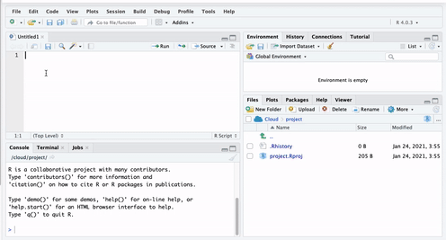
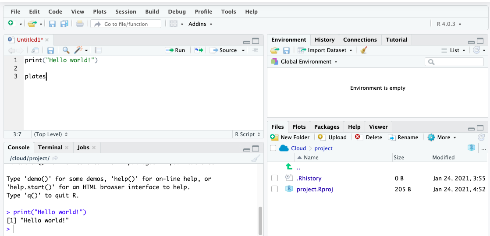
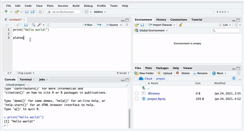
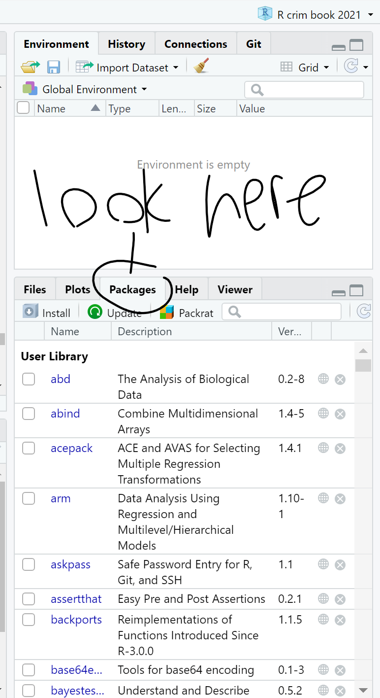

# A First Lesson About R
#### *Operators & Functions, Objects, and Packages* {-}

##### **Learning Outcomes:** {-}
- Install `R` and `R Studio`
- Understand how `R Studio` is set up
- Learn what operators, functions, and objects are and their relevance in `R`
- Understand the purpose of packages
- Install your first package

<div style="margin-bottom:30px;">
</div>

##### **Today’s learning tools**: {-}

<div style="margin-bottom:15px;">
</div>
##### *Total number of activities*: 8 {-}

<div style="margin-bottom:15px;">
</div>
##### *Data*: {-}
- N/A 

<div style="margin-bottom:15px;">
</div>

##### *Packages*: {-}
- `dplyr`

<div style="margin-bottom:15px;">
</div>

##### *Functions introduced (and packages to which they belong)* {-}
- `c()` : Concatenates elements to create vectors (`base R`)
-	`class()` : Check the class of an object (`base R`) 
-	`data.frame()` : Create a new data frame object (`base R`)
-	`install.packages()` : Installs non-base R packages (`base R`)
-	`library()` : Loads the installed non-base R package (`base R`)
-	`list()` : Create a list (`base R`)
-	`log()` : Computes the natural logarithm (`base R`)
-	`View()` : View data in new window (`base R`)


---

In this lesson, you will be introduced to the programming language, `R`. After installing the related software and getting a basic idea of the R Studio interface, you will learn three `R` basics: operators (and functions), objects, and packages. 

Unlike other statistical software like SPSS and STATA, `R` is a free, open-source software for performing statistical analysis and data visualization. In addition, `R` offers more analytical solutions, flexibility, and customization than these commonly used statistical software, and its popularity has increased substantially over the years. 

We learn `R` because we hope that this is an important tool that you will continue to use in the future. As it is free and has a community feel to it where anyone can create and upload new techniques, the idea is that you can use `R` long after this course. Even if data analysis is not in the future for you, learning how to conduct and interpret statistical output is a good skill to have – much of our knowledge of the world includes statistics, so understanding the numbers and how they were derived are advantages. `R` uses a language called **object-oriented programming**, and though it may seem daunting at first, practice makes familiarity. Also, you can impress your friends with all your coding. 

---

## Install R & R Studio

<div style="margin-bottom:30px;">
</div>

As `R` and `R Studio` are free software, you should be able to install these on your own computers at home. You may be working with different IT, so there are different options for a successful install. Our first activity will be to decide what approach to working with `R` and `R Studio` will be best for you. 

<div style="margin-bottom:70px;">
</div>

### Activity 1: Identifying your operating system

In this activity, you need to answer a question about your computer/IT that you will be working with for this class. That question is: 

- **What is your operating system**? Operating system refers to the software that your computer is running to deliver the basic functions. You may have, for example: 

  + *Windows or Linux* - if you have these, you are most likely going to have an easy time installing `R` and `R Studio`, so you should give the installation instructions below a try.
  + *Apple* - if you have a Mac, there are some extra steps to install `R` and `R Studio`. Specifically, there will be an additional programme to download called Xcode, and additional steps to take.  
  + *Chromebook* - Installing `R` and `R Studio` on a Chromebook involves installing Linux. Like with a Mac, there are some additional steps you will need to take, and some patience.
  
In your group google sheets, write down which operating system you have. This will guide which directions to follow later. 

---

<div style="margin-bottom:70px;">
</div>

### Activity 2: Install R & R Studio


#### Some notes specific to your operating system. 

Before you move on to the installation steps, look at your answer from Activity 1, and read or watch the advice specific to your operating system:

- Windows: click [here](https://www.youtube.com/watch?v=VLWaED9jTiA) for instructions 
- Chromebook: read the tutorial [here](https://blog.sellorm.com/2018/12/20/installing-r-and-rstudio-on-a-chromebook/)
- Mac, follow the guidance in the video [here](https://www.youtube.com/watch?v=cX532N_XLIs&list=PLqzoL9-eJTNDw71zWePXyHx3_cm_fMP8S) and then, you will also need to install command line tools, for that you can watch another video [here](https://www.youtube.com/watch?v=3Yd9J_dhSfY) 
- Linux: for ubuntu see the video [here](https://www.youtube.com/watch?v=kF0-FH-xBiE) and if you have questions, let the teaching team know!

<div style="margin-bottom:30px;">
</div>

Once you have watched or read the instructions for your relevant operating system, you are now ready to actually have a go at downloading the software for yourself. Before you start, write in the google doc any questions or concerns, and once ready, install! 

<div style="margin-bottom:30px;">
</div>

#### Install `R`: {-}

1. Go to https://www.r-project.org/ 

2. Click the [download R](https://cran.r-project.org/mirrors.html) link under the *Getting Started* heading 

3. You will be asked to select a Comprehensive R Archive Network (CRAN) mirror. Click the URL closest to your location

4. Click whichever download link is appropriate for your operating system (see above).

5. Then click the *install R for the first-time* link and proceed to install `R`

<div style="margin-bottom:30px;">
</div>

#### Install R Studio: {-}

1. Go to https://rstudio.com/

2. Click the *Download* link

3. Scroll down and then click the DOWNLOAD button for the free version of
`RStudio`

4. You will be taken to a website to download the free version of `RStudio` that is appropriate for your computer. Download and then install it.


#### Plan B: accessing R Studio remotely throught a web browser

It might be that the above does not work and you find that there are some issues specific to your computer, or something just is not working. In that case, you have two options: 

<div style="margin-bottom:15px;">
</div>

- *Option 1:* You can remotely access one of the university PCs from your browser (Firefox, Chrome, Safari, etc). You can find instructions how to do this [here](https://www.itservices.manchester.ac.uk/students/pc-on-campus/remote-cluster-access/) , and the university IT helpdesk can help you access this too. If you do this, you will be able to use the version of `RStudio` installed in the computer clusters. 

- *Option 2*: You can access an online version of `R Studio`, which you can access through any web browser (Firefox, Chrome, Safari, etc). To do this, you visit [https://rstudio.cloud/](https://rstudio.cloud/), click on 'Get Started For Free', choose the free account, and click on 'sign up'. Then you can always visit this website and log in to use `R Studio` in the cloud. Note that you should start a `New Project` and name it *Modelling Crime Data*, and then all your work will be saved in this project. More on projects will be found in Lesson Two, next week. 


---


## Getting to know R Studio

<div style="margin-bottom:30px;">
</div>

You only need to open `Rstudio`, (not both `R` and `RStudio`); `R` runs automatically in the background when `RStudio` is open. Using `RStudio` makes it easier to work with `R` than using `R` itself. If you do not believe this, try working directly in `R`! 

<div style="margin-bottom:30px;">
</div>


{width=80%}


<div style="margin-bottom:30px;">
</div>


Figure 1.1 shows you what `RStudio` looks like when you first open it: three open panes. 

The biggest one to your left is the main console, and it tells you what version of `R` you have. 


When you start working in `Rstudio`, it is best to have *four* open panes. **How?** Let us explore in the next activity. 

<div style="margin-bottom:70px;">
</div>

#### Activity 3: Opening up the script pane

Figure 1.2: Click in the *File* drop down Menu, select *New File*, then *R Script*.

<div style="margin-bottom:30px;">
</div>

{width=70%}

<div style="margin-bottom:30px;">
</div>

You can shift between different panes and re-size them with your mouse too.

<div style="margin-bottom:30px;">
</div>

{width=70%}

<div style="margin-bottom:30px;">
</div>


### The four panes of R Studio

The purposes of the four panes in Figure 1.3 are the following:

1. **Script and data view**: where you type your programming code that tells `R` what you want to do. These are essentially instructions that you type and save as a **script**, so that you can return to it later to remember what you did and to share it with others so that they can reproduce what you did.

<div style="margin-bottom:15px;">
</div>

2. **Environment and history view**: 
  i) *2.1 Environment* tab- gives you the names of all the (data) objects that you have defined during your current `R` session, including number of observations and rows in those objects. We learn more about objects later. 

  ii) *2.2 History* tab- shows you a history of all the code you have previously evaluated in the main console.

<div style="margin-bottom:15px;">
</div>

3. **Main console**: this is considered `R's` heart, and it is where `R` evaluates the codes that you run. You can type your codes directly in the console, but for the sake of good habits, type them in the script and data view so you can save a record of them. Only type and run code from here if you want to debug or do some quick analysis.

<div style="margin-bottom:15px;">
</div>

4. **File directory, Plots, Packages, Help**:
  i) *4.1 Files* tab-  allows you to see the files in the folder that is currently set as your working directory. 

  ii) *4.2 Plots* tab- you will see any data visualizations that you produce here. You have not produced any yet, so it is empty now.

  iii) *4.3 Packages* tab- you will see the packages that are currently available to install. We will explain what these are soon, but know that they are an essential feature when working with `R`.

  iv) *4.4 Help* tab- you can access further information on the various packages. 

<div style="margin-bottom:70px;">
</div>

---

  
#### Activity 4: Interacting with the 4 panes

In the previous activity, you opened up the 'script' pane. We now write some code in it, and see what happens. 

To do this, go to your open version of `R Studio`, and type in the script pane the following: 

<div style="margin-bottom:35px;">
</div>

```r
print("Hello world!")
```

<div style="margin-bottom:50px;">
</div>

When you have typed this, you will have typed your first bit of code. Yet nothing is happening? That is because you also have to **RUN** the code. 

You can do this by highlighting the code you wish to run, and clicking on 'run' in the top right hand corner: 



<div style="margin-bottom:30px;">
</div>

When you 'run' the code, it will print the text 'Hello World!' in the bottom pane, which is the **console**. That means you have written and executed your first line of code.

In the rest of the session, we will be unpacking how this all works, and getting more familiar and comfortable with using `R Studio`. 


---

### Customising R Studio 
<div style="margin-bottom:30px;">
</div>

Did you know you can change the way `RStudio` looks? Click in the *Tools* menu and select *Global Options*. A pop-up window appears with various options: 


<div style="margin-bottom:30px;">
</div>

Select *Appearance*. Here, you can change things related to the appearance of `R Studio` like the font type and size, including the theme background that `R` will use as the interface.


<div style="margin-bottom:30px;">
</div>

*Tomorrow Night Bright* theme in Figure 1.7 is a recommendation because it is easier on your eyes with its dark background. You can preview and then click *Apply* to select the one you like.

<div style="margin-bottom:30px;">
</div>

{width=55%}


---

## Today's 3 (TOPICS) 

Now that we have a basic understanding of `R`, we are ready to learn some building blocks. Each session of *Modelling Criminological Data* will focus on three substantive topics, which are the key learning outcomes for each week. Today's topics are **operators and functions**, **objects**, and **packages**. Once you have mastered these three topics, you will be ready to start using `R` for data analysis!

<div style="margin-bottom:50px;">
</div>

---

### Operators and Functions 

<div style="margin-bottom:30px;">
</div>

**Operators** are symbols that tell `R` to do something specific like assigning values to vectors. They fall into four categories: arithmetic, relational, logical, and assignment. For now, let us type out and run some arithmetic operators: 

<div style="margin-bottom:35px;">
</div>

```r
# Addition
5 + 5
```

```
## [1] 10
```

```r
# Subtraction
10 - 3
```

```
## [1] 7
```

```r
# Multiplication
2 * 5
```

```
## [1] 10
```

```r
# Division
6 / 2
```

```
## [1] 3
```
<div style="margin-bottom:50px;">
</div>

Did you *Run* the arithmetic operators? The answers will have appeared, just like the above. If you are wondering what the # symbol means in the coding above, these are called **comments**. They are annotations you can use in your `R script` to tell `R` that what comes right after the **#** are not code to be ran. Comments are like your personal notes alongside your coding. 

There are other operators we will come across like the *and* operator (`&`) and the *or* operator (`|`), which will be useful when we start to manipulate our data sets. 

<div style="margin-bottom:70px;">
</div>


#### Activity 5: Play around with operators

Return to your open version of `R Studio`, and use this to find the answer to the following: 


```r
12329 + 342980
18390 / 348
```

The results should appear in the console pane and is known as your output. 


---


<div style="margin-bottom:35px;">
</div>

**Functions** are similar to operators in that they *do* things. The difference is that they are called by a certain name, usually a name which represents what they do, and they are followed by brackets `()`. Within the brackets, you can put whatever it is that you want the function to work with. For example, the code we wrote in Activity 4 was the `print()` function. This function told `R` to print into the console whatever we put in the brackets ("Hello world!"). 

Same idea with a personalised greeting: if you want to print 'Hello Reka', you will need to have "Hello Reka" inside the brackets:

<div style="margin-bottom:35px;">
</div>

```r
print("Hello Reka")
```

```
## [1] "Hello Reka"
```
<div style="margin-bottom:50px;">
</div>

Hello Reka.

There are so many functions in `R`. We will be learning many of them throughout our class. `Print` is fun, but most of the time, we will be using functions to help us with our data analysis. You might remember some Excel formulas we learned last semester from *Making Sense of Criminological Data*. For example, getting the minimum, maximum, or mean of a list of numbers. `R` does this using functions in a very similar way. 

For example, if we have a bunch of numbers, we just find the appropriate function to get the summary we want: 

<div style="margin-bottom:35px;">
</div>

```r
mean(10, 34, 5, 3, 77)
```

```
## [1] 10
```

```r
min(10, 34, 5, 3, 77)
```

```
## [1] 3
```

```r
max(10, 34, 5, 3, 77)
```

```
## [1] 77
```
<div style="margin-bottom:50px;">
</div>

How exactly can you find the function you need? Throughout this class, you will learn a list that appears at the top of each lesson. A recommendation is to also create a 'function cookbook', where you write down a list of functions, what the functions do, and some examples. Here is an example: 

<div style="margin-bottom:30px;">
</div>


<div style="margin-bottom:35px;">
</div>

You can use google to make your cookbook, and the website [stackoverflow](https://stackoverflow.com/), in particular, can help you find the function you need. But be wary, especially in the beginning, that you understand what the function does. There can be several different functions for the same action. One good approach is to add a function of interest to your cookbook and ask the teaching team about what it does, and how it might be different to other functions that do the same thing.

<div style="margin-bottom:70px;">
</div>

#### Activity 6: Play around with functions

Have a guess of (or google) what you think is the function to get the median. Once you have your answer, write it in the shared google docs. Then, use it to get the median of the numbers 10, 34, 5, 3, 77. 

Write the answer in your shared google doc (or note it down for yourself if in the quiet room).

The answer is further below, after the note: 

<div style="margin-bottom:50px;">
</div>

**NOTE:** `R` is case-sensitive! For example:

<div style="margin-bottom:35px;">
</div>

```r
# Calculating the logarithm 
Log(100)

# ERROR!
```

```r
# Instead, it should be:
log(100)
```

```
## [1] 4.60517
```
<div style="margin-bottom:50px;">
</div>

 Okay, now you know these, the answer to Activity 6 was...
 
 <div style="margin-bottom:35px;">
</div>

```r
median(10, 34, 5, 3, 77)
```

```
## [1] 10
```
 <div style="margin-bottom:50px;">
</div>
 
Now let us move on to our second key topic for today: objects! 

---

### Objects 


<div style="margin-bottom:30px;">
</div>

Everything that exists in `R` is an **object**. Think of objects as boxes where you put things in. Imagine a big, empty cardboard box. We can create this big empty box in `R` by simply giving it a name. Usually, you want your object ('box') to have a good descriptive name, which will tell others what is in it. Imagine moving house. If you have a cardboard box full of plates, you might want to label it 'plates'. That way, when carrying, you know to be careful, and when unpacking, you know its contents will go in the kitchen. On the other hand, if you named it 'box1', then this is a lot less helpful when it comes to unpacking. 

<div style="margin-bottom:70px;">
</div>

#### Activity 7: Creating an object

Let us create an object called 'plates'. To do this, you go to your script, and type 'plates'. 



<div style="margin-bottom:30px;">
</div>

But if you run this code, you will get an error. Let's see: 



<div style="margin-bottom:30px;">
</div>

You will see the phrase 'Error: object plates not found'. This is because you have not yet put anything inside the plates 'box'. Remember objects are like boxes,so there must be something inside our object 'plates'. In order for this object to exist, you have to put something inside it, or in `R`-speak *assign it some value*.

Therefore, we make an object by using an *assignment operator* ( `<-` ). In other words, we assign something to an object (i.e., put something in the box). For example:

<div style="margin-bottom:35px;">
</div>

```r
plates <- "yellow plate"
```
<div style="margin-bottom:50px;">
</div>

Now if we run this, we will see no error message, but instead, we will see the `plates` object appear in our *environment pane*: 


<div style="margin-bottom:35px;">
</div>

Here are some more examples to illustrate: 

<div style="margin-bottom:35px;">
</div>

```r
# Putting '10' in the 'a' box
a <- 10

# Putting 'Hello!' in the 'abc123' box
abc123 <- "Hello!"
```

<div style="margin-bottom:50px;">
</div>

In these examples, we are putting the value of `10` into the object `a`, and the value of 'Hello!' into the object `abc123`. 

Earlier, we introduced you to the Environment and History pane. We mentioned that it lists objects you defined. After making the 'a' and 'abc123' objects, they should appear in that very pane under the `Environment` tab. 

<div style="margin-bottom:50px;">
</div>

---


#### Types of objects


Why are objects important? They are so because we will be storing everything in our data analysis process in these objects. Depending on what is inside them, they can become a different type of object. Here are some examples: 

**Data structures** are important objects that store your data, and there are five main types but we focus on three for this course:

1. *(atomic) vector*: an ordered set of elements that are of the same *class*. Vectors are a basic data structure in `R`. Below are five different classes of vectors:

<div style="margin-bottom:35px;">
</div>

```r
# 1. numeric vector with three elements
my_1st_vector <- c(0.5, 8.9, 0.6) 

# 2. integer vector with addition of L at the end of the value
my_2nd_vector <- c(1L, 2L, 3L)  

# 3. logical vector
my_3rd_vector <- c(TRUE, FALSE, FALSE) 
# 'my_4th_vector' creates a logical vector using abbreviations of True and False, but you should use the full words instead
my_4th_vector <- c(T, F) 

# 4. character vector
my_5th_vector <- c("a", "b", "c") 

# 5. complex vector (we will not use this for our class)
my_6th_vector <- c(1+0i, 2+4i) 
```


<div style="margin-bottom:50px;">
</div>

2. *lists*: technically they, too, are vectors but they are more complex because they are not restricted on the length, structure, or class of the included elements. For example, to create a list containing strings, numbers, vectors and a logical, use the `list()` function, and inside the brackets, put everything that you want to combine into a list:

<div style="margin-bottom:35px;">
</div>

```r
list_data <- list("teal", "sky blue", c(10, 5, 10), TRUE, 68.26, 95.46, 99.7) 
```

<div style="margin-bottom:50px;">
</div>

Above, we created `list_data`, an object that contains all those things that we put inside the `list()` function. This function serves to create a list from combining everything that is put inside its brackets. 

We then use the `class()` function to confirm that the objects have been defined as a list:
<div style="margin-bottom:35px;">
</div>

```r
class(list_data)
```

```
## [1] "list"
```


<div style="margin-bottom:50px;">
</div>

3. *data frames*: also stores elements but differ from lists because they are defined by their number of columns and rows; the vectors (columns) must be of the same length. Data frames can contain different classes but each column must be of the same class. (More on class next week.) For example, if you want to combine some related vectors to make a data frame on violent American cities, use the function `data.frame()`:

<div style="margin-bottom:35px;">
</div>

```r
# Making some relevant vectors
TopVioCities <- c("St. Louis", "Detroit", "Baltimore") # some violent US cities
VioRatePer1k = c(20.8, 20.6, 20.3) # their violence rates per 1,000 persons
State <- c("Missouri", "Michigan", "Maryland") # in what states are these cities found

#Join the newly created vectors to make a data frame called 'df'
df<-data.frame(TopVioCities, VioRatePer1k, State)
```
<div style="margin-bottom:50px;">
</div>

We can then view the data frame, 'df', with the `View()` function in which a tab will appear containing our vectors:

<div style="margin-bottom:35px;">
</div>

```r
View(df)
```
<div style="margin-bottom:50px;">
</div>

---


#### Activity 8: Doing things to objects

We have learned what functions are (i.e., things that do things) and what operators are (i.e., symbols that do things) as well as what are objects (i.e., the boxes that hold things). We also saw some functions which helped us create objects. Functions can also do things to objects. For example, we saw the function `class()` that told us what kind of object `list_data` was, and `View()` which allowed us to have a look at our dataframe we called `df`.

Let us look back at our `plates` object. Remember it was the object that held our kitchen items, specifically that beloved yellow plate. We added 'yellow plate' to it. Now let us add some more plates (we like to collect plates apparently) and let us use the concatenate `c()` function for this again: 

<div style="margin-bottom:35px;">
</div>

```r
plates <- c("yellow plate", "purple plate", "silver plate", "orange bowl")
```
<div style="margin-bottom:50px;">
</div>

Let us say that we suddenly forgot what was in our object called 'plates'. Like what we learned earlier, we use the function `print()` to see what is inside this object:

<div style="margin-bottom:35px;">
</div>

```r
print(plates)
```

```
## [1] "yellow plate" "purple plate" "silver plate" "orange bowl"
```
<div style="margin-bottom:50px;">
</div>

This can apply to obtaining the mean, the minimum, and maximum. You could assign those statistics to an object this time:

<div style="margin-bottom:35px;">
</div>

```r
nums <- c(10, 34, 5, 3, 77)
```
<div style="margin-bottom:50px;">
</div>

Now if we want to know the mean, we can take the mean of the object `nums`, which we just created:

<div style="margin-bottom:35px;">
</div>


```r
mean(nums)
```

```
## [1] 25.8
```

<div style="margin-bottom:50px;">
</div>

The object we will use most frequently though is data frames. Much like how we worked with spreadsheets in Excel in *Making Sense of Criminological Data*, we will be working with dataframes in `R`. 

We had created a dataframe called `df` previously. If you have not yet created this dataframe in your own `R Studio`, do this now. You should have the object `df` in your environment. When you run `View(df)`, you should see this dataset:


<div style="margin-bottom:30px;">
</div>

To do something to an entire dataframe, we would use the name of the object (`df`) to refer to it. In the case of the `View()` function, we want to see all that is contained in `df`, so we will type `View(df)`. On the other hand, if we want to refer to only one *variable* or column in the data, (remember back to term 1 - each varible is held in each column) there is a special notation to do this -- $

To refer to a variable inside a dataframe, you use:

<div style="margin-bottom:30px;">
</div>

$dataframe name + \$ + variable name$


<div style="margin-bottom:30px;">
</div>

For example, to refer to the variable `VioRatePer1k`, we use the notation `df$VioRatePer1k`. 

And if we wanted to view only that variable, we use: 

<div style="margin-bottom:35px;">
</div>

```r
View(df$VioRatePer1k)
```
<div style="margin-bottom:50px;">
</div>

You should see: 


<div style="margin-bottom:30px;">
</div>

Say we wanted to know the mean violence rate across our units of analysis, the cities, for example, we would take the numeric column to calculate this: 

<div style="margin-bottom:35px;">
</div>

```r
mean(df$VioRatePer1k)
```

```
## [1] 20.56667
```
<div style="margin-bottom:50px;">
</div>


### Packages 

<div style="margin-bottom:50px;">
</div>

**Packages** are a very important element of `R`. Throughout the course, and hopefully afterwards, you will find yourself installing numerous open source software packages that allow `R` to do new and different things. There are loads of packages out there. In early 2020, there were over 150,000 packages available. Anyone can write one, so you will need to be careful with which ones you use as the quality can vary. Official repositories, like [CRAN](https://cran.r-project.org/), are your best bet for packages as they will have passed some quality controls. 

You can see what packages are available in your local install by looking at the *packages* tab in the *File directory, Plots, Packages* pane (Figure 1.14). 


<div style="margin-bottom:30px;">
</div>

{width=35%}

<div style="margin-bottom:30px;">
</div>

A number of the packages we will use belong to a set of packages called **tidyverse**. These packages help make your data tidy. According to Statistician and Chief Scientist at `RStudio`, Hadley Wickham, (also an author of some of your readings) transforming your data into *tidy data* is one of the most important steps of the data analysis process. It will ensure your data are in the format you need to conduct your analyses.

Packages can be installed using the `install.packages()` function. Remember that while you only need to install packages once, they need to be loaded with the `library()`function each time you open up `RStudio`. Let us install the package `dplyr` from `tidyverse` and load it:


```r
library(dplyr)
```

```
## Warning: package 'dplyr' was built under R version 3.6.3
```

```
## 
## Attaching package: 'dplyr'
```

```
## The following objects are masked from 'package:stats':
## 
##     filter, lag
```

```
## The following objects are masked from 'package:base':
## 
##     intersect, setdiff, setequal, union
```


<div style="margin-bottom:30px;">
</div>

A lot of code and activity appears in the console. Warnings may manifest. Most of the time, the warnings explain what is being loaded and confirm that the package is successfully loaded. If there is an error, you will have to figure out what the warnings are telling you to successfully load the package. This happens and is normal.

To double check that you have actually installed `dplyr`, go to that *File Directory, Plots, Packages* pane and click on the *Packages* tab. The list of packages is in alphabetical order and `dplyr` should be there. If there is a tick in its box, it means that this package is currently loaded and you can use it; if there is no tick, it means that it is inactive, and you will have to bring it up with `library()`, or just tick its box (Figure 1.15). 


<div style="margin-bottom:30px;">
</div>

{width=35%}


<div style="margin-bottom:30px;">
</div>

On *masking*:  sometimes packages introduce functions that have the same name as those that are already loaded, maybe from another package, into your session. When that happens, the newly loaded ones will override the previous ones. You can still use them but you will have to refer to them explicitly by bringing them up by specifying to which package they belong using `library()`.

Keep `dplyr` in mind as next week we will learn more about it!

<div style="margin-bottom:30px;">
</div>
---


## SUMMARY


<div style="margin-bottom:50px;">
</div>

Today you installed both `R` and `RStudio` and had a gander around the `RStudio` interface. If you were bored with its default look, you could customise the interface. When working with `RStudio`, it is best to have the four panes. One had to do with the all-important **script** and we use `#` in the coding when we want to make **comments**. 

We learned about some important features of `R`. First were the **operators**. These are symbols that tell `R` what to do and come in four types. One we will use quite a bit is the *assignment operator*, which is the symbol, `<-`. Also important were **functions**, which are similar to operators except their names tell you what they do. Second were **objects**, which are pervasive when working with `R`. They are like boxes that you put stuff in, and we learned about three specific types of **data structure** objects: vectors, lists, and data frames. Third were **packages**. These are open source software that expand what `R` can do. We installed `dplyr` as an example, and we will use this `tidyverse` package in our next session.

<div style="margin-bottom:50px;">
</div>


That is all for today. Do not forget to do your homework task and the quiz by next week!

<div style="margin-bottom:500px;">
</div>

<!-- ```{r} -->
<!-- #Now one last activity about saving your work, and of using projects.  -->

<!-- #### Activity 9: Saving your work and projects -->

<!-- #Finally, you want to keep your code, and you want to work in some nice orderly fashion. Remember in Making Sense of Criminological Data in term 1 we talked about workspaces. In R Studio, projects are a way to achieve this.  -->


<!-- #Now, first things first, hopefully you have already created a separate folder on your desktop, or dropbox, or something like this. Now save the script you've been working on into this folder. By clicking on "File" and "Save as...".  -->

<!-- # -->

<!-- #Then navigate to your folder for this module, and for your script make sure to give it some meaningful name like week1lab.R or something like this. Then click 'save'.   -->

<!-- # -->


<!-- #Now, go back to "File" and select "New project..." -->


<!-- # -->

<!-- #Then in the options that appear choose "Existing Directory". This is because you already have a folder for this work, this is where you saved your script just before. For me this was my folder called 'modelling2021' you saw above.  -->


<!-- # -->

<!-- #So select 'Existing Directory', and on the next page use the "Browse" button to select this folder (the directory) where you saved the script earlier. Once you have done this, click on 'Create Project' on the bottom.  -->

<!-- # -->

<!-- #This will now open up a new R Studio window with your project. In the future, you can start right back up where you finished last time by navigating to the .Rproj file, and double clicking it. It helps you keep everything in one place, and lets R read everything from that folder. -->


<!-- #You can read up here on why projects are useful here: [https://www.r-bloggers.com/2020/01/rstudio-projects-and-working-directories-a-beginners-guide/](https://www.r-bloggers.com/2020/01/rstudio-projects-and-working-directories-a-beginners-guide/) -->
<!-- ``` -->
