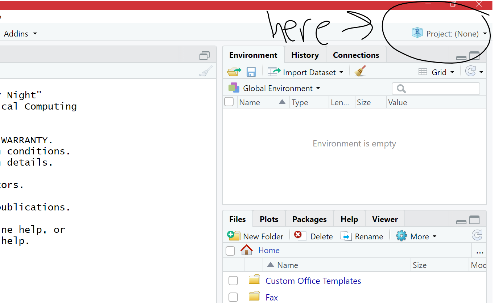

# Getting to know your data
#### *Variables, Labels, and Subsetting* {-}


##### **Learning Outcomes:** {-}
-	Create a project in `R` to refer back to for each session
-	Learn what variables are and how to examine them 
-	Learn how to label variables 
-	Learn how to subset select cases 

<div style="margin-bottom:30px;">
</div>

##### **Today’s Learning Tools:** {-}
<div style="margin-bottom:15px;">
</div>

##### *Data:* {-}
-	National Crime Victimization Survey (NCVS)

<div style="margin-bottom:15px;">
</div>

##### *Packages:* {-}
-	`dplyr`
-	`here`
-	`haven`
-	`labelled`
-	`sjlabelled`
-	`tibble`

<div style="margin-bottom:15px;">
</div>

##### *Functions introduced (and packages to which they belong)* {-}
-	`add_column()` : Adds columns to a data frame (`tibble`)
-	`attributes()` : Access object attributes, such as value labels (`base R`)
-	`case_when()` : Allows users to vectorize multiple if / if else statements (`dplyr`)
-	`count()` : Counts the number of occurrences (`dplyr`)
-	`dir.create()` : creates a new folder in a project (`base R`)
-	`factor()` Creates a factor (`base R`)
-	`filter()` : Subsets a data frame to rows when a condition is true (`dplyr`)
-	`get_labels()` : Returns value labels of labelled data (`sjlabelled`)
-	`here()` : Finds a project’s files based on the current working directory (`here`)
-	`mutate()` : Creates new vectors or transforms existing ones (`dplyr`)
-	`read_spss()` : Imports SPSS .sav files (`haven`)
-	`remove_labels()` : Removes value labels from a variable (`sjlabelled`)
-	`remove_var_label()` : Removes a variable’s label (`labelled`)
-	`sapply()` : Applies a function over a vector or list (`base R`)
-	`select()` : Select columns to retain or drop (`dplyr`)
-	`var_label()` : Returns or sets a variable label (`labelled`)


---

Last time, we installed our first package, `dplyr`. This is one of a number of packages from what is known as **tidyverse**. In this lesson, we use `dplyr` and other `tidyverse` packages so that we can get to know our data. Being familiar with our data requires knowing what they comprise and what form they take. ‘Tidying’ our data through labelling, reformatting, recoding, and creating new variables will help with this step in the data analysis process. Today we will learn another three topics related to data tidying: **variables**, **labels**, and **subsetting**. Let us load `dplyr` if it is not loaded already:

<div style="margin-bottom:35px;">
</div>

```r
library(dplyr)
```

```
## Warning: package 'dplyr' was built under R version 3.6.3
```

```
## 
## Attaching package: 'dplyr'
```

```
## The following objects are masked from 'package:stats':
## 
##     filter, lag
```

```
## The following objects are masked from 'package:base':
## 
##     intersect, setdiff, setequal, union
```

<div style="margin-bottom:50px;">
</div>

## R Projects – Getting Your Work Files Organised

<div style="margin-bottom:30px;">
</div>

Although today is focused on tidying data, it is also helpful if your work is tidy and found in one easily accessible folder. By saving work inside a **project**, you can find files such as data and scripts related to specific work in a single working directory. Let us get into the habit of doing this:

•	Click on the top right tab called *Project: (None)* - Figure 2.1 
<div style="margin-bottom:30px;">
</div>

{width=70%}

<div style="margin-bottom:30px;">
</div>

-	Click on *New Project*. A window with different options appears. Create your project in *New Directory* and then click *New Project*

<div style="margin-bottom:15px;">
</div>

-	Choose a name for your project (e.g., r_crim_course) and a location (working directory) where your project will be created

<div style="margin-bottom:15px;">
</div>

-	Now click on *Create Project* and your new project will be launched

<div style="margin-bottom:15px;">
</div>

Inside your project, you can organise it by having separate files, one for scripts, one for data, one for outputs, and another for visuals. You can make these with the function `dir.create()`:
 
 <div style="margin-bottom:35px;">
</div>

```r
# For example, to make a sub-folder called 'Datasets' in your project folder, type this into your console pane:
dir.create("Datasets")
```

<div style="margin-bottom:50px;">
</div>

If you noticed in your *Files, Plots…* pane, the files there tell you what folder you are automatically working in. This is known as your *working directory*, the default location that is there when you open `RStudio`. Wherever your `R project` is saved will be the working directory. 

Whenever you want to locate certain files within your `Project`, use the `here` package:
<div style="margin-bottom:35px;">
</div>

```r
library(here)
```

```
## Warning: package 'here' was built under R version 3.6.3
```

```
## here() starts at C:/Users/buihl/Desktop/Modelling-Crime-Data-2021
```
<div style="margin-bottom:50px;">
</div>

Doing so is better than typing out the exact location of your file, which can be tedious. The next section shows how to use the `here ()` function to import data from the National Crime Victimization Survey (NCVS).

You can read on why projects are useful here: [https://www.r-bloggers.com/2020/01/rstudio-projects-and-working-directories-a-beginners-guide/](https://www.r-bloggers.com/2020/01/rstudio-projects-and-working-directories-a-beginners-guide/)

---

## Importing Data

Here is another `tidyverse` package to install:

<div style="margin-bottom:35px;">
</div>

```r
library(haven)
```

```
## Warning: package 'haven' was built under R version 3.6.3
```

<div style="margin-bottom:50px;">
</div>

`Haven` enables `R` to understand various data formats used by other statistical packages such as SPSS and STATA. We will need this package to open data in its diverse forms. 

You will have saved the NCVS in a relevant file in your project, so now let us load this data using `read_spss()` from `Haven`:
<div style="margin-bottom:35px;">
</div>

```r
# Importing our SPSS dataset and naming it ‘ncvs’ 
ncvs <- read_spss(here("Datasets", "NCVS lone offender assaults 1992 to 2013.sav"))
```
<div style="margin-bottom:50px;">
</div>

What you are saying to `R` is the following: 

>My data, *NCVS lone offender assaults 1992 to 2013*, is a .sav file. Therefore it is an SPSS dataset, and is located in the sub-folder called *Datasets* in my default working directory. `R`,  please extract it from *here*, understand it, and place it in an object called `ncvs` so I can find it in `RStudio`. 

<div style="margin-bottom:15px;">
</div>

To view the new data frame, `ncvs`, type:
<div style="margin-bottom:35px;">
</div>

```r
View(ncvs)
```

<div style="margin-bottom:50px;">
</div>

---

## Today’s 3 (TOPICS)

<div style="margin-bottom:30px;">
</div>

We now have data to tidy in `R`, so onto our three main topics for this week: **variables**, **labels**, and **subsetting**.

<div style="margin-bottom:30px;">
</div>
---

### Variables

Variables can be persons, places, things, or ideas that we are interested in studying. For example, height and favourite football team. Different variable types refer to different levels of measurement: nominal, ordinal, and interval/ ratio. 

In `R`, nominal and ordinal variables are encoded as a **factor** class because they are categorical characteristics, so take on a limited number of values; factors are like the integer vector introduced last week but each integer is a label. 

Likewise, interval and ratio variables are encoded as **numeric** class because they are continuous characteristics, so take on a wide range of values. These variables appear as vectors and as columns of data frames. 

How do you know what your variable is classed as? There are two ways of knowing using our NCVS data:

<div style="margin-bottom:35px;">
</div>

```r
# To see the class of all the vectors (columns) in our data frame, ncvs, we use:
sapply(ncvs, class)

# To see the class of a specific vector, such as the variable ‘injured’, we use:
class(ncvs$injured)

# The $ symbol allows us to access specific variables in a data frame object
# The $ symbol must be accompanied by the name of the data frame!
```
<div style="margin-bottom:50px;">
</div>

You may have noticed that many of the vectors in our data frame were classed as `haven_labelled`. What is this, you ask? When we use the `haven()` function to import data, `R` keeps the information associated with that file type -- the SPSS variable information and value labels that were in the dataset. In practice, therefore, you can find categorical data in `R` embedded in very different types of vectors (character, factor, or haven labelled) depending on decisions taken by whomever created the data frame.

<div style="margin-bottom:30px;">
</div>

---
#### **Formatting Classes and Value Labels** 

<div style="margin-bottom:30px;">
</div>

In some cases, you may want to make changes to how variables are classed. We can change our variable to specifically be classed as 'factor':

<div style="margin-bottom:35px;">
</div>

```r
# Name the newly created factor *injured_r*
#Specify the order we want our variable labels
ncvs$injured_r <- factor(ncvs$injured, labels = c("Uninjured", "Injured"))
table(ncvs$injured_r)
```

```
## 
## Uninjured   Injured 
##       967       464
```

```r
attributes(ncvs$injured_r)
```

```
## $levels
## [1] "Uninjured" "Injured"  
## 
## $class
## [1] "factor"
```

<div style="margin-bottom:50px;">
</div>

---

#### **Recoding and Creating New Variables** 

<div style="margin-bottom:30px;">
</div>

In some circumstances, we would like to recode variables. Recoding could be collapsing multiple values of your variable into a single category or making some values of your variable become missing. In other circumstances, we may want to create a brand new variable that combines data from two others. First, time to install another package to learn the `add_column()` function: `tibble`. Now let us learn!

---

#### **Creating a new variable from 1 existing variable: 2 examples** 

<div style="margin-bottom:35px;">
</div>

```r
# Load the 'tibble' package
library(tibble)

# 1. Create the new variable ‘InjuredNew’ from ‘injured’ 
ncvs$InjuredNew <-ncvs$injured 
# Specify that order of the labels is important in the new variable
ncvs$injured_r <- factor(ncvs$injured, labels = c("Uninjured", "Injured"), ordered = TRUE) 

attributes(ncvs$injured_r)
```

```
## $levels
## [1] "Uninjured" "Injured"  
## 
## $class
## [1] "ordered" "factor"
```

```r
# 2. Create a new column (aka variable) that has a row ID 
add_column(ncvs, newid = 1:nrow(ncvs))
```

```
## # A tibble: 1,431 x 49
##     YEAR  V2119   V2129 V3014   V3016   V3018   V3021   V3023 V3023A  V3024
##    <dbl> <dbl+> <dbl+l> <dbl> <dbl+l> <dbl+l> <dbl+l> <dbl+l> <dbl+> <dbl+>
##  1  2000 2 [No] 2 [(S)~    34 6 [Not~ 1 [Mal~ 1 [Yes] 1 [Whi~     NA 2 [No]
##  2  2000 2 [No] 2 [(S)~    22 6 [Not~ 2 [Fem~ 1 [Yes] 1 [Whi~     NA 2 [No]
##  3  2000 2 [No] 3 [Not~    21 5 [Nev~ 1 [Mal~ 1 [Yes] 1 [Whi~     NA 2 [No]
##  4  2000 2 [No] 3 [Not~    18 6 [Not~ 2 [Fem~ 2 [No]  1 [Whi~     NA 2 [No]
##  5  2000 2 [No] 2 [(S)~    16 6 [Not~ 2 [Fem~ 2 [No]  1 [Whi~     NA 2 [No]
##  6  2000 2 [No] 1 [Cit~    13 6 [Not~ 2 [Fem~ 2 [No]  1 [Whi~     NA 2 [No]
##  7  2000 2 [No] 2 [(S)~    16 6 [Not~ 1 [Mal~ 2 [No]  1 [Whi~     NA 2 [No]
##  8  2000 2 [No] 2 [(S)~    48 6 [Not~ 1 [Mal~ 1 [Yes] 1 [Whi~     NA 2 [No]
##  9  2000 2 [No] 2 [(S)~    12 5 [Nev~ 1 [Mal~ 1 [Yes] 1 [Whi~     NA 2 [No]
## 10  2000 2 [No] 2 [(S)~    42 6 [Not~ 1 [Mal~ 1 [Yes] 1 [Whi~     NA 2 [No]
## # ... with 1,421 more rows, and 39 more variables: V2026 <dbl+lbl>,
## #   V4049 <dbl+lbl>, V4234 <dbl+lbl>, V4235 <dbl+lbl>, V4236 <dbl+lbl>,
## #   V4237 <dbl+lbl>, V4237A <dbl+lbl>, V4238 <dbl+lbl>, V4239 <dbl+lbl>,
## #   V4240 <dbl+lbl>, V4241 <dbl+lbl>, V4242 <dbl+lbl>, V4243 <dbl+lbl>,
## #   V4244 <dbl+lbl>, V4245 <dbl+lbl>, V4246 <dbl+lbl>, V4246A <dbl+lbl>,
## #   V4246B <dbl+lbl>, V4246C <dbl+lbl>, V4246E <dbl+lbl>, V4246F <dbl+lbl>,
## #   V4246G <dbl+lbl>, V4247 <dbl+lbl>, V4528 <dbl+lbl>, injured <dbl+lbl>,
## #   privatelocation <dbl>, reportedtopolice <dbl+lbl>, weaponpresent <dbl>,
## #   medicalcarereceived <dbl>, `filter_$` <dbl+lbl>, relationship <dbl+lbl>,
## #   Policereported <dbl+lbl>, victimreported <dbl+lbl>,
## #   thirdpartyreport <dbl+lbl>, maleoff <dbl+lbl>, age_r <dbl>,
## #   injured_r <ord>, InjuredNew <dbl+lbl>, newid <int>
```

<div style="margin-bottom:50px;">
</div>

---

#### **Creating a new variable from more than 1 existing variables** 

<div style="margin-bottom:30px;">
</div>

For example, we want to create a new variable in our NCVS data that tells us about the severity of the victimization experienced by the respondent. That severity will be measured by two variables: (1) whether the offender had a weapon and (2) whether the victim sustained an injury during their victimization. These are not necessarily the best variables to use in measuring victimization severity; this example, however, should illustrate how you might combine variables to create a new one. 

Before we decide to do this, we need to know if we can do so by first understanding those variables of interest. By using the function `count ()`, we get a good sense of the values and the number of respondents in each of those values for both variables.

<div style="margin-bottom:35px;">
</div>

```r
# Is the appropriate package, 'dplyr', loaded? 
# You can check what package each function we learn today belongs to by referring to the top of each online lesson, under 'Functions Introduced'

# Using count ( ) for ‘injured’ and ‘weaponpresent’
count(ncvs, injured)
```

```
## # A tibble: 2 x 2
##         injured     n
##       <dbl+lbl> <int>
## 1 0 [uninjured]   967
## 2 1 [injured]     464
```

```r
count(ncvs, weaponpresent)
```

```
## # A tibble: 3 x 2
##   weaponpresent     n
##           <dbl> <int>
## 1             0   950
## 2             1   406
## 3            NA    75
```

<div style="margin-bottom:50px;">
</div>

This function tells us that `injured`, a nominal-level variable, is stored as an integer, where the 0 value means the victim was uninjured and the 1 value means they were injured. Often in data, '0' represents the absence of the feature being measured and '1' means the presence of such feature. Also, the `weaponpresent` variable is also a nominal variable stored as an integer. Here, more victims report that the offender did not use a weapon during the offence (950) as opposed to using one (406). In addition, there are a number of missing values for this question (75).

There is a particular function from the `dplyr` package that is very handy for creating a new variable from more than 1 variable. It is called `mutate`. The `mutate()` function will create a new column that comprises the sum of both of these variables,  keeping the old variables too.

<div style="margin-bottom:35px;">
</div>

```r
# Create the new variable with mutate 
ncvs <- mutate(ncvs, severity = injured + weaponpresent)

# Now let’s check the new variable ‘severity’ against the old ones
ncvs %>% select(injured, weaponpresent, severity) %>% sample_n(10)
```

```
## # A tibble: 10 x 3
##          injured weaponpresent severity
##        <dbl+lbl>         <dbl>    <dbl>
##  1 0 [uninjured]             0        0
##  2 1 [injured]               0        1
##  3 1 [injured]               1        2
##  4 0 [uninjured]             1        1
##  5 1 [injured]               1        2
##  6 1 [injured]               0        1
##  7 0 [uninjured]             1        1
##  8 0 [uninjured]             1        1
##  9 0 [uninjured]             1        1
## 10 0 [uninjured]             1        1
```

<div style="margin-bottom:50px;">
</div>

Notice that `%>%` . This is known as the **pipe operator**, which is a nifty shortcut in `R` coding. It means that we only need to specify the data frame object once at the beginning as opposed to typing out the name of the data frame repeatedly. In all subsequent functions, notice that the object is ‘piped’ through.

The `severity` variable is ordinal-level, where 0 is the least severe (neither a weapon was used nor the victim injured), 1 is more severe (either the offender wielded a weapon or the victim reported being injured), and 2 is the most severe (the respondent reported being injured and the offender had a weapon). You can then add value labels to reflect this understanding.

The above example was simple, but often, we will want to make more complex combinations of variables. This is known as **recoding**. For example, we want to turn the variable in the NCVS dataset, called `relationship`, into a dichotomous variable called `notstranger` whereby the offender was a stranger (0) or was known to the victim (1). Before doing this, we again use the `count ()` function to understand the variable of interest, `relationship`, and it has four categories. We then use `mutate ()` and `case_when ()`. Think of `case_when()` like an ‘if’ logical statement. It allows us to make changes to a variable that are conditional on some requirement. Note below that this turns our new categories into character values.

<div style="margin-bottom:35px;">
</div>

```r
# Making the ‘notstrange’ variable by collapsing the values of the variable ‘relationship’ into only two values
ncvs <- ncvs %>% mutate(notstranger = case_when(relationship %in% 0 ~ "Stranger", relationship %in% 1:3 ~ "Not a stranger"))

# We could also run the following code to make the character values numeric rather than string (e.g., stranger vs not a stranger) 
ncvs <- ncvs %>% mutate(notstranger = case_when(relationship == 0 ~ 0, relationship <= 3 ~ 1))
```

<div style="margin-bottom:50px;">
</div>

---

### Labels

<div style="margin-bottom:30px;">
</div>

Variables sometimes come with labels – these are very brief descriptions of the variable itself and what its values are. Value labels are very useful when we have a nominal or ordinal level variable in our dataset that has been assigned numeric values. To have a look at what are your variable and value labels, use the function `attributes()`:

<div style="margin-bottom:35px;">
</div>

```r
attributes(ncvs$injured)
```

```
## $label
## [1] "Victim Sustained Injuries During Vicitmization"
## 
## $format.spss
## [1] "F8.2"
## 
## $display_width
## [1] 10
## 
## $class
## [1] "haven_labelled" "vctrs_vctr"     "double"        
## 
## $labels
## uninjured   injured 
##         0         1
```

```r
# You can also use var_label() and get_labels() too, but attributes() shows both types of labels
```

<div style="margin-bottom:50px;">
</div>

The output in the console show that uninjured is labelled '0' and injured is labelled '1'. Maybe, though, you do not like the labels that are attached to the variable values. Perhaps they do not make sense or they do not help you to understand better what this variable measures. If so, we can remove and change the labels. 

Let’s return to the `injured` variable from the `ncvs` dataframe. We are going to make a duplicate variable of `injured` to learn how to remove and add labels. We do this because it is good practice to leave your original variables alone in case you need to go back to them. 

<div style="margin-bottom:35px;">
</div>

```r
# Make a new variable that is a duplicate of the original one, but naming it ‘injured_no_labels’
ncvs$injured_no_labels <- ncvs$injured

attributes(ncvs$injured_no_labels)
```

```
## $label
## [1] "Victim Sustained Injuries During Vicitmization"
## 
## $format.spss
## [1] "F8.2"
## 
## $display_width
## [1] 10
## 
## $class
## [1] "haven_labelled" "vctrs_vctr"     "double"        
## 
## $labels
## uninjured   injured 
##         0         1
```
<div style="margin-bottom:50px;">
</div>

To remove labels, we will need to load two new packages: `labelled` and `sjlabelled`. Can you do that?

<div style="margin-bottom:35px;">
</div>

<div style="margin-bottom:50px;">
</div>

After loading the two new packages, we remove variable and value labels:

<div style="margin-bottom:35px;">
</div>

```r
# Remove variable labels 
ncvs$injured_no_labels <- remove_var_label(ncvs$injured_no_labels) 

# Check that they were removed 
var_label(ncvs$injured_no_labels)
```

```
## NULL
```

```r
# Remove value labels 
ncvs$injured_no_labels <- remove_labels(ncvs$injured_no_labels, labels = c(1:2))  

# Check that they were removed 
get_labels(ncvs$injured_no_labels)
```

```
## NULL
```

<div style="margin-bottom:50px;">
</div>

Now to add a label:

<div style="margin-bottom:35px;">
</div>

```r
# Add variable label 
var_label(ncvs$injured_no_labels) <- "Whether Victim Sustained Injured" 

# Check that they were added 
var_label(ncvs$injured_no_labels)
```

```
## [1] "Whether Victim Sustained Injured"
```

```r
# Add variable label 
ncvs$injured_no_labels <-add_labels(ncvs$injured_no_labels, labels = c(`uninjured` = 0, `injured` = 1)) 

# Check that they were added 
get_labels(ncvs$injured_no_labels)
```

```
## [1] "uninjured" "injured"
```
<div style="margin-bottom:50px;">
</div>

---

### Subsetting

<div style="margin-bottom:30px;">
</div>

Through `tidyverse` functions, we can subset our data frames or vectors based on some criteria. Using the function `select()`, we can subset variables by number or name:

<div style="margin-bottom:35px;">
</div>

```r
# Using select () to subset by two variables
ncvs_Df <- ncvs %>% select(1:2) 
```
<div style="margin-bottom:50px;">
</div>

Using the function `slice()`, we can subset rows by number, and combine it with `select()`. For example:

<div style="margin-bottom:35px;">
</div>

```r
# Get the first two rows 
firstTwoRowsOfncvs <- ncvs %>% slice(1:2) 

# Combine with above function to get the first two variables, and first two rows 
firstTwoRowsCols <- ncvs %>% select(1:2) %>% slice(1:2)
```

<div style="margin-bottom:50px;">
</div>

Use the `filter()` function to subset observations (i.e., rows) based on conditions. For example, we only want those for which the `injured` variable was equal to 1, so we run:

<div style="margin-bottom:35px;">
</div>

```r
OnlyInjured <- ncvs %>% filter(injured == 1)

#These filters can be combined using conditions ‘&’ and ‘|’ to produce data similar to the one from the variable 'notstranger' except we call this variable 'KnewOfandInjured':
KnewOfandInjured <- ncvs %>% 
filter(relationship > 0 & injured == 1)
```

<div style="margin-bottom:50px;">
</div>

---

<div style="margin-bottom:50px;">
</div>

## SUMMARY

<div style="margin-bottom:30px;">
</div>

Today you were further introduced to **tidyverse** packages that helped you to tidy your data. First, we learned to put our work into a **project** and then how to import data using a package called `haven`. Whenever we specify a data frame, we learned a nifty short-cut: the **pipe operator** - `%>%` - which allows us to specify the data frame only once when we code. 

Our three main topics today had to do with helping us tidy. One were the variables themselves where we learned about the **factor** and **numeric** classes, and how to make and **recode** new variables. Two, we learned how to remove and add variable and value labels so that we can understand what our variables are measuring.  Three, we then learned to subset our data, whereby we make new dataframes that include only the columns – variables – or rows – cases – we want. We tidied our data using the TIDYVERSE WAY! 

<div style="margin-bottom:50px;">
</div>

And of course: don't forget to do your homework!

<div style="margin-bottom:500px;">
</div>
