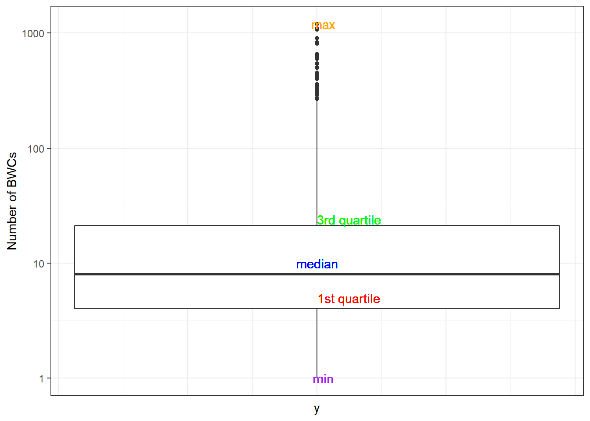
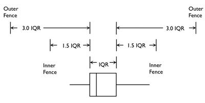
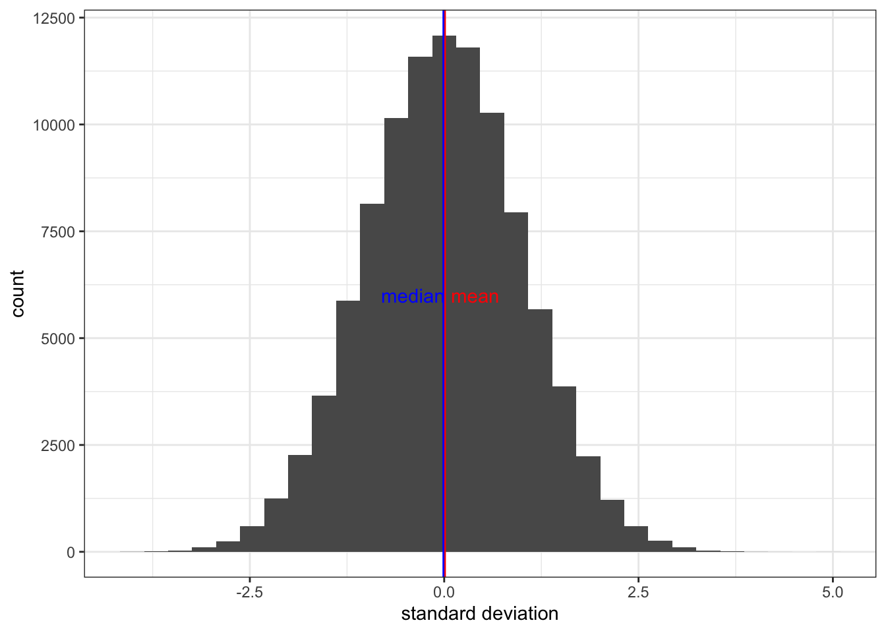

# Descriptive Statistics
#### *Central Tendency, Outliers, and Dispersion* {-}


##### **Learning Outcomes** {-}
- Revisit what descriptive statistics are and their importance in understanding your data
- Learn / review measures of the central tendency and dispersion and how to conduct them 
- Learn how to identify outliers and skewness 


##### **Today’s Learning Tools:** {-}


##### *Total number of activities*: 12 {-}


##### *Data:* {-}

-	Law Enforcement Management and Administrative Statistics (LEMAS)-Body-Worn Camera Supplement (BWCS) Survey
-	2004 Survey of Inmates in State and Federal Correctional Facilities (SISFCF)

##### *Packages:* {-}
-	`dplyr`
-	`ggplot2`
-	`here`
-	`modeest`
-	`moments`
-	`qualvar`
-	`skimr`


##### *Functions introduced (and packages to which they belong)* {-}
-	`diff()` : Computes differences between values in a numeric vector (`base R`)
-	`dim()` : Check the dimensions of an `R` object (`base R`)
-	`DM()` : Computes deviation from the mode (`qualvar`)
-	`group_by()` : Group observations by variable(s) for performing operations (`dplyr`)
-	`IQR()` : Compute interquartile range (`base R`)
-	`is.na()` : Returns `TRUE` when values are missing, `FALSE` if not (`base R`)
- `load()` : Reads data that are stored in an `R` data file formet (`base R`)
-	`mean()` : Compute arithmetic mean (`base R`)
-	`max()` : Returns the maximum value (`base R`)
-	`min()` : Returns the minimum value (`base R`)
-	`mlv()` : Compute the mode (`modeest`)
-	`quantile()` : Compute quantiles as per specified probabilities (`base R`)
-	`sd()` : Computes standard deviation of a numeric vector (`base R`)
-	`skewness()` : Calculate degree of skewness in a numeric vector (`modeest`)
-	`skim()` : Provide summary statistics specific to object class (`skimr`)
-	`summarize()` : Create new summary variable(s), e.g., counts, mean (`dplyr`)
-	`summary()` : Produce summary of model results (`base R`)
-	`table()` : Generates a frequency table (`base R`)
- `var()` : Computes variance (`base R`)

<br>
<br>

---

## Revisiting Descriptive Statistics

The field of statistics is divided into two main branches: descriptive and inferential. Much of what you will cover today on descriptive statistics will be a review from last semester, but learning to conduct them in `R` will be a new learning experience. 

So, what are descriptive statistics? If general statistics is concerned with the study of how best to collect, analyse, and make conclusions about data, then this specific branch -- descriptive statistics -- is concerned with the sample distribution and the population distribution from which the sample is drawn. Basically, descriptive statistics are ways of describing your data. 

Similar to last week’s lesson on data visualization, describing your data is important because it helps you identify patterns and anomalies. In addition, it gives others a succinct understanding of your data, so it facilitates good communication. We revisit and learn another three substantive topics today: the **central tendency**, **outliers**, and **dispersion**. 
<br>


### Activity 1: Our preparation routine

We start by doing the usual routine, but with new data on police body-worn cameras: 

1.	Open up your existing `R` project

2.	Load the required packages (listed at the top of this lesson). Some of these are familiar from previous weeks, so you only need to use the function `library()`to load them. For packages that we have not used before and are not installed in our `R`, you will need to use the function `install.packages()` first before loading it with `library()`:
<br>


```r
# Remember, we only need to do this once whenever we meet a new package and would like to keep it handy in our own R library of packages:

install.packages("modeest")
install.packages("moments")
install.packages("qualvar")
install.packages("skimr")
```


```r
# All of these are now in our R library of packages, but we need to load them, or 'bring them to life', to use their functions:

library(dplyr)
library(ggplot2)
library(here)
library(modeest)
library(moments)
library(qualvar)
library(skimr)
```
<br>

3. You will have downloaded the datasets from Blackboard as usual, ensuring the datasets have been moved into the subfolder you had created from Lesson 2 called 'Datasets'. 

4. For now, open only the 2016 LEMAS-BWCS dataset (37302-0001-Data.rda). These data are from the [Inter-university Consortium for Political and Social Research (ICPSR) website](https://www.icpsr.umich.edu/web/pages/) and you can find them by using the dataset name, which refers to the ICPSR study number. This time, data are stored in an `R` data file format (.rda). Always check for the type of file format the data are in - this determines what codes and packages (if any) you will need to use to load the data into `R`.

5.	For this type of dataset, as it is in an '.rda' data file format, we will need to use the `load()` function to import the data frame into our environment, specifying your working directory using `here()` like we have in Lesson 2, section 2.1.
<br>


```r
load(here("Datasets", "37302-0001-Data.rda"))
```
<br>

6.	Name the data frame `bwcs` by using the `<-` assignment operator. Another way of looking at it is you are putting the dataset into a 'box' that you will call 'bwcs'. It will appear in the Environment pane like all objects you create in `R`.
<br>


```r
bwcs <- da37302.0001
```
<br>

7.	Use the function `View(bwcs)` to ensure the file is loaded and to get to know your data. You can also use the function `dim(bwcs)` to see the number of observations and variables.
<br>
<br>

---


## Today’s 3

Two primary ways of describing your data have to do with the central tendency and their dispersion. We also learn about outliers. 
<br>
<br>

---

### Central Tendency


Central tendency refers to a descriptive summary of the centre of the data’s distribution; it takes the form of a single number that is meant to represent the middle or average of the data. The **mean**, **median**, and **mode** are common statistics of the central tendency. 

The *mean* is the average and it is useful when we want to summarise a variable quickly. Its disadvantage is that it is sensitive to extreme values, so the mean can be distorted easily. 

To address this sensitivity, the *median* is a better measure because it is a robust estimate, which means that it is not easily swayed by extreme values. It is the middle value of the distribution. 

The *mode* helps give an idea of what is the most typical value in the distribution, which is the most frequently occurring case in the data. While mean and median apply to numeric variables, the mode is most useful when describing categorical variables. For example, you may want to know the most frequently occurring category. 

<br>

#### Activity 2: Recap of how to obtain the mean and median

In Lesson 1, you were introduced to the functions `mean()` and `median()`. There is no direct function in `base R` to calculate the mode, but we will learn one way to do so soon. First, find only the mean and median for the following six numbers: 
<br>


```r
# 345, 100, 250, 100, 101, 300 
```
<br>

Type your answers in the group google doc.

<!--mean(c(345, 100, 250, 100, 101, 300)) = 199.33-->
<!-- median(c(345, 100, 250, 100, 101, 300)) = 175.5 -->
<br>
<br>

---

#### Activity 3: Levels of measurement

From today’s data, we are interested in exploring the adoption of body-worn cameras (BWCs) and their usage in a sample of agencies. The variables that will help us explore this is `Q_10A` because it measures whether the agency adopted BWCs as of 2016 and `Q_12` because it measures the number of cameras that agencies reported using. 

Let us say we want to learn about these variables. The first step to choosing the appropriate analysis for our variables, `Q_10A` and `Q_12`, is establishing: *what are their levels of measurement*?  

To review levels of measurement, refer to Lesson 2 (section 2.4.1). Have a think and record your answers for each variable in the google doc.

<br>

<!-- -->

**Figure 4.1** What are the levels of measurement?
<br>

Now that we have established the level of measurement for our variables, what type of object does `R` think these variables are? In other words, what are these variables classed as? Recall that we can use the `class()` function to answer this: 
<br>


```r
# We start with variable Q_10A:

class(bwcs$Q_10A) 
```

```
## [1] "factor"
```
<br>

`Q_10A` is classed as a factor. Another function that will return what the variable is classed as but also the specific levels is the `attributes()` function:
<br>


```r
attributes(bwcs$Q_10A)
```

```
## $levels
## [1] "(1) Agency has acquired in any form (including testing)"
## [2] "(2) Agency has not acquired"                            
## 
## $class
## [1] "factor"
```
<br>

This factor variable has two levels: '(1) Agency has acquired in any form (including testing)' and '(2) Agency has not acquired'. 

Now, we want to know the **mode** -- which level or category appears most frequently in our data set. We use the function `mlv()` (acronym for **m**ost **l**ikely **v**alues) from the `modeest` package to answer this question: 
<br>


```r
# Double check that the package modeest is loaded for this code to work

mlv(bwcs$Q_10A)
```

```
## [1] (2) Agency has not acquired
## 2 Levels: (1) Agency has acquired in any form (including testing) ...
```
<br>

The output returns the answer as: '(2) Agency has not acquired'. It also, conveniently, prints all the levels so we can see what are the other categories. 

If you want to cross check your answer obtained from the `mlv()` function, create a frequency table using the `table()` function: 
<br>


```r
table(bwcs$Q_10A)
```

```
## 
## (1) Agency has acquired in any form (including testing) 
##                                                    1915 
##                             (2) Agency has not acquired 
##                                                    2013
```
<br>

Indeed, there are 2,013 observations where the agency had not acquired any body worn cameras, which is more than the 1,915 observations where the agency had acquired body worn cameras in any format.

We could also run the `mlv()` function and save the output in an object rather than print the answers into the console. Here, we save to the object called `mode_adopted`: 
<br>


```r
mode_adopted <- mlv(bwcs$Q_10A) 
mode_adopted
```

```
## [1] (2) Agency has not acquired
## 2 Levels: (1) Agency has acquired in any form (including testing) ...
```

```r
# This new object will appear in your Environment pane
```
<br>
<br>


---

Our exploration into the adoption of BWCs has so far yielded the knowledge that the majority of agencies had not acquired BWCs as of 2016. But how about those that have done so? To what extent do they use BWCs? This is where variable `Q_12` comes in handy:
<br>

#### Activity 4: The extent of body worn camera use

Similar to the previous activity, obtain the class of the variable `Q_12`. Type the code you used and what class the variable is in your group google doc. 

After you do so, we get to know more about `Q_12`. First, let us get the minimum value: 
<br>


```r
 min(bwcs$Q_12,  na.rm=TRUE)
```

```
## [1] 0
```
<br>

And then the maximum: 
<br>


```r
max(bwcs$Q_12, na.rm=TRUE)
```

```
## [1] 1200
```
<br>

Above we used the functions `min()` and `max()`, and inside we put the name of the specific variable we want the minimum and maximum of and the name of the data frame to which it belongs (hence, `bwcs$Q_12`). We also added the code `na.rm=TRUE` after the comma. 

What the heck is `na.rm`? When calculating measures of central tendency, you need to tell `R` that you have missing (i.e., NA) observations. Using `na.rm = TRUE` will exclude observations that have already been defined as missing. If we do not specify this code, it will instead return `NA` for agencies that have acquired BWCs because `Q_12` has missing data. 
<!--If you have `NA`, however, for the row defining agencies that have not acquired BWCs, this is all right because there would be no cases for them. -->

<br>
<br>

---


Now let us find the average number of BWCs used by agencies that have responded ‘Yes, acquired’ in `Q10_A`. We will use two ways to determine the mean: the `dplyr` way and the usual `base R` way. When we refer to `base R`, it means that these functions are already included in `R`, so there is no need to install additional packages.

We start with `dplyr`. Now, we will do two things: first, we use the `group_by()` function in order to group our observations by the values of the `Q_10A` variable. The values are '1' and '2', and are essentially the categories '(1) Agency has acquired in any form (including testing)' and '(2) Agency has not acquired'. Then, we use the `summarise()` function, to tell us some summary statistics (in this case the mean, using the `mean()` function) *for each group*. 

We did a similar thing last semester whereby we obtained these descriptive statistics for *each* value of a particular variable when we examined the relationship between age and the reason someone was arrested. Here, we are looking for the values of how many body worn cameras are used (`Q_12`) *between* whether they are were acquired or not (`Q_10A`): 
<br>


```r
# If you do not remember what '%>%' means, refer to Lesson 2, section 2.4.2.2
bwcs %>% 
  group_by(Q_10A) %>% 
  summarize(mean_deployed = mean(Q_12, na.rm = TRUE))
```

```
## `summarise()` ungrouping output (override with `.groups` argument)
```

```
## # A tibble: 2 x 2
##   Q_10A                                                   mean_deployed
##   <fct>                                                           <dbl>
## 1 (1) Agency has acquired in any form (including testing)          31.8
## 2 (2) Agency has not acquired                                     NaN
```
<br>

We see that in agencies where BWCs were acquired, the average number of cameras is about 32. But in agencies where BWCs were not acquired, the average is `NaN`. What is this?

<br>


<br>

`NaN` in `R` stands for **N**ot **a** **N**umber. The reason is *all* the values for the number of cameras used (in reference to `Q_12`) among agencies that had not acquired cameras (in reference `Q_10A`) is missing (`NA`). It makes sense that this should be so, because if agencies responded in `Q_10A` that they had not acquired any BWCs, then why would we expect them to give a number in `Q_12` on how many cameras they used? `Q_12` does not apply to them. 

Now, the above was the `dplyr` way. But you could use the `base R` way with the `mean()` function: 
<br>


```r
mean(bwcs$Q_12, na.rm = TRUE)
```

```
## [1] 31.82024
```
<br>

The answers from both ways are the same: 31.8 . This is because we know that one group (agencies that have not acquired BWCs) do not contribute to the average. We learn both methods because there may be situations where one is more appropriate than the other (e.g., maybe you want to see means for the individual categories when they are not `NaN`). 

Next, we identify the median, as, remember, the mean is susceptible to outliers. To get the median for each group, we use `summarise()` but, this time, we include the `median()` rather than the `mean()` function: 
<br>


```r
# Use the same format as above, but this time use the median() function 
# dplyr way 
bwcs %>% group_by(Q_10A) %>% summarise(med_deployed = median(Q_12, na.rm = TRUE))
```

```
## `summarise()` ungrouping output (override with `.groups` argument)
```

```
## # A tibble: 2 x 2
##   Q_10A                                                   med_deployed
##   <fct>                                                          <dbl>
## 1 (1) Agency has acquired in any form (including testing)            8
## 2 (2) Agency has not acquired                                       NA
```
<br>

What about the `base R` way?
<br>


```r
# Base R way 
median(bwcs$Q_12, na.rm = TRUE)
```

```
## [1] 8
```
<br>

Again, both methods to obtain the median are the same, but the median differs a lot from the mean: it is 8. 

What does this mean? There must be a few agencies that use a *lot* of body worn cameras, which distorts our mean to appear as if the majority of agencies use 32 cameras. When the median and the mean are very different from each other, we have what is known as *skew*. 

Now what if we want to calculate these descriptive statistics at once?  This is where the `dplyr` way is most handy. To obtain these statistics together, we specify that we want to create four columns that will appear in the output as a table: 
<br>

- (1) *mean_deployed*, using the `mean()` function 
- (2) *median_deployed*, using the `median()` function
- (3) *mode_deployed*, using the `mlv()` function
- (4) *total*, using the `sum()` function

<br>


```r
# Table containing the mean, median, mode, and total number of BWCs used 
bwcs %>%
  group_by(Q_10A) %>% 
  summarise(mean_deployed = mean(Q_12, na.rm = TRUE),
            median_deployed = median(Q_12, na.rm = TRUE), 
            mode_deployed = mlv(Q_12, method='mfv', na.rm = TRUE), 
            total = sum(Q_12, na.rm = TRUE))
```

```
## `summarise()` ungrouping output (override with `.groups` argument)
```

```
## # A tibble: 2 x 5
##   Q_10A                        mean_deployed median_deployed mode_deployed total
##   <fct>                                <dbl>           <dbl>         <dbl> <dbl>
## 1 (1) Agency has acquired in ~          31.8               8             1 60363
## 2 (2) Agency has not acquired          NaN                NA           NaN     0
```
<br>

Another handy package for descriptive statistics is `skimr`. The function `skim ()` produces measures of central tendency and measures of dispersion (we will learn more on these in the later section), and number of missing values. 

A great feature is that it also includes a histogram of the numeric variables specified. If you do not want to specify any variables, `skim()` will summarise your entire data frame, and this may be good, but it depends on the size of your dataset:
<br>


```r
# Ensure the package 'skimr' is loaded or this will not work
# Produce a summary of your Q_12 variable, grouped by Q_10 using skim() 
bwcs %>% 
  group_by(Q_10A) %>% 
  skim(Q_12)
```


skim_type   skim_variable   Q_10A                                                      n_missing   complete_rate   numeric.mean   numeric.sd   numeric.p0   numeric.p25   numeric.p50   numeric.p75   numeric.p100  numeric.hist 
----------  --------------  --------------------------------------------------------  ----------  --------------  -------------  -----------  -----------  ------------  ------------  ------------  -------------  -------------
numeric     Q_12            (1) Agency has acquired in any form (including testing)           18       0.9906005       31.82024     92.26974            0             3             8            20           1200  ▇▁▁▁▁        
numeric     Q_12            (2) Agency has not acquired                                     2013       0.0000000            NaN           NA           NA            NA            NA            NA             NA               

<br>
<br>

### Outliers

Recall the main disadvantage of the mean: it is not robust to extreme values, otherwise known as **outliers**. 

What exactly constitutes an *outlier*? Generally, an outlier is any observation that shows an extreme value on one of our variables. There are different ways to define what an outlier is, but, in this class, we use the **interquartile range** (IQR) to do so. 

The IQR is another robust estimate and is the 75th percentile observation (the third quartile [Q3]) minus the 25th percentile observation (the first quartile [Q1]) in your distribution:

<br>


$$ IQR= Q3 - Q1 $$
<br>

<!-- One way of determining whether a case is an outlier is:
- 1.5 multiplied by the IQR above the 3rd quartile (very large measurement) or below the 1st quartile (very small measurement), or for extreme outliers, above or below by 3 multiplied by IQR.

Returning to the `bwcs` data, we can calculate these measures using the `quantile()` function:
<br>


```r
# We are asking R to return the quantiles of the variable Q_12
quantile(bwcs$Q_12, na.rm = TRUE)
```

```
##   0%  25%  50%  75% 100% 
##    0    3    8   20 1200
```
<br>

This is our five number summary: (1) minimum, (2) first quartile, (3) second quartile (i.e., median), (4) third quartile, and (5) maximum values. We can also request for any one of these by inserting their number in the square brackets, after the function. For example:
<br>

- minimum: `quantile(bwcs$Q_12, na.rm = TRUE)[1]`  
- maximum: `quantile(bwcs$Q_12, na.rm = TRUE)[5]` 

<br>

To get the IQR, we use a variation of the above code: 
<br>


```r
quantile(bwcs$Q_12, na.rm = TRUE)[4] - quantile(bwcs$Q_12, na.rm = TRUE)[2]
```

```
## 75% 
##  17
```
<br>

The `75%` label does not tell us much, so we can remove it with the function `as.numeric()`:
<br>


```r
as.numeric(quantile(bwcs$Q_12, na.rm = TRUE)[4] - quantile(bwcs$Q_12, na.rm = TRUE)[2])
```

```
## [1] 17
```


Woo we have our IQR! Now that you've gone through all that, I can tell you, there is also a function that will tell us the IQR. It is.... drumroll please..... `IQR()`


```r
IQR(bwcs$Q_12, na.rm = TRUE)
```

```
## [1] 17
```

<!--
We see we get the same number, 17, so we can trust this is a correct answer, now that we've gotten it 3 different ways... 


So, what would be an outlier then? Remember back to the outlier definition we gave above: 

>  a case is an outlier is if it is 1.5 multiplied by the **interquartile range** (IQR) above the 3rd quartile (very large measurement eg very many BWCs) or below the 1st quartile (very small measurement eg very few BWCs)

So any agency is an outlier if it has either fewer than 1st quartile minus 1.5 times the IQR ($Q1 - 1.5*IQR$) body worn cameras, or more than 3rd quartile plus 1.5 times the IQR ($Q3 + 1.5*IQR$) body worn cameras.  Let's get some numbers plugged into the equation: 

$Q1 - 1.5*IQR$ is


```r
as.numeric(quantile(bwcs$Q_12, na.rm = TRUE)[2] - 1.5*IQR(bwcs$Q_12, na.rm = TRUE))
```

```
## [1] -22.5
```


So... any agency that has *minus* 23 body worn cameras would be a negative outlier... I imagine this is not a likely scenario... 


What about high outliers? 

$Q3 + 1.5*IQR$ is


```r
as.numeric(quantile(bwcs$Q_12, na.rm = TRUE)[4] + 1.5*IQR(bwcs$Q_12, na.rm = TRUE))
```

```
## [1] 45.5
```


This one is more realistic, any agency that has 46 or more body worn cameras is an outlier. What about extreme outliers in this direction? Remember that is anything more than 3 times the IQR above the 3rd quartile. In an equation: 

$Q3 + 3*IQR$


```r
as.numeric(quantile(bwcs$Q_12, na.rm = TRUE)[4] + 3*IQR(bwcs$Q_12, na.rm = TRUE))
```

```
## [1] 71
```

Any agencies with more than 71 body worn cameras are extreme outliers!


A nice way to visualise this is with a boxplot. Remember, a boxplot visually represents yout 5-number-summary, like this: 


```
## Warning: Transformation introduced infinite values in continuous x-axis
```

```
## Warning: Removed 97 rows containing non-finite values (stat_boxplot).
```




Now you can also see where the outliers, and extreme outliers are. Outliers are anything above the orange line, extreme outliers are anything above the purple line: 


We could also show this in a histogram, where everything to the right of the orange line is an outlier, and everything to the right of the purple is an extreme outlier: 


-->


A popular method for determining outliers is known as **Tukey fences**. According to this method, outliers are seen as falling outside a lower or an upper inner fence. They are calculated from the following:

<br>

$$ Lower~ inner~ fence = Q1 - (1.5*IQR)$$ 
<br>

$$ Upper~inner ~ fence = Q3 + (1.5 * IQR) $$
<br>

In addition, extreme outliers are seen as falling outside a lower and upper outer fence and can be calculated from the following:

<br>

$$ Lower~ outer ~fence = Q1 - (3 * IQR)$$ 
<br>

$$ Upper~ outer~ fence = Q3 + (3 * IQR) $$

<br>
<br>

To visualise this, see Figure 4.3:

<br>

{width=70%}

<br>
<br>


#### Activity 5: Determining outliers using Tukey fences

We obtain the IQR of our `Q_12` variable using the `IQR` function, and save this into an object called `bwc_deployed_iqr`:
<br>


```r
bwc_deployed_iqr <- IQR(bwcs$Q_12, na.rm = TRUE) 
```
<br>

It is now saved as an object and holds the value for the IQR: 
<br>


```r
# Our 'box' called 'bwc_deployed_iqr' that holds the IQR of the variable Q_12
bwc_deployed_iqr
```

```
## [1] 17
```
<br>

Next, we obtain the 1st and 3rd quartiles of the `Q_12` variable using the `quantile()` function and place them in objects too:
<br>


```r
bwc_deployed_1st <- quantile(bwcs$Q_12, 0.25, na.rm = TRUE) 
bwc_deployed_3rd <- quantile(bwcs$Q_12, 0.75, na.rm = TRUE)
```
<br>

Now, we calculate the Tukey fences and put them each in separate objects. 

The lower inner fence: 
<br>

```r
lower_inner_fence <- bwc_deployed_1st - 1.5 * bwc_deployed_iqr 
lower_inner_fence
```

```
##   25% 
## -22.5
```
<br>

The upper inner fence:
<br>


```r
upper_inner_fence <- bwc_deployed_3rd + 1.5 * bwc_deployed_iqr 
upper_inner_fence
```

```
##  75% 
## 45.5
```
<br>

You can also calculate the 'outer fences' which are considered extreme outliers:
<br>


```r
lower_outer_fence <- bwc_deployed_1st - 3 * bwc_deployed_iqr 
lower_outer_fence
```

```
## 25% 
## -48
```
<br>


```r
upper_outer_fence <- bwc_deployed_3rd + 3 * bwc_deployed_iqr 
upper_outer_fence
```

```
## 75% 
##  71
```
<br>

<!--Are these numbers familiar? You can see, the Tukey fences are just the names given to what we calculated above!-->


Let us see how many agencies are considered outliers and extreme outliers on how many BWCs they use. We revisit the `filter()` function for this. (See Lesson 2, section 2.4.3.1 .) Remember that we filter to keep all rows that meet a specific condition. In this case, we want all observations whose value for the variable `Q_12` is an outlier (outside the inner fences but within the outer fences) and an extreme outlier (outside the outer fences). We will save them in separate objects called `outliers` and `outliers_extreme`: 
<br>


```r
outliers <- bwcs %>% 
  filter(Q_12 > upper_inner_fence| Q_12 < lower_inner_fence) 
```
<br>

and

<br>

```r
outliers_extreme <- bwcs %>% 
  filter(Q_12 > upper_outer_fence| Q_12 < lower_outer_fence)
```
<br>

<!-- (do not understand this)... and see that the outliers has 282 rows (so 282 agencies that are outliers) while extreme_outliers has 188 rows (so 282 agencies that are extreme outliers)!  -->


These new objects are now in our environment (that Environment pane in the top right of your `RStudio`). We can look at their characteristics on the number of BWCs used with the `summary()` function: 
<br>


```r
summary(outliers$Q_12)
```

```
##    Min. 1st Qu.  Median    Mean 3rd Qu.    Max. 
##    46.0    60.0   100.0   162.1   167.2  1200.0
```
<br>

and 

<br>

```r
summary(outliers_extreme$Q_12)
```

```
##    Min. 1st Qu.  Median    Mean 3rd Qu.    Max. 
##    72.0   100.0   130.0   215.4   241.2  1200.0
```
<br>

In your group google doc, type your answers to the following: (1) lower and upper inner fences, (2) lower and upper outer fences, and (3) minimum of `outliers` and `outliers_extreme`.

<br>
<br>

---


#### **On Skewness**

Related to outliers is **skewness**. This has to do with the shape of the distribution. You might remember from last semester we discussed something called the bell curve, or normal distribution. This is how you expect your data to look if the mean and the median are the same exact value, and your data are distributed equally on either side of this value. 

Here is a normal distribution (Figure 4.4): 
<br>


<br>

A skewed distribution would pull the observations more so to the left or to the right, and you would have a long tail on either side. This would also cause your mean and median to be further apart. 

Here is a right skewed distribution (Figure 4.5): 
<br>


<br>


And here is a left skewed distribution (Figure 4.6): 
<br>


<br>

So, how can we tell if our data are skewed? We can tell by visualising it! 

<br>
<br>

---


#### Activity 6: Visualizing skewness using a histogram

When your distribution is skewed, the majority of cases veer more to the left or right of the distribution, with a tail of outliers. An initial way of checking for skewness is to use a histogram, like from last week.
<br>


```r
# To create a histogram of number of BWCs used, we will use the `ggplot()` function and the geometry for histogram which is `geom_histogram()`
# Ensure the package ggplot2 is loaded

ggplot(data = bwcs, mapping = aes(x = Q_12)) + 
  geom_histogram(bins = 15, fill = "red") + 
  labs(x = "Number of BWCs Deployed", y = "Number of Agencies") + 
  ggtitle("Histogram of Number of BWCs Deployed") + 
  theme(plot.title = element_text(hjust = 0.5)) 
```

```
## Warning: Removed 2031 rows containing non-finite values (stat_bin).
```


<br>

What do you observe from the histogram? Discuss in your groups, or reflect if you are in the quiet room. What do you think the number of BWCs may depend on? Size of the agency? Willingness to adopt BWCs? Are you surprised by this data? 

<br> 

{width=70%}

<br>

From our histogram, we see that most agencies used fewer than 250 BWCs and only a small proportion deployed more than 800. 

Another way of checking for skewness is through the `skewness()` function from the `moments` package. Skewness is determined by the following:

<br>

- 0 = no skewness as it is a symmetrical distribution
- positive value = means distribution is positively skewed or skewed right
- negative value = means distribution is negatively skewed or skewed left 

<br>
 
We calculate skewness for our variable `Q_12`and put it into an object called `bwc_skew`: 
<br>


```r
bwc_skew <- skewness(bwcs$Q_12, na.rm = TRUE) 
```
<br>

Now print the result.  Will the skewness coefficient indicate negative, positive, or no skewness?
<br>


```r
bwc_skew
```

```
## [1] 7.640767
```
<br>

We see a positive skew!

From the two ways of checking for skewness, `Q_12` is an asymmetric distribution known as a **positively skewed distribution** -- one tail of the distribution is longer than the others because of outliers on the right side. 

<br>
<br>

---

### Measures of Dispersion


What is meant by dispersion is the spread of values from the one value chosen to represent them all. That one value is usually the mean, or in the case of categorical variables, the mode. This is important because the single number to summarise our data might often mask variation. Last semester, we read *The Tiger That Isn't* and you might remember the section about the 'white rainbow'. We know the vibrancy of each of the colours of the rainbow, but if we combined these colours, they would form a bland white band in the sky - the average of all the colours is white. If we just represented the rainbow by the average, we would miss quite a lot!

<br> 


<br>

Let us explore how we measure dispersion, and how we can interpret this to draw conclusions about the data. 

<br>


#### Activity 7: Loading the other dataset

We learn about measures of dispersion using another dataset from the ICPSR website. The Survey of Inmates in State and Federal Correctional Facilities (SISFCF) survey has been conducted periodically since 1976, and the current survey (2004) data (04572-0001-Data.rda) can, too, be accessed at the ICPSR website and downloaded as an .rda file. Follow the same steps with loading the data as with the previous data on BWCs. Now, for this dataset, we do the following as well:
<br>


```r
load(here("Datasets", "04572-0001-Data.rda"))
```
<br>

1.	After the data loads into `RStudio`, it is now called 'da04572.0001'. Put this into an object called `inmatesurvey04` by using the `<-` assignment operator. 
<br>


```r
inmatesurvey04 <- da04572.0001
```
<br>

<!-- 2.	We only deal with one dataset from this, so use the function `attach(inmatesurvey04)`. Remember to use `detach("inmatesurvey04")` once you are done with today’s lesson. -->

<!-- ```{r, echo=FALSE, message=FALSE, warning=FALSE} -->
<!-- attach(inmatesurvey04) -->
<!-- ``` -->


Once finished with this activity, you will find your new data frame, `inmatesurvey04`, in the *Environment* pane.

<br>
<br>

---


#### **Dispersion in Nominal and Ordinal Variables**

We learn how to conduct two measures of dispersion in `R` for categorical variables: the variation ratio and the index of qualitative variation:

The **variation ratio** (VR) tells us the proportion of cases that are not in the modal category – basically cases not in the most frequent or ‘popular’ category. The formula for the variation ratio (VR) is:

<br>

$$VR = 1 – ({\frac {N~modalcat~} {N~total~}})$$
<br>

$N~modalcat$ refers to the frequency of observations in the modal category, and $N~total~$ refers to the total number of observations. This formula states that VR is equal to 1 minus the proportion of observations that are in the modal category, which is the same as saying the proportion of observations that are not in the modal category. 

<br>

#### Activity 8: Calculating the variation ratio

Now, for example, we are interested in knowing whether the modal category describes the overall work histories prior to arrest of federal inmates pretty accurately, or if there is a lot of variation in responses from inmates. To do so, we use the variable `V1748` which tells us about their work histories prior to arrest. 

We can look at a frequency table:
<br>


```r
table(inmatesurvey04$V1748)  
```

```
## 
##  (1) Full-time  (2) Part-time (3) Occasional (7) Don't know    (8) Refused 
##           2180            284             65              0              1
```
<br>

Or we can use `skim`:
<br>


skim_type   skim_variable    n_missing   complete_rate  factor.ordered    factor.n_unique  factor.top_counts                    
----------  --------------  ----------  --------------  ---------------  ----------------  -------------------------------------
factor      data                  1156       0.6863809  FALSE                           4  (1): 2180, (2): 284, (3): 65, (8): 1 


```r
skim(inmatesurvey04$V1748)
```
<br>

Then, we check if we have any observations defined as missing using `is.na` to get a summary of missing cases:
<br>


```r
table(is.na(inmatesurvey04$V1748))
```

```
## 
## FALSE  TRUE 
##  2530  1156
```
<br>

This tells us that there are 2,530 complete observations and 1,156 missing ones. 

We could tell from the tables above that 'Full-time' is the mode, but we can also get `R` to provide the mode and save it in an object:
<br>


```r
mode_employment <- mlv(inmatesurvey04$V1748, na.rm = TRUE) 
mode_employment
```

```
## [1] (1) Full-time
## 5 Levels: (1) Full-time (2) Part-time (3) Occasional ... (8) Refused
```
<br>


<!-- We can see that federal inmates reported working full-time prior to arrest more than any other single category. But we see that there were these options:   *Don’t Know* and *Refused*. It may be that we are interested in these answers, but it is possible also we only care about those who actually have one of the categories as an answer.   -->

<!-- To do this, we will have to recode the responses of *Don’t Know* and *Refused* as missing, so `R` will not treat these as valid cases. We will create a new variable so not to overwrite the original one; then tell `R` that the latter two categories should be missing (NA). We can use the `recode()` funtion from `dplyr` which we learned about earlier to do this.  -->

What about the variation ratio? To get this, we create two objects: one for total number of observations and, in the other object, only the numbers who reported the modal category, which is Full-time (1). 

To create the first object, get the number of total observations. Store this value in the object `n_employed`: 
<br>


```r
# The '!' next to 'is.na' is telling R to only keep observations that are not missing
n_employed <- inmatesurvey04 %>% 
  filter(!is.na(V1748)) %>% 
  summarize(n = n())
```
<br>

To create the second object, store the value ‘full-time’ in the object `n_mode`: <br>


```r
n_mode <- inmatesurvey04 %>% 
  filter(V1748 == "(1) Full-time" ) %>% 
  summarize(n = n()) 
```
<br>

Finally, we can calculate the proportion. Store this value in the object `proportion_mode`:
<br>


```r
proportion_mode <- n_mode/n_employed 
```
<br>

We can use this to get the variation ratio. To do this, subtract the proportion of cases in the modal category from 1 .
<br>


```r
vratio <- 1 - proportion_mode
vratio
```

```
##           n
## 1 0.1383399
```
<br>

The VR is 0.1383, meaning that the work history among federal inmates prior to arrest is relatively concentrated in the modal category of full-time employment. This is because the smaller the VR, the larger the proportion of cases there are concentrated in the model category. 
<br>
<br>

---


#### Activity 9: Onto the Index of Qualitative Variation (IQV)

The IQV is different from the VR because it considers dispersion across all categories, whereas the VR only views dispersion in terms of modal versus non-modal. 

The IQV lies between 0 and 1 and tells you the variability of the distribution. The smaller the value of the IQV, the smaller the amount of variability of the distribution. We use the `DM()` function from the `qualvar` package, which stores frequencies of a categorical variable in a vector:
<br>


```r
# Get the index of qualitative variation for the same variable, V1748 
IQV<-as.vector(table(inmatesurvey04$V1748)) 

DM(IQV, na.rm = TRUE)
```

```
## [1] 0.1729249
```
<br>

What is the value that you get in the output? Type the value in your google doc and what you think this value means.

<br>
<br>

---

#### **Dispersion in Interval and Ratio Variables**

These measures of dispersion are the most familiar because they are defined as the spread of values around a *mean*. We revisit three of these: the range, variance, and standard deviation. 
<br>

#### Activity 10: The range

The **range** is the difference between the maximum and minimum value in a given distribution. We use the ratio-level variable `V2254`, a measure of the age at which inmates stated they first started smoking cigarettes regularly as an example:
<br>


```r
# Get to know the variable 
attributes(inmatesurvey04$V2254)
```

```
## $value.labels
##                Refused             Don't know Never smoked regularly 
##                     98                     97                      0
```
<br>

Note that this variable has codes that do not indicate the number of times smoked.  These are 0 (never smoked); 97 (Don't know); and 98  (Refused). We notice that these categories are not about smoking and including these will give us an incorrect result. To resolve this, we must convert irrelevant categories into missing data.

First, we create a new variable so we do not write over the original, calling it `age_smoker_range` using the `mutate()` function. This is a duplicate of the `V2254` variable, but we will recode each of the irrelevant values (0, 97, 98) as `NA` by using the `na_if()` function from the `dplyr` package. 
<br>


```r
# We make this new variable using the values from the variable 'V2254'
# Then we include it into our data frame 'inmatesurvey04' by specifying the assignment operator

inmatesurvey04 <- inmatesurvey04 %>% 
  mutate(age_smoker_range = V2254,
           age_smoker_range = na_if(age_smoker_range, 0),
          age_smoker_range = na_if(age_smoker_range, 97),
          age_smoker_range = na_if(age_smoker_range, 98),
         )
```
<br>

The `range ()` function prints the minimum and maximum values. 
<br>


```r
smoker_range <- range(inmatesurvey04$age_smoker_range, na.rm = TRUE)

smoker_range 
```

```
## [1]  1 57
```
<br>

<!--We can then use these to calculate the range by subtracting the minimum value from the maximum. 
<br>


```r
smoker_range[2] - smoker_range[1]
```

```
## [1] 56
```
<br>

Or ... using the `diff()`function. -->
<br>


```r
# We calculate the difference of that object to obtain the value
diff(smoker_range)
```

```
## [1] 56
```
<br>

What is the range? Input the answer in your google doc. 

BUT you can see something strange while figuring out the range: the minimum is one year old! This may be something we want to exclude in future analyses as it might not be valid -- maybe a mistake in coding -- so conducting these descriptive statistics that you have been doing can help with tidying your data.

<br>
<br>

---


#### Activity 11: Variance

Now, the **variance** ( $s^2$ ) is about spread, specifically the sum of the squared deviations from the mean, then divided by the total number of observations. The equation looks like this:

<br>

$$ s^2 = \frac{\sum(x - \mu)^2}{N}$$ 

<br>

We use the function `var()` from the `stats` package that comes already preinstalled in `base R`. 

We use the variable `V2529`, which records the number of times inmates reported being written up for verbally assaulting a prison staff member as an example: 
<br>


```r
# First, let us get to know the variable
summary(inmatesurvey04$V2529)
```

```
##    Min. 1st Qu.  Median    Mean 3rd Qu.    Max.    NA's 
##    1.00    1.00    1.00   31.45    3.00  998.00    3545
```

```r
attributes(inmatesurvey04$V2529)
```

```
## $value.labels
##    Refused Don't know 
##        998        997
```
<br>

Now let us create a new variable so we do not write over the original one. We do this so we can recode '997' and '998' values as missing - you can see these stand for 'Refused' and 'Don't know' respectively.
<br>


```r
inmatesurvey04 <- inmatesurvey04 %>% 
  mutate(verb_assault_var = V2529,
          verb_assault_var = na_if(verb_assault_var, 997),
          verb_assault_var = na_if(verb_assault_var, 998),
         )
```
<br>

Now let us calculate the variance: 
<br>


```r
var1 <- var(inmatesurvey04$verb_assault_var, na.rm = TRUE) 
var1
```

```
## [1] 82.64384
```
<br>

The variance is 82.6, which is fairly dispersed, but if you got to know the data and this variable, you will notice that one inmate self-reported 99 verbal assaults, so this will have had an influence on the variance. 

<br>
<br>

---


#### Activity 12: Standard deviation

Last, we learn about the **standard deviation** (SD), which is the square root of the variance. The smaller it is, the more concentrated the observations are around the mean, while larger values reflect a wider distance from the mean. In other words, the SD tells us how well the mean represents our data. Too large, then the mean is a poor representation, because there is too much variability. We use the variable `verb_assault_var` as an example:
<br>


```r
# Calculate the standard deviation of the 'verb_assault_var' variable and save it to an object 

sd <- sd(inmatesurvey04$verb_assault_var, na.rm = TRUE)
sd
```

```
## [1] 9.090866
```
<br>

Recall that the SD is the square root of the variance. You can double check to see if the SD, squared, matches the variance. Create a new object, `var2`, by taking the square of the standard deviation:
<br>


```r
var2 <- sd^2
var2 
```

```
## [1] 82.64384
```
<br>

Yes, it does match!

The SD is 9.09087, meaning that this number of verbal assaults is one standard deviation above and below the mean, so the majority of reported verbal assaults, about 68% of them (more on the 68-95-99.7 rule next week), should fall within 9.09 above and below the mean. 

<br>
<br>

---


## SUMMARY

Descriptive statistics was the name of the game today. These are measures we use to describe our data. First, we learned about measures of central tendency: the **mean**, **median**, and **mode**. Second, pesky **outliers** were examined along with their cousin **skewness**.  A way of addressing outliers was through the robust estimate, the **interquartile range**. With skewness, visualizations were used to ascertain whether the distribution could be **positively skewed**. Third, we learned all about measures of dispersions: two for nominal and ordinal variables – the **variation ratio** and the **index of qualitative variation** -- and three for interval and ratio variables – the **range**, **variance**, and **standard deviation**. In some situations we found ourselves, missing values appeared. This is actually very common in data, so we addressed these with the `R` argument **na.rm**.  


Homework time!


### Answers to Activities (where applicable)

	1. -
	2. 199.33= mean(c(345, 100, 250, 100, 101, 300));  175.5= median(c(345, 100, 250, 100, 101, 300))
	3. Q_10A: binary categorical; Q_12: ratio/ discrete numeric 
	4. class(bwcs$Q_12) # we see this is a numeric variable
	5. outliers: any agency that has 46 or more (upper inner fence) or -22.5 (lower inner fence though this is not a likely scenario) body worn cameras; extreme outliers: any agency with more than 71 (upper outer fence) or -48 (lower outer fence- though, again, unlikely scenario) body worn cameras ; minimum: 46 (outlier) and 72 (outlier extreme)
	6. -
	7. -
	8. -
	9. The value is 0.1729, meaning that there is not much dispersion across the categories. This supports the result from the VR.
	10. The range of the age when federal inmates started smoking is 56.
	11. -
	12. -
	


