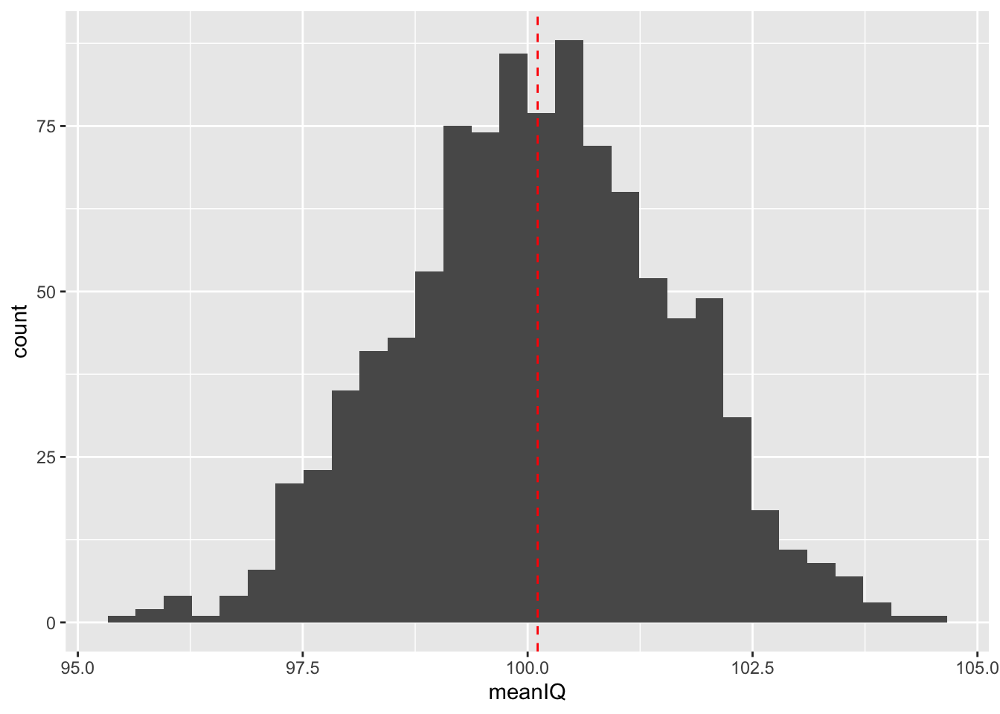

# Inferential Statistics
#### *Samples, Standard Errors, and Confidence Intervals* {-}


#### **Learning Outcomes:** {-}
-	Understand what inferential statistics are and why they are used
-	Learn how samples can be used to draw conclusions about the population
-	Learn about and calculate standard errors and confidence intervals

<div style="margin-bottom:35px;">
</div>

#### **Today’s Learning Tools:** {-}

<div style="margin-bottom:15px;">
</div>
 
##### *Data:* {-}
-	Synthetic data we make ourselves

<div style="margin-bottom:15px;">
</div>

##### *Packages:* {-}
-	`dplyr`
-	`ggplot2`
-	`mosaic`

<div style="margin-bottom:15px;">
</div>

##### *Functions introduced (and packages to which they belong)* {-}
-	`bind_rows()` : Combine data frame(s) together row-wise (`dplyr`)
-	`geom_density()` : Geometry layer for density plots (`ggplot2`)
-	`geom_errorbar()` : Draw error bars by specifying maximum and minimum value (`ggplot2`)
-	`do()` : Loop for resampling (`mosaic`)
-	`geom_vline()` : Geometry layer for adding vertical lines (`ggplot2`)
-	`if_else()` : Tests conditions for true or false, taking on values for each (`dplyr`)
-	`rnorm()` : Create synthetic normally distributed data (`base R`)
-	`round()` : Rounds to nearest whole number or specified number of decimals (`base R`)
-	`sample()` : Randomly sample from a vector or data frame (`mosaic`)
-	`set.seed()` : Random number generator start point (`base R`)

<div style="margin-bottom:50px;">
</div>
---

<div style="margin-bottom:50px;">
</div>

## Generalising About the World from Data

Last week we revisited a familiar sort of statistics: descriptive. But we also learned how to conduct these measures using `R`. Today we learn the other main branch of statistics: inferential. 

Whereas descriptive statistics is concerned with summarising and describing your data, **inferential (or frequentist) statistics** is concerned with using the data to say something about the world in which we live. Using samples drawn from our population of interest, we can conduct statistical analyses to generalise to our lives and what we observe around us. 

Inferences made from inferential statistics are not bound to one dataset and sample, and that is the strength of this type of statistics. Because, however, we will be saying something that is applicable to the ‘real’ world, we must understand the theory for which makes this possible. 

Today’s learning experience is the most theoretical of this course unit. To understand later inferential statistical analyses is to first understand the base on which they stand. Our three substantive topics today are: **samples**, **standard errors**, and **confidence intervals**. 

As usual, we begin by opening your existing `R` project, then installing and loading the required packages as listed above. 

<div style="margin-bottom:50px;">
</div>

---

<div style="margin-bottom:50px;">
</div>

## Today’s 3

<div style="margin-bottom:50px;">
</div>

As you continue the remainder of this course unit, you will observe how important it is to collect accurate information to conduct inferential statistics. Your findings are only as good as its basis, and if that basis is a shoddy collection of data, what you have to say will reflect that. An important way to collect accurate information is to ensure that what we have is representative of that real world. This is where samples arrive to play. 

<div style="margin-bottom:50px;">
</div>

---

### Samples

<div style="margin-bottom:50px;">
</div>

Say we are curious about how widespread robbery in the UK has been in the past 12 months. We could obtain police-recorded data to tell us this information. We also, however, know from previous criminology classes that not many people report crimes to the police, so this data is limited, unable to tap into what is known as ‘the dark figure of crime’. 

What we could do is survey everyone in the UK about whether they have been a victim of robbery in the past year and how many times they have been robbed. But surveying the entire **population** is not very practical because of time and financial constraints.

Sure, eventually mass collection of data from the population may be possible in the future as we have seen with social media corporations, but even then, access and availability remain issues. Because of these limitations of collecting information from the population, we use a sample. 

A **sample** of the population is a small selection of that population of interest. Our sample should also have high **external validity**, which means they are a good representation of the population. To establish external validity depends on the way you collect your sample (e.g., random sampling versus convenience samples). This will make conclusions from a sample generalisable to the population. That is what the *Crime Survey of England and Wales* does: sample from the population to get an estimate of how widespread crime and victimisation are in the whole of the population. 

The big concern now is: how do we know that a sample is generalisable to the wider population? Is there a way to prove that?

We create **synthetic data** to represent a fake population to demonstrate how it is possible for a sample to be used to estimate what goes on in the whole population. Why the data are based on a fake population is because rarely do we have information on the whole population, of course. 

The synthetic data will be randomly generated numbers to represent the intelligence quotient (IQ) scores of every probationer in the US, which is a population of about 3.6 million. For this example, we assume the mean IQ scores to be 100 and the standard deviation to be 15. We create this population distribution by using the function `nrnorm ()` and assigning this to a vector object called `prob_iq`:

<div style="margin-bottom:35px;">
</div>


```r
prob_iq <- rnorm(n = 3600000, mean = 100, sd = 15)
```
<div style="margin-bottom:50px;">
</div>

Visualizing this distribution will help us identify its shape. We use `ggplot2`:

<div style="margin-bottom:35px;">
</div>


```r
# As our data is in a single vector object, we do not need to specify a data frame (as these have multiple vectors), so leave ggplot() empty
ggplot() + 
  geom_histogram(mapping = aes(x = prob_iq), bins = 60) + 
  geom_vline(mapping = aes(xintercept = mean(prob_iq)), col = "red", linetype = "dashed") # We add a red line in the code to show the mean of the population IQ
```


<div style="margin-bottom:50px;">
</div>

Visualising the distribution of IQ scores, we observe that the scores are normally distributed, which is bell-shaped, and there is no skewness on other side. The majority of probationers have an IQ around the mean of 100. Now we conduct some descriptive statistics to know more about our data:

<div style="margin-bottom:35px;">
</div>


```r
mean(prob_iq) # 99.99508
```

```
## [1] 100.0009
```

```r
median(prob_iq) # 99.99855
```

```
## [1] 99.99917
```

```r
sd(prob_iq) # 14.99377
```

```
## [1] 14.99689
```
<div style="margin-bottom:50px;">
</div>

Your numbers may slightly differ from those in the comments, and that is okay, because this has to do with how computers generate random numbers. We want our results to be the same though, so we set a seed using the function `set.seed()`, which ensures it generates the exact same distribution for this session. 

We then create a data frame with an ID column for each probationer and use the `round ()` function to tell `R` to round each IQ score to a whole number (zero decimal places):

<div style="margin-bottom:35px;">
</div>


```r
set.seed(1612) # Use this number! 

# Creating the prob_off data frame with ID variable called ‘probationer_id’ for all 3.6 million cases and including the IQ variable
# Rounding IQ variable to nearest whole number
prob_off <- data.frame( probationer_id = 1:3600000, IQ = round(rnorm(3600000, mean = 100, sd = 15), 0) ) 

# Some descriptive statistics
mean(prob_off$IQ) # 100.0028 
```

```
## [1] 100.0028
```

```r
median(prob_off$IQ) # 100 
```

```
## [1] 100
```

```r
sd(prob_off$IQ) # 14.99976
```

```
## [1] 14.99976
```
<div style="margin-bottom:50px;">
</div>

Your descriptive statistics should match the numbers in the above comments. These numbers are, for this example, the *true* estimates of IQ scores in the population of American probationers. Now if we take a sample from this population, how accurate would our sample estimates be compared to the population estimates?

First, we make a sample that is taken from our population. We draw a random sample of 100 probationers using the function `sample ()` from the `mosaic` package:

<div style="margin-bottom:35px;">
</div>


```r
# We take a sample of 100 from our data frame, ‘prob_off’, and put it into an object called ‘sample1’
sample1 <- sample(x = prob_off, size = 100)

# Some descriptive statistics of ‘sample1’
mean(sample1$IQ) # 101.59 
```

```
## [1] 101.59
```

```r
median(sample1$IQ) # 101.5 
```

```
## [1] 101.5
```

```r
sd(sample1$IQ) # 16.27485
```

```
## [1] 16.27485
```
<div style="margin-bottom:50px;">
</div>

The results seem very close to the ‘true’ estimates from our population of probationers. The reason, though, is we have all set the same seed. But if we did not, we would get different estimates each time we took a random sample from the population. 

This is a real problem facing researchers: each time you take a sample from your population of interest, its estimates may not be similar to the true but unknown estimates of that population. This variation in estimates is known as **sampling variability**, an unavoidable consequence of randomly sampling observations from the population. 

Sampling variability makes up what is known as the **sampling distribution**. This distribution comprises the means of the many samples we draw from the same population. These two concepts are crucial to demonstrating how samples can be used to make inferences about the population. Here’s why:

When we resample – take repeated samples from the same population of interest – we create many sample means. The interesting bit is that when you take the overall mean of a large number of sample means, it is very close to that true population mean of 100.

We use the `do ()` and `group_by ()` functions to demonstrate:

<div style="margin-bottom:35px;">
</div>

```r
# We use the do () function to make 1,000 automatic resamples from the data frame ‘prob_off’
# Each resample comprises 100 cases 
# We put our 1,000 resamples into an object called ‘sample100’
sample100 <- do(1000) * sample(x = prob_off, size = 100)

# Additional variables are now found in sample100, which helps us to calculate the mean IQ of each sample, for which there are now 1000 of them

# Now select the sample100 data frame
sample_means100 <- sample100 %>% 
  group_by(.index) %>% # Group by .index  (the sample id)
  summarize(meanIQ = mean(IQ)) # Creating new variable of mean IQ
```

```
## `summarise()` ungrouping output (override with `.groups` argument)
```

```r
mean(sample_means100$meanIQ)
```

```
## [1] 100.1112
```

```r
# We can visualise this sampling distribution to compare to the previous population distribution
ggplot(data = sample_means100) + 
  geom_histogram(mapping = aes(x = meanIQ)) + 
  geom_vline(mapping = aes(xintercept = mean(meanIQ)), col = "red", linetype = "dashed")
```

```
## `stat_bin()` using `bins = 30`. Pick better value with `binwidth`.
```


<div style="margin-bottom:50px;">
</div>

The histogram of our sampling distribution shows this very important concept in inferential statistics: if you randomly draw repeated samples from the same population and calculate the mean of each sample, then plot the frequency of those means, you will get the *normal distribution* -- that bell-shaped curve. This indicates that most samples drawn from the population will have a mean close to the true population mean. 

According to our sampling distribution of probationer IQ scores, drawing a sample with a mean IQ score that is radically different from that of the population would be unlikely. This concept also applies to other point estimates such as the median and standard deviation, and not just the mean. Of course this also depends on sample size. 

What if we had repeated samples of 30 instead of 1,000? We use the function `bind_rows ()` to combine these different data frames of different sample sizes to answer our question:

<div style="margin-bottom:35px;">
</div>


```r
# 1000 probationers in each sample 
sample1000 <- do(1000) * sample(x = prob_off, size = 1000) 

# 30 probationers in each sample 
sample30 <- do(1000) * sample(x = prob_off, size = 30) 

# Calculate the means IQ scores for each sample 
sample_means1000 <- sample1000 %>% 
  group_by(.index) %>% 
  summarize(meanIQ = mean(IQ)) 
```

```
## `summarise()` ungrouping output (override with `.groups` argument)
```

```r
sample_means300 <- sample30 %>% 
  group_by(.index) %>% 
  summarize(meanIQ = mean(IQ)) 
```

```
## `summarise()` ungrouping output (override with `.groups` argument)
```

```r
# Bind them with our first example, which had 100 probationers in each sample 
sample.means.total <- bind_rows(sample_means300, sample_means100, sample_means1000, .id = "sample.size")

# Density plot for comparison 
ggplot(data = sample.means.total) + 
  geom_density(mapping = aes(x = meanIQ, fill = sample.size), alpha = 0.5) +
  scale_fill_discrete(labels = c("30","100","1000"))
```


<div style="margin-bottom:50px;">
</div>

From the density plot, all three sample distributions are normally distributed and have similar means to that of the population. Notice, however, that the larger the sample size, the more likely that the sample means are closer to those of the population. The distribution of sample sizes of 1,000, for example, is pointy, indicating that the IQ scores cluster very closely to the true population mean, whereas the distribution of the sample sizes of 30 is flatter, and its scores are more spread away from the true population mean. The implication is that if we draw small sized samples, we have a higher chance of having a sample that does not reflect the true population at all. Therefore, our findings and generalisations will be inaccurate. 

<div style="margin-bottom:50px;">
</div>
---

<div style="margin-bottom:35px;">
</div>

### Standard Errors

<div style="margin-bottom:50px;">
</div>

We can summarise the variability of the sampling distribution in an estimate called **standard error** (SE). It is essentially the standard deviation of the sampling distribution. We demonstrate how sample size affects the SE, in that the larger the sample size, the smaller the SE and vice versa:

<div style="margin-bottom:35px;">
</div>

```r
sd(sample_means300$meanIQ)
```

```
## [1] 2.695511
```

```r
sd(sample_means100$meanIQ)
```

```
## [1] 1.485388
```

```r
sd(sample_means1000$meanIQ)
```

```
## [1] 0.4774102
```
<div style="margin-bottom:50px;">
</div>

What we have learned is succinctly referred to as the **Central Limit Theorem**. This theorem states that as sample sizes get larger, the means of the sampling distribution approaches normal distribution; it is able to reflect the true population estimate. 

With the synthetic data, we have demonstrated how samples can estimate the population, which is usually unknown to us. The SE is helpful for when we want to know the extent to which the mean of the sample we have, drawn from a population whose estimates are unknown to us, is an accurate estimation of the true mean in that population. We calculate the SE in `R` by dividing the standard deviation of our IQ variable by the square root of our sample size:

<div style="margin-bottom:35px;">
</div>


```r
# Select our data frame with all 1000 samples
sample1000 %>% 
  filter(.index == 1) %>% # Filter the first one (choose any)
  summarize(SE = sd(IQ)/sqrt(1000)) # Calculate the error
```

```
##          SE
## 1 0.4783743
```

<div style="margin-bottom:50px;">
</div>

The SE is 0.4783, which indicates that the mean of our sample of 1,000 American probationers is .50 away from the true population mean of said probationers – very close. 

<div style="margin-bottom:50px;">
</div>

---

### Confidence Intervals

<div style="margin-bottom:50px;">
</div>

A better way of communicating the extent of inaccuracy in sample estimates is to use **confidence intervals** (CIs). These appear as an interval that tells you the margin of error – how many percentage points is your sample estimate away from the population estimate. We calculate them by, first, returning to our normal distribution. 

A characteristic of the normal distribution is that 95% of values will fall within 1.96 standard deviations of the mean.  This is derived from the **68-95-99.7 rule**, or known as an empirical rule, which states that 68% of cases in the distribution will fall within one standard deviation above and below the mean; 95% within two SD; and 99.7% within three SD. 

Two observations to note: first, last week we learned about standard deviations and that there was mention of 68% of verbal assaults falling within one SD; it was a reference to this rule. Second, there is a contradiction with the numbers. If 95% of values fall within 1.96 SD, then why does the empirical rule state that 95% of values will fall within 2 SD? The former (1.96) is the precise number and the latter (2) is an approximation, meant to help you memorise this rule easier than if the value was a non-integer like 1.96. 

If 95% of values of the normal distribution fall within 1.96 SD of the mean, we are able to calculate the upper and lower boundaries of this particular confidence interval: 

<div style="margin-bottom:35px;">
</div>


```r
# One-off sample containing 1000 probationers 
sample1 <- sample(x = prob_off, size = 1000) 

# Constructing the confidence interval using what we know about SDs and normal distributions
sample1 %>% 
  summarize(lower = mean(IQ)-1.96*sd(IQ), meaniq = mean(IQ), upper =
              mean(IQ)+1.96*sd(IQ))
```

```
##      lower  meaniq   upper
## 1 69.72398 100.539 131.354
```

<div style="margin-bottom:50px;">
</div>

Your numbers may differ a bit as we have not set a seed, but should be about 69.724 for the lower boundary ; 131.354 for the upper boundary; and 100.539 for the mean. We add these using the `geom_vline` function to a density plot visual to better understand our obtained interval:

<div style="margin-bottom:35px;">
</div>

```r
ggplot(data = sample1) + 
  geom_density(mapping = aes(x = IQ)) + 
  geom_vline(mapping = aes(xintercept = mean(IQ)), col = "red", linetype = "dashed") +
  geom_vline(mapping = aes(xintercept = mean(IQ) + 
                             1.96*sd(IQ)), col = "blue", linetype = "dashed") +
  geom_vline(mapping = aes(xintercept = mean(IQ) - 1.96*sd(IQ)), col = "blue", linetype = "dashed")
```


<div style="margin-bottom:50px;">
</div>

Seeing the dashes that represent the confidence interval shows us that IQ scores will vary away from the mean of our sample, but 95% of them will fall within this interval. Similar to what we learned about repeated samples, if we took 100 resamples of our population of probationers and obtained the sample means, the true population mean will fall within the confidence interval 95% of the time. Thus, only 5% of the time will our resamples fail to obtain the true population mean.  We use `R` to illustrate this concept and introduce a new function `if_else()` to do so:

<div style="margin-bottom:35px;">
</div>

```r
# Create a vector containing the true population mean from prob_off
true.mean <- mean(prob_off$IQ)

# Select the sample of 1,000 samples, each with 100 probationers and place in object, ‘new.sample.ci100’
new.sample.ci100 <- sample_means100 %>%
  slice(1:100) %>% #Take the first 100 means 
  mutate(lower = meanIQ-1.96*sd(meanIQ), upper = meanIQ+1.96*sd(meanIQ), # Compute lower and upper boundaries to create a new variable called ‘capture.mean’
         capture.mean = if_else(condition = lower > true.mean | upper < true.mean, true = "no", false = "yes")) # Specify code below to be: If lower > true mean or upper < true mean then capture.mean will #be "yes" 
# If not, capture.mean will be "no"


# Produce table to show new variable and how many Cis captured population mean
table(new.sample.ci100$capture.mean)
```

```
## 
##  no yes 
##   4  96
```
<div style="margin-bottom:50px;">
</div>

Your result may slightly differ but, in this example, 96% of CIs obtained the true population mean and 4% did not, which is close to what we expected. We can visualise this to better understand what we have just found:

<div style="margin-bottom:35px;">
</div>

```r
ggplot(data = new.sample.ci100) + 
  geom_vline(mapping = aes(xintercept = true.mean), linetype = "dashed") +
  geom_errorbarh(mapping = aes(xmin = lower, xmax = upper, y = .index, colour = capture.mean)) + # Creating error bars to represent CIs and colouring in which ones captured population mean #and did not by ‘capture.mean’
  geom_point(mapping = aes(y = .index, x = meanIQ, colour = capture.mean))
```


<div style="margin-bottom:50px;">
</div>

The visual shows the result obtained in the table, but here, you can see all 100 of the scores, their CIs, and how 95% of the time, they capture the true population mean. In reality, we have no way of knowing whether we have captured the true population estimates in our sample, but the use of the confidence interval gives us *confidence* that we are on the right track, so reporting CIs in your results is good practice for presenting your findings. 

<div style="margin-bottom:50px;">
</div>
---

<div style="margin-bottom:70px;">
</div>

## SUMMARY

<div style="margin-bottom:50px;">
</div>

Today was a theoretical demonstration of why **samples** can be used to estimate what is happening in the **population**. Samples with high **external validity** can do so. This is the foundation of inferential statistics, the use of samples to draw conclusions about the population. We used **synthetic data** to show why. Despite **sampling variability**, the means of the **sampling distribution** demonstrate that it is able to approximate the normal distribution and, therefore, the true population estimates. This is further demonstrated by the **central limit theorem**, which clarifies that sample size matters in producing more accurate estimates of the population. We learned about the standard error and then onto **confidence intervals**, which is useful in establishing how accurate our estimates are, because in reality, rarely are the population estimates known. 


<div style="margin-bottom:50px;">
</div>

Homework time!

<div style="margin-bottom:150px;">
</div>


