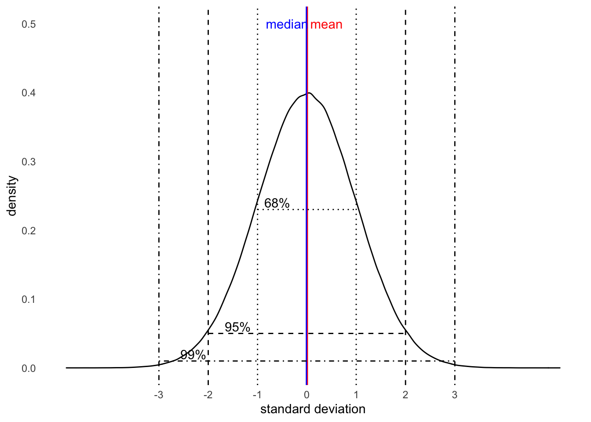
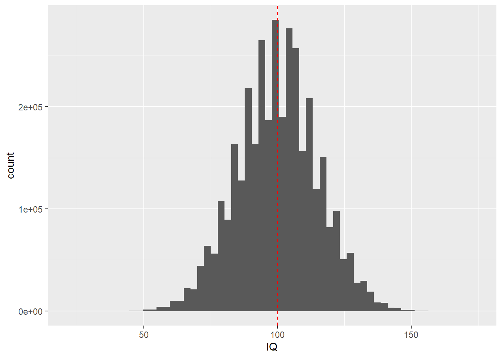
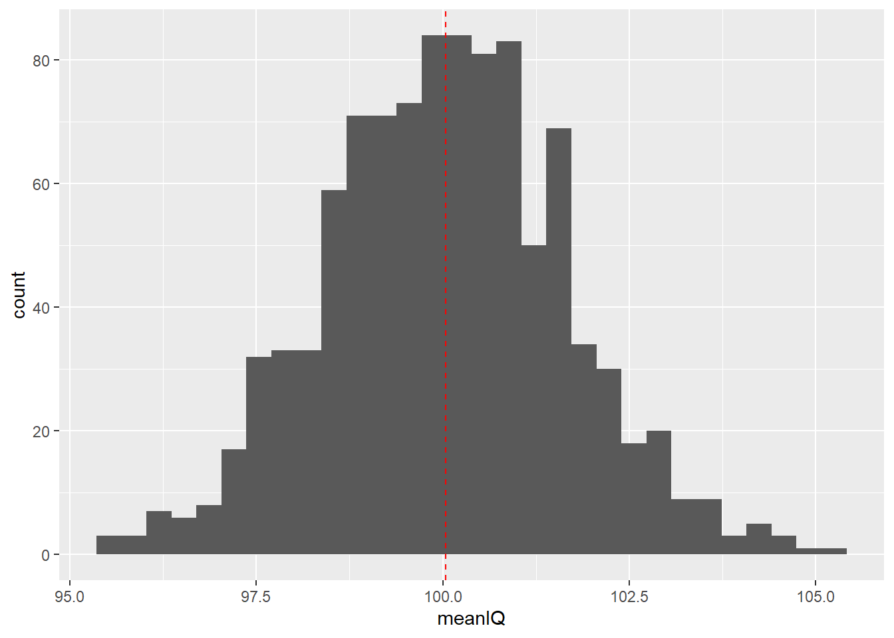
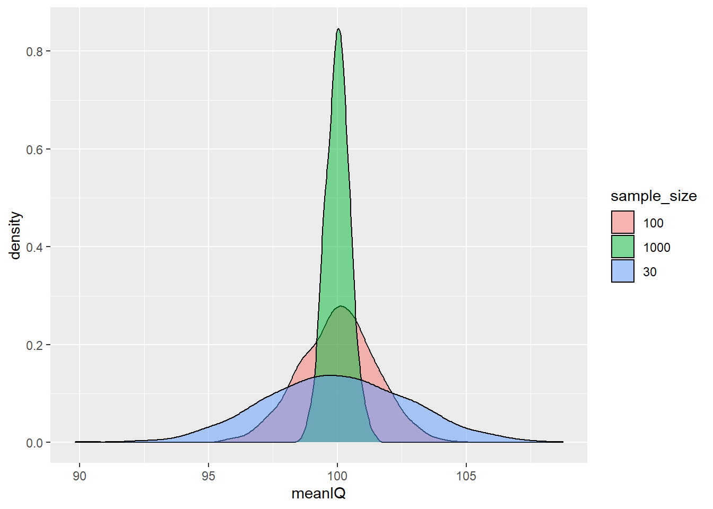

# Inferential Statistics
#### *Samples, Standard Errors, and Confidence Intervals* {-}


#### **Learning Outcomes:** {-}
-	Understand what inferential statistics are and why they are used
-	Learn how samples can be used to draw conclusions about the population
-	Learn about standard errors and confidence intervals and how to calculate them 


#### **Today’s Learning Tools:** {-}

##### *Total number of activities*: 8 {-}

##### *Data:* {-}
-	Synthetic data we make ourselves

##### *Packages:* {-}
-	`dplyr`
-	`ggplot2`
-	`mosaic`

##### *Functions introduced (and packages to which they belong)* {-}
-	`bind_rows()` : Combine data frame(s) together row-wise (`dplyr`)
-	`do()` : Loop for resampling (`mosaic`)
-	`geom_density()` : Geometry layer for density plots (`ggplot2`)
-	`geom_errorbarh()` : Draws horizontal error bars by specifying maximum and minimum value (`ggplot2`)
- `geom_vline()` : Geometry layer for adding vertical lines (`ggplot2`)
-	`if_else()` : Tests conditions for true or false, taking on values for each (`dplyr`)
-	`rnorm()` : Create synthetic normally distributed data (`base R`)
-	`round()` : Rounds to nearest whole number or specified number of decimals (`base R`)
-	`sample()` : Randomly sample from a vector or data frame (`mosaic`)
-	`set.seed()` : Random number generator start point (`base R`)

<br>
<br>

---


## Generalising About the World from Data

Last time, we revisited a familiar sort of statistics: descriptive. But we also learned how to conduct these statistics using `R`. Today, we learn the other main branch of statistics: inferential. 

Whereas descriptive statistics are concerned with summarising and describing your data, **inferential (or frequentist) statistics** are concerned with using the data to say something about the world in which we live. For example, we can make conclusions on body worn camera use in agencies across the country as a whole from data on only a handful of agencies. Using samples drawn from our population of interest, we can conduct statistical analyses to generalise to our lives and what we observe around us. 

Inferences made from inferential statistics are not bound to one dataset and sample, and that is the strength of this type of statistics. It is able to *generalise*, like in the previous example on body worn cameras. Because, however, we will be saying something that is applicable to the ‘real’ world, we must understand the theory for which makes this possible. 

Today’s learning experience is the most theoretical of this course unit. To understand later inferential statistical analyses is to first understand the base on which they stand. 


<br>


### Activity 1: Our preparation routine

As usual, we begin by opening your existing `R` project, then installing (if need) and loading the required packages listed above under the 'Packages' subheading. 


<br>
<br>

---


## Today’s 3

Our three substantive topics today are: **samples**, **standard errors**, and **confidence intervals**. As you continue the remainder of this course unit, you will observe how important it is to collect accurate information to conduct inferential statistics. Your findings and conclusions are only as good as their basis, and if that basis is a shoddy collection of data, what you have to say will reflect that. An important way to collect accurate information is to ensure that what we have is representative of that real world. This is where samples arrive to play. 

<br>
<br>


---

### Samples

Say we are curious about how widespread robbery in England and Wales has been in the past 12 months. We could obtain police-recorded data to tell us this information. We also, however, know from previous criminology classes that many people do not report crimes to the police, so this data is limited, unable to tap into what is known as ‘the dark figure of crime’. 

One way to address this limitation is with self-report victimisation surveys, such as the [Crime Survey for England and Wales](https://www.crimesurvey.co.uk/en/index.html). It would be ideal to survey everyone in England and Wales about whether they have been a victim of robbery in the past year and how many times they have been robbed. Surveying the entire **population**, however, is impractical because of time and financial constraints. So, although the Crime Survey addresses the limitation of police-recorded data, it is still unable to obtain information on the entire population of interest -- everyone living in England and Wales.

Sure, eventually mass collection of data from the population may be possible in the future as we have glimpsed with the sheer amount gathered by social media corporations, but even then, access and availability remain issues. Because of these problems in collecting information from the population, we use a sample. 

A **sample** is a small selection of that population of interest. You may recall from last semester and from your first year research methods classes the different approaches to sampling -- different ways to select individuals to form your sample. Examples are random sampling and convenience sampling. The aim of good sampling is to acheive **external validity**.

If our sample has high external validity, it means that our sample is representative of our population of interest. Therefore, we can be confident that whatever we say and conclude about our sample can be generalised to the population. That is what the Crime Survey of England and Wales does: sample from the population to get an estimate of how widespread crime and victimisation are in the whole of the population. 

<!-- The big concern now is: how do we know that a sample is generalisable to the wider population? Is there a way to prove that? -->
<br>

#### How samples are representative of the population

How do we know that a sample is good at representing the population of interest? In the real world, as we have learned, it is often impossible to get data from the whole population. To illustrate how we can trust our statistics from our sample to represent the estimates in the population from which they are derived, also known as **parameters**, we will create a fake population from which we draw samples using **synthetic data**. 

<!-- We create **synthetic data** to represent this fake population to demonstrate how it is possible for a sample to be used to estimate what goes on in the whole population. 
Why the data are based on a fake population is because rarely do we have information on the whole population, of course.  -->

Last time, we learned about distributions too. Specifically, we focused on the normal distribution. This is also called a bell curve, because when we squint a little, the shape looks like a bell. Remember that normal distributions are symmetrical (there is no skew) and the mean is the same as the median. The below visual is that very distribution. It also depicts a nifty fact of every normal distribution called the **68-95-99.7 rule**, which we will learn more about in this lesson. (It will be first introduced in section 5.2.1.5 .)

<!--In addition, there were measures of distribution, or dispersion. For example, the standard deviation. Later we learn more about a nifty fact on the normal distribution. For now, the normal distribution below illustrates this nifty fact: 68% of your data will fall within +/- 1 standard deviation of your mean; 95% of your data within +/- 2 standard deviations of your mean; and 99% of your data within +/- 3 standard deviations of your mean.-->

<br>
<br>



<br>
<br>

Much of what we will be learning in the coming weeks will make the assumption that our data are normally distributed. Of course, there will be exceptions. This is something you will need to check for before embarking on further statistical analyses. For today, though, we focus on the normal distribution and we create synthetic data on intelligence quotient (IQ) scores of American probationers to show how a sample can be representative of the population. 


#### Activity 2: Making normally distributed synthetic data


The synthetic data will consist of randomly generated numbers to represent the intelligence quotient (IQ) scores of every probationer in the US, which is a population of about 3.6 million. For this example, we assume the mean IQ scores to be 100 and the standard deviation to be 15. 

We create this population distribution by using the function `nrnorm()` and assigning this to a vector object called `prob_iq`: 
<br>


```r
# Inside nrnorm(), we specify the parameters:
# n = number of observations, which is 3.6 milion -- our population of US probationers
# mean = IQ score of 100
# sd = dispersion of 15 IQ points around the mean

prob_iq <- rnorm(n = 3600000, mean = 100, sd = 15)
```
<br>

We now have a vector of numbers, all randomly created. Let us get some descriptive statistics: 
<br>


```r
mean(prob_iq) 
```

```
## [1] 99.99748
```

```r
median(prob_iq) 
```

```
## [1] 99.98472
```

```r
sd(prob_iq) 
```

```
## [1] 15.00275
```
<br>

By obtaining some descriptive statistics, we are verifying that the mean and SD are indeed 100 and 15, but you may notice a few discrepancies: 

- 1. The obtained mean is not *exactly* 100 and the SD is not *exactly* 15, although they are very close to those parameters (population estimates).
- 2. Your values obtained in your `RStudio` may be slightly different to that of the lab notes. The reason is `R` *randomly* generates these numbers for you. If you re-run the code with `rnorm` above to re-create your `prob_iq`, you will get another set of numbers!

<br>

To ensure we have the same set of numbers, we can set a specific seed from which the random numbers should 'grow'. If we choose the same seed, then we will get the same set of random numbers and, thus, the same results.

We set a seed using the function `set.seed()`, which ensures it generates the exact same distribution for this session. Then we re-create the `prob_iq` object: 
<br>


```r
set.seed(1612) # Use this number! 

prob_iq <- rnorm(n = 3600000, mean = 100, sd = 15)
```
<br>

Again, obtain the mean, median, and the SD to verify that we have the same results:
<br>


```r
mean(prob_iq) 
```

```
## [1] 100.0032
```

```r
median(prob_iq) 
```

```
## [1] 100.0035
```

```r
sd(prob_iq) 
```

```
## [1] 14.99679
```
<br>

The values, though slightly different from those stated in our `rnorm()` code, should match those in our lab notes. 

With this set of randomly generated IQ scores, let us build a data frame using the function `data.frame()` in which we will create two columns: one for a unique identifier for each probationer called `probationer_id` and another for IQ scores called `IQ`. The data frame object will be called `prob_off`: 
<br>


```r
prob_off <- data.frame(probationer_id = 1:3600000,      # create a column whose numbers range from 1 to 3.6 million
                       IQ = prob_iq )     # create a column whose numbers are the random IQ scores
```
<br>

We need to take one last step to complete our fake population data: the values for IQ score must be whole numbers (integers). To achieve this, we will use the `round()` function:
<br>


```r
# Here, we tell R that we want to round the numbers in our variable IQ
# We specify 0 after our variable to tell R the number of decimal places we want displayed - we want zero decimal places because we want integers

prob_off$IQ <- round(prob_off$IQ, 0)
```
<br>

Our data of a fake population of 3.6 million US probationers and their IQ scores are complete. You can have a look at this data with the `View()` function. In addition, visualising this distribution will help us identify its shape. We use `ggplot2`:
<br>


```r
View(prob_off)
```


```r
# Double check that 'ggplot2' is loaded
ggplot(prob_off) + 
  geom_histogram(mapping = aes(x = IQ), bins = 60) + 
  geom_vline(xintercept = mean(prob_off$IQ), col = "red", linetype = "dashed") # We add a red line in the code to show the mean of the population IQ
```



<br>

From the histogram, we observe that the scores are normally distributed, which is bell-shaped, and there is no skewness on other side. The majority of probationers have an IQ around the mean of 100. 

<br>
<br>


---


#### Activity 3: Taking a sample from our fake population

From the above, we created a dataset of all 3.6 million probationers in the US. This is our hypothetical population. When we look at the mean, median, and standard deviation of this population, these numbers are considered the *true* estimates of IQ scores in the population of American probationers. 

If we now take a sample from this population, how accurate would our sample estimates be compared to the population estimates?

First, we draw a sample from this population. We use the function `sample()` from the `mosaic` package to get this random sample of 100 probationers:
<br>


```r
# 'size' specifies the size of the sample to take
# 'x' specifies what dataset to sample from
# We take a sample of 100 from our data frame, ‘prob_off’, and put it into an object called ‘sample1’

sample1 <- sample(x = prob_off, size = 100)
```
<br>

We then obtain some descriptive statistics of our newly obtained sample called `sample1`:
<br>


```r
mean(sample1$IQ) # 101.59 
```

```
## [1] 101.59
```

```r
median(sample1$IQ) # 101.5 
```

```
## [1] 101.5
```

```r
sd(sample1$IQ) # 16.27485
```

```
## [1] 16.27485
```
<br>

The sample estimates seem very close to the ‘true’ estimates, or parameters, from our population of probationers. Let us obtain another sample using another seed: 
<br>


```r
set.seed(90201)
sample2 <- sample(x = prob_off, size = 100)
```
<br>

We again obtain descriptive statistics but, this time, of our second generated sample, `sample2`: 
<br>


```r
mean(sample2$IQ) # 100.81 
```

```
## [1] 100.81
```

```r
median(sample2$IQ) # 102.5 
```

```
## [1] 102.5
```

```r
sd(sample2$IQ) # 15.08206
```

```
## [1] 15.08206
```
<br>

These are slightly different estimates from those obtained in `sample1`. This is because we drew a different sample from our population. The estimates from `sample2` are still close to our population estimates (M = 100, SD = 15). We now draw a third sample and obtain some descriptive statistics of it:
<br>


```r
set.seed(42)
sample3 <- sample(x = prob_off, size = 100)

mean(sample3$IQ) # 99.41 
```

```
## [1] 99.41
```

```r
median(sample3$IQ) # 101 
```

```
## [1] 101
```

```r
sd(sample3$IQ) # 15.53497
```

```
## [1] 15.53497
```
<br>

Again, we get slightly different estimates from those in the previous samples because we drew another different sample from the population. Depending on which sample we drew, our estimates would be different. This variation in estimates is known as **sampling variability**, an unavoidable consequence of randomly sampling observations from the population. 

For example, above, we took three different samples. Let us look at the mean of each sample again:
<br>


```r
mean(sample1$IQ) 
```

```
## [1] 101.59
```

```r
mean(sample2$IQ) 
```

```
## [1] 100.81
```

```r
mean(sample3$IQ) 
```

```
## [1] 99.41
```
<br>

Drawing three different samples from the population by setting different seeds illustrates the knowledge that we will get slightly different values for the mean for each sample we create. These mean values, though, often will be close to the true population mean. This gives us some confidence that our sample may be representative of the population, but it is the sampling distribution that increases that confidence.

<br>
<br>

---

#### The Sampling Distribution 


Getting different estimates each time we randomly sample from the population, however, is a real problem facing researchers: every time we take a sample from our population of interest, we need to be confident that its estimates are similar to the true but unknown estimates of that population. 

Sampling variability makes up what is known as the **sampling distribution**. This distribution comprises the values of a certain statistic of the many samples we draw from the same population. All these values, when visualised together, will follow a normal distribution whose total average will reflect that true population value. 

Take our three samples we created previously as an example. We had compared their means and found that they slightly differed from each other. If we were to draw more samples (sample4, sample5, sample6, and so on) from the population, we would find that our resampling – taking repeated samples from the same population of interest – results in creating many (sample) means too. The interesting bit is that when you take the overall average of all the means you obtained from those many samples, it is very close to that true population mean of 100. This is what is known specifically as the sampling distribution of the mean.

<br>

#### Activity 4: The sampling distribution of our probationers


Let us demonstrate the sampling distribution by taking 1,000 samples of 100 people each from our population of 3.6 million probationers. Imagine we received funding to administer general intelligence tests. Each time, we take a random sample of 100 probationers, administer each individual in that sample a general intelligence test, and take the mean IQ of that sample. These mean IQs from each sample are the sample means.

Before, we had used the function `sample()` to obtain one sample of 100 people (`sample(x = prob_off, size = 100)`). We do something similar except we repeat this 1,000 times by using the `do()` function, which tells `R` to do something repeatedly:
<br>


```r
# In other words, to take 1,000 samples with 100 probationers each, we want to 'do' `sample(x = prob_off, size = 100)` 1,000 times and call it 'sample1000': 

sample1000 <- do(1000) * sample(x = prob_off, size = 100)
```
<br>

This might take a while (you are sampling 1,000 times after all), so give `R` time to process. A little stop sign icon may appear in the corner of the console to tell you to be patient. When done, you will see the `sample1000` object appear in your environment. Get to know this new data with `View()`.

You can see we have the variables `probationer_id` (prisoner ID) and `IQ` (IQ score), but we also have these new variables, `.row` and `.index`. The variable `.row` refers to the probationer's position in their particular sample, while `.index` refers to the sample to which they belong. For example, if `.index` indicates '1' for a particular observation, it means belonging to the first sample; if '2', the second sample, and so on up to 1,000.

<!--To select a particular sample, you could use the `filter()` function. For example, to select only the second sample, whereby all cases are `.index == 2`. But we want to keep all 1,000 samples. Instead, what -->

We now want the *average IQ for each sample*. You may recall how to get the mean for each category of a categorical variable from last week - we used the functions `group_by()` and `summarise()` (see Lesson 4, section 4.2.1.3). Let us use these again to create the new object called `sample_means1000`, which contains the mean IQ for each sample, all 1,000 of them: 
<br>


```r
sample_means1000 <- sample1000 %>% 
  group_by(.index) %>% # Group by .index  (the sample id)
  summarize(meanIQ = mean(IQ)) # Creating new variable of mean IQ
```

```
## `summarise()` ungrouping output (override with `.groups` argument)
```
<br>

The resulting data frame,`sample_means1000`, has two columns: one for sample id and one for the mean score of IQ for that specific sample. It has 1,000 observations - one for each sample.

What does our sampling variability look like in `sample_means1000`? We can visualise this sampling distribution to compare with the population distribution:
<br>


```r
ggplot(data = sample_means1000) + 
  geom_histogram(mapping = aes(x = meanIQ)) + 
  geom_vline(mapping = aes(xintercept = mean(meanIQ)), col = "red", linetype = "dashed")
```

```
## `stat_bin()` using `bins = 30`. Pick better value with `binwidth`.
```



<br>


The histogram of our sampling distribution shows this very important concept in inferential statistics: whenever we draw a sample, sometimes we *overestimate* the parameter and sometimes we *underestimate* the parameter. This means that sometimes our sample mean is *larger* than our population mean and, in other times, it is *smaller* than the population mean. 

Usually the mean of the randomly selected sample will fall close to the populatin mean, but occasionally, it will fall far from it. What is exciting is that if you randomly draw repeated samples from the same population and calculate the mean of each sample, then plot the frequency of those means, you will get the *normal distribution*. It does not even matter if your data are normally distributed - your sample statistics, including the mean, will be! 

According to our sampling distribution of probationer IQ scores, drawing a sample with a mean IQ score that is radically different from that of the population would be unlikely. From the histogram, observe how 68% of observations in a normal distribution fall within one standard deviation above and below the mean and 95% within two standard deviations above and below the mean. This should be reassuring. This is the **68-95-99.7 rule**, or known as an empirical rule, whereby:

<br>

- 68% between +/- 1 standard deviation from the mean
- 95% between +/- 2 standard deviations away from the mean
- 99.7% between +/- 3 standard deviations away from the mean

<br>


In real life, however, you are not likely to conduct general intelligence tests on 100 probationers, 1,000 times. Instead, you are likely to administer tests to one sample, and you will have to ensure that your sample is a good one. Random sampling is one approach, as we have done so far, but another important aspect to think about is the **sample size**. The next activity explores this. 

<br>
<br>

---


#### Activity 5: Sample sizes

In our previous activity, we used sample sizes of 100, but is 100 a good size? What if we had repeated samples of 30 observations instead of 100? What about 1,000? 

Let us create three sets of 1,000 samples to see how the sample size might affect our sampling distribution of the mean.

We make the three new data frame objects to represent these sets of 1,000 samples, and call them `sample30`, `sample100`, and `sample1000`:
<br>


```r
# 30 probationers in each sample 
sample30 <- do(1000) * sample(x = prob_off, size = 30) 

# 100 probationers in each sample 
sample100 <- do(1000) * sample(x = prob_off, size = 100) 

# 1000 probationers in each sample 
sample1000 <- do(1000) * sample(x = prob_off, size = 1000) 
```
<br>


Now we have three data frames, all with 1,000 samples of varying sample sizes: The first has one-thousand 30-person samples, the second with one-thousand 100-person samples, and the third with one-thousand 1,000-person samples. 

Which one of these would you trust to best represent the population? Why? Discuss in your groups if you are in the chatty rooms.

After, let us create some data frame objects for each set of the 1,000 samples in which we calculate the mean IQ for each one of them: 
<br>


```r
# Calculate the mean IQ scores for each set of 1,000 samples 

sample_means30 <- sample30 %>% 
  group_by(.index) %>% 
  summarize(meanIQ = mean(IQ))
```

```
## `summarise()` ungrouping output (override with `.groups` argument)
```

```r
sample_means100 <- sample100 %>% 
  group_by(.index) %>% 
  summarize(meanIQ = mean(IQ)) 
```

```
## `summarise()` ungrouping output (override with `.groups` argument)
```

```r
sample_means1000 <- sample1000 %>% 
  group_by(.index) %>% 
  summarize(meanIQ = mean(IQ)) 
```

```
## `summarise()` ungrouping output (override with `.groups` argument)
```
<br>

We now have three more data frames, each with the means of the 1,000 samples of varying sample sizes. We will bind these together but, first, for each set, we create a new column called `sample_size`, which will tell us the sample size:
<br>


```r
sample_means30 <- sample_means30 %>% mutate(sample_size = "30")

sample_means100 <- sample_means100 %>% mutate(sample_size = "100")

sample_means1000 <- sample_means1000 %>% mutate(sample_size = "1000")
```
<br>

Now, we use the function `bind_rows()` to *bind* these different data frames of varying sample sizes into one overall data frame in order to answer our question about a 'good' sample size:
<br>


```r
sample.means.total <- bind_rows(sample_means30, sample_means100, sample_means1000)
```
<br>

If you view this new data frame, it has 3,000 samples in it: a thousand with 30 people in each, a thousand with 100 people in each, and a thousand with 1,000 people in each. We look at the distribution of the mean IQ for each of these three sets. 

We can use the function `geom_density` to create a density plot. Let us fill these curves by `sample_size` and set the opacity to 0.5 (so we can see through each geom because they will overlap; to set this, do so with `alpha = `).
<br>


```r
# Density plot for comparison 
ggplot(data = sample.means.total) + 
  geom_density(mapping = aes(x = meanIQ, fill = sample_size), alpha = 0.5) 
```



<br>

Density plots are useful if we want to compare distributions of a numeric variable across levels of a categorical variable. These plots enable comparisons because they standardise the frequencies of each level or group - the area under each curve of the density plots adds up to 1. If you want to compare two or three groups/levels, the density plot is the most appropriate. To read more on these plots, click [here](https://clauswilke.com/dataviz/histograms-density-plots.html).

In this present case, the numeric variable is `meanIQ` and the categorical variable is `sample_size`. From the density plot, all three sample distributions are normally distributed and have similar means to that of the population. (Remember that the mean of the sampling distribution will be the true population estimate [i.e., parameter].)

Notice, however, that the *larger the sample size, the more likely that the sample means are closer to those of the population*. The distribution of sample sizes of 1,000, for example, is tight and pointy, indicating that the IQ scores cluster very closely to the mean of the sampling distribution (and, therefore, the true population mean). If we look at the distribution of the sample sizes of 30, however, it is flatter and wider - its scores are more spread out from the true population mean. 

The implication is that if we draw small sized samples, we have a higher chance of having a sample that does not reflect the true population at all. With small samples, we run the risk of getting a sample statistic that is further away from the population parameter than we would with larger samples. So, generally, the larger the sample size, the better. Otherwise, our findings and generalisations may be inaccurate. 

What we have learned is succinctly referred to as the **Central Limit Theorem**. This theorem states that as sample sizes get larger, the means of the sampling distribution approaches normal distribution; it is able to reflect the true population estimate. 

How do we know if the sample size is big enough? For this, we carry out something known as a *power analysis*, but we will get to that next week. For now, think: 'bigger is better' when it comes to sample size.

These demonstrations of sampling variability, sampling distribution, and sample sizes serve as evidence of why you can trust samples to accurately represent your population of interest. But we reiterate this once more: we often do not know the estimates of our population of interest. In addition, we may not be too sure if our one sample represents our population well. There is actually quite a lot of uncertainty in the real world of data analysis. 

One approach to articulate this uncertainty is by quantifying our sample variabilty. We do so to get an idea of the extent to which we can trust our sample to represent the characteristics of the population - how precise is it? One quantification of variability is the **standard error**. 

<br>
<br>

---


### The Standard Error
<br>

#### Activity 6: Interpreting the SE

We can summarise the variability of the sampling distribution in an estimate called the standard error (SE). Whereas the standard deviation has to do with describing the data (hence, it appeared in Lesson 4 on descriptive statistics), the SE has more to do with inference (hence, its appearance in this lesson on inferential statistics). The SE is essentially the standard deviation of the sampling distribution.  

If we are concerned with the sample mean, for example, the SE is helpful to gauge the extent to which the mean of the sample we have, drawn from a population whose estimates are unknown to us, is an accurate estimation of the true mean in that population. In other words, how different is the sample mean from the population mean.

We demonstrate how sample size affects the SE, in that the larger the sample size, the smaller the SE and vice versa. We specifically focus on the SE of the mean:
<br>


```r
sd(sample_means30$meanIQ)
```

```
## [1] 2.802161
```

```r
sd(sample_means100$meanIQ)
```

```
## [1] 1.468766
```

```r
sd(sample_means1000$meanIQ)
```

```
## [1] 0.474146
```
<br>

Compare the values of the three sampling distributions: as the sample size gets larger, we see a smaller value for the standard error - the central limit theorem is in action.

With the synthetic data, we have demonstrated how samples can estimate the population, which is usually unknown to us. The above is based on repeated samples but, most likely, we will have only one sample. To calculate the SE from one sample, we create a sample of 1,000 people: 
<br>


```r
set.seed(1234) # setting a seed so we all have the same values

new_1000_sample <- sample(prob_off, 1000)
```
<br>

We get the SE by dividing the standard deviation (SD) of the variable `IQ` from the data frame `new_1000_sample` by the square root of our sample size (n = 1,000):

<br>

$SE = \sigma/\sqrt(n)$

<br>
<br>

In `R`: 
<br>

```r
sd(new_1000_sample$IQ)/sqrt(1000)
```

```
## [1] 0.4887421
```
<br>


The SE (of the mean) is 0.4887421. How to interpret and communicate this estimate? A way of talking about this has to do with the *68-95-99.7 rule*.

With our above SE, and because we are dealing with the normal distribution, we can say that 95% of the sample will produce a mean which is within above or below 2 * 0.4887421; in other words, within +/- 0.9774842, or within approximately one IQ point above and below the mean IQ for the whole population of 3.6 million probationers -- this is close to the true estimate.

This is how we can use the sampling distribution of the mean to estimate how representative the sample mean is to that of the population. 

Reka exclaims: 'How cool is that?! It is the power of statistics all in our hands!'

<br>
<br>

---


### Confidence Intervals


The last thing we will learn about is a better way of communicating the extent of inaccuracy in sample estimates. Communicating uncertainty when talking about statistics is an incredibly important topic! In inferential statistics, we are making generalisations - making inferences about a population based on some data we collected from a sample. This means that we will always have some element of error and uncertainty in our conclusions. 

One way to clearly quantify and communicate our uncertainty is to use **confidence intervals** (CIs). These appear as an interval that tells you the margin of error – how far away is your (sample) statistic from the (population) parameter. We calculate them by, first, returning to our normal distribution, and its 68-95-99.7 rule.

<br>

#### Activity 7: The 68-95-99.7 rule in action

Two observations to note: first, last time, we learned about standard deviations (SD) and there was mention of 68% of verbal assaults falling within one SD; it was a reference to this 68-95-99.7 rule. Second, there is a contradiction with the numbers. If 95% of values fall within 1.96 SD, then why does this rule state that 95% of values will fall within two SD, which we have been stating throughout this lesson too? We are simply rounding up. The former (1.96) is the precise number and the latter (2) is an approximation, meant to help you memorise this rule easier than if the value was a non-integer like 1.96. 

If 95% of values of the normal distribution fall within 1.96 SD of the mean, we are able to calculate the upper and lower bounds of this particular confidence interval using this 1.96 value (also known as the z-value) from our sample using the following formula: 

<br>

$\bar{x} \pm 1.96*{sd}/{\sqrt{n}}$

<br>

Let us revisit our `sample1` object. We obtain its mean of IQ: 
<br>


```r
mean(sample1$IQ, na.rm = TRUE)
```

```
## [1] 101.59
```
<br>

Now to create the lower bound of the CI around this sample statistic, we take the mean and subtract from it the value obtained from dividing the standard deviation by the square root of the sample size, multiplied by 1.96:
<br>


```r
mean(sample1$IQ, na.rm = TRUE) - 1.96*sd(sample1$IQ)/sqrt(100)
```

```
## [1] 98.40013
```
<br>

To get the upper bound, you add the same value (obtained from 1.96 * SD/ sqrt(100)) to the mean: <br>


```r
mean(sample1$IQ, na.rm = TRUE) + 1.96*sd(sample1$IQ)/sqrt(100)
```

```
## [1] 104.7799
```
<br>


<!-- We can visualise these add these using a density plot for the distribution of IQ scores in our sample, and the the `geom_vline` function to show the mean (red line) and the +/- standard deviation (blue line), and the upper and lower CIs (green line): -->


<!-- ```{r} -->

<!-- ggplot(data = sample1) +  -->
<!--   geom_density(mapping = aes(x = IQ)) +  -->
<!--   geom_vline(mapping = aes(xintercept = mean(IQ)), col = "red", linetype = "dashed") + -->
<!--   geom_vline(mapping = aes(xintercept = mean(IQ) +  -->
<!--                              1.96*sd(IQ)), col = "blue", linetype = "dashed") + -->
<!--   geom_vline(mapping = aes(xintercept = mean(IQ) - 1.96*sd(IQ)), col = "blue", linetype = "dashed") +  -->
<!--   geom_vline(mapping = aes(xintercept = mean(IQ) +  -->
<!--                              1.96*sd(IQ)/sqrt(100)), col = "green", linetype = "dashed") + -->
<!--   geom_vline(mapping = aes(xintercept = mean(IQ) - 1.96*sd(IQ)/sqrt(100)), col = "green", linetype = "dashed") -->

<!-- ``` -->


<!--Seeing the dashes that represent the confidence interval shows us that IQ scores will vary away from the mean of our sample, but 95% of them will fall within this interval. Similar to what we learned about repeated samples, if we took 100 resamples of our population of probationers and obtained the sample means, the true population mean will fall within the confidence interval 95% of the time. Thus, only 5% of the time will our resamples fail to obtain the true population mean.  -->


We can conclude from our sample that, 95% of the time, when we calculate the CI this way, the mean IQ for all probationers will be somewhere between 98.4001302 and 104.7798698. **Do NOT** ever state this as: 'There is a 95% chance that the mean is between ... and ...'. To say this contradicts the fact that the true population value is fixed and unknown, and it is either inside or outside of the CI with 100% certainty.

What if we took a different sample though? You can repeat the steps above for sample 2 and sample 3, and you will see the following conclusions: 
<br>

- **Sample 2**: we conclude that, when we take repeated samples from the same population, 95% of the time, the mean IQ for all probationers will be somewhere between 97.8539159 and 103.7660841. 
- **Sample 3**: we conclude that, from 95% of our samples, the mean IQ for all probationers will be somewhere between 96.3651461 and 102.4548539. 

<br>

With each different sample, we get a slightly different upper and lower bound of the CIs. How can we trust this? Since we know that we have 95% of observations within 1.96 SD above and below the mean of the sampling distribution, we can conclude that on the whole, the confidence intervals derived from 95% of our samples will contain the true population parameter.

Seems unbelievable? Let us view this:

First, we take our parameter, the true mean IQ for all probationers in the US: <br>


```r
# Create a vector containing the true population mean from prob_off
true.mean <- mean(prob_off$IQ)
```
<br>

Then, we create another 100 samples with 100 probationers in each: 
<br>


```r
set.seed(1897)
new_sample_100 <- do(100) * sample(prob_off, size = 100)
```
<br>

For each sample, we calculate the mean and the lower and upper bounds of the CI (as done above):
<br>


```r
# Select the sample of 100 samples, each with 100 probationers, and place in object, ‘new.sample.ci100’
new.sample.ci100 <- new_sample_100 %>% 
  group_by(.index) %>% 
  summarise(sample_mean = mean(IQ), 
         sample_sd = sd(IQ),
         lower_ci = sample_mean-1.96*sample_sd/sqrt(100), 
         upper_ci = sample_mean+1.96*sample_sd/sqrt(100)) 
```

```
## `summarise()` ungrouping output (override with `.groups` argument)
```


```r
View(new.sample.ci100)
```
<br>

If you view this new data frame `new.sample.ci100`, you will see that for each one of our 100 samples, we have columns for the sample mean, as well as the SD and the calculated upper and lower bounds of the CIs. 

Now to see whether each one of the CIs in our new data frame contains the true population mean (`true.mean`), we use the `if_else()` function to create an additional variable that will tell us so: 
<br>


```r
# Specify code below to be: If lower CI bound < true mean AND upper CI bound > true mean, then 'capture.mean' will be 'yes' 
# If not, 'capture.mean' will be 'no'
new.sample.ci100 <- new.sample.ci100 %>% 
  mutate(capture.mean = if_else(condition = lower_ci < true.mean & upper_ci > true.mean, true = "yes", false = "no")) 
```
<br>

We now use this to produce a tiny table to show how many CIs captured the true population mean, as indicated in the new variable, `capture.mean`: 
<br>


```r
table(new.sample.ci100$capture.mean)
```

```
## 
##  no yes 
##   4  96
```
<br>

According to our tiny table, about 95% of the CIs from our samples contained the true population estimate. In this example 96% contained our true population mean, and  4% did not, and it is close to what we expected. What if we were to do this with 1,000 samples of 100? What do you think the tiny table of 'yes' and 'no' would look like then? What about 10,000 samples? Discuss in your groups. 

<br>
<br>

---


#### Activity 8: Visualising confidence intervals

Finally, we can visualise our CIs to better understand what we have just discovered:
<br>


```r
ggplot(data = new.sample.ci100) + 
  geom_vline(mapping = aes(xintercept = true.mean), linetype = "dashed") +
  geom_errorbarh(mapping = aes(xmin = lower_ci, xmax = upper_ci, y = .index, colour = capture.mean)) + # Creating error bars to represent CIs and colouring in which ones captured population mean #and did not by ‘capture.mean’
  geom_point(mapping = aes(y = .index, x = sample_mean, colour = capture.mean))
```


<br>


The visual shows the result obtained in our tiny table, but here, you can see all 100 sample means, their CIs, and how 95% of the time, they capture the true population mean. In reality, we have no way of knowing whether we have captured the true population estimates in our sample, but the use of the confidence interval gives us *confidence* that we are on the right track, so reporting CIs in your results is good practice for presenting your findings. 

<br>
<br>


---


## SUMMARY

Today was a theoretical demonstration of why **samples** can be used to estimate what is happening in the **population**. Samples with high **external validity** can do so. This is the foundation of inferential statistics - the use of samples to draw conclusions about the population. We used **synthetic data** to show why and how. Despite **sampling variability**, the means of the **sampling distribution** demonstrate that it is able to approximate the normal distribution and, therefore, the true population estimates. This is further demonstrated by the **central limit theorem**, which clarifies that sample size matters in producing more accurate estimates of the population. A nifty fact we could use to interpret results from the normal distribution was the **68-95-99.7 rule**. We learned about communicating uncertainty in our data by presenting the **standard error** (of the mean) and **confidence intervals**. These are useful in establishing how accurate our estimates are, because in reality, rarely are the population estimates known. 


<br>
<br>

Homework time!


<br>
<br>


