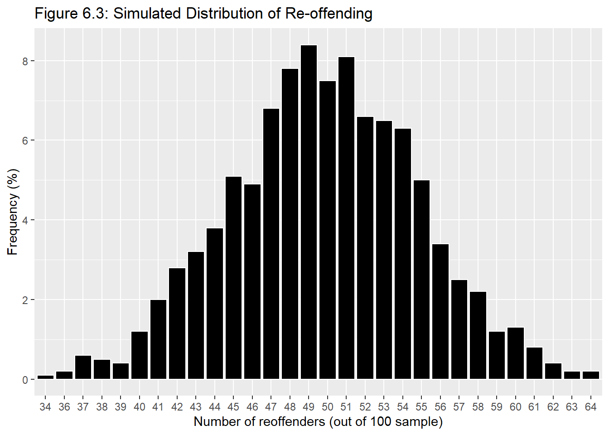
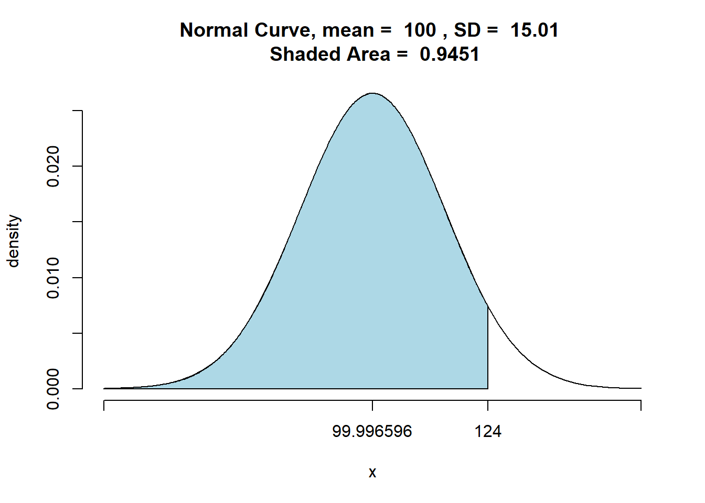
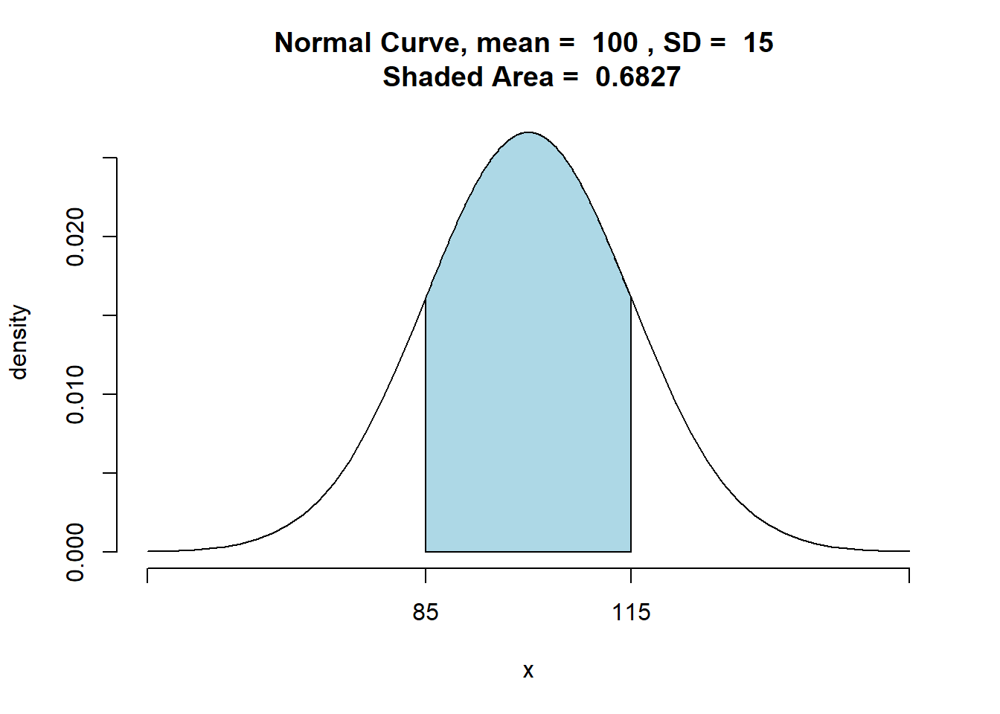

# Hypotheses
#### *Statistical Significance, Binominal Test, Single Sample Significance Tests* {-}


#### Learning Outcomes: {-}
-	Know what hypotheses are and how to use them in inferential statistics
-	Understand what statistical significance is and how to interpret p-values
-	Know what hypothesis tests are and how to conduct a few of them in `R` using the z and t values 

<div style="margin-bottom:35px;">
</div>

#### Today’s Learning Tools: {-}

<div style="margin-bottom:15px;">
</div>

##### *Data:* {-}
-	Synthetic data

<div style="margin-bottom:15px;">
</div>

##### *Packages:* {-}
-	`DescTools`
-	`dplyr`
-	`ggplot2`
-	`tigerstats`

<div style="margin-bottom:15px;">
</div>

##### *Functions introduced (and packages to which they belong)* {-}
-	`BinomCI()` : Compute confidence intervals for binomial proportions (`DescTools`)
-	`cat()` : Combines/concatenates character values and prints them (`base R`)
-	`nrow()` : Counts the number of rows (`base R`)
-	`pnorm()` : Probability of random variable following normal distribution (`stats`)
-	`pnormGC()` : Compute probabilities for normal random variables (`tigerstats`)
-	`prop.test()` : Test null hypothesis that proportions in groups are the same (`base R`)
-	`prop_z_test()` : Single-sample z-test for proportions we created in this chapter
-	`scale()` : Mean centers or rescales a numeric variable (`base R`)
-	`which()` : Provides the position of the elements such as in a row (`base R`)
-	`z_test()` : Function created in this chapter for a single-sample z-test


<div style="margin-bottom:50px;">
</div> 
---

<div style="margin-bottom:50px;">
</div>

## Hypothesis Testing

<div style="margin-bottom:50px;">
</div>

Last time we were introduced to inferential statistics, which uses a sample to draw conclusions about the population. We did not cover types of analyses, however. Instead, as a basis for understanding why samples can be used to say something about the population, we learned the theory that demonstrated why this was so. 

Today we learn the first step in making predictions about our world: hypothesis testing. In crime and criminal justice research, **hypotheses**, essentially predictions, are made frequently – a new intervention programme will reduce reoffending; low self-control is predictive of later criminal behaviour; adverts on reporting sexual harassment on public transport will increase awareness and reduce sexual victimisation rates. 

When we test our hypothesis, we test to see if our prediction is true for the population of interest. For example, if we hypothesize that the new intervention programme will reduce reoffending among at-risk young people in Manchester, and our result shows this, we then can generalise our result to the population of all at-risk young people in Manchester. 

In hypothesis testing, we aim to reject the **null hypothesis**. This states that there is no relationship between our variables. Using the previous example, our null hypothesis ($H_0$) would be that the new intervention programme will not reduce reoffending – there will be no difference in reoffending rates between those who participated and those who did not participate in the programme. Our hypothesis ($H_A$) is considered the *alternative* (hence the ‘A’) of the null hypothesis, which means that there is a relationship between our variables, or in other words, a difference between groups. 

<div style="margin-bottom:35px;">
</div>

Example Hypotheses :

<div style="margin-bottom:15px;">
</div>

$H_0$: There is no difference in reoffending rates between those who participated and those who did not participate in the new intervention programme

<div style="margin-bottom:15px;">
</div>

$H_A$: There is a difference in reoffending rates between those who participated in the new intervention programme and those who did not participate in said programme 

<div style="margin-bottom:35px;">
</div>

Therefore, when we make predictions, we always state two hypotheses: $H_0$  and $H_A$. Stating hypotheses can take two forms: a **directional hypothesis** where you specify the direction or the relationship expected and a **non-directional hypothesis** where you are only interested in whether there is a difference between groups. Our example is a non-directional hypothesis because we do not state specifically whether we want reoffending rates to be lower or higher in each group of young people. 

Confidence is key in hypothesis testing. If we reject the null hypothesis, we want to be confident that it is actually false. In criminology, and across the social sciences, we want to be at least 95% confident in our result. This implies that we are willing to be wrong 5% of the time. We cannot be 100% confident because we usually do not have information from the entire population, so find ourselves trying to decide whether our null hypothesis is false without being so sure of the true result in the population. Because of this uncertainty, we need to be wary of **Type 1 error**.  This error, known also as a false positive, is when we reject the null hypothesis when it is actually true. In addition, there is also *Type 2 error*, a false negative, which is when we fail to reject the null hypothesis even though it is actually false.

<div style="margin-bottom:35px;">
</div>


<div style="margin-bottom:35px;">
</div>
Hypotheses are created before the researcher collects outcome data for the study and conducts any analysis. This is good practice and ethical as well, because if the hypotheses are stated after data has been collected and analysed, then the researcher may be tempted to change the hypotheses, so will dishonestly influence the tests of statistical significance. Also, this affects Type 1 error because we are increasing its likelihood through bad practice – we want to leave that 5% of getting it wrong to chance only.

As we are concerned with rejecting the null hypothesis with high confidence that it is actually false, we will need to identify the risk of making a type 1 error and hope that the risk is as small as possible in a test of **statistical significance**. How to calculate this risk? 

<div style="margin-bottom:50px;">
</div>

---

<div style="margin-bottom:50px;">
</div>

## Today’s 3

<div style="margin-bottom:50px;">
</div>

To understand hypotheses in action, we learn three substantive concepts today: **statistical significance**, **binominal test**, and **single sample significance tests**.  
<div style="margin-bottom:50px;">
</div>

---

<div style="margin-bottom:50px;">
</div>

### Statistical Significance

<div style="margin-bottom:50px;">
</div>

What is meant by **statistical significance**? It is a misleading term because it seems to mean that the result is significant or important, but that is not correct. When we test for statistical significance, we are testing to see if the probability of the null hypothesis being true is less than the level of type 1 error specified. 

The level specified is called the **significance level** and is denoted by the alpha-level (α). In the social sciences, it is usually set at α = 0.05 to indicate that we want to be 95% confident in our rejection of the null hypothesis. If the probability of the null hypothesis is less than α = 0.05, for example, then we can reject it. If, however, the probability is greater than α = 0.05, then we have failed to reject the null hypothesis. 

The probability obtained is the **p-value**, short for probability value, and it tells us how likely that certain result or effect will happen if the null hypothesis is true. That is why if the probability is less then 5%, then it is unlikely to happen. 

The terminology is important here: we can only say we ‘reject’ or ‘fail to reject’ the null hypothesis; we cannot say we ‘accept’ the null hypothesis because testing for statistical significance is not about finding out if the null hypothesis is correct. 

Another important point: lately, there has been substantial [calls to get rid of p-values and statistical significance](https://www.vox.com/latest-news/2019/3/22/18275913/statistical-significance-p-values-explained). The problem is that the p-value is often misunderstood and even misused. It has come to be misinterpreted as either the study worked (a good study) or did not work (a bad study). **That is why including confidence intervals is good practice**. Even though the practice of relying on p-values is controversial, we learn about statistical significance in this course unit because many studies still use it. Understanding what it actually is will prevent misinterpretation. 

Now that we have established what is statistical significance, we must identify the most appropriate test for statistical significance. Selecting an appropriate test depends on a number of assumptions. The remainder of the course unit will introduce you to a number of these tests. For today, we learn about specific hypothesis tests using the binomial distribution and then the normal distribution, and each have their own set of assumptions. We begin with hypothesis testing using the binomial distribution.

<div style="margin-bottom:50px;">
</div>
---

<div style="margin-bottom:50px;">
</div>

### A Binomial Test

<div style="margin-bottom:50px;">
</div>

Hypothesis testing using the binomial distribution have the following assumptions: 

<div style="margin-bottom:35px;">
</div>

1.	*Level of measurement:* the variable is binary, meaning it measures only two possible categories.

<div style="margin-bottom:15px;">
</div>

2.	*Shape of the population distribution:* None

<div style="margin-bottom:15px;">
</div>

3.	*Sample:* high external validity

<div style="margin-bottom:15px;">
</div>

4.	*Hypothesis:* stated before collection and analysis of data

<div style="margin-bottom:35px;">
</div>

We will, once again, create synthetic data of an evaluation of our example intervention programme. The sample comprises 100 at-risk young people who are randomly assigned to two groups: 50 to a treatment group that receives the intervention that aims to prevent them from committing future offences and 50 to the control group that receives no intervention. We evaluate this programme to see if it works and if it can be generalised to all at-risk youth in Manchester. As the outcome has only two options – success and failure – we rely on the **binomial distribution**. 

In `R`, we run the `prop.test ()` function to test the null hypothesis that the proportions, or probabilities of success, are the same or equal in several groups. Say we find that in the treatment group, 10 out of the 50 went on to reoffend whereas, in the control group, 28 out of the 50 went on to reoffend. 

We could stop here and conclude, ‘Yes, there is a difference between groups, and by golly, the intervention works.’ But remember that chance, or random variation, is inherent in all phenomena, so this observation could just be a mere fluke. That is why we conduct a test of statistical significance. This one is called a ‘two-sample proportion test’:

<div style="margin-bottom:35px;">
</div>

```r
# The first concatenate (c () ) contains the numbers that went onto reoffend
# The second concatenate contains the total numbers in each group
prop.test(x = c(10, 28), n = c(50, 50))
```

```
## 
## 	2-sample test for equality of proportions with continuity correction
## 
## data:  c(10, 28) out of c(50, 50)
## X-squared = 12.267, df = 1, p-value = 0.0004611
## alternative hypothesis: two.sided
## 95 percent confidence interval:
##  -0.5567014 -0.1632986
## sample estimates:
## prop 1 prop 2 
##   0.20   0.56
```

<div style="margin-bottom:50px;">
</div>

The output is a little ugly, but you can refer to the help documentation for more detail on the output by typing `?prop.test`. Let us focus on some of the results: 

<div style="margin-bottom:35px;">
</div>

-	P-value: probability of the null hypothesis is true – it is less than α = 0.05

<div style="margin-bottom:15px;">
</div>

-	Alternative hypothesis: the direction of the hypothesis – We expect between-group differences in either direction so it is two-sided

<div style="margin-bottom:15px;">
</div>

-	prop1 and prop2: proportions attributed to each group – 20% in one group (10/ 50) and 56% in the other (28/ 50)

<div style="margin-bottom:35px;">
</div>

The p-value is less than the specified α = 0.05, so we can say that the difference is statistically significant. We have evidence to reject the null hypothesis that no difference in reoffending exists between the treatment and control groups. This suggests that *something* is happening because of the intervention, but we are not sure what. 

Now, if we want a directional hypothesis? For example, we expect that reoffending reduces in the treatment group compared to the control group:

<div style="margin-bottom:35px;">
</div>


```r
# We add ‘alternative=’ and specify ‘less’ to indicate we expect the treatment group to have a smaller probability of reoffending than the control
prop.test(x = c(10, 28), n = c(50, 50), alternative = "less")
```

```
## 
## 	2-sample test for equality of proportions with continuity correction
## 
## data:  c(10, 28) out of c(50, 50)
## X-squared = 12.267, df = 1, p-value = 0.0002306
## alternative hypothesis: less
## 95 percent confidence interval:
##  -1.0000000 -0.1917075
## sample estimates:
## prop 1 prop 2 
##   0.20   0.56
```

<div style="margin-bottom:50px;">
</div>

Again, the p-value is less than α = 0.05, so we have sufficient indication to reject our null hypothesis. In other words, there is evidence to suggest that the at-risk youth in the treatment did offend less than in the control group due to the intervention, and this finding is statistically significant – we can generalise this result to the population which they represent. 

Now if, for example, we found out that the therapist hired to deliver the intervention was a fraud, we may be worried the treatment group did worse than the control group. We then would expect a directional hypothesis where reoffending is higher in the treatment group than that of the control. We run the two-sample proportion test again, but with a slight difference to the direction:

<div style="margin-bottom:35px;">
</div>


```r
# We specify ‘greater’ following ‘alternative’ to indicate our expected direction for the treatment group relative to the control group
prop.test(x = c(10, 28), n = c(50, 50), alternative = "greater")
```

```
## 
## 	2-sample test for equality of proportions with continuity correction
## 
## data:  c(10, 28) out of c(50, 50)
## X-squared = 12.267, df = 1, p-value = 0.9998
## alternative hypothesis: greater
## 95 percent confidence interval:
##  -0.5282925  1.0000000
## sample estimates:
## prop 1 prop 2 
##   0.20   0.56
```

<div style="margin-bottom:50px;">
</div>

The p-value is greater than the specified 0.05, meaning that we have failed to reject the null hypothesis, and we do not have adequate evidence to support our hypothesis that our intervention increases reoffending. 

With this example, we have committed some bad practice: we did multiple hypothesis tests. This is a no-no: stick to one hypothesis and test that. Our purpose here, however, was to demonstrate how to run the binomial test. Recall that it is important to state your hypotheses before you collect and analyse your data.

Including confidence intervals (CIs) is good practice, and it is possible to create them for binomial proportions. For example, we would like to build CIs around the proportion of the outcome for each group. We use the `BinomCI ()` function in the `DescTools` package to do so:

<div style="margin-bottom:35px;">
</div>


```r
# CIs for treatment group where 10 reoffended
BinomCI(10, 50)
```

```
##      est    lwr.ci    upr.ci
## [1,] 0.2 0.1124375 0.3303711
```

```r
# CIs for control group where 28 reoffended
# By default, confidence level is 95% but have added in ‘conf.level’ to show that you can change the confidence level to, say, 99 
BinomCI(28, 50, conf.level = 0.95)
```

```
##       est    lwr.ci   upr.ci
## [1,] 0.56 0.4230603 0.688378
```

<div style="margin-bottom:50px;">
</div>

In the CI for the treatment group, 11 to 33% of young people exposed to the intervention will reoffend, whereas the CI for the control group indicates that 42 to 69% of the young people not exposed to the intervention will reoffend. This seems like a large difference. To get a better understanding, we visualise this using `ggplot`:

<div style="margin-bottom:35px;">
</div>


```r
# Taking the previous coding and placing them in objects
treatment_group <- BinomCI(10, 50, conf.level = 0.95) 
control_group <- BinomCI(28, 50, conf.level = 0.95)

# Creating two error bar layers, one for each group
ggplot() + 
  geom_errorbar(mapping = aes(ymin = treatment_group[2], ymax = treatment_group[3], x = "treatment", colour = "treatment")) + 
  geom_point(mapping = aes(y = treatment_group[1], x = "treatment", colour = "treatment")) + geom_errorbar(mapping = aes(ymin = control_group[2], ymax = control_group[3], x = "control", colour = "control")) + 
  geom_point(mapping = aes(y = control_group[1], x = "control", colour = "control")) +
  xlab("Group") +
  ylab("Proportion who reoffended at follow-up") + 
  theme_minimal()
```



<div style="margin-bottom:50px;">
</div>

Visualising our results, we see further support that the intervention reduces reoffending: the confidence intervals for each group do not overlap and the proportion for the control group is lower than that of the treatment group. When the CIs between groups do not overlap, this is good because it indicates that the two groups likely come from two different populations. 

<div style="margin-bottom:50px;">
</div>

---

<div style="margin-bottom:50px;">
</div>

### Single-sample significance tests

<div style="margin-bottom:50px;">
</div>

For this section, we learn some hypothesis tests that use the normal distribution. 

Hypothesis testing using the normal distribution have the following assumptions: 

<div style="margin-bottom:35px;">
</div>

1.	*Level of measurement:* the variable is interval or ratio level

<div style="margin-bottom:15px;">
</div>

2.	*Shape of the population distribution:* normal distribution

<div style="margin-bottom:15px;">
</div>

3.	*Sample:* high external validity

<div style="margin-bottom:15px;">
</div>

4.	*Hypothesis:* stated before collection and analysis of data

<div style="margin-bottom:35px;">
</div>

Unlike the binominal test, which compared groups, we will be comparing a single group – our sample – to the population. This may sound strange because we have learned that information about the population is rare, so we must make do with uncertainty. In some cases, however, we may know the population parameter and these tests can be used. When comparing our sample to a known population, we use the z- distribution; if we have to compare with an unknown population, we use the t-distribution. The z- and t- distributions are types of normal distributions.

The normal distribution has some predictable characteristics about it. One is that half of the distribution will always be below the mean, and the other half will be above the mean. We demonstrate this by creating a synthetic data of 1.5 million US prisoner IQ scores, drawn from a population that is normally distributed (μ = 100; SD = 15). We then test whether half of our population have an IQ above the mean. We introduce two new functions: `which ()` to select a subset of prisoners who have an IQ of 100 + and `nrow ()`, which divides the number of prisoners with an IQ of 100+ by the total number of prisoners: 

<div style="margin-bottom:35px;">
</div>


```r
# Make synthetic data which includes the variables ‘prisoner_id’ and ‘IQ’
# ‘prisoner_id’ has 1 to 1.5 million IDs while ‘IQ’ has scores generated by ‘rnorm’ function 
# Place data frame in object called ‘PrisonerIQ’
PrisonerIQ <- data.frame( prisoner_id = 1:1500000, IQ = round(rnorm(1500000, mean = 100, sd = 15), 0)) 

# Using ‘which’ function to make subset of prisoners with IQ above 100
# ‘which’ is to the left of the ‘,’ at the end of code to specify that we are selecting rows
# Place subset in object called ‘IQ_Over_100’
IQ_Over_100 <- PrisonerIQ[ which(PrisonerIQ$IQ>100) ,] 

# Divide ‘IQ_Over_100’ by total number of prisoner IQ scores
nrow(IQ_Over_100)/nrow(PrisonerIQ)
```

```
## [1] 0.4867373
```

<div style="margin-bottom:50px;">
</div>

The result should be close to .50 indicating that half of the population will have an IQ higher than the mean. This illustrates a useful feature of the normal distribution: the percentage of cases between its mean and points at a measured distance are fixed. This is referred to as the standard deviation (SD) unit, and the **z-score** is used to represent it. Z-scores range from -4 standard deviations below the mean and +4 standard deviations above the mean. 

To create z-scores, we use the function `scale ()`. For the next example, we take the IQ of five prisoners and change the IQ of the first prisoner from 102 to 115 so that it is easy to show that this prisoner’s z-score is 1. The reason is the prisoner’s IQ score of 115 is one standard deviation above the population mean. (Remember: μ = 100; SD = 15):

<div style="margin-bottom:35px;">
</div>


```r
# View the first 5 prisoner IQs
PrisonerIQ[1:5,] 
```

```
##   prisoner_id  IQ
## 1           1 111
## 2           2  91
## 3           3 124
## 4           4  96
## 5           5 126
```

```r
# Change the IQ of prisoner #1 
PrisonerIQ$IQ[1] <- 115

# Create a variable storing z-scores of IQs 
PrisonerIQ$z_scoreIQ <- scale(PrisonerIQ$IQ) 

# Check to make sure prisoner #1 has a z-score around 1 
PrisonerIQ[1,]
```

```
##   prisoner_id  IQ z_scoreIQ
## 1           1 115 0.9986506
```

<div style="margin-bottom:50px;">
</div>

Where the z-score becomes practical is illustrated in the following example: say if a probation officer is writing a report for a prisoner who is about to be up for parole. The prisoner has an IQ of 124. The officer wants to give a good idea of how this score compares to all other prisoners. An apt way of doing this is to state the proportion of prisoners who have lower IQs. This can be done using the `pnormGC()` function from the `tigerstats` package:

<div style="margin-bottom:35px;">
</div>


```r
# The mean should be 100 but, in reality, it is not precise, so we calculate it and put in the #object ‘m’
m<-mean(PrisonerIQ$IQ) 

# Same with sd; it should be 15 but we calculate it to get a precise estimate and put in object #‘sd’
sd<-sd(PrisonerIQ$IQ) 

# Enter the prisoner’s IQ score and specify ‘below’ following ‘region’ because we are 
# interested in IQ scores below 124
pnormGC(124, region="below", mean=m, sd=sd,graph=TRUE) 
```



```
## [1] 0.9449867
```

<div style="margin-bottom:50px;">
</div>

The output shows 0.9453, meaning that the prisoner has a higher IQ than over 94% of the prison population. 

Recall from the previous week, the 68-95-99.7 rule. This is helpful to keep in mind with z-scores, as a z-score indicates how far away a score is from the mean based on the standard normal distribution. The rule posits that 68% of cases in the distribution fall within one standard deviation above and below the mean; 95% within two SD; and 99.7% within 3 SD. We demonstrate this rule by using the `pnormGC ()` function to get the proportion of prisoners that have an IQ between 85 to 115, which is one SD above and below the mean:

<div style="margin-bottom:35px;">
</div>


```r
# Specify ‘between’ for ‘region’ because we are interested in proportion of prisoners between the two given values
pnormGC(bound=c(85, 115),region="between", mean=100,sd=15,graph=TRUE)
```



```
## [1] 0.6826895
```

<div style="margin-bottom:50px;">
</div>

And, yes, it shows that 68% of the IQ scores do fall within 1 SD of the mean. 

<div style="margin-bottom:35px;">
</div>
---

<div style="margin-bottom:35px;">
</div>

#### **Single sample z-tests for means**

<div style="margin-bottom:35px;">
</div>

Returning to the parole board example, say if the officer wanted to know, with 99% confidence, if the average IQ at this specific prison is significantly different from those of all prisons in the UK. The officer conducts an IQ assessment of all 233 prisoners at their prison and finds average IQ is 103 (SD =18). As the population parameter is known on prisoner IQ, a **single sample z-test** is appropriate. This test examines whether a sample is drawn from a specific population with a known or hypothesized mean. Here are the officer’s hypotheses:

<div style="margin-bottom:35px;">
</div>

$H_0$: The mean IQ of the population from which our sample of prisoners was drawn is the same as the mean IQ of the UK prison population (mean = 100).

<div style="margin-bottom:15px;">
</div>

$H_A$:  The mean IQ of the population from which our sample of prisoners was drawn is not the same as the mean IQ of the UK prison population (mean ≠ 100).

<div style="margin-bottom:35px;">
</div>

We create our own function called ' z_test ' so that other prisons can easily compare their IQ scores to that of all prisoners. In addition, we use `cat()`, which combines our string text to label our z-score in the output and the computed z-score together.

<div style="margin-bottom:35px;">
</div>

```r
# Specifying inputs in the order that the user needs to enter them : mean, standard deviation,number of prisons, and the population mean that the sample mean to which it will be compared
z_test<-function(xbar, sd, n, mu) { 
  z <- (xbar-mu) / (sd / sqrt(n)) # Equation for one-sample z-test
  return(cat('z =', z)) # Report z-score to the user

} # End function

# Test it with our example by supplying estimates 
z_test(103, 18, 233, 100)
```

```
## z = 2.544056
```

<div style="margin-bottom:50px;">
</div>

Including the p-value would be helpful so we edit our code and use the function `pnorm ()` to compute the probability value. 

<div style="margin-bottom:35px;">
</div>


```r
# Same as above
z_test<-function(xbar, sd, n, mu) { 
z <- (xbar-mu) / (sd / sqrt(n)) 

# This is the new bit: we multiply ‘pnorm’ by 2 to indicate that our hypothesis is non-directional 
p<-2 * pnorm(-abs(z)) 

return( cat('z =', z, 
'\np-value =', p)) # Added code to return p-value
} 

# Test it with our example again 
z_test(103, 18, 233, 100)
```

```
## z = 2.544056 
## p-value = 0.01095734
```

<div style="margin-bottom:50px;">
</div>

Remember that the officer wanted to be 99% confident, and this means that the significance level would be set at α = 0.01 and not α = 0.05 (this is if we are 95% confident). As so, our p-value is greater than the alpha level so we fail to reject the null hypothesis. 

<div style="margin-bottom:35px;">
</div>
---
<div style="margin-bottom:35px;">
</div>

#### **Single Sample z-tests for Proportions**

<div style="margin-bottom:35px;">
</div>

Our next example is to do with evaluating a new prison education programme. The foundation supporting the programme would like to achieve a success rate of 75% among 100,000 prisoners participating in he programme. Success is defined as completion of the six-month course. 

After the programme ran, there is conflicting information about its success: managers of the programme claim they achieved higher than the 75% success rate, while a journalist investigating the programme claimed it was below 75%. You want to get to the bottom of this, so you collect information from 150 of the prisoners who enrolled on the programme using independent random sampling. 

Your data shows that 85% of the participants successfully completed the programme. What to make of your result? Let’s set up the hypotheses where we want a non-directional alternative hypothesis:

<div style="margin-bottom:35px;">
</div>

$H_0$: The success rate of the program is 0.75% (P = 0.75). 

<div style="margin-bottom:15px;">
</div>

$H_A$: The success rate of the program is not 0.75% (P ≠ 0.75)

<div style="margin-bottom:35px;">
</div>

To test this, we use a **single-sample z-test for proportions** because we are concerned with comparing the percentages or proportions between our sample and the known population. We create another new function:

<div style="margin-bottom:35px;">
</div>


```r
# Specifying inputs: p is proportion of success, P is proportion of success in population, n is sample size
prop_z_test<-function(p, P, n) { 

Numerator<-(p - P) 

PQ<- P * (1-P) 

# Standard error
Denominator<-sqrt(PQ / n) 
z<- Numerator / Denominator 

# Return the z-value and p-value to the user
p<-2 * pnorm(-abs(z)) 

return( cat('z =', z, 
'\np-value =', p)) 
} 

# Let's test it using the values from our problem 
prop_z_test(0.85, 0.75, 150)
```

```
## z = 2.828427 
## p-value = 0.004677735
```

<div style="margin-bottom:50px;">
</div>

The z-score is 2.828427 and the p-value is statistically significant. We reject the null hypothesis and conclude that the success rate is not 75%. 

<div style="margin-bottom:35px;">
</div>
---

#### **Single-sample t-tests for Means**

<div style="margin-bottom:35px;">
</div>

When the population parameter is unknown and we want to compare our sample to it, we use the t-distribution. From the previous example, let us say that average test scores were also collected for those prisoners who completed the six-month education course. 

The foundation defined success as 65 for the test. Again, managers claimed the average scores were higher than this, whereas the journalist claimed the average was below 65. You have collected test score information from 50 prisoners and find that the mean is 60 and SD is 15. What conclusions can be made about the *larger population of prisoners* at the 95% confidence level?

<div style="margin-bottom:35px;">
</div>

*Hypotheses*
<div style="margin-bottom:15px;">
</div>
$H_0$: The mean test score for prisoners who have completed the program is 65 (μ = 65).

<div style="margin-bottom:15px;">
</div>

$H_A$: The mean test score for prisoners who have completed the program is not 65 (μ ≠ 65).

<div style="margin-bottom:35px;">
</div>

We conduct a **single-sample t-test for means**, which is similar to the previous z-tests except it is for an unknown population, which in this case, is the overall population of prisoners and not just the ones who had completed the six-month education programme. We modify the code from the `z_test ()` function:

<div style="margin-bottom:35px;">
</div>


```r
# Specifying inputs: xbar is sample mean, sd is sample standard deviation, n is sample size, mu is defined by null hypothesis and is 65
single_t_test<-function(xbar, sd, n, mu) { 

# Equation for one-sample z-test
t <- (xbar-mu) / (sd / sqrt(n - 1)) 

# Report t-score and p-value to the user
p<-2 * pnorm(-abs(t)) 

return( cat('t =', t, 
'\np-value =', p))
} 

# Test it with our example 
single_t_test(60, 15, 51, 65)
```

```
## t = -2.357023 
## p-value = 0.01842213
```

<div style="margin-bottom:50px;">
</div>

The t-value of -2.357023 is statistically significant, so we have sufficient support to reject the null hypothesis. We conclude that the mean test score for prisoners who completed the programme is not 65. 

<div style="margin-bottom:50px;">
</div>
---

## SUMMARY

<div style="margin-bottom:35px;">
</div>

Today, we learned that to make predictions about the population from our sample, we must create **hypotheses**. When we test our hypothesis, we aspire to reject the **null hypothesis**, which tells us no differences exist. To ensure we reject the null accurately, however, we must be wary of **type 1 error** so we consider this error in tests of **statistical significance** and in evaluating our **p-values**. These hypothesis tests we learned today in `R` used the **binomial distribution** as well as the normal distribution, and required us to set our hypotheses at the outset as either **directional** or **non-directional**. Hypothesis tests that used the normal distribution were for **single samples** and statistical significance was determined by **z scores** and **t values**. 

<div style="margin-bottom:100px;">
</div>

Homework time...

<div style="margin-bottom:200px;">
</div>

