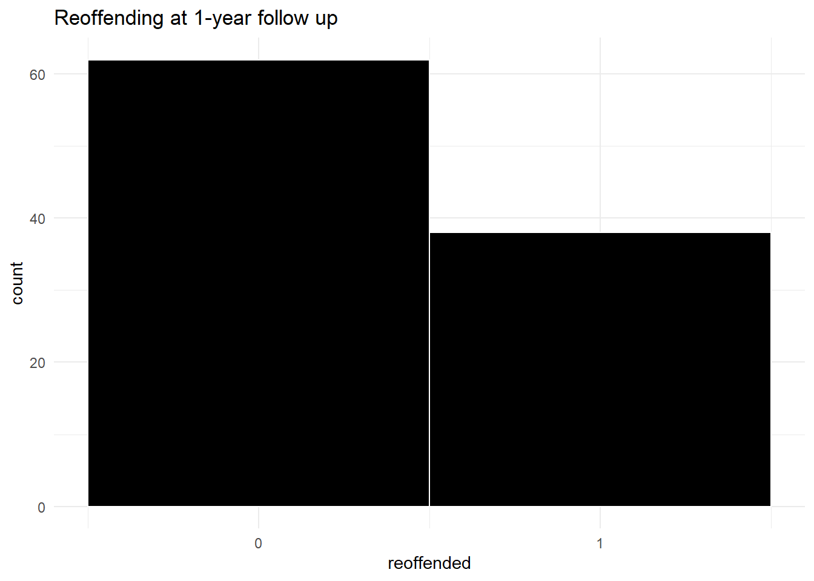
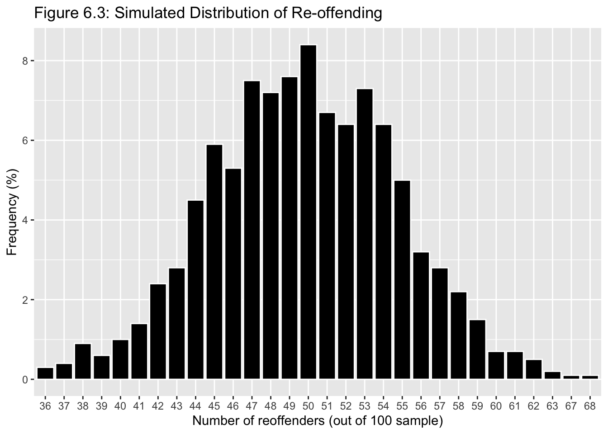
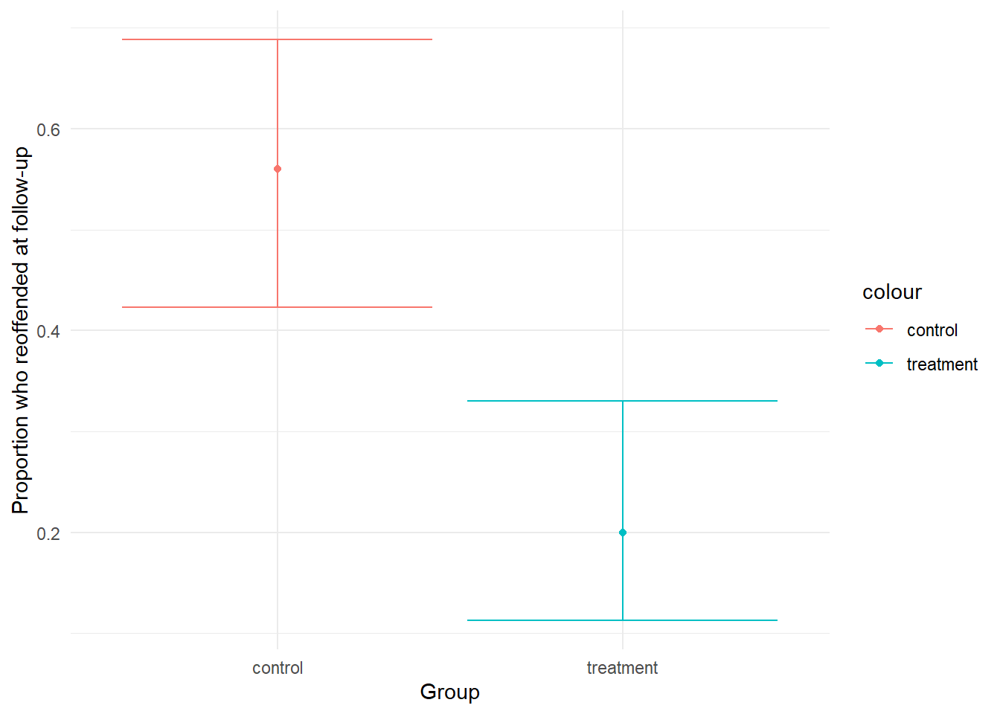
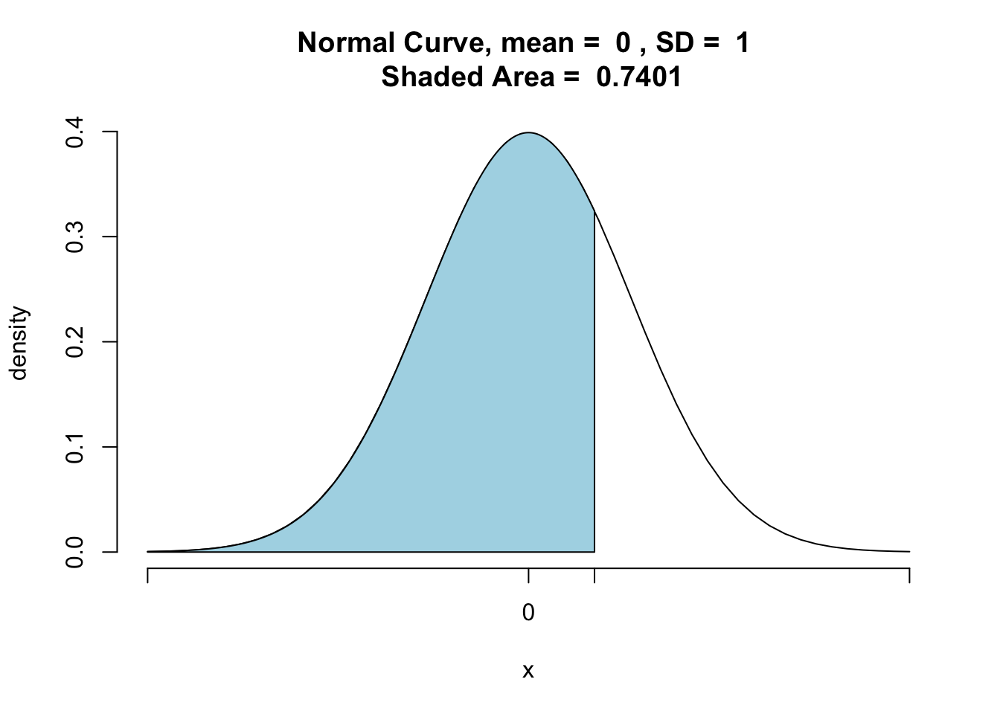
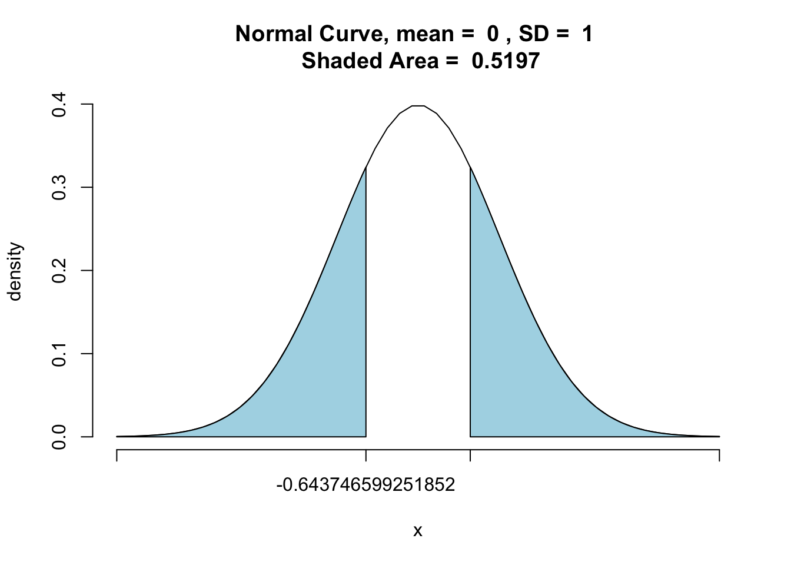

# Hypotheses
#### *Statistical Significance & Hypothesis Tests for Binominal and Normal Distributions* {-}


#### Learning Outcomes: {-}
-	Know what hypotheses are and how to use them in inferential statistics
-	Understand what statistical significance is and how to interpret p-values
-	Know what hypothesis tests are and how to conduct a couple of them


#### Today’s Learning Tools: {-}


##### *Data:* {-}
-	Synthetic data 


##### *Packages:* {-}
-	`DescTools`
-	`dplyr`
-	`ggplot2`
- `mosaic`
-	`tigerstats`


##### *Functions introduced (and packages to which they belong)* {-}
-	`BinomCI()` : Compute confidence intervals for binomial proportions (`DescTools`)
-	`nrow()` : Counts the number of rows (`base R`)
-	`pnorm()` : Probability of random variable following normal distribution (`base R`)
-	`pnormGC()` : Compute probabilities for normal random variables (`tigerstats`)
-	`prop.test()` : Test null hypothesis that proportions in groups are the same (`base R`)
-	`scale()` : Mean centers or rescales a numeric variable (`base R`)
-	`which()` : Provides the position of the elements such as in a row (`base R`)


<br>
<br>

 
---


## Hypothesis Testing


Last time, we were introduced to inferential statistics: we used a sample of observations, taken from the population, to draw conclusions about this population. We did this to understand how a sample statistic (such as the sample mean) can be used to make inferences about the parameters (such as the true mean value in the population). 


We often, however, use samples not only to make inferences about the population of interest, but to also answer research questions. For example, we might want to know if students experience more burglary than non-students? Do men worry about crime more so than women? Do different ethnic groups have different levels of trust in the police? 


In this session, we are going to learn the first step in making predictions about our world: hypothesis testing. In crime and criminal justice research, **hypotheses** (essentially predictions) are made and tested frequently. Hypotheses estimate what we will observe in our data. 


Having been informed by previous research and evidence, we might predict the following: that a new intervention programme will reduce reoffending; low self-control is predictive of later criminal behaviour; adverts on reporting sexual harassment on public transport will increase awareness and, in turn, reduce sexual victimisation rates. These are all hypotheses about a specific population (offenders who may reoffend; potential offenders who have varying levels of self-control; people who take public transport). As we learned from last time, though, we cannot test an entire population. Therefore, instead, with hypothesis testing, we take a sample from our population of interest, and use this sample to draw our inferences. 


When we test our hypothesis, we test to see if our prediction is true for the population of interest. For example, we hypothesize that a new intervention programme will reduce reoffending among at-risk young people in Manchester. There are different research designs that can answer this question; for example, last semester, we learned about [randomised control trials](https://www.bi.team/publications/test-learn-adapt-developing-public-policy-with-randomised-controlled-trials/). 


If we use a randomised control trial, we take a sample of at-risk young people in Manchester and randomly assign them to either a control (no intervention) or treatment (our new intervention programme) group. After one year, we can then compare the level of reoffending between these two groups to confirm whether our hypothesis is true. This is known as  **hypothesis testing**, as we test the hypothesis that the new intervention had an effect (i.e., reduced reoffending). After, we can generalise our result to the population of all at-risk young people in Manchester. 


Although it seems like the example of the new intervention programme is about demonstrating that the programme works in reducing reoffending after one year, in actuality, we do not set out to *prove* that it works. What we try to do with hypothesis testing is to *try to disprove* that our intervention works. It may sound like scientists are a bunch of negative pessimists, but it is about reducing doubt and increasing certainty in our findings. This is the paradigm of scientific research that we will follow. 


While we do not have time to get into the philosophy of science in this class, if you are interested, read up on [Karl Popper and falsification](https://plato.stanford.edu/entries/popper/).

<br>


(https://xkcd.com/2078/)

<br>

This is the approach that we follow with hypothesis testing -- instead of showing that our hypothesis is correct, we want to demonstrate that the hypothesis that is *NOT* ours is *NOT* correct. How do we do this? 

<br>

### The null hypothesis

We do this with something called a **null hypothesis**. The null hypothesis can be seen as the opposite of our hypothesis -- what is expected if our hypothesis were *not true* in the population. When we carry out our hypothesis testing, we aim to reject the **null hypothesis**. 

Our hypothesis ($H_A$) is considered the *alternative* (hence the ‘A’) of the null hypothesis ($H_0$). Returning to our intervention programme example, $H_A$ was: the intervention reduces reoffending. The $H_0$, however, will state that *there is no relationship between the intervention and reoffending*. In other words, the new intervention programme will not reduce reoffending and, therefore, there will be no difference in reoffending rates between participants in the control and treatment groups. 

We test the null hypothesis and we will either *reject* or *fail to reject* it. If we reject our null hypothesis, that is good, because it seems that, as far as we can tell, there is a relationship between our variables (intervention and reoffending), or in other words, a difference between control and treatment groups in reoffending. Another way of understanding this is that we had tried to disprove that there was a relationship between the variables and were unable. Thus, we can continue to believe the new intervention has an effect on reoffending, and we can continue asking funders to support it in good conscience.

If, however, we fail to reject $H_0$, this means we managed to disprove $H_A$. Applied to the example of the new intervention for at-risk Manchester youth, we should stop asking for funding to support this intervention because we cannot claim that it works in reducing reoffending. 

Notice that at no point did we say 'we proved this works', as we cannot actually do this. All we can do is disprove or fail to disprove. Someone else can come along and try to disprove. This is science. If this someone obtains the same results as we have, we can say that *our results replicate*. If different results were obtained, then our findings come into question. This may sound familiar from last semester. If you are interested in the sordid misadventures of scientific (primarily psychological) research, [Science Fictions by Stuart Ritchie](https://www.penguin.co.uk/books/111/1117290/science-fictions/9781847925657.html) is a recommended read.    


<br>


#### Activity 1: Example Hypotheses


In this activity, let us look at some (alternative) hypotheses and then some null hypotheses. We will then construct some of our own. 


First, we consider our previous example of youth reoffending and formalise our hypotheses. 


Our alternative hypothesis could be formalised as: 
<br>

- $H_A$: There is a difference in reoffending rates between those who participated in the new intervention programme and those who did not participate in said programme.  

<br>
In contrast, our null hypothesis should be stated as:
<br>

- $H_0$: There is no difference in reoffending rates between those who participated and those who did not participate in the new intervention programme

<br>

What about the research question on how low self-control is predictive of later criminal behaviour?


Here is the alternative hypothesis: 
<br>

- $H_A$: There is a relationship between engaging in criminal behaviour and scoring low on assessments of self-control. 

<br>
Now, what do you think the accompanying null hypothesis might be? Think about this and type it out in the google docs. 


And, finally, we considered whether adverts on reporting sexual harassment on public transport will increase awareness. If we wanted to test this, what would our $H_A$ look like? What about our $H_0$?

<br>

When we make predictions, we always state both $H_0$ and $H_A$. Doing so communicates the specific aim of our statistical analyses (e.g., to disprove that there is no difference in levels of reoffending) and helps guide us in selecting appropriate analyses to use on our sample as well as what sort of conclusions can be made from them about our population of interest. 

<br>
<br>

---


### Directional hypotheses

When we are formulating our hypothesis, we can also choose whether it is a **directional hypothesis** or a **non-directional hypothesis**. 

A directional hypothesis is where you specify the direction of the relationship expected, whereas a non-directional hypothesis is where you are only interested in whether there is a relationship between variables (i.e., any difference between groups). 

The new intervention on reoffending example is a non-directional hypothesis because we do not state specifically whether we want reoffending rates to be lower or higher in each group of at-risk young people. Here, again, is the alternative hypothesis: 
<br>

- $H_A$: There is a difference in reoffending rates between those who participated in the new intervention programme and those who did not participate in said programme.  

<br>

In contrast, our null hypothesis also only refers to a difference between the two groups: 

<br>

- $H_0$: There is no difference in reoffending rates between those who participated and those who did not participate in the new intervention programme

<br>

With this, if we observe *any* difference between the two groups, we reject our null hypothesis. Previously, we mentioned that this result was great because it meant our intervention worked, so we can apply for more funding. But we did not say anything about the *direction* of this relationship -- we stated that there was a difference but did not account for the possibility that it could mean there was actually more reoffending among those who participated in the intervention than those who did not!

<br>

#### Activity 2: Applying knowledge on directional hypotheses

Think what might be a *directional* hypothesis for our new-intervention-to-reduce-reoffending example. Discuss this in your chatty group and type in your google docs the directional $H_A$ and $H_0$. We will revisit this later.


<br>
<br>

---


## Today’s 3

To understand hypotheses in action, we learn three substantive concepts today: **statistical significance**, and hypothesis tests for **the binominal distribution**, and **the normal distribution**. Before we begin, do ensure all appropriate packages are loaded; they are always listed at the top of each lesson.


<br>

### Statistical Significance

When testing whether there is a relationship between two variables (e.g., intervention and reoffending), you may hear the term **statistical significance**. You may have read this in criminology articles in your other classes. You might read something like:

<br>

> 'There is a statistically significant relationship between the treatment of a new intervention and reoffending rates among at-risk young people.'

<br>

What is meant by statistical significance? It is a misleading term because it seems to mean that the result is *significant* or *important* in some way, but that is incorrect. When we test for statistical significance, we are simply testing to see whether we can confidently generalise from our sample to our population. 

Statistical significance also does not tell us about how big any difference in reoffending is between our two groups, for example. All it tells us is whether *we are confident* that the difference observed in our sample can be generalised to the population. What is meant by 'we are confident'? Confidence is key in hypothesis testing. If we reject the null hypothesis, we want to be confident that it is actually false. 

In criminology, and across the social sciences, it is common to want to be at least 95% confident in our result. (Recall our 95% confidence intervals recently learned.) While 95% sounds steep, keep in mind that this implies that we are willing to be wrong 5% of the time. If our study of reoffending, for example, is repeatedly replicated, we expect about 1 in 20 of the results to reach incorrect conclusions. 

Why are we willing to accept error? The reason is we cannot be 100% confident; we usually do not have information from the entire population, so find ourselves trying to decide whether our null hypothesis is false without being so sure of the true result in the population.

<br>

#### Type 1 error

Because of this uncertainty, we need to be wary of **type 1 error**.  This error, known also as a *false positive*, occurs when we reject the null hypothesis when it is actually true. In addition, there is also **type 2 error**, *a false negative*, which occurs when we fail to reject the null hypothesis even though it is actually false. The image below might help understand these errors:

<br>


{width=70%}

<br>


<!-- We mentioned earlier that you start your study with clarifying and formalising your hypotheses. Hypotheses are created before the researcher collects outcome data for the study and conducts any analysis. This is good practice and ethical as well, because if the hypotheses are stated after data has been collected and analysed, then the researcher may be tempted to change the hypotheses, so will dishonestly influence the tests of statistical significance. Also, this affects Type 1 error because we are increasing its likelihood through bad practice – we want to leave that 5% of getting it wrong to chance only. -->

In testing for statistical significance, we are concerned with rejecting the null hypothesis with high confidence that it is actually false. For this, we will need to identify the risk of making a type 1 error and hope that the risk is as small as possible in a **test of statistical significance**. 

How to calculate this risk of type 1 error? We do this by testing to see if the probability of the null hypothesis being true is less than the level of type 1 error specified. 

<br>

#### Significance level

The level specified is called the **significance level** and is denoted by alpha (α). In the social sciences, it is usually set at α = 0.05 to indicate that we want to be 95% confident in our rejection of the null hypothesis. We then use this value as a cut-off value. If the probability of the null hypothesis is less than α = 0.05, for example, then we can reject it. If, however, the probability is greater than α = 0.05, then we have failed to reject the null hypothesis. 

The probability obtained is the **p-value**, short for probability value, and it tells us how likely we are to observe that certain result or effect which we found in our sample if the null hypothesis were true. 
<!-- That is why if the probability is less then 5%, then it is unlikely to happen.  -->

Again, (like the 'disprove or fail to disprove' the null hypothesis), the terminology is important here: we can only say we ‘reject’ or ‘fail to reject’ the null hypothesis; we cannot say we ‘accept’ the null hypothesis because testing for statistical significance is not about finding out if the null hypothesis is correct. 

Let us return to the intervention for reoffending example: we find that one year after allocating the young people into treatment and control groups, 10 out of the 50 young people in the treatment group went on to reoffend whereas, in the control group, 28 out of the 50 went on to reoffend. 

When we hypothesis test, we will look for whether this difference in reoffending numbers is *statistically significant* -- that is, the probability of this between-group difference  occurring when our null hypothesis -- that the new intervention has no effect -- is true. If we find this probability to be small (less than our cut-off value of $\alpha = 0.05$), we *reject the null hypothesis*. If, however, we find the probability to be larger than our cut-off value of $\alpha = 0.05$, then we *fail to reject* our null hypothesis. 


Now, how can we calculate this probability value? We learn this in the next section. 


<!-- Another important point: lately, there has been substantial [calls to get rid of p-values and statistical significance](https://www.vox.com/latest-news/2019/3/22/18275913/statistical-significance-p-values-explained). The problem is that the p-value is often misunderstood and even misused. It has come to be misinterpreted as either the study worked (a good study) or did not work (a bad study). **That is why including confidence intervals is good practice**. Even though the practice of relying on p-values is controversial, we learn about statistical significance in this course unit because many studies still use it. Understanding what it actually is will prevent misinterpretation.  -->

<br>


---


### Hypothesis Tests for the Binomial Distribution

Now that we have established what is statistical significance, we must identify the most appropriate test for it. Selecting an appropriate test depends on a number of assumptions. The remainder of the course unit will introduce you to a number of these tests. For today, we learn specific hypothesis tests based on the binomial distribution and then the normal distribution, and each have their own set of assumptions. We illustrate hypothesis testing using the binomial distribution.

<br>

#### Activity 3: Distributions

In the previous lesson, much talk was on the normal distribution. We also mentioned that the sampling distribution of your sample statistic (e.g., mean) will always follow a normal distribution, even if your data follow different distributions. And your data often will! 

For example, count data often follows a [Poisson distribution](https://bookdown.org/gabriel_butler/ECON41Labs/tutorial-5-the-poisson-distribution.html). And here, in the case of our youth reoffending intervention, we are looking at a Binomial distribution. The **binominal distribution** describes the probability of observing events from a binary variable (i.e., only two possible options). We can code binary data as '0' and '1', where '1' is the presence of our event (sometimes called successes) and '0' is the absence of that event (sometimes called failures). 

With our data on youth reoffending, we could consider, at the one-year follow up, reoffending an event ('1') while not having reoffended the absence of this event ('0'). You can also see why we do not always want to call the event the 'success' -- you might get funny looks if you say that young people reoffending is a success!

Now let us create synthetic data again, but this time it will be on the youth reoffending intervention example. We will 'assign' 50 to the treatment and 50 to the control group. Then we specify how many did and did not reoffend in each group by the time of our one-year follow-up for our binary variable, `reoffended`. 
<br>


```r
# Create a data frame called 'young_people'
# Give each young person an ID of 1 to 100 (because it is an anonymous study)
# 'group' to specify how many in treatment or control group
# 'reoffended' creates our made-up values for reoffending

young_people <- data.frame( 
  id = c(1:100), 
  group = c(rep("treatment", 50), rep("control", 50)), 
  reoffended =  c(rep(1, 10), rep(0, 40), rep(1, 28), rep(0, 22))
)
```
<br>

Let us see the distribution of our outcome variable, `reoffended`: 
<br>


```r
ggplot(young_people, aes(x = reoffended)) + 
  geom_histogram(bins = 2, fill = "black", col = "white") + 
  theme_minimal() + 
  scale_x_continuous(breaks = c(0,1)) + 
  labs(title = "Reoffending at 1-year follow up")
```



<br>

We observe that, overall, there is quite a high count of reoffending in our follow-up -- about 40% 

But what we are interested in is the *probability* of observing the number of reoffending 'events'. As the binominal distribution is a probability distribution, it can tell us what the probability is of obtaining a certain number of young people reoffending. We have 100 young people, so what is the probability of having $k$ number of them reoffend? (i.e. $P(X=k)$). 

For our binomial distribution, we calculate the probability of observing $k$ young people who reoffended for each possible $k$. In other words, we want to calculate what is the probability that exactly one young person reoffended; then for exactly two young people; and then for three young people, and so on.

What is the probability for each one of these outcomes? We use the equation below to calculate this:

<br>

$Binomial(n,k,p) = C(n,k) * p^k * (1-p)^{n-k}$

<br>

Where $C(n,k)$ refers to all the possible combinations in which you can have $k$ people reoffend in our sample of $n$. 

For example, for the probability that exactly 38 young people reoffended out of our sample of 100, we calculate this:

<br>

$C(n,k) = {n!}/{(n-k)!}$ as $C(100,38) = {100!}/{100!*(100-38)!}$ 

<br>

Whereby `!` means factorial (i.e., multiply the given number by all of the positive whole numbers less than it), which in `R` you can calculate with the `factorial()` function: 
<br>


```r
factorial(100)/factorial(100-38)
```

```
## [1] 2.965564e+72
```
<br>

The value shows that there are many different ways in which we can choose 38 reoffenders. 

Last, what we must plug into the equation is `p`, which is the probability of an outcome. Assuming that the reoffending is as likely an outcome as not reoffending, this value is 0.5 (as there are only two possible outcomes). 

Together, the probability that we get exactly 38 young people reoffending in our data is: 
<br>


```r
(factorial(100)/(factorial(100)*factorial(100-38)))*( 0.5^38) * ((1-0.5)^(100-38))
```

```
## [1] 2.50671e-116
```
<br>

<br>

#### Visualising the binomial distribution

To visualise our binomial distribution, we could create a simulation of 1,000 replications for this reoffending example, with n = 100 young people in each, and it would look like this:
<br>


<br>

From the distribution, we would presume that it is about a 50% chance whether a young person reoffends without having received any intervention in the population. These are the sort of reoffending outcomes we can expect to observe. We can see our sample, overall, is on the left tail of this distribution (although this left skew is not so obvious). Let us move on now to how we can use this for hypothesis testing. 

<br>
<br>

---

#### Activity 4: Making Assumptions 


All the ways in which we will be learning hypothesis testing rely on certain assumptions about the data. If these assumptions are violated, then the tests may not be as accurate as we would like, resulting in erroneous conclusions. Therefore, it is very important to consider the assumptions, and address whether these are *met* or *violated* by our data. 


Hypothesis testing using the binomial distribution have the following assumptions: 

<br>

1.	*Level of measurement:* the variable is binary, meaning it measures only two possible categories.

2.	*Shape of the population distribution:* None

3.	*Sample:* high external validity

4.	*Hypothesis:* stated before collection and analysis of data
<br>

<br>

How can we check that these assumptions are met? We go through each assumption:

First, identify the *level of measurement* of our outcome variable. Since `reoffended` is a binary variable, this assumption is *met*. 

Second, the test makes no assumptions about the shape of the distribution, so this is fine.

Third, a way to check for external validity is by identifying the sampling strategy. For example, was a random (probability) sampling technique used? While, here, we create synthetic data, in actual studies, you will hear about the sampling and how it ensures this validity. For now, this is okay too. 

Fourth, we had stated our hypothesis before 'collecting' our data, and so, this assumption is met as well.

<br>
<br>

---

#### Activity 5: Statistical significance with proportions test


Our assumptions for hypothesis testing with a binomial distribution are met, so let us refresh our memory of our example data -- our sample comprises 100 at-risk young people who are randomly assigned to two groups: 50 to a treatment group that receives the intervention that aims to prevent them from committing future offences and 50 to the control group that receives no intervention. We evaluate this programme to see if it works and if it can be generalised to all at-risk youth in Manchester by checking in after one year as a follow-up. The follow-up will provide us with information on whether the young people reoffended at different proportions in the two groups. As the outcome has only two options – success and failure – we rely on the binomial distribution. 

In `R`, we run the `prop.test()` function to test the null hypothesis that the proportions, or probabilities of success, are the same or equal in several groups. 

We observe any differences in reoffending between the two groups by using the `facet_wrap()` function in `ggplot2` so to look at the groups side by side: 
<br>


```r
ggplot(young_people, aes(x = reoffended)) + 
  geom_histogram(bins = 2, fill = "black", col = "white") + 
  theme_minimal() + # This makes the background white; see Lesson 3, Activity 8
  scale_x_continuous(breaks = c(0,1)) + 
  labs(title = "Reoffending at one-year follow-up") + 
  facet_wrap(~group)
```


<br>

The visual shows very different proportions in the two groups!

Now let us look at the number of people who reoffended in each group:
<br>


```r
# If you do not remember what '%>%' is, see Lesson 2, Section 2.4.2.2, on pipes

young_people %>% group_by(group, reoffended) %>% count()
```

```
## # A tibble: 4 x 3
## # Groups:   group, reoffended [4]
##   group     reoffended     n
##   <fct>          <dbl> <int>
## 1 control            0    22
## 2 control            1    28
## 3 treatment          0    40
## 4 treatment          1    10
```
<br>

We find that in the treatment group, 10 out of the 50 went on to reoffend whereas, in the control group, 28 out of the 50 went on to reoffend. 

We could stop here and conclude, ‘Yes, there is a difference between groups, and by golly, the intervention works.’ But remember that chance, or random variation, is inherent in all phenomena, so this observation could just be a mere fluke -- uncertainty abounds. That is why we conduct a test of statistical significance.

The particular hypothesis test we will use is called a **two-sample proportion test**. Like mentioned previously with the `prop.test()` function, we need to give two *pairs* of values: `x` and `n`. 

For the `x` value, we need to specify the number of event present ('1's) in each group. We have 10 events present (number of young people who have reoffended) in the treatment group, and 28 in the control group. We then combine them as `c(10, 28)`. The second value pair, `n`, refers to the sample sizes of each group. Here, we have 50 in each group so the value pair is `c(50,50)`. We now can conduct the two-sample proportion test:
<br>


```r
# The first concatenate (c () ) contains the numbers that went onto reoffend
# The second concatenate contains the total numbers in each group
prop.test(x = c(10, 28), n = c(50, 50))
```

```
## 
## 	2-sample test for equality of proportions with continuity correction
## 
## data:  c out of c10 out of 5028 out of 50
## X-squared = 12.267, df = 1, p-value = 0.0004611
## alternative hypothesis: two.sided
## 95 percent confidence interval:
##  -0.5567014 -0.1632986
## sample estimates:
## prop 1 prop 2 
##   0.20   0.56
```
<br>


The output is a little ugly, but you can refer to the help documentation for more detail on the output by typing `?prop.test` into the console pane. 

You can see there are some points of interest in the output. We can extract them individually by saving the results into a new object called `reoff_results`:
<br>


```r
reoff_results <- prop.test(x = c(10, 28), n = c(50, 50))
```
<br>

We can actually extract whatever interests us from our new object `reoff_results` the same way we refer to variables in dataframes, by using the `$` operator. Let us start with extracting the p-value (`$p.value`) and interpreting it: 
<br>


```r
reoff_results$p.value
```

```
## [1] 0.0004611492
```
<br>


Recall that the p-value is the probability of observing this difference (in proportions) when the null hypothesis is true -- is it less than α = 0.05 ? 

With our (alternative) hypothesis ($H_A$), although we should have specified the direction of the hypothesis before collecting our data, `R` reminds us of our choices here. If we had expected between-group differences in either direction, it would be **non-directional** or **two-sided**, and extracting that information confirms this:
<br>


```r
reoff_results$alternative
```

```
## [1] "two.sided"
```
<br>

The estimate gives you the proportion of successess attributed to each group – 20% in one group (10/ 50) (prop 1) and 56% in the other (28/ 50) (prop 2):


```r
reoff_results$estimate
```

```
## prop 1 prop 2 
##   0.20   0.56
```
<br>

Let us elaborate on our interpretations further. Below is how you would aptly interpret your results:

The p-value is less than the specified $\alpha$ = 0.05, so we can *reject our null hypothesis* and state that the difference in reoffending between the two groups is statistically significant. We have evidence to reject the null hypothesis that no difference in reoffending exists between the treatment and control groups. This suggests that *something* is happening because of the intervention, but we are not sure what. But we could look at the proportions in each group and state that a smaller proportion of young people who had the intervention reoffended compared with those who did not receive the intervention (20% as opposed to 56%). 

<br>
<br>

#### Activity 6: Directional tests

Now, what if we did specify a direction for our hypothesis? For example, we expected that reoffending reduces in the treatment group compared with the control group. Our directional hypothesis is that the treatment group will have *less* levels of reoffending, so we will need to test it. This would also be considered a one-tailed (one-sided) hypothesis.

Since our hypothesis has changed, the test we use will need to change. As, for this example, we now have a directional hypothesis and we can specify within the `prop.test()` function what we want our alternative hypothesis to be.

By default, the `prop.test()` function will perform a two-sided test (non-directional hypothesis). This is why we did not have to specify what type of hypothesis we had previously. For this, we can choose which way we think the direction will go. We can choose 'less' or 'greater' depending on whether we think that reoffending in our treatment group will be less than in the control group, or greater than in the control group. 

In our present example, we want our treatment to *reduce* reoffending, not increase it, so we will choose 'less': 
<br>


```r
# We add ‘alternative=’ and specify ‘less’ to indicate we expect the treatment group to have a smaller probability of reoffending than the control
reoff_directional_results <- prop.test(x = c(10, 28), n = c(50, 50), alternative = "less")
```
<br>

First, let us check the $H_A$ to confirm its type and direction: 
<br>


```r
reoff_directional_results$alternative
```

```
## [1] "less"
```
<br>

It is indeed 'less', but does this change our conclusions compared to that of the non-directional hypothesis?
<br>


```r
reoff_directional_results$p.value
```

```
## [1] 0.0002305746
```
<br>

Does not seem so because the p-value is less than $\alpha$ = 0.05. We have sufficient evidence to reject our null hypothesis. In other words, there is evidence to suggest that the at-risk youth in the treatment group did re-offend less than in the control group due to the intervention, and this finding is statistically significant – we can generalise this result to the population which they represent. 

Now if, for example, we found out that the therapist hired to deliver the intervention was a fraud. We may be worried that the treatment group did worse than the control group. We then would expect a directional hypothesis where reoffending is higher in the treatment group than that of the control group. We run the two-sample proportion test again, but with a slight difference to the direction:
<br>


```r
# We specify ‘greater’ following ‘alternative’ to indicate our expected direction for the treatment group relative to the control group
reoff_greater_results<- prop.test(x = c(10, 28), n = c(50, 50), alternative = "greater")
```
<br>

Let us check the p-value:
<br>


```r
reoff_greater_results$p.value
```

```
## [1] 0.9997694
```
<br>

The p-value is greater than the specified 0.05, meaning that we have failed to reject the null hypothesis, and we do not have adequate evidence to support our hypothesis that our intervention *increases* reoffending. 

**NOTE:** With this example, we have committed some bad practice: we did multiple hypothesis tests. This is a no-no: stick to one hypothesis and test that. Our purpose here, however, was to demonstrate how to run binomial tests. Recall that it is important to state your hypotheses before you collect and analyse your data.

<br>
<br>

#### Activity 7: Confidence Intervals

Last time, we were introduced to confidence intervals (CIs). Including them is good practice, and it is possible to create them for binomial proportions. For example, we would like to build CIs around the proportion of the outcome for each group. 

We use the `BinomCI ()` function in the `DescTools` package to do so. We specify three values: (1) the number of present events (reoffenders), the sample size (50 for each group), and the confidence level (95%):
<br>


```r
# CIs for treatment group where 10 reoffended
BinomCI(10, 50, conf.level = 0.95)
```

```
##      est    lwr.ci    upr.ci
## [1,] 0.2 0.1124375 0.3303711
```

```r
# CIs for control group where 28 reoffended
BinomCI(28, 50, conf.level = 0.95)
```

```
##       est    lwr.ci   upr.ci
## [1,] 0.56 0.4230603 0.688378
```
<br>

In the CI for the treatment group, 11 to 33% of young people exposed to the intervention will reoffend, whereas the CI for the control group indicates that 42 to 69% of the young people not exposed to the intervention will reoffend. This seems like a large difference. To get a better understanding, we visualise this using `ggplot`:
<br>


```r
# Taking the previous coding and placing them in objects
treatment_group <- BinomCI(10, 50, conf.level = 0.95) 
control_group <- BinomCI(28, 50, conf.level = 0.95)

# Creating two error bar layers, one for each group
ggplot() + 
  geom_errorbar(mapping = aes(ymin = treatment_group[2], ymax = treatment_group[3], x = "treatment", colour = "treatment")) + 
  geom_point(mapping = aes(y = treatment_group[1], x = "treatment", colour = "treatment")) + geom_errorbar(mapping = aes(ymin = control_group[2], ymax = control_group[3], x = "control", colour = "control")) + 
  geom_point(mapping = aes(y = control_group[1], x = "control", colour = "control")) +
  xlab("Group") +
  ylab("Proportion who reoffended at follow-up") + 
  theme_minimal()
```


<br>

Visualising our results, we observe further support that the intervention reduces reoffending: the confidence intervals for each group do not overlap and the proportion for the control group is lower than that of the treatment group. 


<br>
<br>

---


### Hypothesis Tests for the Normal Distribution


For this section, we learn about hypothesis tests that use the *normal distribution*. 

We begin with checking the assumptions. Hypothesis testing using the normal distribution have the following assumptions: 
<br>

1.	*Level of measurement:* the variable is interval or ratio level

2.	*Shape of the population distribution:* normal distribution

3.	*Sample:* high external validity

4.	*Hypothesis:* stated before collection and analysis of data

<br>

Unlike the binominal test(s), which compared groups, we will be comparing a single group – our sample – to the population. This may sound strange because we have learned that information about the population is rare, so we must make do with uncertainty. 

In some cases, however, we may know the parameter from the population and these tests can be used. When comparing our sample to a known population, we use the z- distribution; if we have to compare with an unknown population, we use the t-distribution. The z- and t- distributions are types of normal distributions.

The normal distribution has some predictable characteristics about it. One is that half of the distribution will always be below the mean, and the other half will be above the mean. We demonstrate this by creating a synthetic data of 1.5 million US prisoner IQ scores, drawn from a population that is normally distributed ($\mu$ = 100; SD = 15). 

We then test whether half of our population have an IQ above the mean. We introduce two new functions: `which()` to select a subset of prisoners who have an IQ of 100+ and `nrow()`, which divides the number of prisoners with an IQ of 100+ by the total number of prisoners: 
<br>


```r
# Make synthetic data which includes the variables ‘prisoner_id’ and ‘IQ’
# ‘prisoner_id’ has 1 to 1.5 million IDs while ‘IQ’ has scores generated by ‘rnorm’ function 
# Place data frame in object called ‘prisoner_iq’
prisoner_iq <- data.frame( prisoner_id = 1:1500000, IQ = round(rnorm(1500000, mean = 100, sd = 15), 0)) 


# Using ‘which’ function to make subset of prisoners with IQ above 100
# ‘which’ is to the left of the ‘,’ at the end of code to specify that we are selecting rows
# Place subset in object called ‘iq_over_100’
iq_over_100 <- prisoner_iq %>% filter(IQ > 100)

# Divide ‘iq_over_100’ by total number of prisoner IQ scores
nrow(iq_over_100)/nrow(prisoner_iq)
```

```
## [1] 0.486722
```
<br>

The result should be close to .50, indicating that half of the population will have an IQ higher than the mean. This illustrates a useful feature of the normal distribution: the percentage of cases between its mean and points at a measured distance are fixed. This is referred to as the standard deviation (SD) unit, and the **z-score** is used to represent it. Z-scores range from -4 standard deviations below the mean and +4 standard deviations above the mean. 

<br>

#### Activity 8: Calculating a z-score


This should all be sounding a bit familiar now. All the z-score does is express, in standard deviations, how far away a particular observed value lies from the mean. The z-score of any observed value can be calculated by subtracting the mean from the observation, and dividing by the standard deviation: 

<br>

$z = \frac{x - \mu}{\sigma}$

<br>

With `R`, we can make it simpler to create z-scores with the function `scale()`. For this next example, we take the IQ of five prisoners and change the IQ of the first prisoner from 102 to 115 so that it is easy to show that this prisoner’s z-score is 1. The reason is the prisoner’s IQ score of 115 is one standard deviation above the population mean. (Remember: $\mu$ = 100; SD = 15):
<br>


```r
# View the first 5 prisoner IQs
prisoner_iq[1:5,] 
```

```
##   prisoner_id  IQ
## 1           1 133
## 2           2  95
## 3           3 100
## 4           4  88
## 5           5  85
```

```r
# Change the IQ of prisoner #1 
prisoner_iq$IQ[1] <- 115

# Create a variable storing z-scores of IQs 
prisoner_iq$z_scoreIQ <- scale(prisoner_iq$IQ) 

# Check to make sure prisoner #1 has a z-score around 1 
prisoner_iq[1,]
```

```
##   prisoner_id  IQ z_scoreIQ
## 1           1 115  1.001025
```
<br>

<!--To show that this is the same z-score you would get with the formula above, we  calculate the z-score using the equation, $z = \frac{x - \mu}{\sigma}$:
<br>


```r
(115 - mean(prisoner_iq$IQ))/sd(prisoner_iq$IQ)
```

```
## [1] 1.001025
```
<br> -->


Where the z-score becomes practical is illustrated in the following example: say if a probation officer is writing a report for a prisoner who is about to be up for parole. The prisoner has an IQ of 124. The officer wants to give a good idea of how this score compares to all other prisoners. An apt way of doing this is to state the proportion of prisoners who have lower IQs. This can be done using the `pnormGC()` function from the `tigerstats` package:
<br>


```r
# The mean should be 100 but, in reality, it is not precise, so we calculate it and put in the #object ‘iq_m’
iq_m<-mean(prisoner_iq$IQ) 

# Same with sd; it should be 15 but we calculate it to get a precise estimate and put in object #‘iq_sd’
iq_sd<-sd(prisoner_iq$IQ) 

# Enter the prisoner’s IQ score and specify ‘below’ following ‘region’ because we are 
# interested in IQ scores below 124
pnormGC(124, region="below", mean=iq_m, sd=iq_sd,graph=TRUE) 
```


```
## [1] 0.9453586
```
<br>


The output shows the shaded area at 0.9453, meaning that the prisoner has a higher IQ than over 94% of the prison population. 

Recall from the previous lesson, the 68-95-99.7 rule. This is helpful to keep in mind with z-scores, as a z-score indicates how far away a score is from the mean based on the standard normal distribution. The rule posits that 68% of cases in the distribution fall within one standard deviation above and below the mean; 95% within two SD; and 99.7% within 3 SD. We demonstrate this rule by using the `pnormGC()` function to get the proportion of prisoners that have an IQ between 85 to 115, which is one SD above and below the mean:
<br>


```r
# Specify ‘between’ for ‘region’ because we are interested in proportion of prisoners between the two given values
pnormGC(bound=c(85, 115),region="between", mean=100,sd=15,graph=TRUE)
```


```
## [1] 0.6826895
```
<br>

And, yes, it shows that 68% of the IQ scores do fall within +/-1 standard deviation of the mean, in the case of a normal distribution. 

<br>
<br>

---


#### Activity 9: Single sample z-tests for means

Now, how can we use this to test hyptheses? Returning to the parole board example, say if the officer wanted to know, with 99% confidence, the average IQ at this specific prison is significantly different from those of all prisons in the UK. 

Let us say that we have a prison with a random selection of 233 prisoners. We then sample this from our population: 
<br>


```r
set.seed(1234)
prison_1 <- sample(prisoner_iq, 233) # Is the 'mosaic' package loaded?
```
<br>


The officer conducts an IQ assessment of all 233 prisoners at their prison and finds average IQ is 99.3476395 (SD = 14.0747452). 

As the parameter (mean IQ for all prisoners in the population) is known, a **single sample z-test** is appropriate. This test examines whether a sample is drawn from a specific population with a known or hypothesized mean. Here are the officer’s hypotheses:

<br>

$H_0$: The mean IQ of the population from which our sample of prisoners was drawn is the same as the mean IQ of the UK prison population (mean = 100).

$H_A$:  The mean IQ of the population from which our sample of prisoners was drawn is not the same as the mean IQ of the UK prison population (mean ≠ 100).

<br>

> Note: we 'know' the population mean because we made a hypothetical population. We might not know this in real life, but our hypothetical officer might have a *hypothesis* that the population mean is 100 IQ. Thus, we can test our sample mean against the hypothesised population mean. 

<br>

To test, we need to calculate a z-test statistic. To calculate this statistic, we need the following statistics: 

<br>

From the sample:

- Mean ($\bar{x}$); 
- Size ($n$)

<br>
From the population:

- Known (or hypothesised) population mean ($\mu$);
- Standard deviation ($\sigma$)

<br>

The equation to calculate the z-test statistic is as follows: 

<br>

$z = \frac{\bar{x}-\mu}{\sigma/\sqrt{n}}$

<br>

It is the difference between the sample mean and the population mean over the standard deviation divided by the square root of the sample size. 


To compute this in `R`, first, we need each of these values: 
<br>


```r
xbar <- mean(prison_1$IQ) # sample mean
mu <- 100 # (hypothesised) population mean
iq_sd <- sd(prison_1$IQ) # sample standard deviation 
sample_size <- nrow(prison_1) # the number of prisoners in our sample
```
<br>

We can now compute our test statistic using the values calculated above: 
<br>


```r
# Equation for one-sample z-test
z_stat <- (xbar-mu) / (iq_sd / sqrt(sample_size)) 

z_stat
```

```
## [1] -0.7074978
```
<br>

<!-- We create our own function called ' z_test ' so that other prisons can easily compare their IQ scores to that of all prisoners. In addition, we use `cat()`, which combines our string text to label our z-score in the output and the computed z-score together. -->

<!-- The function we create `z_test()` will take as parameters the sample mean (xbar), the sample standard deviation (sd), the sample size (n), and the known (or hypothesised) population mean (mu):  -->


<!--  z <- (xbar-mu) / (sd / sqrt(n))  -->


<!-- ```{r} -->

<!-- # Specifying inputs in the order that the user needs to enter them : sample mean, standard deviation,number of prisons, and the population mean that the sample mean to which it will be compared -->
<!-- z_test<-function(xbar, sd, n, mu) {  -->
<!--   z <- (xbar-mu) / (sd / sqrt(n)) # Equation for one-sample z-test -->
<!--   return(cat('z =', z)) # Report z-score to the user -->

<!-- } # End function -->

<!-- # Test it with our example by supplying estimates  -->
<!-- z_test(xbar, iq_sd, 233, 100) -->

<!-- ``` -->


<!-- Including the p-value would be helpful so we edit our code and use the function `pnorm()` to compute the probability value.  -->


<!-- ``` {r} -->

<!-- # Same as above -->
<!-- z_test<-function(xbar, sd, n, mu) {  -->
<!-- z <- (xbar-mu) / (sd / sqrt(n))  -->

<!-- # This is the new bit: we multiply ‘pnorm’ by 2 to indicate that our hypothesis is non-directional  -->
<!-- p<-2 * pnorm(-abs(z))  -->

<!-- return( cat('z =', z,  -->
<!-- '\np-value =', p)) # Added code to return p-value -->
<!-- }  -->

<!-- # Test it with our example again  -->
<!-- z_test(103, 18, 233, 100) -->

<!-- ``` -->

We obtained this test statistic of -0.7074978, but how can we interpret this? We can use z-test statistic to find *the associated p-value*.  

Traditionally, you had to look up the associated p-value with each z-score in the back of a textbook, which usually would contain a [z-table](https://www.math.arizona.edu/~rsims/ma464/standardnormaltable.pdf)

If you click on the link above, you will see that, for example, a z-score of -0.75, at $\alpha$ = 0.05 , is associated with the value 0.22663 in the table. You find this by starting on the left side and identifying '-0.7'; then go to the top of the table and locate '.05' (as -0.7 - 0.05 = -0.75). The value 0.22663 is greater than the alpha of 0.05, and so we would fail to reject the null hypothesis.

Another way to find the p-value is to know that the z-statistic is, in fact, a z-score on a normal distribution. The p-value is the probability of seeing these outcomes if the null hypothesis were true. We can refer back to our `pnormGC()` function to see what this value may be: 
<br>


```r
z_stat_1 <- pnormGC(z_stat, region="below", mean=0, sd=1, graph=TRUE) 
```



```r
z_stat_1
```

```
## [1] 0.2396286
```

<br>

The value is 0.2396286. This is a more precise approximation than our lookup table (where we had to round -0.7074978), and so we are getting a more precise p-value. 

We did not, however, specify a direction. In actuality, we should be looking at a two-tailed probability: 
<br>


```r
z_stat_2 <- pnormGC(bound=c(z_stat, -z_stat), region="outside", mean=0, sd=1, graph=TRUE) 
```



```r
z_stat_2 
```

```
## [1] 0.4792572
```
<br>

You will see our value has increased to 0.4792572. In fact, this is simply two times the original p-value we originally obtained with the one-tail probability. You will also notice that the *two tails* of the distribution are shaded because our hypothesis is non-directional - the difference can go either way.

When we were looking at a directional hypothesis, it only took into consideration *one-tail* of the distribution, hence it being called a one-tailed test. 


Now you do not usually need the visualisation for this, but we just included it to help you learn the concepts. We can get our associated p-value for `z_stat`  using the `pnorm()` function: 
<br>


```r
pnorm(z_stat)
```

```
## [1] 0.2396286
```
<br>

And, since, we actually have a non-directional hypothesis, we can multiply this by two, as it is a two-tailed hypothesis: 
<br>


```r
pnorm(z_stat)*2
```

```
## [1] 0.4792572
```


And one more thing: remember that the officer wanted to be 99% confident, and this means that the significance level would be set at $\alpha$ = 0.01 and not $\alpha$ = 0.05 (this is if we are 95% confident; 1 - 0.95 = 0.05).  In our example, though, our p-value is greater than the alpha level, so we fail to reject the null hypothesis. 

<br>
<br>


<!-- #### Activity 10: Single Sample z-tests for Proportions -->


<!-- Our next example is to do with evaluating a new prison education programme. The foundation supporting the programme would like to achieve a success rate of 75% among 100,000 prisoners participating in he programme. Success is defined as completion of the six-month course.  -->

<!-- After the programme ran, there is conflicting information about its success: managers of the programme claim they achieved higher than the 75% success rate, while a journalist investigating the programme claimed it was below 75%. You want to get to the bottom of this, so you collect information from 150 of the prisoners who enrolled on the programme using independent random sampling.  -->

<!-- Your data shows that 85% of the participants successfully completed the programme. What to make of your result? Let’s set up the hypotheses where we want a non-directional alternative hypothesis: -->


<!-- $H_0$: The success rate of the program is 0.75% (P = 0.75).  -->


<!-- $H_A$: The success rate of the program is not 0.75% (P ≠ 0.75) -->


<!-- To test this, we use a **single-sample z-test for proportions** because we are concerned with comparing the percentages or proportions between our sample and the known population. We create another new function: -->


<!-- ```{r} -->

<!-- # Specifying inputs: p is proportion of success, P is proportion of success in population, n is sample size -->
<!-- prop_z_test<-function(p, P, n) {  -->

<!-- Numerator<-(p - P)  -->

<!-- PQ<- P * (1-P)  -->

<!-- # Standard error -->
<!-- Denominator<-sqrt(PQ / n)  -->
<!-- z<- Numerator / Denominator  -->

<!-- # Return the z-value and p-value to the user -->
<!-- p<-2 * pnorm(-abs(z))  -->

<!-- return( cat('z =', z,  -->
<!-- '\np-value =', p))  -->
<!-- }  -->

<!-- # Let's test it using the values from our problem  -->
<!-- prop_z_test(0.85, 0.75, 150) -->

<!-- ``` -->


<!-- The z-score is 2.828427 and the p-value is statistically significant. We reject the null hypothesis and conclude that the success rate is not 75%.  -->


<!-- --- -->

<!-- #### Activity 11: Single-sample t-tests for Means -->


<!-- When the population parameter is unknown and we want to compare our sample to it, we use the t-distribution. From the previous example, let us say that average test scores were also collected for those prisoners who completed the six-month education course.  -->

<!-- The foundation defined success as 65 for the test. Again, managers claimed the average scores were higher than this, whereas the journalist claimed the average was below 65. You have collected test score information from 50 prisoners and find that the mean is 60 and SD is 15. What conclusions can be made about the *larger population of prisoners* at the 95% confidence level? -->


<!-- *Hypotheses* -->


<!-- $H_0$: The mean test score for prisoners who have completed the program is 65 (μ = 65). -->


<!-- $H_A$: The mean test score for prisoners who have completed the program is not 65 (μ ≠ 65). -->


<!-- We conduct a **single-sample t-test for means**, which is similar to the previous z-tests except it is for an unknown population, which in this case, is the overall population of prisoners and not just the ones who had completed the six-month education programme. We modify the code from the `z_test ()` function: -->


<!-- ```{r} -->

<!-- # Specifying inputs: xbar is sample mean, sd is sample standard deviation, n is sample size, mu is defined by null hypothesis and is 65 -->
<!-- single_t_test<-function(xbar, sd, n, mu) {  -->

<!-- # Equation for one-sample z-test -->
<!-- t <- (xbar-mu) / (sd / sqrt(n - 1))  -->

<!-- # Report t-score and p-value to the user -->
<!-- p<-2 * pnorm(-abs(t))  -->

<!-- return( cat('t =', t,  -->
<!-- '\np-value =', p)) -->
<!-- }  -->

<!-- # Test it with our example  -->
<!-- single_t_test(60, 15, 51, 65) -->

<!-- ``` -->


<!-- The t-value of -2.357023 is statistically significant, so we have sufficient support to reject the null hypothesis. We conclude that the mean test score for prisoners who completed the programme is not 65.  -->


---


## SUMMARY


Today, we learned that to make predictions about the population from our sample, we must create **hypotheses**. When we test our hypothesis, we aspire to reject the **null hypothesis**, which tells us no differences exist. To ensure we reject the null accurately, however, we must be wary of **type 1 error**, so we consider this error in tests of **statistical significance** and in evaluating our **p-values**. These hypothesis tests we learned today in `R` used the **binomial distribution** as well as the normal distribution, and required us to set our hypotheses at the outset as either **directional** or **non-directional**. Hypothesis tests that used the normal distribution were explored for **single samples** and statistical significance was determined by **z-scores** . With further statistical analyses, however, many of the functions used in `R` will compute p-values for you, but it is important to understand what these are, where they come from, and what they mean so to be able to correctly communicate your results. 

<br>


Homework time...


<br>
<br>


