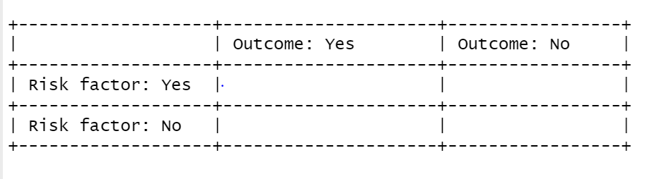

# Relationships with Categorical Variables
#### *Independent and Dependent Variables, T-test, Chi-square* {-}


#### Learning Outcomes: {-}
-	Learn to arrange variables as independent and dependent variables
-	Learn to test for statistical significance in relationships between a categorical variable and one other variable
- Understand how to interpret outputs from t-tests and the chi-square test


#### Today’s Learning Tools: {-}

##### *Total number of activities*: 11 {-}

##### *Data:* {-}
-	British Crime Survey (BCS)

##### *Packages:* {-}
-	`dplyr`
- `effsize`
- `ggplot2`
-	`gmodels`
-	`haven`
-	`here`
-	`skimr`
-	`vcdExtra`


##### *Functions introduced (and packages to which they belong)* {-}
-	`chisq.test()` : Produces the chi-square test (`base R`)
- `cohen.d()` : Computes the Cohen's d and Hedges'g effect size statistics (`effsize`)
-	`CrossTable()` : Produces contingency tables (`gmodels`)
-	`fisher.test()` : Produces Fisher’s exact test (`base R`)
-	`n()` : Count observations within `summarize()`, `mutate()`, `filter()` (`dplyr`)
-	`read_dta()` : Imports a .dta Stata file (`haven`)
-	`t.test()`: Performs one and two sample t-tests on vectors of data (`base R`)
-	`var.test()` : Performs an F-test to compare the variances of two samples from normal populations (`base R`)
-	`with()` : Evaluates an expression, often to specify data you want to use (`base R`)

<br>
<br>


---


## Associating with Categorical Variables


We are familiar with categorical variables. They have a nominal or ordinal level of measurement, and can be binary -- have only two possible values. In `R`, these variables are encoded as a factor class, and for shorthand, are referred to as *factors*. (See Lesson 2, section 2.4.1.1 .) 

In inferential statistics, sometimes we want to make predictions about relationships with factors. For example, we want to understand the relationship between sex and fear of crime. Perhaps we think males will have lower levels of fear of crime than females would have. The variable, sex, in this case, is a binary factor with the two categories, male and female, whereas fear of crime is a numeric variable. 

Today, we learn how to conduct more inferential statistical analyses, but specifically with categorical variables. 

<br>

### Activity 1: Our `R` prep routine

Before we start, we do the following:

1. Open up our existing `R` project

2. Install and load the required packages listed above with exception to `vcdExtra`; the reason is `vcdExtra` will interfere with the package `dplyr` (see Lesson 1, section 1.3.3 on masking):


3. Download from Blackboard and load into `R` the British Crime Survey (BCS) dataset (*bcs_2007_8_teaching_data_unrestricted.dta* ). Be mindful of its data format because it will require certain codes and packages. Name this data frame `BCS0708`. 


4.	Get to know the data with the `View()` function.


<br>
<br>

---


## Today’s 3

We further our understanding of inferential statistics by learning more about variables and a couple of new statistical analyses that examine a relationship with factor variables. Our three topics today are: **independent and dependent variables**, the **t-test**, and the **chi-square**. 


 
---

### Independent and Dependent Variables

When setting hypotheses, we primarily wanted to know whether there was a relationship between certain variables. Inadvertently, we also were arranging our variables in a way that indicated one was the explanation and the other was the outcome. 

Using our previous example on sex and fear of crime, we can arrange them so that sex is the **independent variable** (IV or $X$), indicating that it is presumed to have an impact on the level of fear of crime, the **dependent variable** (DV or $Y$), considered to be influenced by $X$. 

We believe that sex ($X$) has an influence on level of fear of crime ($Y$), and hypothesise, based on previous research, that males will have lower levels of fear of crime than females. We then select a sample, collect our data from that sample, and conduct an appropriate statistical test to find out whether our hypothesis holds. 

<!-- Although independent and dependent variables are not terms usually used for today’s analyses, we will use them to indicate which variable plays the role of explanation and which plays the part of outcome. In addition, it is good to get into the mindset of arranging your variables as such. This helps to clarify how your variables will relate to each other.  -->

An important point to remember is that, although the independent variable (IV) is considered to influence the dependent variable (DV), it *does not mean the IV causes the DV*. We can only arrange these variables in the direction we think is suitable and make statements about whether they are related to or *correlated* with each other. 

This idea of 'cause' is referred to as *causal inference* and is, in itself, a whole area of research, as establishing causal relationships is not an easy task. One approach we have covered and made reference to throughout your data analysis and research methods classes is to use experimental research designs, such as randomised control trials. If you are interested in causal inference, Scott Cunningham's [Causal Inference Mixtape](https://www.scunning.com/mixtape.html) is highly recommended. Nevertheless, for the kinds of analysis we will be doing in this class, it is best to keep in mind that correlation *does not mean* causation. 

<br>
<br>
 
---


### Comparing means: the t-test

When assessing the relationship between a binary, categorical variable and a numeric variable, we usually summarise the numeric variable for each category of the categorical variable in order to compare. For example, we are interested in fear of crime and how levels of it vary between sexes. For this, we have two relevant variables in our data frame `BCS0708`: `sex` and `tcviolent`. Let us have a look: 
<br>


```r
attributes(BCS0708$sex)
```

```
## $label
## [1] "respondent sex"
## 
## $format.stata
## [1] "%8.0g"
## 
## $class
## [1] "haven_labelled" "vctrs_vctr"     "double"        
## 
## $labels
##   male female 
##      1      2
```

```r
# Any missing values?
table(is.na(BCS0708$sex))
```

```
## 
## FALSE 
## 11676
```
<br>

We can see that the first variable, `sex`, takes the values of '1' for 'male' and '2' for 'female'. This variable should be classed as a factor, in `R` speak, so let us recode `sex` so that it is classed as so: 
<br>


```r
# As is, 'sex' is classed as 'haven-labelled', which is incorrect, so we change it to its correct class, factor:
BCS0708$sex <- as_factor(BCS0708$sex)

# Double check that it is now a factor:
attributes(BCS0708$sex) # indeed
```

```
## $levels
## [1] "male"   "female"
## 
## $class
## [1] "factor"
## 
## $label
## [1] "respondent sex"
```
<br>

Now we check out our other variable of interest, `tcviolent`:
<br>


```r
attributes(BCS0708$tcviolent)
```

```
## $label
## [1] "respondent level of worry about being a victim of personal crime (high score = h"
## 
## $format.stata
## [1] "%9.0g"
```

```r
class(BCS0708$tcviolent)
```

```
## [1] "numeric"
```

```r
# Any missing values?
table(is.na(BCS0708$tcviolent)) # Yes, there is!
```

```
## 
## FALSE  TRUE 
##  8434  3242
```
<br>

The variable, `tcviolent`, represents 'respondent level of worry about being a victim of personal crime (high score = high worry)'. This is a numeric variable and measures fear of crime.

<br>

#### Activity 2: Exploring our data with descriptive statistics

Before conducting further tests, let us do some *exploratory data analysis* by getting to know our variables of interest. We use the function `summarise()` to examine the variable `sex` and use the function `n()` to obtain frequencies:
<br>


```r
# Examining distribution of sex variable
BCS0708 %>% group_by(sex) %>% summarise(n = n())
```

```
## # A tibble: 2 x 2
##   sex        n
## * <fct>  <int>
## 1 male    5307
## 2 female  6369
```
<br>


The output displays 5307 males and 6369 females. 

Now for our dependent variable `tcviolent`: we use the `skim()` function from the `skimr` package introduced in Lesson 4:
<br>


```r
# We do not use 'summarise()' because this is a numeric variable
skim(BCS0708, tcviolent)
```


|skim_type |skim_variable | n_missing| complete_rate| numeric.mean| numeric.sd| numeric.p0| numeric.p25| numeric.p50| numeric.p75| numeric.p100|numeric.hist |
|:---------|:-------------|---------:|-------------:|------------:|----------:|----------:|-----------:|-----------:|-----------:|------------:|:------------|
|numeric   |tcviolent     |      3242|     0.7223364|    0.0455821|    1.00436|   -2.35029|  -0.6718318|   -0.116783|     0.53989|     3.805476|▁▇▅▂▁        |

<br>
<br>

Then we get to know the data further by checking out the dependent variable, `tcviolent`, by the independent variable `sex`. Let us now look at the mean, standard deviation, and variance: 
<br>


```r
# We tell R to obtain the three descriptive statistics and 'round' the values to two decimal places

# Remember, we must add 'na.rm = TRUE' as we have missing values or else this will display 'NA'
BCS0708 %>% group_by(sex) %>% 
  summarise(mean_worry = round(mean(tcviolent, na.rm = TRUE),2), 
            sd_worry = round(sd(tcviolent, na.rm = TRUE),2), 
            var_worry = round(var(tcviolent, na.rm = TRUE),2))
```

```
## # A tibble: 2 x 4
##   sex    mean_worry sd_worry var_worry
## * <fct>       <dbl>    <dbl>     <dbl>
## 1 male        -0.27     0.86      0.74
## 2 female       0.33     1.04      1.08
```
<br>

The mean for females is higher than that of males, and we have quite high dispersion too, as indicated by the variance. We observe how scores from `tcviolent` might differ between sexes in the variable `sex`. 


<!--We can do so with the `describeBy` function from the `psych` package, which produces summary statistics by group:
<br>

```r
# Use the with() function too to specify the data frame:
with(BCS0708, describeBy(tcviolent, sex))
```
<br>

From the output, it seems that males have a lower average fear of crime than females do, specifically a difference of a score of 0.602. The difference between the medians is even larger: 0.669. -->

In addition, we can visualise a five-number summary with boxplots (see Lesson 3, section 3.3.3.3):
<br>


```r
ggplot(BCS0708, aes (x = tcviolent, group = sex, fill = sex)) + 
  geom_boxplot() + 
  coord_flip() + 
  theme_bw() 
```

```
## Warning: Removed 3242 rows containing non-finite values (stat_boxplot).
```

<!-- -->
<br>

Note that these descriptive statistics are only about our sample; we actually want to make inferences about our population of interest -- all males and females in England and Wales. So, we use inferential statistics; our observation of a difference between means prompts us to test whether this difference is an actual difference, or if it is attributed to chance.

Hence, our hypothesis is that, in the population, there is a difference in the mean level of fear of crime for males compared to said levels for females. 

<!-- What we want then is a **difference-in-means** estimator. That is, we want to estimate the difference in means between the two groups in our population, from our sample. For this, we can use two-sample tests, based on a difference in means estimator to investigate our null hypothesis that the means are equal between the two populations.  -->

Our non-directional hypothesis has to do with our research question of whether there is a difference in the amount of fear of crime between males and females. As one of our variables of interest is binary, categorical and the other, numeric, we test our hypothesis using the **t-test**, which relies on Student's *t* distribution.

<br>

---

#### Student's *t* distribution

In previous weeks, we used the standard deviation (SD or $s$) of our sample to estimate the standard error (SE or $\sigma$). (See Lesson 5, section 5.2.2 .) This approach works reasonably well when applied to large samples. With small samples, however, using the SD as an estimate of the SE is problematic. 

The reason is that the SD varies from sample to sample, so this variation in smaller samples makes for more uncertainty. In addition, we are likely not to know the true population values, our parameters. For such a case, William Gosset, [Statistician and Head Brewer for Guinness,](https://mathshistory.st-andrews.ac.uk/Biographies/Gosset/) (see also recommended reading) suggested that we needed to use a different probability distribution, **Student's *t* distribution**. 

Gosset had developed this distribution (under his pen name 'Student') so that he could make meaningful predictions using small samples of barley instead of large ones -- a cost-effective method. A small sample is considered to be less than 60 observations, and definitely 30 or less. (The ambiguity of this is because various textbooks have different ideas on what constitutes a 'small sample' but the rule of thumb is n= 30.) 


<!--The *t* distribution and the normal distribution are nearly indistinguishable for large samples. This has implications for, say, the calculation of the margin of error. For large samples, you would still multiply the value (from dividing the SD by the square root of the sample size) by 1.96:

<br>
1.96*{sd}/{\sqrt{n}}$

<br>

With smaller sample sizes, though, that value will differ for different distributions (e.g., z-distribution or a t-distribution).

<br>

> *In order to use the t-distribution, however, we need to assume the data were randomly sampled and that the population distribution is unimodal and symmetric.* 
<br>

In fact, this is probably a good time to engage with our assumptions made by the t-test. -->
<br>

#### Assumptions of the t-test

The t-test makes a number of assumptions, and to use this test, all assumptions should be met:

1. *Two means or proportions will be compared*: our independent variable is binary, signifying two groups, and the dependent variable is a numeric variable (or a binary variable for comparision of proportions, but this requires a large sample size). 

2. *The sampling method was independent random sampling*. We will proceed as if this assumption is met.

3. *Normal distribution is assumed for both populations* (from which the two groups come from): because the t-test makes assumptions about the shape of the distribution, it is considered a **parametric test**. Tests that do not make this assumption about shape are called non-parametric. This assumption, however, can be relaxed if the sample size for both groups are large (and why proportions can be compared).

You may also want to check for outliers by plotting the data. Outliers may distort your results, particularly with smaller samples. All assumptions with the exception of the second one are met. To meet the third assumption, you can check if your data are normally distributed, especially if the sample size(s) is not large, using density plots:
<br>


```r
ggplot(BCS0708, aes(x = tcviolent, fill = sex)) +
  geom_density(alpha = 0.5) +
  theme_bw()
```

```
## Warning: Removed 3242 rows containing non-finite values (stat_density).
```

<!-- -->
<br>

The density plots provide a visual tool for assessing the *unimodality* -- a single, clear peak indicating a most frequent value -- and the symmetry of the distribution.  For now, let us assume that this is adequate to compute the t-test.

4. *The variances of both samples are equal to each other*. We test for this in the next section.
<!--Later, we will discuss a more elaborate graphical tool for assessing the normality, the normal probability plot.The BCS uses a complex survey design which would require the use of special procedures for hypothesis testing. However, those special procedures are well beyond the scope of this course and would typically be covered in more advanced courses. Therefore, for convenience -->

<br>

For an independent sample t-test, however, an additional assumption must be met: 

5. *The two groups must be independent of each other*: This assumption of independence would be violated if, for example, one group comprised women and the other group, their partners. If this were the case, the resulting values for both groups would be connected and misleading. If this assumption is violated, we would need the dependent t-test, which will be covered later.

<br>

#### Independent Sample t-test

<!--In one of this lesson's lecture videos, different types of t-tests were mentioned. One-sample t-tests are not covered in this class, but two other types are: independent (or unpaired) and dependent (or paired) sample t-tests. -->

In our example, we would like to know whether there is a difference between the mean score of fear of crime, as embodied in the variable `tcviolent`, between males and females. Previously, we fulfilled three assumptions for the **independent sample t-test** or *unpaired t-test*. This t-test compares two groups that are independent of one another. It suggests that the values for the dependent variable in one group are not reliant on the values for the dependent variable in the other group. In our case, levels of fear of crime for females and males are not related to one another, so the fifth assumption is met. 

In addition to our research question which asks whether there is a difference in the amount of fear of crime between males and females, our null and alternative hypotheses are:

<br>
$H_0$: There is no significant difference in fear of crime between males and females. 

<br>
$H_A$: There is a significant difference in fear of crime between males and females.

<br>
 
##### Activity 3: Testing for equality of variance

We must meet the fouth assumption by conducting the **test for equality of variance**, also known as **Levene's test**. Conducting this specific test is an important step before the t-test. This is an F-test that evaluates the null hypothesis that the variances of the two groups are equal. When we want to compare variances, we conduct this test as the variances may affect how we specify our t-test. If we *fail* to reject the null hypothesis, then we have met this assumption. 
<br>


```r
# DV comes first in code, then the IV
var.test(BCS0708$tcviolent ~ BCS0708$sex)
```

```
## 
## 	F test to compare two variances
## 
## data:  BCS0708$tcviolent by BCS0708$sex
## F = 0.68886, num df = 3958, denom df = 4474, p-value < 2.2e-16
## alternative hypothesis: true ratio of variances is not equal to 1
## 95 percent confidence interval:
##  0.6484653 0.7318632
## sample estimates:
## ratio of variances 
##          0.6888643
```
<br>

The information to focus on in the output are the alternative hypothesis, the F-statistic, and associated p-value. The alternative hypothesis states that the variances are not equal to 1, meaning they are not equal to each other. Likewise, the p-value is very small, so we reject the null hypothesis that the variances are equal to each other. Thus, we have violated this assumption of equal variances, so we must address this. 

One way to do so, and is familiar to one of the lesson's lecture videos, is to use the `t.test()` function. There, you can specify whether the equality of variance assumption is met. In our case, we must set `var.equal` to `FALSE` in the following independent sample t-test as the assumption is violated. 

<br>
<br>

---

##### Activity 4: Conducting an independent sample t-test

It is now time to carry out our t-test. We use the `t.test()` function, which performs both the one and two sample t-tests on vectors of data. It can also perform paired and independent samples t-tests by modifying the `paired=` argument. We include our independent and dependent variables, separated by a tilda (`~`), and set the `var.equal` argument to `FALSE`:
<br>


```r
# Run the t-test with var.equal option set to false as assumption was violated:
t.test(BCS0708$tcviolent ~ BCS0708$sex, var.equal = FALSE)
```

```
## 
## 	Welch Two Sample t-test
## 
## data:  BCS0708$tcviolent by BCS0708$sex
## t = -29.114, df = 8398.3, p-value < 2.2e-16
## alternative hypothesis: true difference in means is not equal to 0
## 95 percent confidence interval:
##  -0.6425300 -0.5614656
## sample estimates:
##   mean in group male mean in group female 
##           -0.2738322            0.3281656
```

```r
# You can save your results in an object, too, to refer back to later:
t_test_results <- t.test(BCS0708$tcviolent ~ BCS0708$sex, var.equal = FALSE)

# Print independent t-test results 
t_test_results
```

```
## 
## 	Welch Two Sample t-test
## 
## data:  BCS0708$tcviolent by BCS0708$sex
## t = -29.114, df = 8398.3, p-value < 2.2e-16
## alternative hypothesis: true difference in means is not equal to 0
## 95 percent confidence interval:
##  -0.6425300 -0.5614656
## sample estimates:
##   mean in group male mean in group female 
##           -0.2738322            0.3281656
```
<br>

From the output, focus on: the means, alternative hypothesis ($H_A$), the t-statistic, the p-value, and the 95% confidence interval (CI). 

First, the means show that males score an average score of -0.2738322 on this fear of crime measure, while females score an average of 0.3281656 - this is the same output we got from exploring our data previously. 

Second, the alternative hypothesis is not equal to 0, which is what we expect if there is no difference between the two groups. 

Third, the t-statistic reports -29.1142624 with an associated p-value that is much smaller than our $\alpha$ = 0.05, so we reject the null hypothesis that the difference in the population is 0. We can say that there is a *statistically significant* difference between fear of crime for males and females in England and Wales. We can also state that, given the null hypothesis, there is a < .001 chance of observing the difference that we have actually observed (or one more unlikely).

Fourth, the 95% CI allows us to make an estimate of the difference in means in the population. From our sample, we estimate that the difference in fear of crime scores between sexes is somewhere between 0.56 and 0.64 points. 

Is this considered a large or small difference? In many cases, interpreting this is challenging because it can be subjective or the scale that was used to measure the variable is not the original, raw version. To help us answer our question of size difference, we will need to include a measure of effect size.

<br>
<br>

---

##### Activity 5: Considering the effect size- Cohen's *d*


We can always look at **standardised measures of the effect size**. There are a number of them. They aim to give you a sense of how large the difference is by using a standardised metric. The value indicating the strength of relationship is known as the **effect size**, and simply quantifies the magnitude of difference between two variables. 

We will use one of the measures, **Cohen's *d***, for this example. We can obtain it with the `cohen.d()` function from the `effsize` package:
<br>


```r
cohen.d(BCS0708$tcviolent ~ BCS0708$sex)
```

```
## 
## Cohen's d
## 
## d estimate: -0.6281126 (medium)
## 95 percent confidence interval:
##      lower      upper 
## -0.6719205 -0.5843047
```
<br>

Jacob Cohen (inventor of Cohen's *d*) suggested a general guideline to interpret this effect size as an absolute value: 0.2 to 0.3 is considered a 'small' effect; around 0.5, a 'medium' effect; and 0.8 and larger, a 'large' effect. The output suggests that the observed difference is a medium effect size. 

<!--However, keep in mind these rules are not absolute. In some fields of research and in relation to some problems the rules of thumb may be slightly different. You need, in professional practice, to be alert to those nuances by being familiar to the rules that other researchers use in your particular area of work.-->

To communicate the results obtained from our descriptive statistics, the t-test, and Cohen's *d*, we could write something like the following: 

<br>

>'On average, males have a lower score of fear of crime (M=-.27, SD=.86) than females (M= 0.33, SD= 1.04). Using an alpha level of 0.05, this difference was significant (t= -29.11, p <.001) and corresponds to a medium-sized effect (d= -0.63).'

<br>

Communicating this way is similar to the way findings are communicated in the 'Results' section of academic papers.

<!--In your "Conclusions" you would need to discuss what the theoretical or practical implications of this finding are; connecting it to existing theoretical debates. 

One important thing to remember is that when doing hypothesis testing there is always the possibility of error. Our statements are probabilistic. We could be rejecting the null hypothesis when we shouldn't (false positive or Type I error), if we are using an alpha level of .05 this may happen 5% of the time, or we may fail to reject the null hypothesis when we should (false negative or Type II error).-->

<br>
<br>

---

#### Dependent Sample t-test


Previously, we went through the assumptions of an independent sample t-test. If we had violated the fifth assumption, we would need to use the dependent sample t-test instead. But, also, we use this t-test when we are actually interested in comparing means of two groups that are related to each other, the **dependent sample t-test** or *paired sample t-test* is appropriate. What this means is that the responses are paired together because there is a prior connection between them. For example, the same people form both of our groups, where the first group comprises their test scores before an intervention and the second one comprises their test scores after that intervention. The scores are connected to each other because they belong to the same people.

<br>

##### Activity 6: Conducting a dependent sample t-test

Let us create a familiar synthetic data of a hypothetical intervention for at-risk youth in Manchester. We have identified 100 at-risk young people and exposed them to an intervention designed to stop them from reoffending. Both before and after the intervention, though, we ask them to take a test that measures their compliance with the law.
<br>


```r
set.seed(1999) # Ensuring results are the same for you and me

# Making this sythentic data of at-risk youth
df <- data.frame(subject_id = c(1:100, 1:100), # ID for each young person
                 prepost = c(rep("pre", 100), rep("post", 100)), # Whether assessed before or after intervention
                 compliance_score = c(rnorm(100, 30, 10), rnorm(100, 60, 14))) # Test scores
```
<br>

We now have our data frame called `df`, which contains a total of 200 observations (our young people) of their scores on the compliance test taken before and after the intervention. This can be seen as *two waves* of a survey; we compare the behaviours of the young people from Wave 1 to Wave 2 to address the research question: ‘Do the compliance scores of the young people change after our intervention?’ Our non-directional null and alternative hypotheses are as follows:

<br>
 

$H_0$: There is no significant difference in the compliance scores between Wave 1 (pre-intervention) and Wave 2 (post-intervention). 

<br>
$H_A$: There is a significant difference in the compliance scores between Wave 1 (pre-intervention) and Wave 2 (post-intervention). 

<br>
 
As responses from both Waves 1 and 2 are required, cases with missing responses from either will be dropped automatically when our analysis is conducted. Assumptions one to three are met, but how about equality of variance?
<br>


```r
# DV comes first in code, then the IV
var.test(df$compliance_score ~ df$prepost)
```

```
## 
## 	F test to compare two variances
## 
## data:  df$compliance_score by df$prepost
## F = 1.6479, num df = 99, denom df = 99, p-value = 0.01367
## alternative hypothesis: true ratio of variances is not equal to 1
## 95 percent confidence interval:
##  1.108752 2.449111
## sample estimates:
## ratio of variances 
##           1.647864
```
<br>

The p-value is less than $\alpha$ = 0.05. This means that we, again, have unequal variances, so we must specify this in the `var.equal=` argument of the `t.test()` function. We conduct the dependent sample t-test: 
<br>


```r
# Use the variables `prepost` indicating whether the answer is from wave 1 (pre-intervention) or wave 2 (post-intervention) and `compliance_score`, the score the young person achieved on the compliance questionnaire. 

# Specify TRUE for the `paired` option 
t.test(compliance_score ~ prepost, data = df, var.equal= FALSE, paired= TRUE)
```

```
## 
## 	Paired t-test
## 
## data:  compliance_score by prepost
## t = 18.075, df = 99, p-value < 2.2e-16
## alternative hypothesis: true difference in means is not equal to 0
## 95 percent confidence interval:
##  27.38580 34.13993
## sample estimates:
## mean of the differences 
##                30.76287
```
<br>

The results indicate that we can reject the null hypothesis as the p-value is less than $\alpha$ = 0.05. We conclude that there is a significant difference in compliance scores before and after our intervention, between Wave 1 and Wave 2. The mean difference, 95% of time when repeated samples are taken from the population, will be between 27.39 and 34.14 points. On average, compliance scores were 30.76 points higher than before the intervention. What is the magnitude of this difference?

We, again, use Cohen's *d* to find out. As this is a paired t-test, we must conduct it slightly differently than when we did for the independent t-test. We specify the argument `paired= TRUE` and specify what ID it can use to match our participants in the pre- and post- groups (the variable `subject_id`); this is done with the `Subject()` array appended with the `|` operator:
<br>


```r
cohen.d(compliance_score ~ prepost | Subject(subject_id), data = df, paired= TRUE)
```

```
## 
## Cohen's d
## 
## d estimate: 2.798971 (large)
## 95 percent confidence interval:
##    lower    upper 
## 2.121816 3.476126
```

The magnitude of the difference between pre and post test compliance scores is considered a large effect (*d* = 2.799). In addition, 95% of the time, when we draw samples from this population, we would expect the effect size to be between 2.12 and 3.48. Our intervention seems to be associated with increased test scores. But remember: correlation is not causation!

<br>
<br>

---


### Chi-square


The **chi-square statistic** is a test of statistical significance for two categorical variables. It tells us how much the observed distribution differs from the one expected under the null hypothesis. It is based on the **cross-tabulation** (aka crosstabs) or **contingency table**. These appear as a table that simultaneously shows the frequency distributions of two categorical variables that do not have too many levels or categories. 

<!--For this lesson, we are only going to explore **two-way cross-tabulations**, that is, contingency tables where we plot the frequency distribution of two variables at the same time. As we learned during the first week we can get results from R in a variety of ways. You can produce basic tables with some of the core functions in R. However, in order to produce the sort of cross-tabs  we will use, I suggest you install and load the package `gmodels`. This package allows you to produce cross tabulations in a format similar to the one used by commercial statistical packages SPSS and SAS. Since some of you may have some previous experience with SPSS we will use the SPSS format. Cross-tabs with this package are more useful for our purposes than the default you may get with the core R `table()` function.-->
<br>

#### Activity 7: Cross-tabulations

To explore some relationships related to the fear of crime, we return to the BCS data to produce a cross-tabulation of victimisation (`bcsvictim`) and whether the presence of rubbish is common in the area where the respondent lives (`rubbcomm`). According to [*Broken Windows Theory*](https://www.theatlantic.com/magazine/archive/1982/03/broken-windows/304465/), proposed by James Q. Wilson and George Kelling, we should see a relationship between these two variables. 

First, we get to know our variables:
<br>


```r
# Seeing what class these variables are
class(BCS0708$bcsvictim)
```

```
## [1] "haven_labelled" "vctrs_vctr"     "double"
```

```r
class(BCS0708$rubbcomm)
```

```
## [1] "haven_labelled" "vctrs_vctr"     "double"
```

```r
# 0-Not victim of crime; 1-Victim of crime
attributes(BCS0708$bcsvictim) 
```

```
## $label
## [1] "experience of any crime in the previous 12 months"
## 
## $format.stata
## [1] "%8.0g"
## 
## $class
## [1] "haven_labelled" "vctrs_vctr"     "double"        
## 
## $labels
## not a victim of crime       victim of crime 
##                     0                     1
```

```r
# 5-point Likert-scale ranging from 1 (very common) to 4 (not common) 
attributes(BCS0708$rubbcomm)
```

```
## $label
## [1] "in the immediate area how common is litter\\rubbish"
## 
## $format.stata
## [1] "%8.0g"
## 
## $class
## [1] "haven_labelled" "vctrs_vctr"     "double"        
## 
## $labels
##       very common     fairly common   not very common not at all common 
##                 1                 2                 3                 4 
##         not coded 
##                 5
```

```r
# We can change these variables to factors:
BCS0708$bcsvictim <- as_factor(BCS0708$bcsvictim)
BCS0708$rubbcomm <- as_factor(BCS0708$rubbcomm)
```
<br>

Notice that `rubbcomm` ranges from '1' to '4', from 'very common' to 'not at all common'. It would make sense if the numbers reflected, instead, the order of levels from 'not at all common' ('1') to 'very common' ('4') -- from less to more. To re-order the categories/ levels, we use the familiar function `factor()` from Lesson 2:
<br>


```r
# We request for R to change the levels so that it goes from 'not at all common' to 'very common' in the 'levels = c()' argument

# As 'rubbcomm' is a factor, we use the 'factor()' function to specify
BCS0708$rubbcomm <- factor(BCS0708$rubbcomm, levels = c("not at all common", "not very common", "fairly common", "very common"))

# Double check that the levels have been reordered:
attributes(BCS0708$rubbcomm) # Indeed
```

```
## $levels
## [1] "not at all common" "not very common"   "fairly common"    
## [4] "very common"      
## 
## $class
## [1] "factor"
```
<br>

Now we observe any missing values: 
<br>


```r
# If you want the frequency distribution with labels, use ‘as_factor ()’
table(as_factor(BCS0708$bcsvictim))
```

```
## 
## not a victim of crime       victim of crime 
##                  9318                  2358
```

```r
table(as_factor(BCS0708$rubbcomm))
```

```
## 
## not at all common   not very common     fairly common       very common 
##              5463              4154              1244               204
```

```r
# Checking for any missing values using ‘sum ()’ to count number of NA data
sum(is.na(BCS0708$bcsvictim))
```

```
## [1] 0
```

```r
# 611 are indicated as missing
sum(is.na(BCS0708$rubbcomm))
```

```
## [1] 611
```
<br>


For the DV, `rubbcomm`, we are missing 611 observations. For our class, keep in mind that all the statistical tests you will learn rely on **full cases analysis** whereby the tests will exclude observations that have missing values. There are appropriate ways in dealing with missing data but this is beyond the scope of this class. 

<!--There are a couple of ways of producing cross-tabulations in `R`:
<br>


```r
# Basic R
table(as_factor(BCS0708$bcsvictim), 
      as_factor(BCS0708$rubbcomm))

# dplyr
results <- BCS0708 %>% # ‘fct_explicit_na()’ function from the forcats package to get an explicit factor level from our # missing values
  group_by(fct_explicit_na(as_factor(rubbcomm))) %>% 
  # We use the function ‘mean()’ as the variable is binary and because it is coded as 0 and 1.
  summarize( count = n(), outcome_1 = mean(bcsvictim))

# Auto-print the results stored in the newly created object 
results
```


 

The `dplyr` coding seems more complicated than that of `basic R` but its output is clearer to read than the one produced by `R`, and it is more detailed. The proportion of victimised individuals are within each of the levels of the categorical, ordered measure of rubbish in the area. Victimisation appears higher (31%) in the areas where rubbish in the streets is a very common problem. -->

Although, previously, we learned how to obtain contingency tables with the `table()` function from `base R` and with the `dplyr` package, the best package for crosstabs is `gmodels`. It allows you to produce cross-tabulations in a format similar to the one used by commercial statistical packages SPSS and SAS. We use the function `CrossTable ()`, then the `with()` function to identify the data frame at the outset instead of having to include it with each variable (using `$`). 
<br>


```r
# Is the package `gmodels` loaded?

# Define the rows in your table (rubbcomm) and then the variable that will define the columns (bcsvictim)
with(BCS0708, CrossTable(as_factor(rubbcomm), 
                         as_factor(bcsvictim), prop.chisq = FALSE, format = c("SPSS")))
```

```
## 
##    Cell Contents
## |-------------------------|
## |                   Count |
## |             Row Percent |
## |          Column Percent |
## |           Total Percent |
## |-------------------------|
## 
## Total Observations in Table:  11065 
## 
##                     | as_factor(bcsvictim) 
## as_factor(rubbcomm) | not a victim of crime  |       victim of crime  |             Row Total | 
## --------------------|-----------------------|-----------------------|-----------------------|
##   not at all common |                 4614  |                  849  |                 5463  | 
##                     |               84.459% |               15.541% |               49.372% | 
##                     |               52.408% |               37.550% |                       | 
##                     |               41.699% |                7.673% |                       | 
## --------------------|-----------------------|-----------------------|-----------------------|
##     not very common |                 3173  |                  981  |                 4154  | 
##                     |               76.384% |               23.616% |               37.542% | 
##                     |               36.040% |               43.388% |                       | 
##                     |               28.676% |                8.866% |                       | 
## --------------------|-----------------------|-----------------------|-----------------------|
##       fairly common |                  876  |                  368  |                 1244  | 
##                     |               70.418% |               29.582% |               11.243% | 
##                     |                9.950% |               16.276% |                       | 
##                     |                7.917% |                3.326% |                       | 
## --------------------|-----------------------|-----------------------|-----------------------|
##         very common |                  141  |                   63  |                  204  | 
##                     |               69.118% |               30.882% |                1.844% | 
##                     |                1.602% |                2.786% |                       | 
##                     |                1.274% |                0.569% |                       | 
## --------------------|-----------------------|-----------------------|-----------------------|
##        Column Total |                 8804  |                 2261  |                11065  | 
##                     |               79.566% |               20.434% |                       | 
## --------------------|-----------------------|-----------------------|-----------------------|
## 
## 
```
<br>

 

Cells for the central two columns are the total number of cases in each category, comprising the *row percentages*, the *column percentages*, and the *total percentages*. 
The cross-tabulation shows that 63 people in the category ‘rubbish is very common’ were victims of a crime; this represents 30.88% of all the people in the ‘rubbish is very common’ category (your row percent), 2.79% of all the people in the 'victim of a crime' category (your column percent), and 0.57% of all the people in the sample. 

There is quite a lot of proportions that the contingency table will churn out, but you are only interested in the proportions or percentages that allow you to make meaningful comparisons. 
<!--Again, this is where talk about independent and dependent variables come in. Although talking about variables like this is not common in these analyses as they would be, say, in regression, an analysis we learn later, it is good to get into the mindset of arranging our variables in this way.--> 

If you believe in broken windows theory, you will think of victimisation as the outcome we want to explain (dependent variable or $Y$) and rubbish in the area as a possible explanation for the variation in victimisation (independent variable or $X$). If so, you will need to request percentages that allow you to make comparisons across `rubbcomm` for the outcome, `bcsvictim`. 

This is a very **important** point: often, cross tabulations are interpreted the wrong way because percentages were specified incorrectly. Two rules to help ensure you interpret crosstabs correctly:

<br>
 
1.	If your dependent variable is defining the rows, then you ask for the *column percentages*

2.	If your dependent variable is defining the columns, then you ask for the *row percentages*

<br>
 

Also, *you make comparisons across percentages in the direction where they do not add up to a hundred percent*. For example, 30.88% of people who live in areas where rubbish is very common have been victimised, whereas only 15.54% of people who live in areas where rubbish is not at all common have been victimised in the previous year. To make it easier, we can ask `R` to only give us the percentages in that we are interested:
<br>


```r
# prop.c is column and prop.t is total
with(BCS0708, CrossTable(as_factor(rubbcomm), 
                         as_factor(bcsvictim), 
                         prop.chisq = FALSE, prop.c = FALSE, prop.t = FALSE, format =
                           c("SPSS")))
```

```
## 
##    Cell Contents
## |-------------------------|
## |                   Count |
## |             Row Percent |
## |-------------------------|
## 
## Total Observations in Table:  11065 
## 
##                     | as_factor(bcsvictim) 
## as_factor(rubbcomm) | not a victim of crime  |       victim of crime  |             Row Total | 
## --------------------|-----------------------|-----------------------|-----------------------|
##   not at all common |                 4614  |                  849  |                 5463  | 
##                     |               84.459% |               15.541% |               49.372% | 
## --------------------|-----------------------|-----------------------|-----------------------|
##     not very common |                 3173  |                  981  |                 4154  | 
##                     |               76.384% |               23.616% |               37.542% | 
## --------------------|-----------------------|-----------------------|-----------------------|
##       fairly common |                  876  |                  368  |                 1244  | 
##                     |               70.418% |               29.582% |               11.243% | 
## --------------------|-----------------------|-----------------------|-----------------------|
##         very common |                  141  |                   63  |                  204  | 
##                     |               69.118% |               30.882% |                1.844% | 
## --------------------|-----------------------|-----------------------|-----------------------|
##        Column Total |                 8804  |                 2261  |                11065  | 
## --------------------|-----------------------|-----------------------|-----------------------|
## 
## 
```
<br>

Now with this output, we only see the row percentages. **Marginal frequencies** appear as the right column and bottom row. *Row marginals* show the total number of cases in each row. For example, 204 people perceive rubbish as very common in the area where they are living and 1,244 perceive rubbish as fairly common in their area. *Column marginals* show the total number of cases in each column: 8,804 non-victims and 2,261 victims.

In the central cells, these are the total number for each combination of categories. For example, for row percentages, 63 people who perceive rubbish as very common in their area and who are a victim of a crime represent 30.88% of all people who have reported that rubbish is common (63 out of 204). For column percentages (from first crosstab output), 63 people who live in areas where rubbish is very common and are victims represent 2.79% of all people who were victims of crime (63 out of 2,261). 

<br>
<br>

---

#### Acivity 8: Comparing categorical variables with chi-square test

We now have an understanding of crosstabs so that we can interpret the chi-square statistic. Our null and alternative hypotheses are as follows:

<br>

$H_0$: Victimisation and how common rubbish is in the area are not related to each other. (They are considered independent of each other.)
<br>

$H_A$: Victimisation and how common rubbish is in the area are significantly related to each other. (They are considered dependent on each other.)

<br>
 

We use the chi-square test because it compares these expected frequencies with the ones we actually observe in each of the cells; then averages the differences across the cells; and produces a standardised value, *χ*$^2$ (the chi-square statistic).

We then would observe the chi-square distribution to see how probable or improbable this value is. But, in practice, the p-value helps us ascertain this more quickly. 

Crosstabs also can show the different frequencies: **expected frequencies** are the number of cases you would expect to see in each cell within a contingency table if there was no relationship between the two variables -- if the null hypothesis were true. **Observed frequencies** are the cases that we actually see in our sample. We use the `CrossTable ()` function again, specifying that we would like to see expected frequencies by setting `expected = TRUE`: 
<br>


```r
with(BCS0708, CrossTable(as_factor(rubbcomm), 
                         as_factor(bcsvictim), 
                         expected = TRUE, prop.c = FALSE, prop.t = FALSE, format =
                           c("SPSS") ))
```

```
## 
##    Cell Contents
## |-------------------------|
## |                   Count |
## |         Expected Values |
## | Chi-square contribution |
## |             Row Percent |
## |-------------------------|
## 
## Total Observations in Table:  11065 
## 
##                     | as_factor(bcsvictim) 
## as_factor(rubbcomm) | not a victim of crime  |       victim of crime  |             Row Total | 
## --------------------|-----------------------|-----------------------|-----------------------|
##   not at all common |                 4614  |                  849  |                 5463  | 
##                     |             4346.701  |             1116.299  |                       | 
##                     |               16.437  |               64.005  |                       | 
##                     |               84.459% |               15.541% |               49.372% | 
## --------------------|-----------------------|-----------------------|-----------------------|
##     not very common |                 3173  |                  981  |                 4154  | 
##                     |             3305.180  |              848.820  |                       | 
##                     |                5.286  |               20.583  |                       | 
##                     |               76.384% |               23.616% |               37.542% | 
## --------------------|-----------------------|-----------------------|-----------------------|
##       fairly common |                  876  |                  368  |                 1244  | 
##                     |              989.804  |              254.196  |                       | 
##                     |               13.085  |               50.950  |                       | 
##                     |               70.418% |               29.582% |               11.243% | 
## --------------------|-----------------------|-----------------------|-----------------------|
##         very common |                  141  |                   63  |                  204  | 
##                     |              162.315  |               41.685  |                       | 
##                     |                2.799  |               10.899  |                       | 
##                     |               69.118% |               30.882% |                1.844% | 
## --------------------|-----------------------|-----------------------|-----------------------|
##        Column Total |                 8804  |                 2261  |                11065  | 
## --------------------|-----------------------|-----------------------|-----------------------|
## 
##  
## Statistics for All Table Factors
## 
## 
## Pearson's Chi-squared test 
## ------------------------------------------------------------
## Chi^2 =  184.0443     d.f. =  3     p =  1.180409e-39 
## 
## 
##  
##        Minimum expected frequency: 41.68495
```
<br>
 

The output shows that, for example, 63 people lived in areas where rubbish was very common and experienced victimisation in the past year. Under the null hypothesis of no relationship, however, we should have expected 41.69 people (the expected value). Thus, more people are in this cell than we would expect under the null hypothesis. 

The chi-square value is 184.04, with 3 degrees of freedom (df). The df is obtained by the number of rows minus one, then multiplied by the number of columns minus one: (4 − 1)*(2 − 1). 

The p-value associated with this particular value is nearly zero (p = 1.180e-39). This value is considerably lower than $\alpha$ = 0.05. We conclude that there is a significant relationship between victimisation and the presence of rubbish. We reject the null hypothesis.

If you do not want to use `CrossTable()`, you can use `chisq.test()`  to give you only the chi-square value:
<br>
 


```r
chisq.test(BCS0708$rubbcomm, BCS0708$bcsvictim)
```

```
## 
## 	Pearson's Chi-squared test
## 
## data:  BCS0708$rubbcomm and BCS0708$bcsvictim
## X-squared = 184.04, df = 3, p-value < 2.2e-16
```
<br>

<br>

---

#### Fisher's exact test

For the chi-square to work though, it needs to have a sufficient number of cases in each cell. Notice that `R` was telling us that the minimum expected frequency is 41.68. One rule of thumb is that all expected cell counts should be above 5. If we do have a small number in the cells, one alternative is to use **Fisher’s exact test**:
<br>


```r
fisher.test(BCS0708$rubbcomm, BCS0708$bcsvictim)
```


```r
# If you get an error message about increasing the size of your workspace, do so with this code:
fisher.test(BCS0708$rubbcomm, BCS0708$bcsvictim, workspace = 2e+07, hybrid = TRUE)
```

```
## 
## 	Fisher's Exact Test for Count Data hybrid using asym.chisq. iff
## 	(exp=5, perc=80, Emin=1)
## 
## data:  BCS0708$rubbcomm and BCS0708$bcsvictim
## p-value < 2.2e-16
## alternative hypothesis: two.sided
```
<br>

 

We did not need this test for our example, but we use it to illustrate how to use Fisher’s Exact Test when counts in a cell are low (less than five). The p-value from Fisher’s exact test is still smaller than $\alpha$ = 0.05, so we reach the same conclusion that the relationship observed can be generalised to the population. 

In addition, the chi-square statistic only tells us whether there is a relationship between two variables; it says nothing about the strength of relationship or exactly what differences between observed and expected frequencies are driving the results. We will need to conduct further analyses to address these.

<br>

#### Effect size measures related to chi-square 

Now that we can generalise to the population, we want to know the magnitude of the difference or the strength of the relationship. We will look at a few ways to talk about this: one, for differences between the observed and expected frequencies; second, for relationships between an ordinal variable and a binary variable; and third, between two binary variables.  

<br>

##### Activity 9: Residuals

We had observed that there were differences between the observed and expected frequencies. This is called a **residual**. Some differences seem larger than others. For example, there were about 21 more people that lived in areas where rubbish was very common and they experienced more victimisation than what was expected under the null hypothesis. When you see large differences, it is unsurprising to also expect that the cell in question may be playing a particularly strong role in driving the relationship between rubbish and victimisation. 

We are not sure, though, of what is considered a large residual. A statistic that helps address this is the **adjusted standardised residuals**, which behaves like a z-score. Residuals indicate the difference between the expected and observed frequencies on a standardised scale. When the null hypothesis is true, there is only about a 5% chance that any particular standardised residual exceeds 2 in absolute value. 

Whenever you see differences that are greater than the absolute value of 2, the difference between expected and observed frequencies in that particular cell is significant and is driving the results of your chi-square test. Absolute values above 3 are considered convincing evidence of a true effect in that cell:
<br>


```r
# Include argument ‘asresid= TRUE’ to include adjusted standardised residuals
with(BCS0708, CrossTable(as_factor(rubbcomm), as_factor(bcsvictim), expected = TRUE,
                         prop.chisq = FALSE, prop.c = FALSE, prop.t = FALSE, asresid =
                           TRUE, format = c("SPSS") ))
```

```
## 
##    Cell Contents
## |-------------------------|
## |                   Count |
## |         Expected Values |
## |             Row Percent |
## |           Adj Std Resid |
## |-------------------------|
## 
## Total Observations in Table:  11065 
## 
##                     | as_factor(bcsvictim) 
## as_factor(rubbcomm) | not a victim of crime  |       victim of crime  |             Row Total | 
## --------------------|-----------------------|-----------------------|-----------------------|
##   not at all common |                 4614  |                  849  |                 5463  | 
##                     |             4346.701  |             1116.299  |                       | 
##                     |               84.459% |               15.541% |               49.372% | 
##                     |               12.605  |              -12.605  |                       | 
## --------------------|-----------------------|-----------------------|-----------------------|
##     not very common |                 3173  |                  981  |                 4154  | 
##                     |             3305.180  |              848.820  |                       | 
##                     |               76.384% |               23.616% |               37.542% | 
##                     |               -6.436  |                6.436  |                       | 
## --------------------|-----------------------|-----------------------|-----------------------|
##       fairly common |                  876  |                  368  |                 1244  | 
##                     |              989.804  |              254.196  |                       | 
##                     |               70.418% |               29.582% |               11.243% | 
##                     |               -8.494  |                8.494  |                       | 
## --------------------|-----------------------|-----------------------|-----------------------|
##         very common |                  141  |                   63  |                  204  | 
##                     |              162.315  |               41.685  |                       | 
##                     |               69.118% |               30.882% |                1.844% | 
##                     |               -3.736  |                3.736  |                       | 
## --------------------|-----------------------|-----------------------|-----------------------|
##        Column Total |                 8804  |                 2261  |                11065  | 
## --------------------|-----------------------|-----------------------|-----------------------|
## 
##  
## Statistics for All Table Factors
## 
## 
## Pearson's Chi-squared test 
## ------------------------------------------------------------
## Chi^2 =  184.0443     d.f. =  3     p =  1.180409e-39 
## 
## 
##  
##        Minimum expected frequency: 41.68495
```
<br>


The column representing the outcome of interest (victimisation present), shows the adjusted standardised residual is -12.61 for the ‘not at all common’ category. That is the largest residual for the DV. The expected frequency under the null hypothesis in this cell is much higher than that of the observed.

<br>
<br>

---

##### Activity 10: Goodman-Kruskal's Gamma

The residuals suggest that the difference is not trivial. One of the tests discussed in the required reading as a test for effect size is Goodman-Kruskal's Gamma. **Gamma** is a measure of the strength of the relationship between either two ordinal variables or, in this case, between an ordinal variable and a binary variable. 

<!-- Gamma is appropriate for testing the relationship between two categorical ordered variables (ordinal-level variables) or between a categorical ordered variable and a categorical unordered variables with only two levels (a dichotomous variable, such as "victimisation": that only has two levels, you have or you haven't experienced a victimisation). -->

We first install and load the package `vcdExtra` and create an object, `mytable.2`: 
<br>


```r
# Install 'vcdExtra' then load it
library(vcdExtra)
```

```
## Loading required package: vcd
```

```
## Loading required package: grid
```

```
## Loading required package: gnm
```

```
## 
## Attaching package: 'vcdExtra'
```

```
## The following object is masked from 'package:dplyr':
## 
##     summarise
```

```r
# We create a new object in tabular form because the function we use to compute Gamma is table()
mytable.2 <- table(BCS0708$bcsvictim, BCS0708$rubbcomm) 

# Print the content of this object to see that it is simply the crosstab
print(mytable.2)
```

```
##                        
##                         not at all common not very common fairly common
##   not a victim of crime              4614            3173           876
##   victim of crime                     849             981           368
##                        
##                         very common
##   not a victim of crime         141
##   victim of crime                63
```
<br>

We then use the `GKgamma()` function from the `vcdExtra` package to compute Gamma:
<br>
 

```r
# Between the parenthesis, you need to include the object that contains the data
GKgamma(mytable.2) 
```

```
## gamma        : 0.266 
## std. error   : 0.019 
## CI           : 0.229 0.302
```
<br> 

Gamma can take on values ranging from −1 to +1, where: 0 indicates no relationship at all; a negative value indicates a negative relationship; and a positive value, a positive relationship. The closer the value is to either −1 or +1, the stronger the relationship is between variables. 

[De Vaus (2002)](https://www.taylorfrancis.com/books/mono/10.4324/9780203501054/surveys-social-research-david-de-vaus) provides the following rules of thumb for interpreting effect size strength for Gamma:  up to 0.10 (trivial), 0.10 to 0.29 (low to moderate), 0.30 to 0.49 (moderate to substantial), 0.50 to 0.69 (substantial to very strong), 0.70 to 0.89 (very strong), 0.9 and above (near perfect). 

Our output shows that the effect size is positive and low to moderate (Gamma = 0.266): this suggests that the higher levels of `rubbcomm` are associated with the higher values of `bcsvictim`. We see, however, that the percentage of people that experience victimisation is almost the same for those who live in areas where rubbish is fairly common and for those who live in areas where it is very common. That is, once we reach a certain level of rubbish, the risk of victimisation does not go much higher. In situations like this, Gamma is likely underestimating the strength of the relationship.

<!--The larger the absolute value of gamma, the stronger the association. There are not clear rules of thumb in how to interpret Gamma. This value is larger than 0, although closer to 0 than to 1. On those bases, I would say this particular Gamma estimated at .226 indicates an association of modest size. Notice that the confidence interval is provided. So the estimated gamma with an alpha level of 0.05 is estimated to be anywhere between 0.302 and 0.229. If this confidence interval overlapped with 0 we could not reject the null hypothesis.Gamma, however, assumes a "linear" relationship, more in one of the variables, more in the other (for positive relationships), less in one, more in the other (for negative relationships). -->

<br>
<br>

---

##### Activity 11: Odds ratios

To estimate the effect size between two binary variables are **odds ratios** (ORs). If you have knowledge of betting, you may already know a bit about odds. For this example, we are interested in the relationship between victimisation (`bcsvictim`) and living in a rural or urban area (`rural2`): 
<br>


```r
# Getting to know our data
attributes(BCS0708$rural2)
```

```
## $label
## [1] "type of area 2004: urban/rural"
## 
## $format.stata
## [1] "%8.0g"
## 
## $class
## [1] "haven_labelled" "vctrs_vctr"     "double"        
## 
## $labels
## urban rural 
##     1     2
```

```r
# Change into a factor
BCS0708$rural2 <- as_factor(BCS0708$rural2)

# We generate crosstabs and conduct the chi-square analysis
with(BCS0708, CrossTable(rural2, bcsvictim, prop.c = FALSE, prop.t = FALSE, expected = TRUE, format = c("SPSS")))
```

```
## 
##    Cell Contents
## |-------------------------|
## |                   Count |
## |         Expected Values |
## | Chi-square contribution |
## |             Row Percent |
## |-------------------------|
## 
## Total Observations in Table:  11676 
## 
##              | bcsvictim 
##       rural2 | not a victim of crime  |       victim of crime  |             Row Total | 
## -------------|-----------------------|-----------------------|-----------------------|
##        urban |                 6757  |                 1945  |                 8702  | 
##              |             6944.607  |             1757.393  |                       | 
##              |                5.068  |               20.028  |                       | 
##              |               77.649% |               22.351% |               74.529% | 
## -------------|-----------------------|-----------------------|-----------------------|
##        rural |                 2561  |                  413  |                 2974  | 
##              |             2373.393  |              600.607  |                       | 
##              |               14.830  |               58.602  |                       | 
##              |               86.113% |               13.887% |               25.471% | 
## -------------|-----------------------|-----------------------|-----------------------|
## Column Total |                 9318  |                 2358  |                11676  | 
## -------------|-----------------------|-----------------------|-----------------------|
## 
##  
## Statistics for All Table Factors
## 
## 
## Pearson's Chi-squared test 
## ------------------------------------------------------------
## Chi^2 =  98.52709     d.f. =  1     p =  3.206093e-23 
## 
## Pearson's Chi-squared test with Yates' continuity correction 
## ------------------------------------------------------------
## Chi^2 =  98.00261     d.f. =  1     p =  4.178318e-23 
## 
##  
##        Minimum expected frequency: 600.6074
```
<br>

Of those living in urban areas (n= 8,702), 22% reported being a victim of crime in the previous year compared to 14% of those living in rural areas (n = 2,974). The chi-square has a p-value of < 0.001, suggesting a statistically significant relationship between living in urban areas and crime victimisation. But, of course, how large is this relationship? We use the OR to find out.

Before we do so, we need to match the levels of our variables to this type of cross-tabulation:

<br>
<br>




<br>
<br>

ORs are commonly used in Public Health, and were introduced in criminology in 1992 by David Hawkins and Richard Catalano. Now, they are used frequently in studies involving the risk factor prevention paradigm, a major component of Developmental and Life Course Criminology.

To compute ORs, they require the variables to correspond to a 2x2 table whereby the independent variable is considered the 'risk factor' and the dependent variable is the 'outcome'. Presence of outcome and risk factor intersect ('Yes') at the left hand corner. To ensure our variables correspond to this 2x2 table, we first have a look at their level ordering:
<br>

<!--In this tradition researchers place the disease/condition defining the columns and the treatment or risk factor defining the rows and they do so in such a way that the first cell correspond to the intersection of the outcome and the risk factor. And the software that computes odd ratios tends to assume this is how your table is set up. So, whenever you are after the relative risks or odd ratios (that is, whenever you work with a 2X2 table) you should laid the table like this as well. It will help interpretation:
Our table was set up in such a way that the rows are defined by our "risk factor" and the columns by our outcome. But the first cell represents the intersection of the presence of the risk factor and the absence of the outcome. The easiest way to sort this out is to change the order of the levels in our factor variable identifying the outcome ("bcsvictim"). If we ask R to print the levels of the bcsvictim variable we will see that they are as follow:-->


```r
print(levels(BCS0708$bcsvictim))
```

```
## [1] "not a victim of crime" "victim of crime"
```

```r
print(levels(BCS0708$rural2))
```

```
## [1] "urban" "rural"
```
<br>

We will need to reverse the ordering of the levels in the variable `bcsvictim` so that 'victim of crime' appears as the first level like `urban` in the variable `rural2`:
<br>


```r
# We recommend that you make a duplicate variable with a different name and the changes, so the original remains (sometimes we do not follow our own advice)
BCS0708$bcsvictimR <- factor(BCS0708$bcsvictim, levels= c("victim of crime", "not a victim of crime"))

print(levels(BCS0708$bcsvictimR))
```

```
## [1] "victim of crime"       "not a victim of crime"
```

```r
# Just double-checking:
table(BCS0708$bcsvictimR)
```

```
## 
##       victim of crime not a victim of crime 
##                  2358                  9318
```

```r
table(BCS0708$bcsvictim)
```

```
## 
## not a victim of crime       victim of crime 
##                  9318                  2358
```
<br>

We can now rerun the previous cross tabulation but with the victim variable `bcsvictimR` to verify that it resembles that 2x2 table:
<br>


```r
with(BCS0708, CrossTable(rural2, bcsvictimR, prop.c = FALSE, prop.t = FALSE, expected = TRUE, format = c("SPSS")))
```

```
## 
##    Cell Contents
## |-------------------------|
## |                   Count |
## |         Expected Values |
## | Chi-square contribution |
## |             Row Percent |
## |-------------------------|
## 
## Total Observations in Table:  11676 
## 
##              | bcsvictimR 
##       rural2 |       victim of crime  | not a victim of crime  |             Row Total | 
## -------------|-----------------------|-----------------------|-----------------------|
##        urban |                 1945  |                 6757  |                 8702  | 
##              |             1757.393  |             6944.607  |                       | 
##              |               20.028  |                5.068  |                       | 
##              |               22.351% |               77.649% |               74.529% | 
## -------------|-----------------------|-----------------------|-----------------------|
##        rural |                  413  |                 2561  |                 2974  | 
##              |              600.607  |             2373.393  |                       | 
##              |               58.602  |               14.830  |                       | 
##              |               13.887% |               86.113% |               25.471% | 
## -------------|-----------------------|-----------------------|-----------------------|
## Column Total |                 2358  |                 9318  |                11676  | 
## -------------|-----------------------|-----------------------|-----------------------|
## 
##  
## Statistics for All Table Factors
## 
## 
## Pearson's Chi-squared test 
## ------------------------------------------------------------
## Chi^2 =  98.52709     d.f. =  1     p =  3.206093e-23 
## 
## Pearson's Chi-squared test with Yates' continuity correction 
## ------------------------------------------------------------
## Chi^2 =  98.00261     d.f. =  1     p =  4.178318e-23 
## 
##  
##        Minimum expected frequency: 600.6074
```
<br>

ORs are about odds: it is the ratio of two odds -- the odds of having the outcome for when the 'risk factor' is present and when it is not. For example, the odds of victimisation for urban dwellers is calculated as the number of victimised urban dwellers (1,945) divided by the number of non-victimised urban dwellers (6,757). Therefore, there are 0.2878496 victimised urban dwellers for every non-victimised urban dweller. The odds of victimisation for rural dwellers is calculated as the number of victimised rural dwellers (413) divided by the number of non-victimised rural dwellers (2,561). Thus, there are 0.1612651 victimised rural dwellers for every non-victimised rural dweller.

<!--the *risk* is the probability of the 'outcome' occurring. From our example, the risk of victimisation for urban dwellers is simply the number of victimised urban dwellers (1945) divided by the total number of urban dwellers (8702). This is .2235. Similarly we can look at the risk of victimisation for people living in rural areas: the number of victimised countryside residents (413) divided by the total number of residents in rural areas (2974).  This is .1388. The **relative risk** is simply the ratio of these two risks. In this case this yields 1.60. This suggests that urban dwellers are 1.60 times more likely to be victimised than people who live in rural areas.-->

The OR of victimisation for urban dwellers to rural residents is 1.78 (0.2878496/ 0.1612651). This means that the odds of victimisation are 1.78 times higher for urban dwellers than it is for those in rural areas. 

We use `R` to obtain the OR directly with the `vcd` package (it may already be loaded because sometimes it accompanies the package `vcdExtra`): 
<br>


```r
library(vcd)

mytable.3<-table(BCS0708$rural2, BCS0708$bcsvictimR)

# This produces the OR for the table data in the object called 'mytable.3'
# `stratum` option clarifies your data are not stratified
#`log=FALSE` requests an ordinary OR
oddsratio(mytable.3, stratum = NULL, log = FALSE) 
```

```
##  odds ratios for  and  
## 
## [1] 1.784947
```
<br>

<!--The  `oddsratio` function here is . The `log=FALSE` requests an ordinary odds ratio and the `stratum` option clarifies your data are not stratified.

What would happen if rather than using the recoded variable ("bcsvictimR") we use the original one?


```r
mytable.4<-table(BCS0708$urban, BCS0708$bcsvictim)
print(mytable.4)
oddsratio(mytable.4, stratum = NULL, log = FALSE)
```

What's going on? Why do we have a different value here? If you look at the cross tab you should be able to understand. R is now computing the odd ratio for "not being a victim of a crime" (since this is what defines the first column). When an odds ratio is below 1 is indicating that the odds in the first row ("urban") are lower than in the second row ("rural"). Living in urban areas (as contrasted with living in rural areas) reduces the likelihood of non-victimisation.-->

Do keep in mind that ORs cannot take on negative values. If the OR is greater than 1, that means that the presence of the risk factor increases the chances of the outcome relative to the absence of that risk factor. 

If the OR were between '0'and '1', that would mean the opposite: the presence of the 'risk factor' reduces the chances of the outome relative to the absence of said factor. 
A value of '1' means that there is no relationship between the two variables -- the odds are the same for both groups.

As the OR is about odds, you cannot state that urban dwellers are 1.78 *more likely* to be victimised. All you can state with an OR is that the *odds* of being victimised are 1.78 times higher for urban dwellers than for residents in rural areas. Odds and probabilities are different things. 

If you are still uncertain about these concepts, and it is normal to feel that way, have a look at [this video](https://www.youtube.com/watch?v=nFHL54yOniI).

<!--it may help to see an oral presentation of these ideas with a different example.  Repeated practice will make it easier to understand. The fact that the interpretation of these quantities is contingent in the way we have laid out our table makes it particularly advisable to hand calculate them as explained above in relation to the outcome you are interested until you are comfortable with them. This may help you to see more clearly what you are getting and how to interpret it. When looking at the R results for odd ratios just always keep in mind that you are aware of what are the reference categories (what defines the first column and the first row) when reading and interpreting odd ratios. The R function we introduced will always give you the odds ratio for the event defined in the first column and will contrast the odds for the group defined by the first row with the odds defined by the second row. If the odds ratio is between 0 and 1 that would mean the odds are lower for the first row, if the odds is greater than 1 that would mean the odds are higher for the second row.

It is also very important you do not confuse the relative risk (a ratio of probabilities) with the odds ratio (a ratio of odds). Be very careful with the language you use when interpreting these quantities.

Odd ratios are ratios of odds, not probability ratios. -->

Last, these values must be interpreted carefully. You will often see media reports announcing things like 'chocolate consumption will double your risk of some $*insert~ terrible~ disease*$'. What that means is that the percentage of cases of individuals that take chocolate (the 'risk factor') and present the outcome is twice as large as those that do not take chocolate but present the outcome. Yet the probabilities could be very low to start with, so such proclamations can be very misleading (see Figure 7.2).

<br>


<br>
<br>


---


## SUMMARY


We learned a few inferential statistical analyses to examine relationships with categorical variables, known as **factors** in `R`. These variables, in today’s analyses, were arranged as **independent variables** or **dependent variables**. When analysing a relationship between a categorical and a numeric variable, the t-test was used. We learned to conduct **independent sample** and **dependent sample** t-tests. 

Before we performed the former t-test, a **parametric test**, we conducted the **test for equality of variance**. We also learned about effect size with **Cohen's d**. In the latter section, we learned to conduct a chi-square test, a test of statistical significance between two categorical variables. This involved **contingency tables** or **cross tabulations** (crosstabs). 

The chi-square statistic contrasts **expected** and **observed frequencies** in the crosstab. When counts in any one cell is lower than five, **Fisher’s Exact Test** is used instead. To obtain effect sizes related to the chi-square, we learned to use the **adjusted standardised residuals** to identify which contrast of frequencies are driving the observed results. We, too, learned about effect size with **Gamma** and **Odds Ratios**.

<br>
<br>
 

Homework time!

 <br>
 
 <br>
 
 <br>
