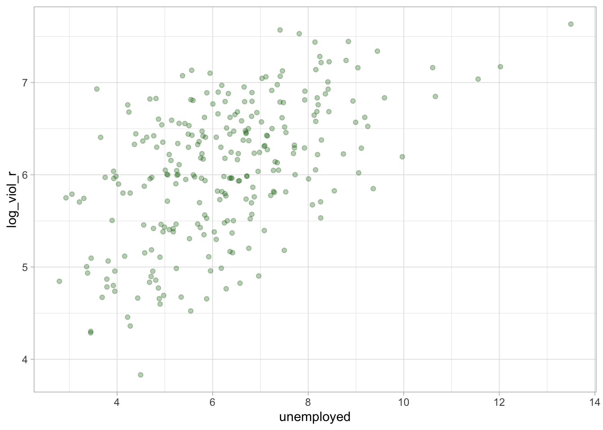

# (More) On Effect Sizes 
#### *Correlations & Power Analysis* {-}


#### Learning Outcomes: {-}
- Explore relationships between two numeric variables 
- Learn to calculate effect sizes for correlations
- Understand statistical power
- Conduct post and pre - hoc power analyses


#### Today’s Learning Tools: {-}

##### *Total number of activities*: 6 {-}


##### *Data:*{-}
- Patrick Sharkey’s data
- Seattle Neighborhoods and Crime Survey


##### *Packages:*{-}
-	`dplyr`
-	`ggplot2`
- `haven`
- `here`
-	`tibble`
- `pwr`


##### *Functions introduced (and packages to which they belong)*{-}
-	`add_row()` : Adds rows to a data frame (`tibble`)
-	`cor()` : Produces the correlation of two variables (`base R`)
-	`cor.test()` : Obtains correlation coefficient (`base R`)
-	`rm()` : Removes an object from the `R` environment (`base R`)
- `ES.w2()`: Computes effect size w for a two-way probability table (`pwr`)
- `pwr.chisq.test()` : Computes power of a test or determines estimates to obtain target power (`pwr`)

<!-- -	`CramerV()` : Conducts the Cramer’s V measure of association (`DescTools`)
-	`Phi()` : Conducts the phi measure of association (`DescTools`)
-	`SomersDelta()` : Conducts the Somers’ D measure of association (`DescTools`)-->
<br>
<br>


---


## Measures of Association: A Continuation

To date, we have learned ways of measuring whether there is a relationship between variables. These are known as *bivariate analyses*, which involve two variables. If a relationship exists, as indicated by tests of statistical significance, it means that the value of the independent variable (IV) can be used to predict the value of the dependent variable (DV). 

We also learned to test how *strong* these associations between variables were. This is known as the *effect size*, and simply quantifies the magnitude of difference between two variables. Instead of merely addressing the question ‘Is there a relationship or not?’, the effect size addresses the question ‘To what extent is this relationship generalisable?’ We were recently introduced to some measures of effect sizes such as Cohen's *d* and the odds ratio (OR). 

<!--In crime and criminal justice research, not only are we interested in whether there is a relationship between variables, but also we are interested in the size of that relationship. Knowing the strength of the relationship is useful because it indicates the size of the difference.This lesson we will consider a few more measures. -->

Today, we learn more measures of effect size, specifically that of relationships between two numeric variables. These are known as measures of **correlation**. 

In addition, throughout our class, there was repeated mention of a 'large sample size' - that a number of assumptions for certain statistical tests could be relaxed if the sample size was 'large enough', but it was not clear what was meant by 'large'. For this lesson, we learn to assess whether our sample size is (large) enough using **power analysis**. 

<br>

### Activity 1: The `R` prep routine

We begin by:

1. Opening our usual `R` project

2. Install and load the required packages


3. Load Professor Patrick Sharkey’s dataset ( 'sharkey.csv' ), which is a study on the effect of nonprofit organisations on the levels of crime, using the `read_csv()` function. Alternatively, you can load the dataset from the [Dataverse website](https://dataverse.harvard.edu/dataset.xhtml?persistentId=doi:10.7910/DVN/46WIH0).

4. Name the data frame `sharkey`, and if you dislike scientific notation, you can turn it off in `R` by typing and running `options(scipen=999)`.


5. Get to know the data by using the functions `View()` and `dim()` and to see if it has been loaded successfully


<br>
<br>


---


## Today’s 2 (!)


Our two topics are **correlations** where we explore the relationship between numeric variables and how to interpret them; and **power** where we learn about power analyses for estimating sample sizes. 


<!--
### Effect sizes for relationships between with categorical variables 

Following last week’s lesson on the chi-square analysis, the effect size for the relationship between two categorical variables can be conducted after obtaining the *χ*2 statistic. A number of measures are available to test *how related* the two variables are to each other. We learn three of them: *phi*, *Cramer’s V*, and *Goodman and Kruskal’s lambda and tau*.


#### Activity 1:  Phi


This measure builds directly off of the chi-square statistic, but it is for the strength of association between two *binary* variables. It is used for 2×2 tables to obtain a measure of association ranging from 0 to 1, whereby higher values indicate a stronger relationship. 
What this measure does is account for the sample size under observation, as the chi-square statistic is influenced by it. We obtain the **phi** coefficient by dividing the chi-square value by the sample size and taking the square root of that result, but we can do this in `R`. For example, we would like to know whether there is a relationship between sex and reporting victimisation to the police, and what is the strength of that relationship. We obtain the relevant variables, then conduct a chi-square analysis and obtain the phi coefficient:


```r
# Create copies of the variables, rename them so it is easier to remember 
# sex is variable ‘QDEM3’
table(seattle_df$QDEM3)
# Use factor () function to create factor variable ‘sex’
seattle_df$sex <- factor(seattle_df$QDEM3, levels = c(1, 2), labels = c("female" ,
                                                                        "male"))

# Reported victimisation to police is ‘Q58E’
table(seattle_df$Q58E)
# Use factor () function to create factor variable ‘reported_to_police’
seattle_df$reported_to_police <- factor(seattle_df$Q58E, levels = c(0, 1), labels =
                                          c("no" , "yes"))

# Chi-square analysis 
# Place variable objects into new object ‘chi’
chi<-table(seattle_df$sex, seattle_df$reported_to_police) 
# Make sure the relationship is significant first
chisq.test(chi)
# Chi-square is significant ( p= 0.01588)

# Calculate the phi coefficient 
Phi(seattle_df$sex, seattle_df$reported_to_police)
```


The phi value is about 0.1, and as the range is 0 to 1, it seems that this value is closer to 0 than it is to 1. We conclude that this is a weak association between a respondent’s sex and whether they reported their victimisation to the police. 


---


#### Activity 2: Cramer’s V


For tables that are larger than 2x2, meaning these categorical variables are not binary, **Cramer’s V** is appropriate (although using Cramer’s V on a 2x2 table will produce the same value as that of the phi coefficient). Interpreting this value is similar to phi: a range from 0 to 1 with higher values indicating a stronger relationship. An advantage of Cramer’s V is that it is not swayed by sample size, so if you had suspected that the chi-square statistic was the result of a large sample size, this value can help determine that:


```r
# Cramer's V test for the same relationship detailed above to show that it is exactly like phi: 
CramerV(seattle_df$sex, seattle_df$reported_to_police)

# Now for non-binary variable, Q52, ‘How often do you worry about being attacked in your neighbourhood’

# Checking it out
table(seattle_df$Q52)

# Make a copy of the Q52 variable 
seattle_df$worry_attacked <- factor(seattle_df$Q52, levels = c(1, 2, 3, 4), labels =
                                      c("Less than once a month" , "once a month",
                                        "about o nce a week", "everyday"))

# Run a chi-square test to make sure there is a significant relationship 
# Save the result in the object "chi2" 
chi2 <- table(seattle_df$worry_attacked, seattle_df$sex) 
chisq.test(chi2)

# Conduct the Cramer's V test of association on the contingency table 
# You can use the object ‘chi2’ for convenience 
CramerV(chi2)
```


Like the phi, the value shows a relatively small relationship between residents’ sex and how often they worry about being attacked in their neighbourhood.


In some common situations in crime and criminal justice research, we work with survey data that have ordered response categories. For example, a likert scale of how strongly someone feels about abolishing the death penalty. 

We learn two measures that deal with relationships between categorical, ordinal variables: Goodman-Kruskal's Gamma and Somers’ D. Both use concordant and discordant pairs of observations to estimate the effect size. **Concordant pairs** are observations where the rankings are consistent for both variables, and **discordant pairs** are observations whose rankings are inconsistent for both variables. If a pair of observations has the same rank on the variables of interest, they are considered a **tied pair**. 


---


#### Activity 3: Goodman-Kruskal Gamma


**Gamma** can take on values ranging from −1 to +1, where: 0 indicates no relationship at all; a negative value indicates a negative relationship; and a positive value a positive relationship. The closer the value is to either −1 or +1, the stronger the relationship is between variables. 

For this example, we test the association between two measures commonly used to gauge community informal social control. The first variable, `Q20A`, is based on a survey question asking respondents how likely it is that their neighbours would do something about a group of neighbourhood children skipping school. The second variable, `Q20B`, asks respondents how likely it is that neighbours would do something if children were spray painting graffiti on a neighbourhood building. 


```r
# First, check and recode your variables if necessary 
table(seattle_df$Q20A)

# Recode Q20A- check the codebook on the variable's ranking
seattle_df$intv.truancy <- factor(seattle_df$Q20A, levels = c(1, 2, 3, 4), labels =
                                    c("very likely" , "likely", "unlikely", "very unlikely"))

# Review everything was coded correctly 
table(seattle_df$intv.truancy)
class(seattle_df$intv.truancy)

# Now do the same for the graffiti variable 
table(seattle_df$Q20B)
seattle_df$intv.graff<- factor(seattle_df$Q20B, levels = c(1, 2, 3, 4), labels =
                                 c("very likely" , "likely", "unlikely", "very unlikely")) 

table(seattle_df$intv.graff)
class(seattle_df$intv.graff)

# Assess the relationship between these two variables 
GoodmanKruskalGamma(seattle_df$intv.truancy, seattle_df$intv.graff, conf.level = .95)

# We can also run it using a table saved as an R object 
x <- table(seattle_df$intv.truancy, seattle_df$intv.graff) 
gamma_neighbor_intervene <- GoodmanKruskalGamma(x, conf.level = .95)
```


We specified the `conf.level` option and get a 95% confidence interval around the gamma coefficient. The value we receive is 0.63, which, in addition to the confidence interval that does not overlap with 0, indicates a fairly strong statistically significant and positive association between the two variables.


---


#### Activity 4: Somers’ D


**Somer’s D** provides a value between −1 and +1, whereby values closer to −1 and +1 indicate better prediction ability. This commonly used measure for ordinal variables indicates how much improvement in the prediction of the dependent variable is attributed to information we know from the independent variable. 

We use the `SomersDelta` function from the `DescTools` package to conduct Somers’ D. We examine the relationship between the respondents’ perception of their neighbour’s willingness to exert informal social control and how likely the respondent would miss their neighbourhood if they moved away (`Q7`):


```r
# Recode the variable Q7 
seattle_df$miss_neigh <- factor(seattle_df$Q7, levels = c(1, 2, 3, 4), labels = c("very likely" , "likely", "unlikely", "very unlikely")) 

# Check our newly coded variable 
table(seattle_df$miss_neigh)

# To run Somers' D, first save the contingency table in the R object "z" 
z <- table(seattle_df$intv.graff, seattle_df$miss_neigh) 

# Now run the Somers' D measure 
# ‘direction’ tells R which variable should be considered the IV
# It defaults to row, so if you excluded this option, the function would still provide you with a value
SomersDelta(z, direction = "row", conf.level = 0.95)
```


Somers’ D is positive, but close to 0, meaning that perception of neighbours’ willingness to intervene is a poor predictor of how much respondents would miss their neighbourhood if they moved. The confidence interval around the estimate does not overlap with 0 meaning that the association is statistically significant, even though the association is weak. 


-->

---


### Correlations


This section is about measuring the strength of relationship between two ratio/ interval variables. 

With our data frame, `sharkey`, we focus on the year 2012, the most recent year, and on only a couple of select variables. We will place them in a new data frame named `df`. To do this, we will use the `filter()` and `select()` functions from the `dplyr` package. (See Lesson 2, section 2.4.3 on subsetting.) Then, we will remove the `sharkey` data frame from `R` using the `rm()` function.
<br>


```r
# We only want data from the year 2012 in our new data frame  `df`
df <- filter(sharkey, year == "2012") 

# For our new data frame, we want only the following two variables
df <- select(df, unemployed, log_viol_r) 

# Goodbye sharkey
rm(sharkey)
```
<br>

<!--# For our new data frame, we want only the following nine variables
df <- select(df, place_name, state_name, black, lesshs, unemployed, fborn,
             incarceration, log_viol_r, largest50)- `place_name`: US city located in each of the 44 US states
- `state_name`: name of US state
- `black`: percentage of the black population 
- `lesshs`: percentage without a high school degree
- `fborn`: percentage of those who are foreign born - `incarceration`: incarceration rate - `largest50`: whether the city is one of the 50 largest cities in the USA (‘1’)--> 
The variables we now have contain information of cities in 44 US states on:

- `unemployed`: percentage of those who are unemployed 
- `log_viol_r`: violence rate 

<br>


#### Activity 2: Identifying a linear relationship 

We are interested in whether there is a relationship between unemployment and violence. First, we must examine our bivariate relationship through a scatterplot. We do this to ascertain if our variables of interest have a *linear relationship*, which determines what statistical test we will need to use. 

The extent to which two variables move together is called **covariation**: if one variable moves up and so does the other, this is referred to as a *positive linear relationship*; if one variable moves down while the other moves up, this is known as a *negative linear relationship*.

We create a scatterplot between our independent variable, unemployment (`unemployed`), and our dependent variable, the log of the violence rate (`log_viol_r`), using the `ggplot()` function in the `ggplot2` package:

<br>


```r
ggplot(df, aes(x = unemployed, y = log_viol_r)) + 
  geom_point(alpha=.3, colour= "dark green", position="jitter") + # Jitter adds a little random noise; this makes points less likely to overlap one another in the plot
  theme_light()
```



<br>

Does it look as if US cities that have a high score on unemployment on the x-axis also have a high score on violent crime on the y-axis? Type out your observations on the google doc and then look below to compare your answer:

<br>

<br>

<br>

It is hard to see whether there is a linear relationship, but there is a trend: American cities with more unemployment seem to have more violence. Notice, for example, how at high levels of unemployment, there are places with high levels of violence.

<br>
<br>

---

#### Pearsons's Correlation

As there is a linear relationship, we conduct a **Pearson’s correlation** test. This test tells you whether the two variables are significantly related to one another – whether they covary. A p-value is provided to determine this. Also provided is a Pearson’s *r* value, which indicates the strength of the relationship between the two variables. The value of *r* ranges from −1 (a negative linear relationship) to 1 (a positive linear relationship). Values that are closer to 1 or −1 suggest a stronger relationship. 

The test calculates the Pearson's *r* by, first, examining the extent to which each observation deviates from the mean of each of the two variables, and then multiplies these deviations with each other to obtain the covariation of scores:

<br>

$covariation~ of ~scores =	\sum_{i=1}^{n} (x_{1i} - \bar{x_1})(x_{2i} - \bar{x_2})$

<br>

Second, it standardises the covariation by taking the square root of the value obtained from the sums of squared deviations from the mean of both variables. Standardising is necessary because, sometimes, the variables may use different units of measurement from each other. For example, one variable measures in inches and the other variable measures in decades. 

Thus, Pearson's *r* is the ratio between the covariation of scores and this standardisation of covariation:

<br>

$Pearson's~ r = \frac{\sum_{i=1}^{n} (x_{1i} - \bar{x_1})(x_{2i} - \bar{x_2})}{\sqrt{[\sum_{i=1}^{n} (x_{1i}- \bar{x_1})^2][\sum_{i=1}^{n} (x_{2i}- \bar{x_2})^2]}}$

<br>


Our null and alternative hypotheses are as follows:

<br>

$H_0$: There is no correlation between unemployment and the violence rate. 

$H_A$: There is a correlation between unemployment and the violence rate.

<br>

<br>
<br>


---

#### Activity 3: Pearson's correlation in `R`

We use the `cor()` function and `cor.test` from `base R` to conduct a Pearson’s correlation:

<br>


```r
# This gives us the value of Pearson's r 
cor(df$log_viol_r, df$unemployed)
```

```
## [1] 0.5368416
```

```r
# This supplies the p-value and 95% confidence interval
cor.test(~ log_viol_r + unemployed, data=df, method = "pearson", conf.level = 0.95)
```

```
## 
## 	Pearson's product-moment correlation
## 
## data:  log_viol_r and unemployed
## t = 10.3, df = 262, p-value < 0.00000000000000022
## alternative hypothesis: true correlation is not equal to 0
## 95 percent confidence interval:
##  0.4449525 0.6175447
## sample estimates:
##       cor 
## 0.5368416
```
<br>


The `cor()` function gives the correlation but `cor.test()` gives more detail. Both give a positive correlation of 0.54. The coefficient is also an indication of the strength of the relationship. Returning to Jacob Cohen (1988), he suggested that within the social sciences, a correlation of 0.10 may be defined as a small relationship; a correlation of 0.30, a moderate relationship; and a correlation of 0.50, a large relationship.

As our relationship was linear and our results are statistically significant, we reject the null hypothesis. We conclude that the higher the level of unemployment, the higher the rate of violence - this relationship can be generalisable to the population of US cities.

<br>
<br>

----


#### Activity 4: Nonparametric correlation tests


What about bivariate relationships where linearity is not met? This would call for either **Kendall’s tau** or **Spearman’s rho** (or correlation), nonparametric versions of Pearson’s correlation. Kendall’s tau is more accurate when you have a small sample size compared to Spearman’s rho. 

We add some (purposive) excitement in our next example by adding an outlier so the relationship is no longer linear. We use the function `add_row()` from the `tibble` package. This will produce a fictitious city with a very high level of unemployment and the lowest level of violence. First, we create another data frame, `df_1`, that only contains our two variables of interest.

<br>


```r
# For convenience, we further reduce the number of variables and place in a new data frame
df_1 <- select(df, unemployed, log_viol_r) 

# Adding that fake outlier to make the relationship non-linear
df_1 <- add_row(df_1, unemployed = 20, log_viol_r = 1)
```
<br>

We again use the function `cor.test()` to conduct the nonparametric correlations:
<br>

```r
# Conducting a Kendall
cor.test(~ log_viol_r + unemployed, data=df_1, method = "kendall", conf.level = 0.95)
```

```
## 
## 	Kendall's rank correlation tau
## 
## data:  log_viol_r and unemployed
## z = 8.3925, p-value < 0.00000000000000022
## alternative hypothesis: true tau is not equal to 0
## sample estimates:
##      tau 
## 0.345979
```

```r
# Conducting a Spearman
cor.test(~ log_viol_r + unemployed, data=df_1, method = "spearman", conf.level = 0.95)
```

```
## Warning in cor.test.default(x = c(7.2830276, 6.79316, 6.478019, 5.949461, :
## Cannot compute exact p-value with ties
```

```
## 
## 	Spearman's rank correlation rho
## 
## data:  log_viol_r and unemployed
## S = 1574389, p-value < 0.00000000000000022
## alternative hypothesis: true rho is not equal to 0
## sample estimates:
##       rho 
## 0.4923882
```
<br>


The correlation coefficient is represented by tau for Kendall’s rank (ranges from 0 to 1) and by Spearman’s *r* (or rho) value (ranges −1 to 1) for Spearman’s rank. According to Cohen (1988), what is the strength of relationship?

<br>
<br>

---


### Power analysis

In the lecture videos, we introduced the notion of power analysis. Now, in this section, we introduce the `pwr` package to conduct this analysis. For a statistical test to be effective - to be able to detect an effect - you need to have sufficient power.

**Power** is related to the magnitude of the effect (i.e., it will be easier to detect stronger rather than weaker effects) and sample size (i.e., it will be easier to detect effects with large samples than with small samples). 

A problem with many scientific studies is that they are *underpowered*. Consequently, they fail to reject the null hypothesis, often because the sample size is not large enough. 

Power analysis is generally done during the planning of an analysis and before you collect data. It helps you to identify what kind of sample you are going to need to be able to run meaningful hypothesis tests. 

We still can, however, check how much power we have after collecting data. Doing so  ensures we are not failing to reject the null hypothesis as a consequence of insufficient power.  

There are a number of functions from the `pwr` package to compute power, and you must select the most appropriate one for the kind of test you plan to conduct. For example, if comparing means between two groups -- the t-test! -- we would use the `pwr.t2n.test()` function; for a chi-square test, the `pwr.chisq.test()` function is appropriate. 

Below is a list of `pwr` functions for specific power analyses that correspond to their respective inferential statistical tests: 

<br>

- `pwr.p.test()`: one-sample proportion test
- `pwr.2p.test()`: two-sample proportion test
- `pwr.2p2n.test()`: two-sample proportion test (unequal sample sizes)
- `pwr.t.test()`: two-sample, one-sample and paired t-tests
- `pwr.t2n.test()`: two-sample t-tests (unequal sample sizes)
- `pwr.r.test()`: correlation test
- `pwr.chisq.test()`: chi-squared test (goodness of fit and association)
- `pwr.f2.test()`: test for the general linear model
<!--#- `pwr.anova.test()`: one-way balanced ANOVA-->

<br>

Once you know what test you are calculating your power for, this `pwr` function requires us to provide the sample size of each group and the effect size we may want to be able to detect. This approach of computing power is only done after the data collection.

<br>
<br>


#### Activity 5: The Post-hoc Power Analysis


Checking for our statistical power in this after-the-fact manner is referred to as **post-hoc power analysis**. Post-hoc power is the retrospective magnitude of an observed effect based on the sample size and parameter estimates derived from a certain data set. Post-hoc power can be considered as a follow-up analysis. 


For this example, we load the Seattle Neighborhoods and Crime Survey dataset and name it `seattle_df`. Take care to load it using the correct package and codes - check its data format.


We are interested in the relationship between gender (`QDEM3`) and reporting to the police (`Q58E`). Let us get to know these variables and create new ones using the `factor()` function. (See Lesson 2, section 2.4.1.2):
<br>


```r
# Gender is variable ‘QDEM3’
table(seattle_df$QDEM3)
```

```
## 
##    1    2 
## 1145 1075
```

```r
# Reported victimisation to police is ‘Q58E’
table(seattle_df$Q58E)
```

```
## 
##   -1    0    1    8    9 
## 1582  379  255    2    2
```

```r
# Create copies of the variables, rename them so it is easier to remember 
# Use factor () function to create factor variable ‘gender’
seattle_df$gender <- factor(seattle_df$QDEM3, levels = c(1, 2), labels = c("female" ,
                                                                        "male"))


# Use factor () function to create factor variable ‘reported_to_police’
seattle_df$reported_to_police <- factor(seattle_df$Q58E, levels = c(0, 1), labels =                                     c("no" , "yes"))

attributes(seattle_df$gender)
```

```
## $levels
## [1] "female" "male"  
## 
## $class
## [1] "factor"
```

```r
attributes(seattle_df$reported_to_police) # excludes values that were not included in levels=c()
```

```
## $levels
## [1] "no"  "yes"
## 
## $class
## [1] "factor"
```
<br>

Now that we have our new variables, we get to know `gender` using the `count()` function: 

<br>

```r
count(seattle_df, gender)
```

```
## # A tibble: 2 x 2
##   gender     n
##   <fct>  <int>
## 1 female  1145
## 2 male    1075
```
<br>

To conduct a power analysis in order to gauge whether our sample size of 1,145 females  and 1,075 males is 'large enough', we need to specify:

- (a) the minimum effect size we want to detect; 
- (b) number of observations; 
- (c) degrees of freedom; and 
- (d) our alpha level (usually $\alpha$ = 0.05). 

<br>

Judging from the type of variables we have (two binary, categorical variables), we would conduct a chi-square test.

We start with obtaining the (minimum) effect size. We use the `ES.w2()` function, which requires a proportions table. We first, however, create a object containing a crosstab with the `table()` function, and then create another object containing a proportions table created from the `prop.table()` function: 
<br>


```r
cross_tab <- table(seattle_df$gender, seattle_df$reported_to_police)

prop_tab <- prop.table(cross_tab)

# Contains the proportions of those who did or did not report to the police by gender
prop_tab
```

```
##         
##                 no       yes
##   female 0.2287066 0.1940063
##   male   0.3690852 0.2082019
```
<br>

The 2x2 table shows the proportions of our observations of each cell, which represents all combinations of levels between the variables -  females who reported and did not report, and males who reported and did not report. All the proportions together should add up to 1. 

We now use the `ES.w2()` function to obtain the effect size. This function computes effect size ( $w$ ) for a two-way (i.e., two variable) contingency table that corresponds to the alternative hypothesis (in the chi-squared test of association in two-way contingency tables):
<br>


```r
# Taking the object 'prop_tab' containing the 2x2 table of proportions to obtain effect size
ES.w2(prop_tab)
```

```
## [1] 0.09903062
```
<br>

In this case, effect size ( $w$ = 0.09903062) is the square root of the standardised chi-square statistic.

We now need the total number of observations. We can get this with the `dim()` function, or by counting the number of rows with the `nrow()` function: 
<br>


```r
dim(seattle_df) 
```

```
## [1] 2220  230
```

```r
# or
nrow(seattle_df)
```

```
## [1] 2220
```
<br>

We can see there are 2220 observations. 

We also need degrees of freedom, which is the product of the number of values in each column minus 1:

<br>
$df = (n-1)(n-1)$ 

<br>

In this case: *df* = (2-1)*(2-1), which is 1.

Finally, we specify our significance level (the default is 0.05, but we specify it for this example):
<br>


```r
# We use this `pwr` function for chi-square
pwr.chisq.test(w = ES.w2(prop_tab), N = 2220, df = 1, sig.level =  0.05)
```

```
## 
##      Chi squared power calculation 
## 
##               w = 0.09903062
##               N = 2220
##              df = 1
##       sig.level = 0.05
##           power = 0.9965956
## 
## NOTE: N is the number of observations
```
<br>

The output shows a power of 0.9965956. The statistical power ranges from 0 to 1, and as it increases, the probability of making a type II error (wrongly failing to reject the null hypothesis) decreases. (See Lesson 6, section 6.2.1.1 .) With our power value so close to 1, we are very unlikely to fail to reject the null hypothesis when we should.

With sample sizes this large, you are unlikely to run into problems with power. If you did have a small sample, however, accuracy of results may be affected. For example, if we were evaluating the effectiveness of a particular criminal justice intervention, and used a small sample, we may wrongly conclude that the intervention did not make a difference (i.e., you fail to reject the null hypothesis) because we did not have sufficient statistical power. This was a common problem in older studies (see [here](https://www.sciencedirect.com/science/article/pii/0047235289900044) for a review) and it is a problem that still persists to some extent (read [this](https://www.tandfonline.com/doi/abs/10.1080/07418825.2018.1495252) more recent review).


That is why conducting a power analysis before collecting data is important as it gives an indication of what sample size is needed. Thus, a **pre-hoc power analysis** is best.

<br>
<br>

---


#### Activity 6: Pre-hoc Power Analysis

Here is the hypothetical scenario: you are planning your dream criminology research project and have not collected your data yet, but want to calculate your ideal sample size. That sample size will give you the effect size that will help you lower the likelihood of making inaccurate conclusions about your research.  

In this hypothetical scenario, instead of taking the effect size from our sample, we can give our *desired* effect size - the size of effect we would like to detect. And instead of giving our sample size, we can specify the level of statistical power we want to have in our results. 

Below is a table of effect sizes. These numbers are derived from common practice. For example, [this article from UCLA on effect size in power analysis](https://stats.idre.ucla.edu/other/mult-pkg/faq/general/effect-size-power/faqhow-is-effect-size-used-in-power-analysis/) have compiled a table of reference numbers from [Cohen, 1988](http://www.utstat.toronto.edu/~brunner/oldclass/378f16/readings/CohenPower.pdf):

<br>

analysis                 effect    small   medium   large
-----------------------  -------  ------  -------  ------
t-test for means         d          0.20     0.50    0.80
t-test for correlation   r          0.10     0.30    0.50
F-test for regression    f^2        0.02     0.15    0.35
chi-square               w          0.10     0.30    0.50

<br>
<br>

For example, a medium effect size for our chi-square results would be .30 . In our actual sample, however, we saw an effect size of 0.099. The table indicates that this is about a small sized effect. 

Let us say that we want to detect a medium sized effect, and wish to achieve 90% power with our study. In that case, these are the values we would specify within our `pwr.chisq.test()` function: 
<br>


```r
# medium sized effect according to table- .30
pwr.chisq.test(w = 0.30, power = 0.90, df = 1, sig.level = 0.05)
```

```
## 
##      Chi squared power calculation 
## 
##               w = 0.3
##               N = 116.7491
##              df = 1
##       sig.level = 0.05
##           power = 0.9
## 
## NOTE: N is the number of observations
```
<br>

In order to detect a medium effect size, with 90% power, we need 117 respondents (N = 116.75). What if we wanted to detect a large effect size? 

In your google doc, type your answer to:
**To detect a large size effect, will we need more observations in our sample, or fewer? Why?**


Now let us find out: 
<br>


```r
pwr.chisq.test(w = 0.50, power = 0.90, df = 1, sig.level = 0.05)
```

```
## 
##      Chi squared power calculation 
## 
##               w = 0.5
##               N = 42.02968
##              df = 1
##       sig.level = 0.05
##           power = 0.9
## 
## NOTE: N is the number of observations
```
<br>

To detect a large sized effect, we would need fewer people. The reason is the bigger the difference between the two groups, the easier this is to detect -- it is a more obvious observation compared to small and medium sized effects. If there are large differences between males and females in reporting to the police in the population, for example, we will see these emerge even in smaller samples. If the differences, however, are smaller, then we may not observe this in small samples. 


Let us see what sample size we would need to find small effect sizes: 
<br>


```r
pwr.chisq.test(w = 0.10, power = 0.90, df = 1, sig.level = 0.05)
```

```
## 
##      Chi squared power calculation 
## 
##               w = 0.1
##               N = 1050.742
##              df = 1
##       sig.level = 0.05
##           power = 0.9
## 
## NOTE: N is the number of observations
```
<br>

The output shows we would now need 1,050 observations! Our sample size in our Seattle data, however, is of similar size, and accordingly, we did detect this small but statistically significant (i.e. generalisable) difference! 

The power calculation processes are similar for other types of test. You can always explore the help functions (type `?` in front of the function, like `? pwr.t.test()` in the console, for example) to find out the slight variations. And now you can confidently answer questions like how many people will you need to survey in order to detect different effect sizes. 

Do note that, although we are capable of detecting a bigger effect, it does not mean that there will actually be one. Returning to our interest in gender differences in reporting vicimisation to the police, it may be that the effect is not that big in the difference in reporting between males and females.


<br>
<br>


---


## SUMMARY


Today was a continuation of last time where we learned more about **effect sizes** and how to produce them. Here, we learned to produce effect sizes for relationships between numeric variables, and an important assumption had to do with **covariation**: **Pearson’s correlation** when the relationship is **linear** and nonparametric tests, **Kendall’s tau** and **Spearman’s correlation**, when the relationship is not. We then also learned about **power analysis** which helps determine the size of the effect which we can expect to find (or not find) in our research. Remember: *power analyses save effect sizes*!

<!--For relationships between nominal variables, we have the following options: **phi** and **Cramer’s V**. Then, for relationships between ordinal variables, we used **concordant and discordant pairs** to find effect sizes through **Gamma** and **Somers’ D**.-->

<br>

<br>

Homework time!

<br>

<br>


<br>

