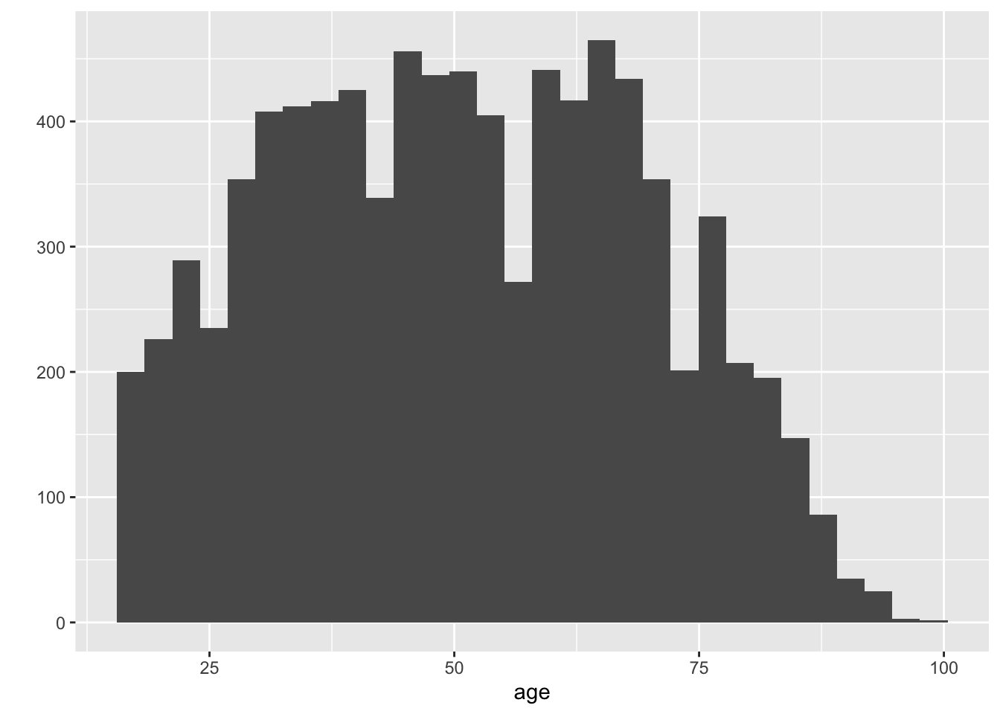
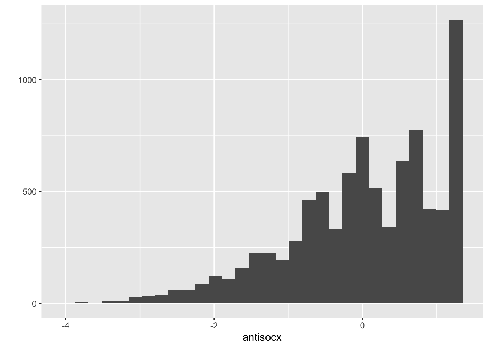
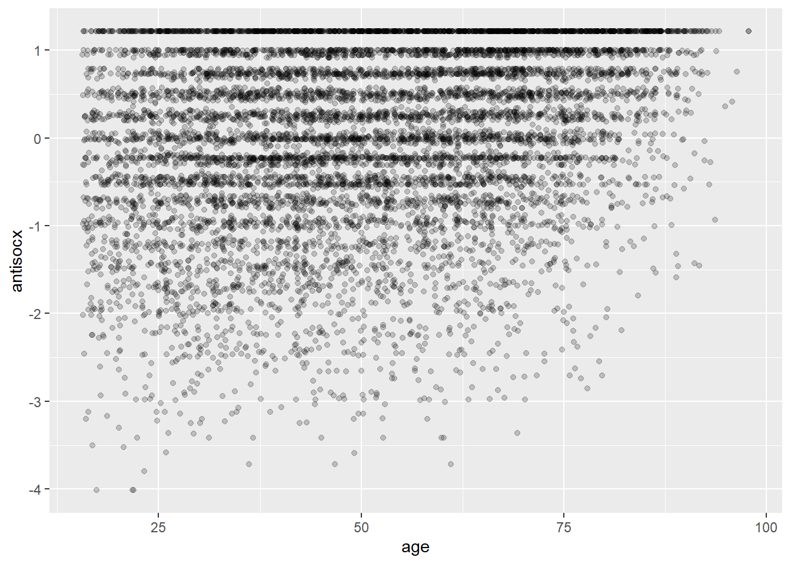
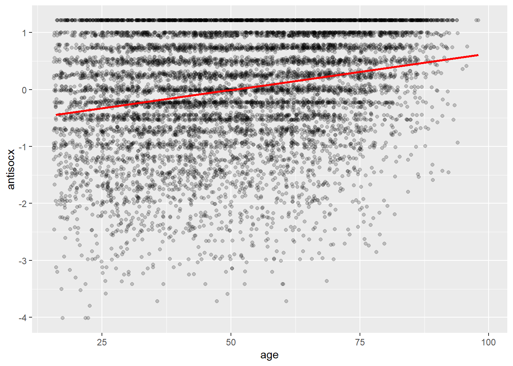
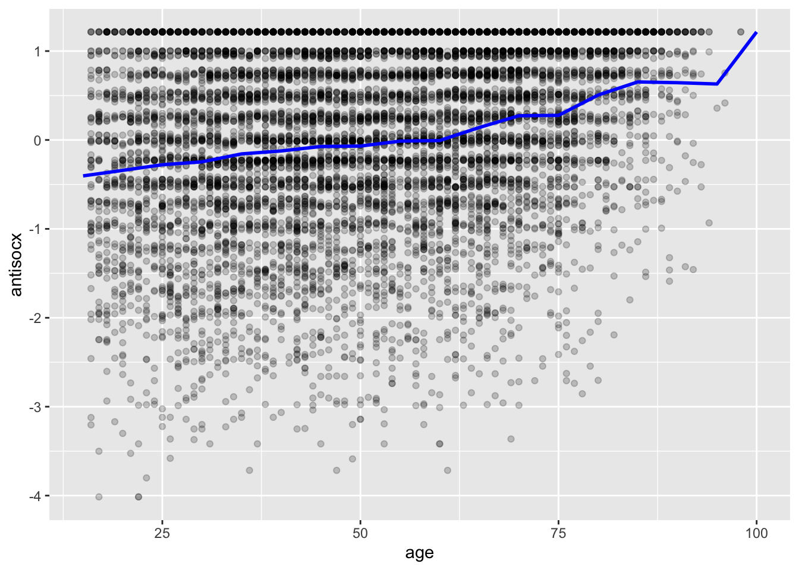
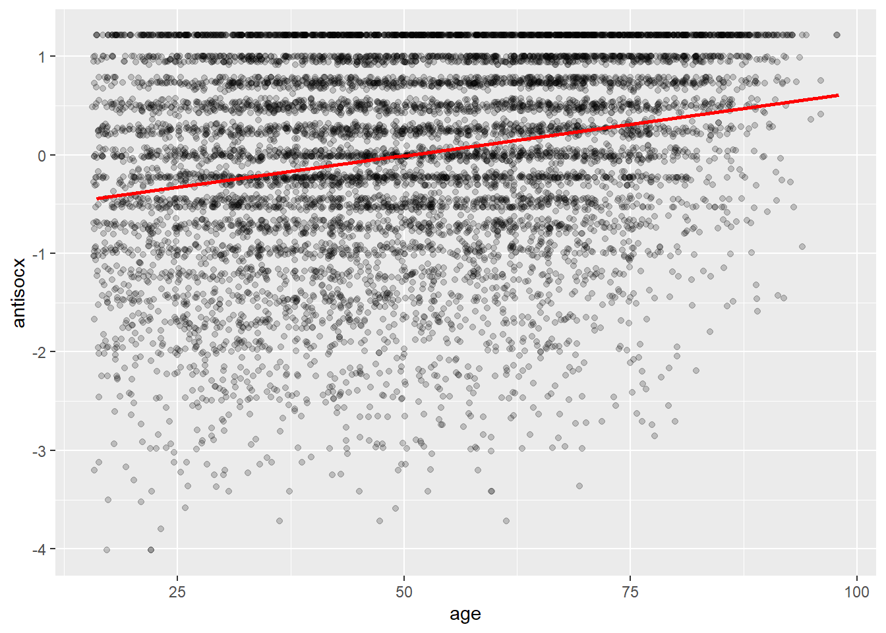
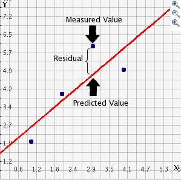

# Regression
#### *OLS & Logistic Regressions* {-}


#### Learning Outcomes: {-}
-	Learn how and when to use ordinary least squares and logistic regressions
-	Understand what their outputs mean 


#### Today’s Learning Tools: {-}


##### *Data:*{-}
-	Crime Survey for England and Wales (CSEW) from 2013 to 2014 sweep teaching dataset
-	`Arrests` from the `effects` package


##### *Packages:*{-}
-	`arm`
-	`car`
-	`effects`
-	`ggplot2`
-	`here`
- `lessR`
-	`sjplot`
-	`tidyverse`


##### *Functions introduced (and packages to which they belong)* {-}
-	`complete.cases()` : Returns only complete cases that do not have NAs (`base R`)
-	`display()` : Gives a clean printout of lm, glm, and other such objects (`arm`)
- `lm()` : Fit linear models (`base R`)
- `Logit()` : Fit logistic regression models with less typing (`lessR`)
-	`qplot()` : Creates a variety of plots/graphs (`base R`)
-	`relevel()` : Reorders the levels of a factor (`base R`) 
-	`tab_model()` : Creates HTML tables summarising regression models (`sjplot`)
-	`vif()` : Calculate the variance inflation for OLS or other linear models (`car`)


---


## Multiple and Simultaneous Relationships


Our learning on inferential statistics, so far, has been on single relationships between two variables. One of the major drawbacks of previous analyses of single relationships is that, even though you are able to test for statistical significance, you cannot ascertain prediction very well. In other words, you were unable to say for certain that one variable predicted another variable; we merely could say ‘there was a relationship’ or ‘there was no relationship.’ 

Although we got into the habit of arranging our variables as independent and dependent variables, these terms are more relevant to regression. The reason is, not only can we establish significant relationships, we also can say with relatively more clarity, how that relationship looks like – which variable is impacting on what other variable.

Another major drawback of previous analyses on bivariate relationships is that you are less certain about whether the relationship and its effect size would still hold in the face of other variables. For example, would a significant relationship between peer group and violence still exist when the relationship between unemployment and violence is considered? This last lesson is on analyses that establish predictive relationships and test multiple relationships between two variables at the same time.


---


## Today’s 3


Our main topic of the day is **regression** and we learn two forms: ordinary least squares (OLS) and logistic. The former is applied to dependent variables that are measured at interval or numeric level, while the latter is applied to dependent variables that are binary and measured at the nominal level. The three topics are: assumptions of OLS regression; interpreting OLS regression; and logistic regression.


---


### Assumptions of OLS Regression 


**Ordinary least squares (OLS)** regression is a popular technique used to explore whether one or multiple independent variables (X) can predict or explain the variation in the dependent variable (Y).  When multiple independent variables are included simultaneously, they are called **covariates**; when only one independent variable is used, the OLS regression is called **bivariate regression**. OLS regression has been the mainstay analysis in the social sciences. 


To begin, we do the following:


1.	Open up your existing `R` project


2.	Install and load the required packages shown above


3.	Import the dataset ‘csew1314_teaching.csv’, using the `read_csv()` function


4.	Name the data frame `df`


For our example, we are interested in the bivariate relationship between age (X) and perception of antisocial behaviour (Y). Our research question is: ‘Does age predict perceived level of antisocial behaviour in one’s neighbourhood?’ Our null and alternative hypotheses are as follows:


$H_0$: Age does not predict perceived level of antisocial behaviour in one’s neighbourhood. 


$H_A$: Age predicts perceived level of antisocial behaviour in one’s neighbourhood.


Our initial step is to get to know our data:


```r
# Age variable
summary(df$age)
```

```
##    Min. 1st Qu.  Median    Mean 3rd Qu.    Max.    NA's 
##   16.00   36.00   51.00   51.19   66.00   99.00     118
```

```r
# Antisocial variable
summary(df$antisocx)
```

```
##    Min. 1st Qu.  Median    Mean 3rd Qu.    Max.    NA's 
##  -4.015  -0.559   0.177   0.000   0.788   1.215   26695
```


Both variables have missing data. You could ignore the 'NAs', but when we run regression, it will conduct a *listwise deletion*, which is when cases are dropped from your analysis if they have missing data on either the independent variable (IV) or the dependent variable (DV). As we now want descriptive statistics of cases we will be using, we will delete the cases that will be dropped anyway. We use the `complete.cases ()` function to keep cases that have valid responses in both the IV and DV:


```r
# Start with 35,371 cases
nrow(df) 
```

```
## [1] 35371
```

```r
# Retain only complete cases
df <- df[(complete.cases(df$age) & complete.cases(df$antisocx)), ]

# Left with 8,650 cases after dropping NAs
nrow(df) 
```

```
## [1] 8650
```

```r
# Summaries of just the 8,650 cases 
summary(df$age)
```

```
##    Min. 1st Qu.  Median    Mean 3rd Qu.    Max. 
##   16.00   36.00   50.00   50.82   66.00   98.00
```

```r
summary(df$antisocx)
```

```
##      Min.   1st Qu.    Median      Mean   3rd Qu.      Max. 
## -4.014557 -0.552077  0.178767  0.001823  0.788219  1.215267
```


To conduct OLS regression, or linear regression for short, a number of assumptions must be met, so you will need to test for them. Failure to do so will result in a possibly incorrect model and drawing conclusions from it would be silly. We only, however, briefly go through the first four assumptions because going into detail is beyond the scope of this class. 

The purpose of today is more to introduce you to regression and learn how to use it and interpret the output. For this class, we find that the assumption of linearity is important to go into detail. Going through this assumption in detail will give you a better understanding of OLS regression itself and how it operates. We now go through each of the five assumptions of OLS regression before using the technique.


---


#### Independence of errors


Errors of the prediction, which make up the regression line, are assumed to be independent of each other. The term *heteroscedasticity* is used to describe this violation of independence of errors. When we violate this assumption, our points in the scatterplot resemble the shape of a funnel. If there is dependency between the observations, you would need to use other models that are not covered in this course.


#### Equal Variances of errors


If the variance of our residuals is unequal, we will need different estimation methods, but this issue is minor. The reason it is a minor issue is that regression is considered a *robust* estimation, meaning that it is not too sensitive to changes in the variance.


#### Normality of errors


Residuals are assumed to be normally distributed. Gelman and Hill (2007) believe this to be the least important of the assumptions because regression inferences tend to be robust regarding non-normality of the errors. Your results, however, may be sensitive to large outliers so you will need to drop them if appropriate.


#### Multicollinearity


When you are including more than one IV, **multicollinearity** may be a concern. Independent variables that are highly correlated with each other mean that they are tapping into the same construct. For example, if you include two IVs, parental attachment and parental discipline, you may find that they are highly related to each other because both measure a similar idea.

One indication is that if you run a Pearson’s correlation for the two IVs and get a value of 0.6 or 0.7, you should start investigating further. Another way to check for multicollinearity is through the *variance inflation factor* (VIF). How high the VIF should be before multicollinearity is a concern is debatable: here, anything above 5 should be a matter of concern. With this analysis, IVs should be numeric. We include an additional covariate, confidence in the police (`confx`), to illustrate. The VIF for our variables is conducted with the `vif ()` function in the `car` package:


```r
cal_vif <- lm(antisocx ~ age + confx, data = df) 

vif(cal_vif)
```

```
##      age    confx 
## 1.003988 1.003988
```


The VIF values are below 5 and indicate that including both variables, `age` and `confx`, in the same model does not pose any multicollinearity concerns.


#### Linearity


Similar to Pearson’s correlation, a linear relationship must be established before conducting the analysis. If the relationship is non-linear, your predicted values will be wrong, and it will systematically miss the true pattern of the mean of Y. 

Say, for example, you randomly drew a case from the dataset. What would be your best guess on the value of that case’s perceived antisocial behaviour in the neighbourhood (`antisocx`)? Likely, you say a value near the mean (M = 0.001823) of the sample. Next, we visualise our variable distributions:


```r
qplot(x = age, data = df)
```

```
## `stat_bin()` using `bins = 30`. Pick better value with `binwidth`.
```



```r
qplot(x = antisocx, data = df)
```

```
## `stat_bin()` using `bins = 30`. Pick better value with `binwidth`.
```



```r
# antisocx is negatively skewed

# Checking out how the variables covary together
ggplot(df, aes(x = age, y = antisocx)) + 
  geom_point(alpha=.2, position="jitter")
```




If you were to guess that case’s perceived level of antisocial behaviour in the neighbourhood, but now based it on the scatterplot, and learned they were aged 30, what would your answer now be? Before, we based our guess on descriptive measures of central tendency and dispersion, which included all ages. Now, we are asked to guess knowing that the person is aged 30. If we were to now guess the level of perceived antisocial behaviour, we would try and guess the mean of those who are also aged 30. This is what is known as the *conditional mean* -- the mean of Y for each value of X.

We create a trend line through the scatterplot, which represents the mean of the variable on the y-axis, `antisocx`, and we want the means computed for each age:


```r
ggplot() + 
  geom_point(data=df, aes(x = age, y = antisocx), alpha=.2) + 
  geom_line(data=df, aes(x = age, y = antisocx), stat='summary', fun.y=mean,
            color="blue", size=1)  
```

```
## No summary function supplied, defaulting to `mean_se()`
```




Plotting the conditional means shows us that the mean of perceived antisocial behaviour for those respondents around the age of 30 is around −0.3. This would be a better guess than the mean for all ages, 0.0018. The trend line gives us a better idea of what is going on in our scatterplot, but the line looks a bit rough. We can make it smoother:


```r
# Make smoother by calculating average perceived antisocial behaviour for age in increments of 5 years
ggplot() + 
  geom_point(data=df, aes(x = age, y = antisocx), alpha=.2) + 
  geom_line(data=df, aes(x = round(age/5)*5, y = antisocx), stat='summary', fun.y=mean,
            color="blue", size=1)
```

```
## No summary function supplied, defaulting to `mean_se()`
```




The blue trend line shows us that there is an upward trend, meaning that as age increases, so do perceptions of antisocial behaviour in the neighbourhood. Like what we did above, OLS regression tries to capture the trend or pattern of the data by drawing a straight line of predicted values as the model of the data:


```r
# method=lm asks for the linear regression line 
# se=FALSE asks not to print confidence interval 
# Other arguments specify the colour, thickness of the line 
ggplot(data = df, aes(x = age, y = antisocx)) + 
  geom_point(alpha = .2, position = "jitter") + 
  geom_smooth(method = "lm", se = FALSE, color = "red", size = 1)
```

```
## `geom_smooth()` using formula 'y ~ x'
```




The red **regression line** gives you guesses or predictions for the value of perceived level of antisocial behaviour based on information that we have about age. The line can also be seen as one that tries to summarise the pattern of what is going on among points. The line is, of course, linear. It does not go through all the points, however. 
As Bock et al. (2012) highlight:

>'Like all models of the real world, the line will be wrong – wrong in the sense that it can’t match reality exactly. But it can help us understand how the variables are associated' (p.  179). 

A map is never a perfect representation of the world; the same happens with statistical models. Yet, as with maps, models can be helpful.


---


### Interpreting OLS Regression


In this section, we learn how to interpret bivariate and multiple regression output. Now that we know what the regression line is, how do we draw one? Two points are needed to do so:


1.	We need to know where the line begins. The **intercept** is where it begins, which is the value of Y, our DV, when X (our IV) is 0. 


2.	We also need to know the angle of that line. This is referred to as the **slope**. 


This translates into the equation: 

$$y = b_0 + b_1x_i$$


Where $b_0$ is the y-intercept and $b_1x_i$ is the slope of the line. Linear regression models try to minimise the distance from every point in the scatterplot to the regression line. This is called *least squares estimation*. The farther these points are from the regression line, the more error your regression model will have. 

It is not unusual to observe that some points will fall above the line (a positive error value), while other points will fall below it (a negative error value). If we wanted to sum these error values, the problem is that the positive values would cancel out the negative values, underreporting our overall error. This would then incorrectly suggest that our regression line was perfect. 

To resolve this issue, the error values are squared before they are summed. This is called the *error sum of squares*. Our regression model is trying to find a line fit that has the least (squared) error. Hence, least squared estimation. 


---


#### Bivariate Regression


To fit the model, we use the `lm()` function using the formula specification `(Y ~ X)`:


```r
fit_1 <- lm(antisocx ~ age, data = df)

# Get to know the data
class(fit_1)
```

```
## [1] "lm"
```

```r
attributes(fit_1)
```

```
## $names
##  [1] "coefficients"  "residuals"     "effects"       "rank"         
##  [5] "fitted.values" "assign"        "qr"            "df.residual"  
##  [9] "xlevels"       "call"          "terms"         "model"        
## 
## $class
## [1] "lm"
```

```r
summary(fit_1)
```

```
## 
## Call:
## lm(formula = antisocx ~ age, data = df)
## 
## Residuals:
##     Min      1Q  Median      3Q     Max 
## -3.8481 -0.5752  0.1297  0.7691  1.6581 
## 
## Coefficients:
##              Estimate Std. Error t value            Pr(>|t|)
## (Intercept) -0.647232   0.030455  -21.25 <0.0000000000000002
## age          0.012773   0.000563   22.68 <0.0000000000000002
## 
## Residual standard error: 0.9705 on 8648 degrees of freedom
## Multiple R-squared:  0.05616,	Adjusted R-squared:  0.05606 
## F-statistic: 514.6 on 1 and 8648 DF,  p-value: < 0.00000000000000022
```

```r
# A more concise display of results is using ‘display ()’ from arm package:
display(fit_1)
```

```
## lm(formula = antisocx ~ age, data = df)
##             coef.est coef.se
## (Intercept) -0.65     0.03  
## age          0.01     0.00  
## ---
## n = 8650, k = 2
## residual sd = 0.97, R-Squared = 0.06
```


Now let us interpret the regression output. There are several points to focus on when communicating your results:


1.	Beta (or regression) coefficient: this is the value that measures the impact of the independent variable on the dependent variable. It is the $b_1$ regression coefficient from the previous equation, the value that will shape the slope for this model. From our output, this value is 0.012773. When the value is positive, it tells us that for every 1 unit increase in X, there is a $b_1$ increase on Y; if, however, the coefficient is negative, then it represents a decrease on Y. Here, we interpret the result as: ‘For every 1 year older, there is a 0.01 unit increase in level of perceived antisocial behaviour in the neighbourhood.’ The coefficient can be interpreted as a measure of the effect size of this relationship. In addition, with very large sample sizes, you should place less of an emphasis on p-values and more emphasis on the size of the beta coefficients because p-values are sensitive to sample size. For example, you may have all statistically significant covariates, even though the variables have small coefficients. This means that they do not have much of an effect on the DV.


2.	P-value: The p-value for each beta coefficient tests the null hypothesis that the coefficient is equal to zero. A low p-value ( < 0.05) means you can reject the null hypothesis and that the changes in the predictor’s value are significantly related to changes in the DV value. For statistically non-significant coefficients, it is not recommended that you interpret them; you can, however, make statements about their general trend (positive or negative). In our output, the p-value is very small ( p < .001). We conclude that age significantly predicts level of perceived antisocial behaviour and that we can reject the null hypothesis.  


3.	F-statistic: There is another p-value at the bottom of your regression output and belongs to the F-statistic. This assesses whether our overall model can predict the DV with high confidence, especially if we have multiple predictors. This, too, is statistically significant, meaning that at least one of our inputs must be related to our DV.


4.	$R^2$: This is known as the percent of variance explained, and it is a measure of the strength of our model. This value ranges from 0 to 1. Towards 1, the better we are able to account for variation in our outcome Y with our IV(s).  In other words, the stronger the relationship is between Y and X. Weisburd and Britt (2009: 437) suggest that, in criminal justice research, values greater than .40 are rare, but if we obtain such a value, it is considered a powerful model. If the value is lower than .20, the model is considered relatively weak. The output shows that $R^2$ for our model was about .06 (the multiple r-squared value). We interpret this as our model explains 6% of the variance in the level of perceived antisocial behaviour. 





To understand $R^2$, we refer to **residuals** (*e*). These are the distance between each point in the dataset and the regression line. The distance represents the amount of error. Previously, this was mentioned in the context of least squares estimation. Residuals matter because it tells us how much variation is still unexplained and considers the fact that we cannot perfectly predict perceived antisocial behaviour each time by using the information on age. In actuality, our regression equation should be:


$$y = b_0 + b_1x_i + e$$


---


#### Multiple Regression


At the start of the session, there was mention of one of the major drawbacks of looking at only bivariate relationships. One was that these analyses did not consider other possible explanations. It could be that you have a statistically significant relationship, but without considering other variables that may explain this relationship, your significant result could, in fact, be *spurious* -- an association that should not be taken very seriously. For some ridiculous examples, click [here](http://tylervigen.com/spurious-correlations). 

Multiple regression is a way for assessing the relevance of competing explanations. For example, we think there is a relationship between age and perceived antisocial behaviour levels, but we have not considered whether other reasons may provide a better explanation for these perceptions. Maybe previous victimisation or fear of crime may be better contenders. 

The equation for multiple regression is similar to bivariate regression except it includes more coefficients:

$$y = b_0 + b_1x_i + b_2x_{ii} +... b_nx_n + e$$

For this example, we include additional variables to our model: sex (`sex`), previous victimisation in past 12 months (`bcsvictim`), and confidence in the police (`confx`). First, we check out these variables and tidy them as necessary. Then we will run our regression: 


```r
# Checking out what type of class

class(df$confx) 
```

```
## [1] "numeric"
```

```r
class(df$bcsvictim)
```

```
## [1] "integer"
```

```r
# attach labels to bcsvictim and make ordering false 
df$bcsvictim <- factor(df$bcsvictim, labels = c("not victim", "Yes victim"), ordered = FALSE) 

# Sex
class (df$sex)
```

```
## [1] "integer"
```

```r
table(df$sex)
```

```
## 
##    1    2 
## 4064 4586
```

```r
# Recode sex as dummy variable (0 and 1) where female is 0 and ordered is false
df$gender <- df$sex
df$gender[df$gender=="2"] <- "0"
df$gender <- factor(df$gender, labels = c("female", "male"), ordered = FALSE) 
# Double check values match original variable
table(df$gender)
```

```
## 
## female   male 
##   4586   4064
```

```r
# Now let us run the multiple regression

fit_2 <- lm(antisocx ~ age + gender + bcsvictim + confx, data = df)
summary(fit_2)
```

```
## 
## Call:
## lm(formula = antisocx ~ age + gender + bcsvictim + confx, data = df)
## 
## Residuals:
##     Min      1Q  Median      3Q     Max 
## -3.8854 -0.5684  0.1142  0.7195  2.5249 
## 
## Coefficients:
##                       Estimate Std. Error t value             Pr(>|t|)
## (Intercept)         -0.5136682  0.0328072 -15.657 < 0.0000000000000002
## age                  0.0104148  0.0005699  18.276 < 0.0000000000000002
## gendermale           0.1003834  0.0207701   4.833           0.00000137
## bcsvictimYes victim -0.4310943  0.0290209 -14.855 < 0.0000000000000002
## confx                0.2038268  0.0106002  19.229 < 0.0000000000000002
## 
## Residual standard error: 0.9361 on 8151 degrees of freedom
##   (494 observations deleted due to missingness)
## Multiple R-squared:  0.1247,	Adjusted R-squared:  0.1243 
## F-statistic: 290.3 on 4 and 8151 DF,  p-value: < 0.00000000000000022
```


We return to those four points to focus on when confronted with a regression output:


1.	Regression coefficients: The usual interpretation is to state that Y changes for every one-unit increase in X *when the other variables in the model are held constant* (or are 'controlled for'). Therefore, a 0.01 increase in level of perceived antisocial behaviour in the neighbourhood is associated with a one-year increase in age, for example. This is similar to the bivariate regression. For categorical variables, however, the interpretation is different; notice how these variables have an additional label attached to them in the output. For example, `gender` includes 'male' and `bcsvictim` includes 'yes victim'. Labels that do not appear next to the name of the categorical variable in the model are called the *reference category*. This category is the lowest value. You can select your reference category based on the modal category or if it is a category in which you are least interested. We interpret them as the following: males have a perceived antisocial behaviour level that averages 0.10 units higher than that of females; victims have a perceived antisocial behaviour level that averages .43 units lower than that of non-victims. A one-point score increase for confidence in neighbourhood police is related to .20 increase in level of perceived antisocial behaviour. For each interpretation, covariates in the model are controlled for.  


2.	P-value: All coefficients are statistically significant, meaning that we can reject the null hypothesis that no differences exist on perceived antisocial behaviour. 


3.	F-statistic: Now that we have more than one IV in our model, we evaluate whether all of the regression coefficients are zero. The F-statistic is below the conventional significance level of α = 0.05, so at least one of our IVs is related to our DV. You will also notice t-values for each IV. These are testing whether each of the IVs is associated with the DV when controlling for covariates in the model. 


4.	$R^2$: The $R^2$ is higher than that of our previous bivariate regression model. It will, however, inevitably increase whenever new variables are added to the model, regardless if they are only weakly related to the DV. Having said this, the new $R^2$ value suggests that the addition of the three new variables improves our previous model. 


If you would like to professionally present your results, you can use the function `tab_model ()` from the `sjplot` package:


```r
tab_model(fit_2)
```

<table style="border-collapse:collapse; border:none;">
<tr>
<th style="border-top: double; text-align:center; font-style:normal; font-weight:bold; padding:0.2cm;  text-align:left; ">&nbsp;</th>
<th colspan="3" style="border-top: double; text-align:center; font-style:normal; font-weight:bold; padding:0.2cm; ">antisocx</th>
</tr>
<tr>
<td style=" text-align:center; border-bottom:1px solid; font-style:italic; font-weight:normal;  text-align:left; ">Predictors</td>
<td style=" text-align:center; border-bottom:1px solid; font-style:italic; font-weight:normal;  ">Estimates</td>
<td style=" text-align:center; border-bottom:1px solid; font-style:italic; font-weight:normal;  ">CI</td>
<td style=" text-align:center; border-bottom:1px solid; font-style:italic; font-weight:normal;  ">p</td>
</tr>
<tr>
<td style=" padding:0.2cm; text-align:left; vertical-align:top; text-align:left; ">(Intercept)</td>
<td style=" padding:0.2cm; text-align:left; vertical-align:top; text-align:center;  ">-0.51</td>
<td style=" padding:0.2cm; text-align:left; vertical-align:top; text-align:center;  ">-0.58&nbsp;&ndash;&nbsp;-0.45</td>
<td style=" padding:0.2cm; text-align:left; vertical-align:top; text-align:center;  "><strong>&lt;0.001</td>
</tr>
<tr>
<td style=" padding:0.2cm; text-align:left; vertical-align:top; text-align:left; ">age</td>
<td style=" padding:0.2cm; text-align:left; vertical-align:top; text-align:center;  ">0.01</td>
<td style=" padding:0.2cm; text-align:left; vertical-align:top; text-align:center;  ">0.01&nbsp;&ndash;&nbsp;0.01</td>
<td style=" padding:0.2cm; text-align:left; vertical-align:top; text-align:center;  "><strong>&lt;0.001</td>
</tr>
<tr>
<td style=" padding:0.2cm; text-align:left; vertical-align:top; text-align:left; ">gender [male]</td>
<td style=" padding:0.2cm; text-align:left; vertical-align:top; text-align:center;  ">0.10</td>
<td style=" padding:0.2cm; text-align:left; vertical-align:top; text-align:center;  ">0.06&nbsp;&ndash;&nbsp;0.14</td>
<td style=" padding:0.2cm; text-align:left; vertical-align:top; text-align:center;  "><strong>&lt;0.001</td>
</tr>
<tr>
<td style=" padding:0.2cm; text-align:left; vertical-align:top; text-align:left; ">bcsvictim [Yes victim]</td>
<td style=" padding:0.2cm; text-align:left; vertical-align:top; text-align:center;  ">-0.43</td>
<td style=" padding:0.2cm; text-align:left; vertical-align:top; text-align:center;  ">-0.49&nbsp;&ndash;&nbsp;-0.37</td>
<td style=" padding:0.2cm; text-align:left; vertical-align:top; text-align:center;  "><strong>&lt;0.001</td>
</tr>
<tr>
<td style=" padding:0.2cm; text-align:left; vertical-align:top; text-align:left; ">confx</td>
<td style=" padding:0.2cm; text-align:left; vertical-align:top; text-align:center;  ">0.20</td>
<td style=" padding:0.2cm; text-align:left; vertical-align:top; text-align:center;  ">0.18&nbsp;&ndash;&nbsp;0.22</td>
<td style=" padding:0.2cm; text-align:left; vertical-align:top; text-align:center;  "><strong>&lt;0.001</td>
</tr>
<tr>
<td style=" padding:0.2cm; text-align:left; vertical-align:top; text-align:left; padding-top:0.1cm; padding-bottom:0.1cm; border-top:1px solid;">Observations</td>
<td style=" padding:0.2cm; text-align:left; vertical-align:top; padding-top:0.1cm; padding-bottom:0.1cm; text-align:left; border-top:1px solid;" colspan="3">8156</td>
</tr>
<tr>
<td style=" padding:0.2cm; text-align:left; vertical-align:top; text-align:left; padding-top:0.1cm; padding-bottom:0.1cm;">R<sup>2</sup> / R<sup>2</sup> adjusted</td>
<td style=" padding:0.2cm; text-align:left; vertical-align:top; padding-top:0.1cm; padding-bottom:0.1cm; text-align:left;" colspan="3">0.125 / 0.124</td>
</tr>

</table>

```r
# Change name of DV
tab_model(fit_2, dv.labels = "Perceived Antisocial Behaviour")
```

<table style="border-collapse:collapse; border:none;">
<tr>
<th style="border-top: double; text-align:center; font-style:normal; font-weight:bold; padding:0.2cm;  text-align:left; ">&nbsp;</th>
<th colspan="3" style="border-top: double; text-align:center; font-style:normal; font-weight:bold; padding:0.2cm; ">Perceived Antisocial Behaviour</th>
</tr>
<tr>
<td style=" text-align:center; border-bottom:1px solid; font-style:italic; font-weight:normal;  text-align:left; ">Predictors</td>
<td style=" text-align:center; border-bottom:1px solid; font-style:italic; font-weight:normal;  ">Estimates</td>
<td style=" text-align:center; border-bottom:1px solid; font-style:italic; font-weight:normal;  ">CI</td>
<td style=" text-align:center; border-bottom:1px solid; font-style:italic; font-weight:normal;  ">p</td>
</tr>
<tr>
<td style=" padding:0.2cm; text-align:left; vertical-align:top; text-align:left; ">(Intercept)</td>
<td style=" padding:0.2cm; text-align:left; vertical-align:top; text-align:center;  ">-0.51</td>
<td style=" padding:0.2cm; text-align:left; vertical-align:top; text-align:center;  ">-0.58&nbsp;&ndash;&nbsp;-0.45</td>
<td style=" padding:0.2cm; text-align:left; vertical-align:top; text-align:center;  "><strong>&lt;0.001</td>
</tr>
<tr>
<td style=" padding:0.2cm; text-align:left; vertical-align:top; text-align:left; ">age</td>
<td style=" padding:0.2cm; text-align:left; vertical-align:top; text-align:center;  ">0.01</td>
<td style=" padding:0.2cm; text-align:left; vertical-align:top; text-align:center;  ">0.01&nbsp;&ndash;&nbsp;0.01</td>
<td style=" padding:0.2cm; text-align:left; vertical-align:top; text-align:center;  "><strong>&lt;0.001</td>
</tr>
<tr>
<td style=" padding:0.2cm; text-align:left; vertical-align:top; text-align:left; ">gender [male]</td>
<td style=" padding:0.2cm; text-align:left; vertical-align:top; text-align:center;  ">0.10</td>
<td style=" padding:0.2cm; text-align:left; vertical-align:top; text-align:center;  ">0.06&nbsp;&ndash;&nbsp;0.14</td>
<td style=" padding:0.2cm; text-align:left; vertical-align:top; text-align:center;  "><strong>&lt;0.001</td>
</tr>
<tr>
<td style=" padding:0.2cm; text-align:left; vertical-align:top; text-align:left; ">bcsvictim [Yes victim]</td>
<td style=" padding:0.2cm; text-align:left; vertical-align:top; text-align:center;  ">-0.43</td>
<td style=" padding:0.2cm; text-align:left; vertical-align:top; text-align:center;  ">-0.49&nbsp;&ndash;&nbsp;-0.37</td>
<td style=" padding:0.2cm; text-align:left; vertical-align:top; text-align:center;  "><strong>&lt;0.001</td>
</tr>
<tr>
<td style=" padding:0.2cm; text-align:left; vertical-align:top; text-align:left; ">confx</td>
<td style=" padding:0.2cm; text-align:left; vertical-align:top; text-align:center;  ">0.20</td>
<td style=" padding:0.2cm; text-align:left; vertical-align:top; text-align:center;  ">0.18&nbsp;&ndash;&nbsp;0.22</td>
<td style=" padding:0.2cm; text-align:left; vertical-align:top; text-align:center;  "><strong>&lt;0.001</td>
</tr>
<tr>
<td style=" padding:0.2cm; text-align:left; vertical-align:top; text-align:left; padding-top:0.1cm; padding-bottom:0.1cm; border-top:1px solid;">Observations</td>
<td style=" padding:0.2cm; text-align:left; vertical-align:top; padding-top:0.1cm; padding-bottom:0.1cm; text-align:left; border-top:1px solid;" colspan="3">8156</td>
</tr>
<tr>
<td style=" padding:0.2cm; text-align:left; vertical-align:top; text-align:left; padding-top:0.1cm; padding-bottom:0.1cm;">R<sup>2</sup> / R<sup>2</sup> adjusted</td>
<td style=" padding:0.2cm; text-align:left; vertical-align:top; padding-top:0.1cm; padding-bottom:0.1cm; text-align:left;" colspan="3">0.125 / 0.124</td>
</tr>

</table>

```r
# Change name of IVs
tab_model(fit_2, pred.labels = c("(Intercept)", "Age", "Sex", "Victimisation", "Confidence in Police"), dv.labels = "Perceived Antisocial Behaviour")
```

<table style="border-collapse:collapse; border:none;">
<tr>
<th style="border-top: double; text-align:center; font-style:normal; font-weight:bold; padding:0.2cm;  text-align:left; ">&nbsp;</th>
<th colspan="3" style="border-top: double; text-align:center; font-style:normal; font-weight:bold; padding:0.2cm; ">Perceived Antisocial Behaviour</th>
</tr>
<tr>
<td style=" text-align:center; border-bottom:1px solid; font-style:italic; font-weight:normal;  text-align:left; ">Predictors</td>
<td style=" text-align:center; border-bottom:1px solid; font-style:italic; font-weight:normal;  ">Estimates</td>
<td style=" text-align:center; border-bottom:1px solid; font-style:italic; font-weight:normal;  ">CI</td>
<td style=" text-align:center; border-bottom:1px solid; font-style:italic; font-weight:normal;  ">p</td>
</tr>
<tr>
<td style=" padding:0.2cm; text-align:left; vertical-align:top; text-align:left; ">(Intercept)</td>
<td style=" padding:0.2cm; text-align:left; vertical-align:top; text-align:center;  ">-0.51</td>
<td style=" padding:0.2cm; text-align:left; vertical-align:top; text-align:center;  ">-0.58&nbsp;&ndash;&nbsp;-0.45</td>
<td style=" padding:0.2cm; text-align:left; vertical-align:top; text-align:center;  "><strong>&lt;0.001</td>
</tr>
<tr>
<td style=" padding:0.2cm; text-align:left; vertical-align:top; text-align:left; ">Age</td>
<td style=" padding:0.2cm; text-align:left; vertical-align:top; text-align:center;  ">0.01</td>
<td style=" padding:0.2cm; text-align:left; vertical-align:top; text-align:center;  ">0.01&nbsp;&ndash;&nbsp;0.01</td>
<td style=" padding:0.2cm; text-align:left; vertical-align:top; text-align:center;  "><strong>&lt;0.001</td>
</tr>
<tr>
<td style=" padding:0.2cm; text-align:left; vertical-align:top; text-align:left; ">Sex</td>
<td style=" padding:0.2cm; text-align:left; vertical-align:top; text-align:center;  ">0.10</td>
<td style=" padding:0.2cm; text-align:left; vertical-align:top; text-align:center;  ">0.06&nbsp;&ndash;&nbsp;0.14</td>
<td style=" padding:0.2cm; text-align:left; vertical-align:top; text-align:center;  "><strong>&lt;0.001</td>
</tr>
<tr>
<td style=" padding:0.2cm; text-align:left; vertical-align:top; text-align:left; ">Victimisation</td>
<td style=" padding:0.2cm; text-align:left; vertical-align:top; text-align:center;  ">-0.43</td>
<td style=" padding:0.2cm; text-align:left; vertical-align:top; text-align:center;  ">-0.49&nbsp;&ndash;&nbsp;-0.37</td>
<td style=" padding:0.2cm; text-align:left; vertical-align:top; text-align:center;  "><strong>&lt;0.001</td>
</tr>
<tr>
<td style=" padding:0.2cm; text-align:left; vertical-align:top; text-align:left; ">Confidence in Police</td>
<td style=" padding:0.2cm; text-align:left; vertical-align:top; text-align:center;  ">0.20</td>
<td style=" padding:0.2cm; text-align:left; vertical-align:top; text-align:center;  ">0.18&nbsp;&ndash;&nbsp;0.22</td>
<td style=" padding:0.2cm; text-align:left; vertical-align:top; text-align:center;  "><strong>&lt;0.001</td>
</tr>
<tr>
<td style=" padding:0.2cm; text-align:left; vertical-align:top; text-align:left; padding-top:0.1cm; padding-bottom:0.1cm; border-top:1px solid;">Observations</td>
<td style=" padding:0.2cm; text-align:left; vertical-align:top; padding-top:0.1cm; padding-bottom:0.1cm; text-align:left; border-top:1px solid;" colspan="3">8156</td>
</tr>
<tr>
<td style=" padding:0.2cm; text-align:left; vertical-align:top; text-align:left; padding-top:0.1cm; padding-bottom:0.1cm;">R<sup>2</sup> / R<sup>2</sup> adjusted</td>
<td style=" padding:0.2cm; text-align:left; vertical-align:top; padding-top:0.1cm; padding-bottom:0.1cm; text-align:left;" colspan="3">0.125 / 0.124</td>
</tr>

</table>


---


### Logistic Regression


Now, what if our dependent variable is categorical and binary? This is where **logistic regression**, a technique belonging to a family of techniques called **generalized linear models**, is appropriate. Those assumptions of linearity and normality are not issues because this technique, itself, is not based on the normal distribution. 

In criminology, it is often the case that our DV has only two categories. For example, victim or not a victim; arrested or not arrested. This form of regression models the probability of belonging to one of the levels of the binary outcome. 

For this example, we are interested in the relationship between race and receiving harsher treatment for possession of marijuana. We use the dataset `Arrests` from the `effects` package. This data includes information on police treatment of individuals arrested for possession of marijuana in Toronto, Canada. Our DV is whether the arrestee was released with summons; if they were not, they received harsh treatment such as being brought to the police station or held for bail:


```r
library(effects)
data(Arrests, package="effects") # It will tell you that the dataset are not found, but it is there

# Checking out our DV
table(Arrests$released)
```

```
## 
##   No  Yes 
##  892 4334
```

```r
# Checking out the order of the levels in the DV
attributes(Arrests$released)
```

```
## $levels
## [1] "No"  "Yes"
## 
## $class
## [1] "factor"
```


Logistic regression will predict probabilities associated with the level whose first letter is further in the alphabet — this would be ‘yes’, the respondent was released with a summons. But this is not our level of interest. We will need to reorder the levels in the DV using the `relevel` function:


```r
# Reverse the order
#Rename the levels so that it is clear we now mean 'yes' to harsh treatment
Arrests$harsher <- relevel(Arrests$released, "Yes")
Arrests$harsher <- factor(Arrests$harsher, labels = c("No", "Yes"), ordered = TRUE) 

#  Check that it matches the original variable ‘released’ but in reverse order
table(Arrests$harsher)
```

```
## 
##   No  Yes 
## 4334  892
```

```r
table(Arrests$released)
```

```
## 
##   No  Yes 
##  892 4334
```

```r
# We will also reverse the levels in our race variable so that ‘white’ is ‘0’
table(Arrests$colour)
```

```
## 
## Black White 
##  1288  3938
```

```r
Arrests$race <- Arrests$colour
Arrests$race <- relevel(Arrests$race, "White")

# Check to see coding has changed
table(Arrests$race)
```

```
## 
## White Black 
##  3938  1288
```


Now that we have arranged the codes of our variables of interest, we fit the logistic regression model using the `glm ()` function and specify a logit model (`family=”binomial”`). We include three other variables in the model to see to what extent race seems to matter in harsher police treatment even when we adjust or consider sex, employment, and previous police contacts:


```r
fit_3 <- glm(harsher ~ race + checks + sex + employed, data=Arrests, family = "binomial")
summary(fit_3)
```

```
## 
## Call:
## glm(formula = harsher ~ race + checks + sex + employed, family = "binomial", 
##     data = Arrests)
## 
## Deviance Residuals: 
##     Min       1Q   Median       3Q      Max  
## -1.5226  -0.6156  -0.4407  -0.3711   2.3449  
## 
## Coefficients:
##             Estimate Std. Error z value             Pr(>|z|)
## (Intercept) -1.90346    0.15999 -11.898 < 0.0000000000000002
## raceBlack    0.49608    0.08264   6.003        0.00000000194
## checks       0.35796    0.02580  13.875 < 0.0000000000000002
## sexMale      0.04215    0.14965   0.282                0.778
## employedYes -0.77973    0.08386  -9.298 < 0.0000000000000002
## 
## (Dispersion parameter for binomial family taken to be 1)
## 
##     Null deviance: 4776.3  on 5225  degrees of freedom
## Residual deviance: 4330.7  on 5221  degrees of freedom
## AIC: 4340.7
## 
## Number of Fisher Scoring iterations: 5
```


The output is similar to the one produced for linear regression, although there are some differences such as the Akaike information criterion (AIC) and the z-statistic, which is a similar idea to the t-test in linear regression. The z-statistic is a test of statistical significance and assesses whether each variable in the model is associated with the DV. 

All IVs are significantly associated with harsher police treatment except for sex. We see that every one unit increase in the number of previous police contacts, the log odds of receiving harsher treatment (versus being released on summons) increases by 0.36 adjusting for the other variables in the model. 

Observe that variables that are categorical have a label next to them in the output. For example, sex has ‘male’ next to it; race has ‘black’ next to it; employed has ‘yes’ next to it. These are the categories you are comparing to the reference category (whichever category is coded ‘0’). So, being black increases the log odds of receiving harsh treatment by 0.49 compared to being white, while being employed decreases the log odds of harsh treatment by 0.77 compared to being unemployed. 

This is good, but most people find interpreting log odds, well, odd – it is not very intuitive. It is common to use the **odds ratio** (OR) to interpret logistic regression. We convert these values into ORs:


```r
exp(coef(fit_3))
```

```
## (Intercept)   raceBlack      checks     sexMale employedYes 
##   0.1490516   1.6422658   1.4304108   1.0430528   0.4585312
```

```r
# We can add confidence intervals
exp(cbind(OR = coef(fit_3), confint(fit_3)))
```

```
## Waiting for profiling to be done...
```

```
##                    OR     2.5 %    97.5 %
## (Intercept) 0.1490516 0.1081600 0.2026495
## raceBlack   1.6422658 1.3957633 1.9298763
## checks      1.4304108 1.3601419 1.5049266
## sexMale     1.0430528 0.7830594 1.4090622
## employedYes 0.4585312 0.3892103 0.5407210
```

```r
# Another way of getting the results, which uses less typing, is to use the Logit() function from the lessr package

Logit(harsher ~ checks + colour + sex + employed, data=Arrests, brief=TRUE)
```

```
## 
## Response Variable:   harsher
## Predictor Variable 1:  checks
## Predictor Variable 2:  colour
## Predictor Variable 3:  sex
## Predictor Variable 4:  employed
## 
## Number of cases (rows) of data:  5226 
## Number of cases retained for analysis:  5226 
## 
## 
## 
##    BASIC ANALYSIS 
## 
## Model Coefficients
## 
##              Estimate    Std Err  z-value  p-value   Lower 95%   Upper 95%
## (Intercept)   -1.4074     0.1724   -8.162    0.000     -1.7453     -1.0694 
##      checks    0.3580     0.0258   13.875    0.000      0.3074      0.4085 
## colourWhite   -0.4961     0.0826   -6.003    0.000     -0.6580     -0.3341 
##     sexMale    0.0422     0.1496    0.282    0.778     -0.2511      0.3355 
## employedYes   -0.7797     0.0839   -9.298    0.000     -0.9441     -0.6154 
## 
## 
## Odds ratios and confidence intervals
## 
##              Odds Ratio   Lower 95%   Upper 95%
## (Intercept)      0.2448      0.1746      0.3432 
##      checks      1.4304      1.3599      1.5046 
## colourWhite      0.6089      0.5179      0.7160 
##     sexMale      1.0431      0.7779      1.3986 
## employedYes      0.4585      0.3890      0.5404 
## 
## 
## Model Fit
## 
##     Null deviance: 4776.258 on 5225 degrees of freedom
## Residual deviance: 4330.699 on 5221 degrees of freedom
## 
## AIC: 4340.699 
## 
## Number of iterations to convergence: 5 
## 
## 
## 
## 
## >>> Note:  colour is not a numeric variable.
## 
## 
## 
## >>> Note:  sex is not a numeric variable.
## 
## 
## 
## >>> Note:  employed is not a numeric variable.
## 
## Collinearity
## 
## 
## >>> No collinearity analysis because not all variables are numeric.
```


If the odds ratio is greater than 1, it indicates that the odds of receiving harsh treatment increases when the independent variable, too, increases. Previous police contacts increase the odds of harsher treatment by 43% and being black increases the odds of harsher treatment by 64% (all the while adjusting for the other variables in the model). Employment, however, has an odds ratio of 0.45. If the OR is between 0 and 1, it is considered a negative relationship. Referring to the confidence intervals is also helpful: if 0 is within the interval, the result is statistically non-significant. Take the 95% CI of sex, for example. 

For both types of regression, it is inappropriate to make comparisons between IVs. You cannot directly compare the coefficients of one IV to the other, unless they use the same metric. For more ways to interpret ORs in logistic regression, refer to the [UCLA Institute for Digital Research and Education](https://stats.idre.ucla.edu/other/mult-pkg/faq/general/faq-how-do-i-interpret-odds-ratios-in-logistic-regression/)


#### **Model Fit**


Now, how well is the fit of our logistic regression model? In order words, how well does our IVs collectively predict the DV? Recall from OLS regression, we assessed how well our overall model predicts the DV by observing the *F-statistic* and *$R^2$*. This is not the case for logistic regression. The reason is, in our familiar linear regression, we understand residual variation (related to that regression line) through the error sum of squares. In logistic regression, there is not one way to understand residual variation, but several, because of its binary outcome. This results in different ways of understanding model fit: (1) quantitative prediction, focused on how close the prediction is to being correct; (2) qualitative prediction, focused on whether the prediction is correct or incorrect; or (3) both. We go through the first one.


#### *Quantitative Prediction*


A common measure for evaluating model fit is the **deviance**, also known as -2LL. It measures how accurate the prediction is by multiplying the log likelihood statistic by -2. This *log-likelihood statistic* measures how much unexplained variance remains after the model is fitted, whereby larger values reflect poorer fit. Larger values of -2LL, similarly, indicate worse prediction. 

The logistic regression model can be estimated using an approach of probability called *maximum likelihood estimation*, which calculates the probability of obtaining a certain result given the IVs in the model. It does so by minimising that -2LL. This is like what OLS regression does with the error sum of squares -- tries to minimise it. Thus, -2LL is to logistic regression as the error sum of squares is to OLS regression. 

When we re-run our model, we find that -2LL is in the form of *null* and *residual* deviances towards the bottom of the output:


```r
Logit(harsher ~ checks + colour + sex + employed, data=Arrests, brief=TRUE)
```

```
## 
## Response Variable:   harsher
## Predictor Variable 1:  checks
## Predictor Variable 2:  colour
## Predictor Variable 3:  sex
## Predictor Variable 4:  employed
## 
## Number of cases (rows) of data:  5226 
## Number of cases retained for analysis:  5226 
## 
## 
## 
##    BASIC ANALYSIS 
## 
## Model Coefficients
## 
##              Estimate    Std Err  z-value  p-value   Lower 95%   Upper 95%
## (Intercept)   -1.4074     0.1724   -8.162    0.000     -1.7453     -1.0694 
##      checks    0.3580     0.0258   13.875    0.000      0.3074      0.4085 
## colourWhite   -0.4961     0.0826   -6.003    0.000     -0.6580     -0.3341 
##     sexMale    0.0422     0.1496    0.282    0.778     -0.2511      0.3355 
## employedYes   -0.7797     0.0839   -9.298    0.000     -0.9441     -0.6154 
## 
## 
## Odds ratios and confidence intervals
## 
##              Odds Ratio   Lower 95%   Upper 95%
## (Intercept)      0.2448      0.1746      0.3432 
##      checks      1.4304      1.3599      1.5046 
## colourWhite      0.6089      0.5179      0.7160 
##     sexMale      1.0431      0.7779      1.3986 
## employedYes      0.4585      0.3890      0.5404 
## 
## 
## Model Fit
## 
##     Null deviance: 4776.258 on 5225 degrees of freedom
## Residual deviance: 4330.699 on 5221 degrees of freedom
## 
## AIC: 4340.699 
## 
## Number of iterations to convergence: 5 
## 
## 
## 
## 
## >>> Note:  colour is not a numeric variable.
## 
## 
## 
## >>> Note:  sex is not a numeric variable.
## 
## 
## 
## >>> Note:  employed is not a numeric variable.
## 
## Collinearity
## 
## 
## >>> No collinearity analysis because not all variables are numeric.
```


The null deviance is the value of -2LL for a model without any IVs, whereas the residual deviance is the value of -2LL for our present model. We test to see if the null hypothesis, that the regression coefficients (IVs) equal zero, is true. We do so by calculating the *model chi-squared*. This is the difference between both deviances:


```r
# All the information we need to calculate the model chi-squared is already in our model object
names(fit_3)
```

```
##  [1] "coefficients"      "residuals"         "fitted.values"    
##  [4] "effects"           "R"                 "rank"             
##  [7] "qr"                "family"            "linear.predictors"
## [10] "deviance"          "aic"               "null.deviance"    
## [13] "iter"              "weights"           "prior.weights"    
## [16] "df.residual"       "df.null"           "y"                
## [19] "converged"         "boundary"          "model"            
## [22] "call"              "formula"           "terms"            
## [25] "data"              "offset"            "control"          
## [28] "method"            "contrasts"         "xlevels"
```

```r
# We now calculate said chi-squared by taking the difference of the deviances 
with(fit_3, null.deviance - deviance)
```

```
## [1] 445.5594
```


Our obtained value is: 445.56. We do not know, though, how big or small this value is to determine how predictive our model is. We will need a test of statistical significance:


```r
# Obtaining the p-value
with(fit_3, pchisq(null.deviance - deviance, df.null - df.residual, lower.tail = FALSE))
```

```
## [1] 3.961177e-95
```

```r
# Incorporating previous calculation of difference between deviances
# df.null - df.residual: calculating the degrees of freedom (should equal the number of IVs in the model)
```


The p-value is smaller than α = 0.05, so we conclude that our model is a better fit than a model with no IVs (or predictors). 

In addition, [Professor Scott Menard (2010)](https://methods.sagepub.com/book/logistic-regression-from-introductory-to-advanced-concepts-and-applications) suggests calculating the *likelihood ratio $R^2$*, also known as the Hosmer/Lemeshow $R^2$, by taking the difference of the previous deviances and dividing it by the null deviance. The likelihood ratio $R^2$ tells you the extent to which including your IVs in your model reduces the variation, or error, as measured by the null deviance. The value can range from 0 to 1, where higher values mean better predictive accuracy:


```r
#Likelihood ratio R2
with(fit_3, (null.deviance - deviance)/null.deviance)
```

```
## [1] 0.09328629
```


This particular $R^2$ is considered a 'pseudo- $R^2$' as it is not the same as the one obtained in OLS/ linear regression. There are many kinds of pseudo ones but Menard recommended the likelihood ratio one because (1) of its conceptual similarity to the $R^2$ in OLS regression; (2) it is not easily swayed by the base rate (the number of cases that have the charateristic of interest); (3) it is easy to interpret; and (4) it can also be used in other generalised linear models, such as ones with categorical DVs with more than two levels.


---


## SUMMARY


Regression allows us to look at relationships between variables while including other variables, called **covariates**, in the model. For OLS regression, assumptions must be met before embarking on fitting this model, and has to do with building the **regression line** whereby the line starts at the **intercept** and its angle is determined by the **slope**. **Residuals** form the equation to determine the $R^2$ and is the error of the model. When the DV is binary, logistic regression is appropriate. The **odds ratio** is an easier way to interpret logistic regression. We assess model fit through quantitative prediction measures of deviance, and it is recommended to use the likelihood ratio $R^2$ instead of other pseudo $R^2s$


Homework time!


