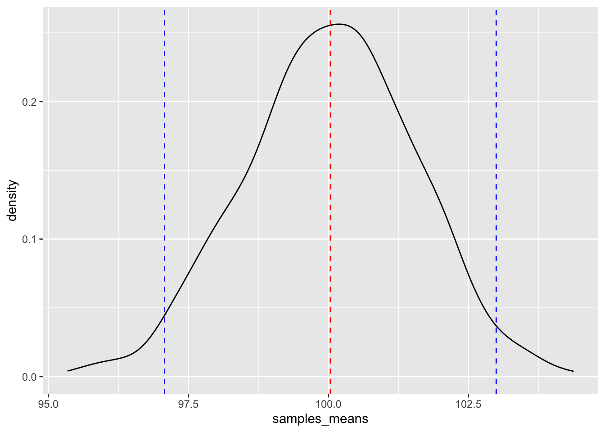
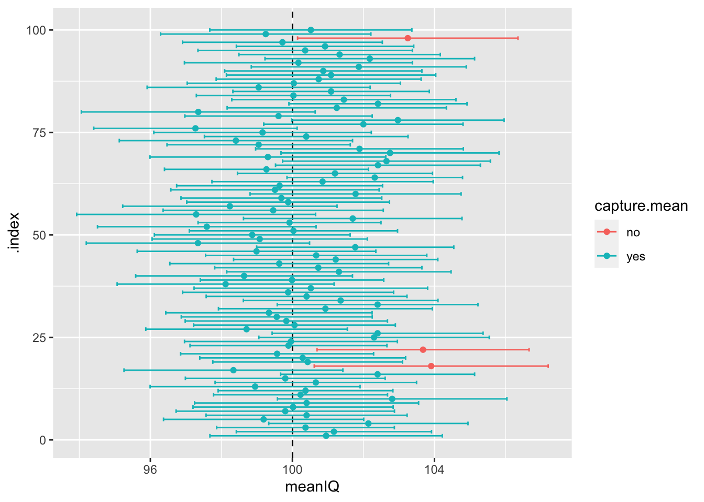

```r
library(dplyr)
```

```
## 
## Attaching package: 'dplyr'
```

```
## The following objects are masked from 'package:stats':
## 
##     filter, lag
```

```
## The following objects are masked from 'package:base':
## 
##     intersect, setdiff, setequal, union
```

```r
library(mosaic)
```

```
## Registered S3 method overwritten by 'mosaic':
##   method                           from   
##   fortify.SpatialPolygonsDataFrame ggplot2
```

```
## 
## The 'mosaic' package masks several functions from core packages in order to add 
## additional features.  The original behavior of these functions should not be affected by this.
```

```
## 
## Attaching package: 'mosaic'
```

```
## The following object is masked from 'package:Matrix':
## 
##     mean
```

```
## The following object is masked from 'package:ggplot2':
## 
##     stat
```

```
## The following objects are masked from 'package:dplyr':
## 
##     count, do, tally
```

```
## The following objects are masked from 'package:stats':
## 
##     binom.test, cor, cor.test, cov, fivenum, IQR, median, prop.test,
##     quantile, sd, t.test, var
```

```
## The following objects are masked from 'package:base':
## 
##     max, mean, min, prod, range, sample, sum
```

```r
set.seed(1612) # Use this number!
prob_off <- data.frame(
probationer_id = 1:3600000,
IQ = round(rnorm(3600000, mean = 100, sd = 15), 0) )
mean(prob_off$IQ) # 100.0028 
```

```
## [1] 100.0028
```

```r
median(prob_off$IQ) # 100 
```

```
## [1] 100
```

```r
sd(prob_off$IQ) # 14.99976
```

```
## [1] 14.99976
```


We know from this that roughly 95% of our probationers fall between 69.72398 (lower boundary) and 131.354 (upper boundary), with the mean of 100.539 directly in the middle. We can illustrate this by plotting the distribution of the IQ scores of our probationers and adding these bandwidths: 


```r
sample100 <- do(100)*sample(x = prob_off, size = 100)

sample1000 <- do(1000)*sample(x = prob_off, size = 100)
```


```r
# Select our data frame with all 1000 samples and get the sample mean for each one

many_samples <- sample1000 %>% 
  group_by(.index) %>%
  summarise(samples_means = mean(IQ)) 
```


```r
ggplot(data = many_samples) +
  geom_density(mapping = aes(x = samples_means)) + 
  geom_vline(mapping = aes(xintercept = mean(samples_means)),col = "red", linetype = "dashed") +
  geom_vline(mapping = aes(xintercept = mean(samples_means) + 1.96*sd(samples_means)), col = "blue", linetype = "dashed") +
  geom_vline(mapping = aes(xintercept = mean(samples_means) - 1.96*sd(samples_means)), col = "blue", linetype = "dashed")
```




```r
true.mean <- mean(prob_off$IQ) 

new.sample.ci100 <- sample100 %>% # select the df with 100 samples of size of 100 
  group_by(.index) %>% # group by the .index 
  summarise(meanIQ = mean(IQ),  # compute sample mean 
            sample_sd = sd(IQ), # compute sample sd 
            lower = meanIQ-1.96*sample_sd/sqrt(100), # compute lower boundary 
            upper = meanIQ+1.96*sample_sd/sqrt(100)) %>%  # compute upper boundary
  slice(1:100) %>% # Take the first 100 means 
  # If lower > true mean or upper < true mean then capture.mean will be "yes" 
  # If not, capture.mean will be "no" 
  mutate(capture.mean = if_else(condition = lower > true.mean | upper < true.mean, true = "no", false = "yes")) 
```


```r
table(new.sample.ci100$capture.mean)
```

```
## 
##  no yes 
##   3  97
```


```r
ggplot(data = new.sample.ci100) + 
  geom_vline(mapping = aes(xintercept = true.mean), linetype = "dashed") + 
  geom_errorbarh(mapping = aes(xmin = lower, xmax = upper, y = .index, colour = capture.mean)) +
  geom_point(mapping = aes(y = .index, x = meanIQ, colour = capture.mean))
```



